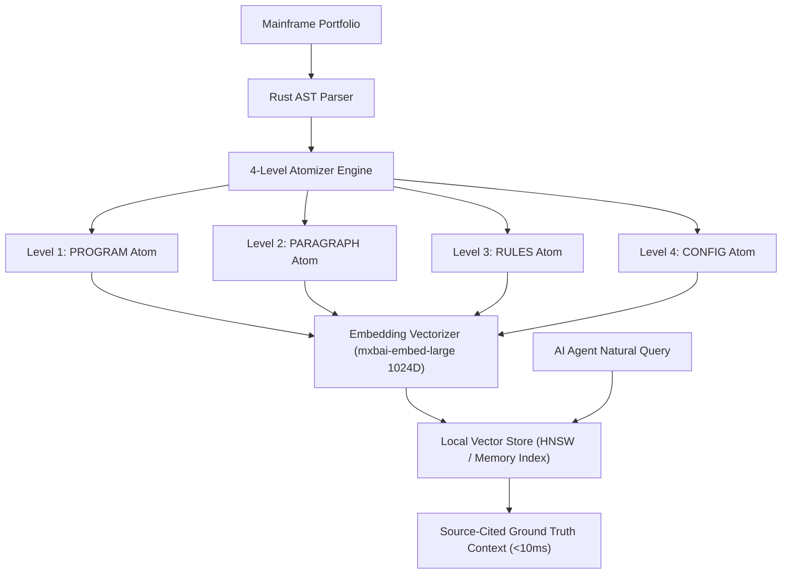

# CobolIQ — Full Architecture, CLI Reference & QUAD-RAG Guide
> **Deterministic Mainframe Knowledge Engine & Semantic Vector Intelligence**

---

## 1. Complete CLI Command & Flag Reference

`coboliq` is a single, zero-dependency binary written in Rust. It operates completely offline (Air-Gapped) without cloud access or JVM overhead.

### 1.1. Core Command Syntax
```bash
coboliq <PORTFOLIO_PATH> [OPTIONS]
```

### 1.2. Available Format Flags (`--format <FORMAT>`)

| Format Flag | Output Type & Description | Primary Use Case |
|---|---|---|
| `--format mini` | **Compact Console Summary (Default)**. Output formatted for quick terminal inspection. | Rapid developer checks. |
| `--format md` | **Full Markdown Report**. Complete portfolio documentation with Mermaid graphs and risk scoring. | PR reviews & documentation. |
| `--format csv` | **Excel / Spreadsheet CSV Matrix**. Flat table of programs, paragraphs, variables, and formulas. | Business & actuarial validation. |
| `--format xref` | **Cross-Reference Index (CSV)**. Full variable cross-reference mapping across all programs. | Variable impact analysis. |
| `--format html` | **Self-Contained Standalone HTML Dashboard**. Rich dark-mode UI with embedded graphs. | Offline executive presentations. |
| `--format html-calculator` | **Interactive Web Calculator (.html)**. Live JavaScript evaluator for extracted COBOL math. | Instant formula testing. |
| `--format decision-matrix` | **Decision Flow Matrix (Markdown + Mermaid)**. Isolated `IF`/`EVALUATE` decision trees. | Decision logic audits. |
| `--format code-mechanics` | **Code Execution Mechanics Map**. Low-level breakdown of memory moves and I/O. | Deep technical debugging. |
| `--format http-api` | **REST API Web Microservice Generator**. Generates Rust Axum router + Dockerfile. | Greenfield cloud microservices. |
| `--format python-port` | **Python Port Skeleton**. Generates typed Python port package (`--package <NAME>`). | Modernizing COBOL to Python. |
| `--format impact-sim` | **What-If Impact Simulator**. Simulates blast radius (`--override "VAR:old->new"`). | Refactoring risk analysis. |
| `--format modernization-readiness` | **Modernization Scorecard**. Ranks programs by externalization readiness. | Portfolio roadmap planning. |

### 1.3. Extraction & Compliance Flags

```bash
# Extract Magic Numbers & Rules into INI / JSON
coboliq ./portfolio --extract-rules --format ini --out rules.ini

# Extract 88-Level COBOL Condition Enums
coboliq ./portfolio --extract-states --format json --out states.json

# Extract COBOL OCCURS Tables → SQL DDL Schemas
coboliq ./portfolio --extract-schemas --format sql --out schema.sql

# Extract LINKAGE Data Flow Traces
coboliq ./portfolio --extract-dataflow --format md --out flow.md

# Extract SWI-Prolog Declarative Knowledge Base
coboliq ./portfolio --extract-prolog --out facts.pl

# Compliance Scans (DORA & GDPR)
coboliq ./portfolio --compliance dora8 --out dora8.md   # ICT Risk Management
coboliq ./portfolio --compliance dora9 --out dora9.md   # Systems & Component Inventory
coboliq ./portfolio --compliance gdpr30 --out gdpr30.md # Data Processing Lineage Records

# Portfolio Version Diffing
coboliq ./v2 --diff ./v1 --out audit-diff.md
```

---

## 2. The QUAD-RAG Semantic Vector Search Architecture

**QUAD-RAG** is CobolIQ's 4-level hybrid RAG (Retrieval-Augmented Generation) engine designed specifically for AI Coding Agents (Claude, GPT-4, Cursor).



### 2.1. The 4 Atom Levels of QUAD-RAG
1. **PROGRAM Atom**: High-level program metadata, LINKAGE parameters, entry points, and cross-program call dependencies.
2. **PARAGRAPH Atom**: Cyclomatic complexity score, variable assignments, `PERFORM` call chains, and static issue flags.
3. **RULES Atom**: Extracted magic numbers, threshold constants, and algebraic `COMPUTE` expressions.
4. **CONFIG Atom**: File definitions (`FILE-CONTROL`), VSAM dataset mappings, copybook structures, and SQL DDL schemas.

### 2.2. QUAD-RAG CLI Commands
```bash
# Build QUAD-RAG vector embeddings index (Offline via Ollama mxbai-embed-large 1024D)
coboliq ./my-cobol-portfolio --rag build

# Perform semantic search query
coboliq ./my-cobol-portfolio --rag search --query "Where is Medicare ESRD wage index calculated?"
```

---

## 3. SWI-Prolog Knowledge Engine — Declarative Code Quality

CobolIQ exports legacy codebases into SWI-Prolog facts (`.pl`), enabling declarative logic inference for complex anti-pattern audits:

```bash
# Export Prolog facts
coboliq ./my-cobol-portfolio --extract-prolog --out facts.pl

# Headless Prolog query execution
coboliq ./my-cobol-portfolio --query-prolog "issue(Prog, state_leak, Sev, Line, Msg)"
```

### Key SWI-Prolog Audit Rules

| Prolog Predicate | Detected Issue / Anti-Pattern | Modernization Impact |
|---|---|---|
| `issue(P, alter_statement, S, L, M)` | Detects dynamic `ALTER ... TO PROCEED TO ...` | **Critical Risk.** Mutates `GO TO` targets at runtime. Destroys static control flow. |
| `issue(P, perform_thru_goto, S, L, M)` | Detects `PERFORM THRU` containing internal `GO TO` | **Spaghetti Logic.** High risk of stack corruption during Java refactoring. |
| `issue(P, state_leak, S, L, M)` | Detects unreset `WORKING-STORAGE` flags | **Cross-User Memory Leak.** Transpiled Java Spring singletons reuse dirty state across web requests! |
| `issue(P, infinite_loop, S, L, M)` | Detects `PERFORM UNTIL` with unmutated loop variables | **Batch Hang.** Causes nightly batch processing to freeze indefinitely. |

---

## 4. Shadow Hybrid Export Bridge (`bridge_export_ledger.json`)

For zero-downtime, dual-write migrations, CobolIQ automatically detects mainframe `WRITE`/`REWRITE` operations and generates export bridges:

1. **COBOL Patches**: Generates minimal load-module patches (`CALL "nats_publish"`).
2. **Binary Struct Mappings**: Emits C `repr(C, packed)` and Rust struct definitions for EBCDIC `COMP-3` byte layouts.
3. **Dual-Write Synchronization**: Enables new cloud microservices to receive real-time transaction events while legacy mainframes continue running.

---
*CobolIQ Enterprise Suite — Complete Architecture & CLI Reference.*
