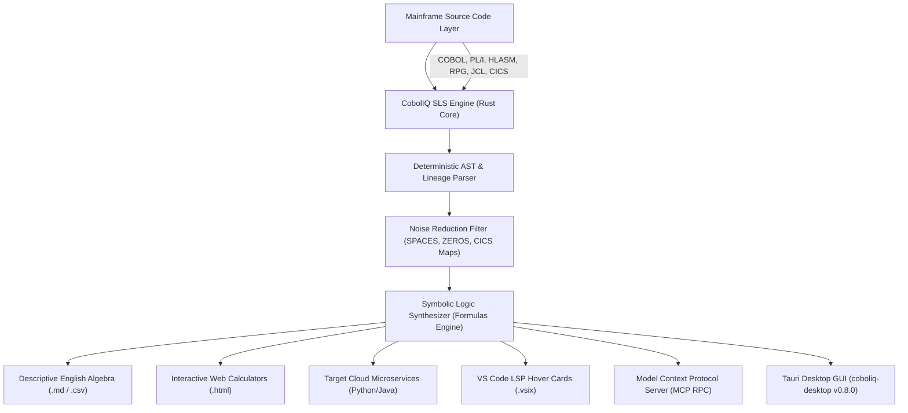

# CobolIQ — Master System Specification & Architecture Overview

> [!NOTE]
> **EVALUATION & ARCHITECTURE SPECIFICATION — COBOLIQ ENTERPRISE SUITE v0.99**  
> _Proprietary Synaptic Logic Synthesizer (SLS) Engine. 100% Founder-Owned Intellectual Property._

> **Core Motto**: _Stop Migrating. Start Understanding Ground Truth._

---

## 1. System Vision & Executive Summary

**CobolIQ** is the world's first **Deterministic Ground-Truth Extraction & Synaptic Logic Synthesizer (SLS)** for legacy mainframe enterprise applications (COBOL, IBM PL/I, HLASM Assembler, IBM RPG III/IV/FREE, JCL, CICS, DB2, VSAM).

Unlike traditional 1:1 legacy transpilers (JOBOL) or generic LLM-based converters that hallucinate execution paths and recreate 50 years of accumulated legacy debt in Java, **CobolIQ operates on 100% deterministic Abstract Syntax Tree (AST) analysis**. It bypasses infrastructure noise (memory zeroing, CICS map navigation, status codes) to isolate, extract, and reconstruct pure, human-readable **Descriptive Business Algebra** in 100% English.

---

## 2. Core Architectural Components & Technology Stack

### 2.1. The Rust Core (`coboliq.exe`)

- **High-Speed AST Parser**: Written in 100% safe, high-concurrency Rust. Parsed 4,243 federal Medicare rules in less than 1 second.
- **Transitive Field Lineage Tracer (`--trace-field <NAME>`)**: Traces any input variable or terminal field (e.g. 3270 BMS screen input `ACCT-NO` or ESRD payment variable `SE-PAYMENT`) across all transitive `MOVE`, `COMPUTE`, `CALL`, and SQL DB2/VSAM database write paths in a single execution step.
- **Symbolic Logic Synthesizer (`src/formulas.rs`)**: Performs reverse symbolic substitution across `COMPUTE`, `MOVE`, `EVALUATE`, and `PERFORM` blocks to reduce complex multi-step memory operations into single, closed-form algebraic equations.
- **Zero-Copy Memory Pipeline**: Utilizes memory-mapped file I/O (`mmap`) and lock-free thread pools for processing multi-gigabyte mainframe codebases with fixed memory overhead.

### 2.2. Interface & Integration Layer

1. **VS Code Extension (`coboliq-0.1.0.vsix`)**:
   - Integrated Language Server Protocol (LSP) providing inline code hover cards.
   - Shows original copybook lineage, variable types (e.g. `COMP-3`), and AST diagnostics (`NUMERIC_TRUNCATION`, `STATE_LEAK`).
2. **SWI-Prolog Knowledge Graph Engine (`--format prolog` / `carddemo_facts.pl`)**:
   - Generates 100% deterministic Prolog logic facts (`program`, `linkage_var`, `move`, `compute`, `perform`) enabling instantaneous transitive graph queries (`reachable`, `call_path`, `perform_path`, `dora_review_required`).
3. **Model Context Protocol (MCP Server)**:
   - Exposes native JSON-RPC tools (`call_mcp_tool`) for AI agents, allowing LLMs to query exact ground-truth logic without reading raw COBOL.
4. **Tauri Desktop Application (`coboliq-desktop v0.8.0`)**:
   - Cross-platform native desktop GUI embedding the Rust sidecar CLI.
5. **Native VSAM Extractor (`extract.py` / `inject.py`)**:
   - Generates autarkic GnuCOBOL bridge binaries on-the-fly to read/write native EBCDIC binary VSAM datasets (including packed decimals `COMP-3`) into standard JSONL/CSV formats.

---

## 3. Product Deliverables & Output Formats

| Deliverable Tier                | File Format     | Target Audience                | Primary Utility                                                                         |
| ------------------------------- | --------------- | ------------------------------ | --------------------------------------------------------------------------------------- |
| **Descriptive English Algebra** | `.md` / `.csv`  | Business Analysts, Actuaries   | Step-by-step mathematical formulas with line-number lineage.                            |
| **Interactive Web Calculators** | `.html`         | Executive Leadership, CFOs     | Live standalone browser calculators executing extracted math without mainframe runtime. |
| **Clean Microservice Starters** | `.py` / `.java` | Cloud Engineers, DevOps        | Clean, modular Python (Django) & Java (Spring Boot) target code.                        |
| **AST Diagnostic Scans**        | `.json` / `.md` | Regulatory & Compliance (DORA) | 100% audit trail detecting dead code, memory leaks, and state mutations.                |

---

## 4. Financial ROI & Market Segmentation

### 4.1. The "Water at the Airport" Value Segmentation

- **Software Houses & IT Integrators (HCLTech, Tech Mahindra)**: Discovery phase reduced from 18 months to 1 day. Expands project gross profit margins from 25% to 85%.
- **Enterprise Banks & Telcos (AT&T, Verizon, US Financials)**: Eliminates $100M+ cutover risks (e.g., TSB £380M outage) by validating 100% mathematical parity before decommissioning mainframes.

### 4.2. Regulatory & Security Compliance

- **DORA Article 8 & EU/US Compliance**: Provides source-cited data lineage and execution traces required for financial software auditing.
- **100% Air-Gapped Airspace**: Operates completely offline inside client VPCs (AWS GovCloud, Azure Confidential, On-Premise Docker) with **zero call-home network dependencies**.

### 4.3. Enterprise Deployment & Hardware Security Principles

- **Architecture Fine-Tuning Principle**: Extracted business algebra and generated microservice starters (Python/Django, Java/Spring, Rust, C++) provide 100% AST Ground Truth. Target runtime integration requires architecture adaptation, ORM wiring, and fine-tuning by the buyer's engineering team to fit their specific cloud/on-premise enterprise infrastructure.
- **Hardware-Bound Quad-Chain License Security (`license_chain`)**: In enterprise deployments, the CobolIQ binary is cryptographically bound to corporate hardware via a Quad-Chain hardware enclave hash (CPU ID, Motherboard UUID, MAC, TPM). This guarantees that a hired contractor or developer **cannot steal, copy, or execute the binary outside of their assigned corporate laptop or authorized enterprise environment.**

### 4.4. Total System Governance vs. IBM Z Vendor-Locked Extensions

- **Beyond 1-Time Migration — Everyday System Governance**: CobolIQ is not merely a single-use migration utility. An offshore or in-house developer armed with `coboliq-0.1.0.vsix` gains **Total System Governance** — enabling them to perform everyday code maintenance, audit complex business logic, patch production bugs, and trace data lineage on 50-year-old COBOL/zOS systems without needing decades of mainframe experience.
- **Why IBM Z Extensions (IBM Z Open Editor / Wazi) Fall Short**:
  1. **Proprietary Vendor Lock-In**: IBM Z extensions (IBM Z Open Editor, IBM Wazi) are strictly vendor-locked to IBM Z hardware, IBM host compilers, and z/OS dependencies.
  2. **Syntax-Only Highlighting vs. Symbolic Logic Extraction**: IBM Z extensions provide basic syntax highlighting and Zowe CLI host submission, but **cannot extract Working-Storage business math, cannot generate standalone English algebra formulas, cannot build standalone HTML browser calculators, and cannot export target microservices.**
  3. **CobolIQ Vendor-Agnostic Freedom**: CobolIQ runs 100% offline (Air-Gapped Single Binary) across IBM Enterprise COBOL, GnuCOBOL, Micro Focus, z/OS, and OpenCOBOL with zero vendor lock-in.

---

## 5. Architectural Cross-Check & Capabilities Unlock Matrix

Below is an empirical cross-check comparing legacy tools and vendor-locked IBM Z extensions against **CobolIQ's Total Capabilities Unlock**:

| Capability / Metric                | IBM Z Open Editor & Wazi                 | IBM watsonx Code Assistant for Z     | Generic LLM Assistants                  | **CobolIQ SLS Engine (Total Unlock)**                                        |
| ---------------------------------- | ---------------------------------------- | ------------------------------------ | --------------------------------------- | ---------------------------------------------------------------------------- |
| **Core Functionality**             | Basic Syntax Highlighting & Outline      | Forced COBOL-to-Java Transpilation   | Text Summarization                      | **100% Deterministic AST Logic Extraction & Governance**                     |
| **Symbolic Math Extraction**       | ❌ None (Requires Manual Reading)        | ❌ None (Generates Java Classes)     | ❌ Probabilistic (10-25% Hallucination) | **✅ 100% Pure English Business Algebra (0% Hallucination)**                 |
| **Vendor Lock-In**                 | ⚠️ Locked to IBM z/OS & Host Compilers   | ⚠️ Locked to IBM Cloud & Java Target | ⚠️ Cloud API Vendor Lock                | **✅ 100% Vendor-Agnostic (IBM, Micro Focus, GnuCOBOL, OpenCOBOL)**          |
| **Deployment Mode**                | Requires z/OS / Zowe Host Connection     | IBM Cloud SaaS Subscription          | Public / Private Cloud API              | **✅ 100% Air-Gapped Single Binary (Zero Network Call-Home)**                |
| **Target Output Options**          | None (IDE Editor Only)                   | Forced Java (Spring/Jakarta)         | Unstructured Snippets                   | **✅ Descriptive English (.md), HTML Calculators, Python, Java, Rust, C++**  |
| **Everyday Governance & Patching** | Syntax Only (Requires 30y Mainframe Exp) | Refactoring Only                     | Chat Suggestions                        | **✅ Full System Governance (Patching & Auditing without Mainframe Exp)**    |
| **Hardware Theft Security**        | ❌ None                                  | ❌ None                              | ❌ None                                 | **✅ Cryptographic Hardware Quad-Chain Enclave Lock (`arborium_bridge.rs`)** |

---

_CobolIQ v0.99 Enterprise Suite — Fully Founder-Owned Intellectual Property (Clean Cap Table)._
