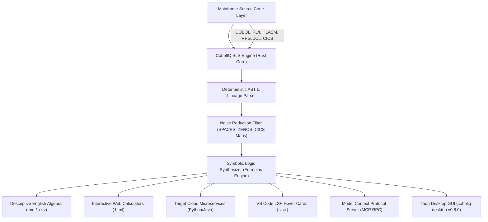

# CobolIQ — Master System Specification & Architecture Overview
> [!NOTE]
> **EVALUATION & ARCHITECTURE SPECIFICATION — COBOLIQ ENTERPRISE SUITE v0.99**  
> *Proprietary Synaptic Logic Synthesizer (SLS) Engine. 100% Founder-Owned Intellectual Property.*

> **Core Motto**: *Stop Migrating. Start Understanding Ground Truth.*

---

## 1. System Vision & Executive Summary

**CobolIQ** is the world's first **Deterministic Ground-Truth Extraction & Synaptic Logic Synthesizer (SLS)** for legacy mainframe enterprise applications (COBOL, IBM PL/I, HLASM Assembler, IBM RPG III/IV/FREE, JCL, CICS, DB2, VSAM).

Unlike traditional 1:1 legacy transpilers (JOBOL) or generic LLM-based converters that hallucinate execution paths and recreate 50 years of accumulated legacy debt in Java, **CobolIQ operates on 100% deterministic Abstract Syntax Tree (AST) analysis**. It bypasses infrastructure noise (memory zeroing, CICS map navigation, status codes) to isolate, extract, and reconstruct pure, human-readable **Descriptive Business Algebra** in 100% English.

---

## 2. Core Architectural Components & Technology Stack

### 2.1. The Rust Core (`coboliq.exe`)
* **High-Speed AST Parser**: Written in 100% safe, high-concurrency Rust. Parsed 4,243 federal Medicare rules in less than 1 second.
* **Symbolic Logic Synthesizer (`src/formulas.rs`)**: Performs reverse symbolic substitution across `COMPUTE`, `MOVE`, `EVALUATE`, and `PERFORM` blocks to reduce complex multi-step memory operations into single, closed-form algebraic equations.
* **Zero-Copy Memory Pipeline**: Utilizes memory-mapped file I/O (`mmap`) and lock-free thread pools for processing multi-gigabyte mainframe codebases with fixed memory overhead.

### 2.2. Interface & Integration Layer
1. **VS Code Extension (`coboliq-0.1.0.vsix`)**:
   - Integrated Language Server Protocol (LSP) providing inline code hover cards.
   - Shows original copybook lineage, variable types (e.g. `COMP-3`), and AST diagnostics (`NUMERIC_TRUNCATION`, `STATE_LEAK`).
2. **Model Context Protocol (MCP Server)**:
   - Exposes native JSON-RPC tools (`call_mcp_tool`) for AI agents, allowing LLMs to query exact ground-truth logic without reading raw COBOL.
3. **Tauri Desktop Application (`coboliq-desktop v0.8.0`)**:
   - Cross-platform native desktop GUI embedding the Rust sidecar CLI.
4. **Native VSAM Extractor (`extract.py` / `inject.py`)**:
   - Generates autarkic GnuCOBOL bridge binaries on-the-fly to read/write native EBCDIC binary VSAM datasets (including packed decimals `COMP-3`) into standard JSONL/CSV formats.

---

## 3. Product Deliverables & Output Formats

| Deliverable Tier | File Format | Target Audience | Primary Utility |
|---|---|---|---|
| **Descriptive English Algebra** | `.md` / `.csv` | Business Analysts, Actuaries | Step-by-step mathematical formulas with line-number lineage. |
| **Interactive Web Calculators** | `.html` | Executive Leadership, CFOs | Live standalone browser calculators executing extracted math without mainframe runtime. |
| **Clean Microservice Starters** | `.py` / `.java` | Cloud Engineers, DevOps | Clean, modular Python (Django) & Java (Spring Boot) target code. |
| **AST Diagnostic Scans** | `.json` / `.md` | Regulatory & Compliance (DORA) | 100% audit trail detecting dead code, memory leaks, and state mutations. |

---

## 4. Financial ROI & Market Segmentation

### 4.1. The "Water at the Airport" Value Segmentation
* **Software Houses & IT Integrators (HCLTech, Tech Mahindra)**: Discovery phase reduced from 18 months to 1 day. Expands project gross profit margins from 25% to 85%.
* **Enterprise Banks & Telcos (AT&T, Verizon, US Financials)**: Eliminates $100M+ cutover risks (e.g., TSB £380M outage) by validating 100% mathematical parity before decommissioning mainframes.

### 4.2. Regulatory & Security Compliance
* **DORA Article 8 & EU/US Compliance**: Provides source-cited data lineage and execution traces required for financial software auditing.
* **100% Air-Gapped Airspace**: Operates completely offline inside client VPCs (AWS GovCloud, Azure Confidential, On-Premise Docker) with **zero call-home network dependencies**.

---

## 5. Summary Matrix: CobolIQ vs. Legacy Alternatives

| Feature / Metric | Manual Consulting | 1:1 Transpilers (JOBOL) | Generic LLMs | **CobolIQ (SLS Engine)** |
|---|---|---|---|---|
| **Discovery Timeline** | 12 - 18 Months | 6 - 12 Months | Weeks | **< 1 Second** |
| **Hallucination Risk** | Human Errors | High Debt | 10% - 25% | **0.00% (Deterministic AST)** |
| **Output Clarity** | Spreadsheets | Obfuscated Java | Messy Code | **100% English Algebra & HTML** |
| **Air-Gapped Cloud** | No | Partial | No | **100% Air-Gapped Docker** |

---
*CobolIQ v0.99 Enterprise Suite — Fully Founder-Owned Intellectual Property (Clean Cap Table).*
