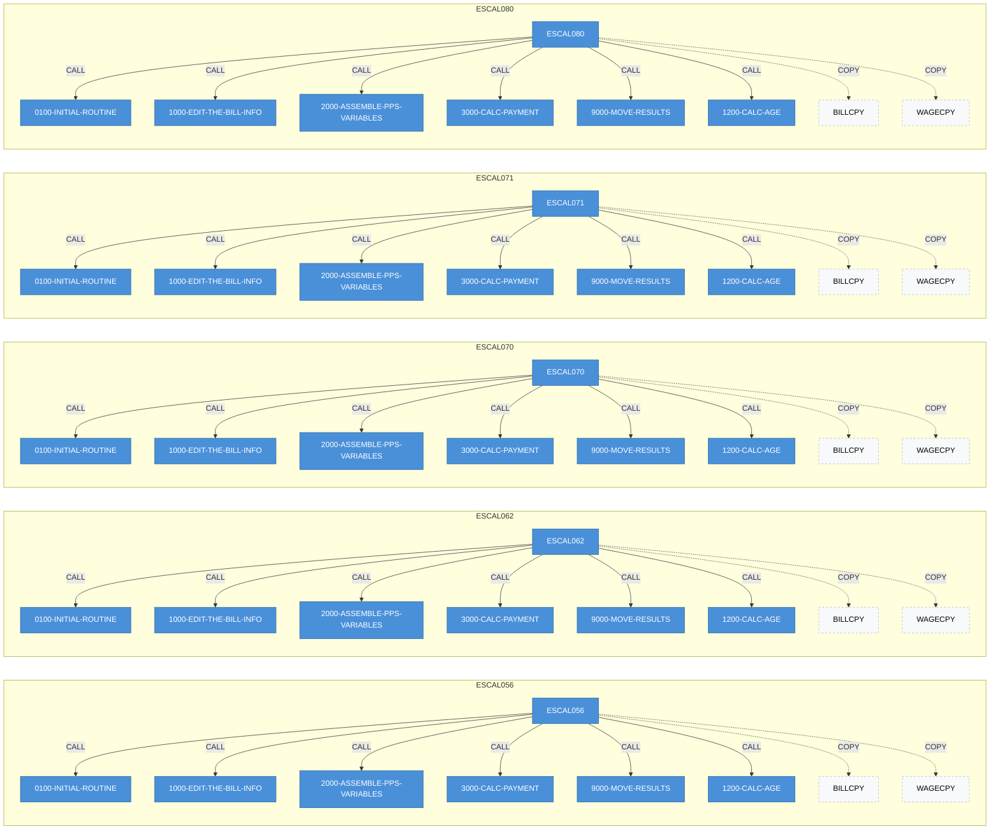

# COBOL Project Analysis

**Root:** `d:\cobol\ESRDCY212MainframePricerReleaseFiles`

**Programs:** 21 | **ASM modules:** 0 | **Copybooks:** 0

## Executive Summary

### `ESCAL056`

COBOL program `ESCAL056` orchestrates a 1-step business flow. It emits 9 distinct return-code value(s) across 9 assignment site(s), driven by 0 state-machine flag group(s). Depends on 2 external copybook(s): BILLCPY, WAGECPY.

### `ESCAL062`

COBOL program `ESCAL062` orchestrates a 1-step business flow. It emits 9 distinct return-code value(s) across 9 assignment site(s), driven by 0 state-machine flag group(s). Depends on 2 external copybook(s): BILLCPY, WAGECPY.

### `ESCAL070`

COBOL program `ESCAL070` orchestrates a 1-step business flow. It emits 9 distinct return-code value(s) across 9 assignment site(s), driven by 0 state-machine flag group(s). Depends on 2 external copybook(s): BILLCPY, WAGECPY.

### `ESCAL071`

COBOL program `ESCAL071` orchestrates a 1-step business flow. It emits 9 distinct return-code value(s) across 9 assignment site(s), driven by 0 state-machine flag group(s). Depends on 2 external copybook(s): BILLCPY, WAGECPY.

### `ESCAL080`

COBOL program `ESCAL080` orchestrates a 1-step business flow. It emits 9 distinct return-code value(s) across 9 assignment site(s), driven by 0 state-machine flag group(s). Depends on 2 external copybook(s): BILLCPY, WAGECPY.

### `ESCAL091`

COBOL program `ESCAL091` orchestrates a 1-step business flow. It emits 9 distinct return-code value(s) across 9 assignment site(s), driven by 0 state-machine flag group(s). Depends on 2 external copybook(s): BILLCPY, WAGECPY.

### `ESCAL100`

COBOL program `ESCAL100` orchestrates a 1-step business flow. It emits 9 distinct return-code value(s) across 9 assignment site(s), driven by 0 state-machine flag group(s). Depends on 2 external copybook(s): BILLCPY, WAGECPY.

### `ESCAL117`

COBOL program `ESCAL117` orchestrates a 1-step business flow. It emits 47 distinct return-code value(s) across 47 assignment site(s), driven by 1 state-machine flag group(s). Depends on 3 external copybook(s): RTCCPY, BILLCPY, WAGECPY.

### `ESCAL122`

COBOL program `ESCAL122` orchestrates a 1-step business flow. It emits 47 distinct return-code value(s) across 48 assignment site(s), driven by 1 state-machine flag group(s). Depends on 3 external copybook(s): RTCCPY, BILLCPY, WAGECPY.

### `ESCAL130`

COBOL program `ESCAL130` orchestrates a 1-step business flow. It emits 47 distinct return-code value(s) across 48 assignment site(s), driven by 1 state-machine flag group(s). Depends on 3 external copybook(s): RTCCPY, BILLCPY, WAGECPY.

### `ESCAL140`

COBOL program `ESCAL140` orchestrates a 1-step business flow. It emits 47 distinct return-code value(s) across 48 assignment site(s), driven by 1 state-machine flag group(s). Depends on 3 external copybook(s): RTCCPY, BILLCPY, WAGECPY.

### `ESCAL151`

COBOL program `ESCAL151` orchestrates a 1-step business flow. It emits 47 distinct return-code value(s) across 48 assignment site(s), driven by 1 state-machine flag group(s). Depends on 3 external copybook(s): RTCCPY, BILLCPY, WAGECPY.

### `ESCAL160`

COBOL program `ESCAL160` orchestrates a 1-step business flow. It emits 47 distinct return-code value(s) across 48 assignment site(s), driven by 1 state-machine flag group(s). Depends on 3 external copybook(s): RTCCPY, BILLCPY, WAGECPY.

### `ESCAL170`

COBOL program `ESCAL170` orchestrates a 1-step business flow. It emits 47 distinct return-code value(s) across 48 assignment site(s), driven by 1 state-machine flag group(s). Depends on 3 external copybook(s): RTCCPY, BILLCPY, WAGECPY.

### `ESCAL171`

COBOL program `ESCAL171` orchestrates a 1-step business flow. It emits 47 distinct return-code value(s) across 48 assignment site(s), driven by 1 state-machine flag group(s). Depends on 3 external copybook(s): RTCCPY, BILLCPY, WAGECPY.

### `ESCAL180`

COBOL program `ESCAL180` orchestrates a 1-step business flow. It emits 47 distinct return-code value(s) across 48 assignment site(s), driven by 1 state-machine flag group(s). Depends on 3 external copybook(s): RTCCPY, BILLCPY, WAGECPY.

### `ESCAL191`

COBOL program `ESCAL191` orchestrates a 1-step business flow. It emits 47 distinct return-code value(s) across 48 assignment site(s), driven by 1 state-machine flag group(s). Depends on 3 external copybook(s): RTCCPY, BILLCPY, WAGECPY.

### `ESCAL200`

COBOL program `ESCAL200` orchestrates a 1-step business flow. It emits 47 distinct return-code value(s) across 48 assignment site(s), driven by 1 state-machine flag group(s). Depends on 3 external copybook(s): RTCCPY, BILLCPY, WAGECPY.

### `ESCAL202`

COBOL program `ESCAL202` orchestrates a 1-step business flow. It emits 47 distinct return-code value(s) across 48 assignment site(s), driven by 1 state-machine flag group(s). Depends on 3 external copybook(s): RTCCPY, BILLCPY, WAGECPY.

### `ESCAL212`

COBOL program `ESCAL212` orchestrates a 1-step business flow. It emits 47 distinct return-code value(s) across 48 assignment site(s), driven by 1 state-machine flag group(s). Depends on 3 external copybook(s): RTCCPY, BILLCPY, WAGECPY.

### `ESDRV212`

COBOL program `ESDRV212` orchestrates a 1-step business flow. It emits 6 distinct return-code value(s) across 13 assignment site(s), driven by 0 state-machine flag group(s). Depends on 8 external copybook(s): DSCNTRL, ESWRT151, ESCOM151, ESBUN210, ESCHI151, WAGECPY, RTCCPY, BILLCPY.

## Aggregated Stats

- Paragraphs: **232** | Call edges: **212**
- Return-code assignments: **699** | State machines: **13**

## Portfolio TSB Risk Metric (Technical & Structural Breakdown Risk)

- Average: [W] 35/100 (MEDIUM) | Worst paragraph: 100/100
- **60** CRITICAL, **1** HIGH paragraphs across portfolio

| Program | Avg | Max | Critical | High |
|---|---|---|---|---|
| `ESCAL117` | 53 | **100** | 4 | 0 |
| `ESCAL122` | 48 | **100** | 4 | 0 |
| `ESCAL130` | 48 | **100** | 4 | 0 |
| `ESCAL140` | 48 | **100** | 4 | 0 |
| `ESCAL151` | 48 | **100** | 4 | 0 |
| `ESCAL160` | 46 | **100** | 4 | 0 |
| `ESCAL170` | 43 | **100** | 4 | 0 |
| `ESCAL171` | 43 | **100** | 4 | 0 |
| `ESCAL180` | 43 | **100** | 4 | 0 |
| `ESCAL191` | 43 | **100** | 4 | 0 |
| `ESCAL200` | 43 | **100** | 4 | 0 |
| `ESCAL202` | 43 | **100** | 4 | 0 |
| `ESCAL212` | 44 | **100** | 4 | 0 |
| `ESDRV212` | 26 | **100** | 1 | 1 |
| `ESCAL056` | 19 | **84** | 1 | 0 |
| `ESCAL062` | 18 | **84** | 1 | 0 |
| `ESCAL070` | 18 | **84** | 1 | 0 |
| `ESCAL071` | 18 | **84** | 1 | 0 |
| `ESCAL080` | 18 | **84** | 1 | 0 |
| `ESCAL091` | 18 | **84** | 1 | 0 |
| `ESCAL100` | 18 | **84** | 1 | 0 |

## Infrastructure Graph

57 nodes, 268 edges.

# Unified Infrastructure Graph

## Summary

- **Nodes:** 57
- **Edges:** 268

| Node Type | Count |
|-----------|------|
| COBOL | 49 |
| Copybook | 8 |

## Top Incoming References (Blast Radius)

| Node | Incoming | Type |
|------|----------|------|
| `BILLCPY` | 21 | Copybook |
| `WAGECPY` | 21 | Copybook |
| `RTCCPY` | 14 | Copybook |
| `1000-VALIDATE-BILL-ELEMENTS` | 13 | COBOL |
| `1200-INITIALIZATION` | 13 | COBOL |
| `2000-CALCULATE-BUNDLED-FACTORS` | 13 | COBOL |
| `2100-CALC-COMORBID-ADJUST` | 13 | COBOL |
| `2500-CALC-OUTLIER-FACTORS` | 13 | COBOL |
| `2600-CALC-COMORBID-OUT-ADJUST` | 13 | COBOL |
| `9000-SET-RETURN-CODE` | 13 | COBOL |
| `9100-MOVE-RESULTS` | 13 | COBOL |
| `3000-LOW-VOL-FULL-PPS-PAYMENT` | 12 | COBOL |
| `3100-LOW-VOL-OUT-PPS-PAYMENT` | 12 | COBOL |
| `0100-INITIAL-ROUTINE` | 7 | COBOL |
| `1000-EDIT-THE-BILL-INFO` | 7 | COBOL |
### Cross-Program Dependency Map

```mermaid
graph LR
classDef cobol   fill:#4a90d9,stroke:#2c6aa0,color:#fff,font-weight:bold
classDef jcl     fill:#f0a500,stroke:#c07800,color:#000
classDef vsam    fill:#27ae60,stroke:#1e8449,color:#fff
classDef cics    fill:#e74c3c,stroke:#b03a2e,color:#fff
classDef db2     fill:#8e44ad,stroke:#6c3483,color:#fff
classDef ims     fill:#16a085,stroke:#0e6655,color:#fff
classDef mq      fill:#f39c12,stroke:#d68910,color:#fff
classDef utility fill:#bdc3c7,stroke:#95a5a6,color:#000

    cobol_ESCAL056["ESCAL056"] -->|CALL| cobol_0100_INITIAL_ROUTINE["0100-INITIAL-ROUTINE"]
    cobol_ESCAL056["ESCAL056"] -->|CALL| cobol_1000_EDIT_THE_BILL_INFO["1000-EDIT-THE-BILL-INFO"]
    cobol_ESCAL056["ESCAL056"] -->|CALL| cobol_2000_ASSEMBLE_PPS_VARIABLES["2000-ASSEMBLE-PPS-VARIABLES"]
    cobol_ESCAL056["ESCAL056"] -->|CALL| cobol_3000_CALC_PAYMENT["3000-CALC-PAYMENT"]
    cobol_ESCAL056["ESCAL056"] -->|CALL| cobol_9000_MOVE_RESULTS["9000-MOVE-RESULTS"]
    cobol_ESCAL056["ESCAL056"] -->|CALL| cobol_1200_CALC_AGE["1200-CALC-AGE"]
    cobol_ESCAL062["ESCAL062"] -->|CALL| cobol_0100_INITIAL_ROUTINE["0100-INITIAL-ROUTINE"]
    cobol_ESCAL062["ESCAL062"] -->|CALL| cobol_1000_EDIT_THE_BILL_INFO["1000-EDIT-THE-BILL-INFO"]
    cobol_ESCAL062["ESCAL062"] -->|CALL| cobol_2000_ASSEMBLE_PPS_VARIABLES["2000-ASSEMBLE-PPS-VARIABLES"]
    cobol_ESCAL062["ESCAL062"] -->|CALL| cobol_3000_CALC_PAYMENT["3000-CALC-PAYMENT"]
    cobol_ESCAL062["ESCAL062"] -->|CALL| cobol_9000_MOVE_RESULTS["9000-MOVE-RESULTS"]
    cobol_ESCAL062["ESCAL062"] -->|CALL| cobol_1200_CALC_AGE["1200-CALC-AGE"]
    cobol_ESCAL070["ESCAL070"] -->|CALL| cobol_0100_INITIAL_ROUTINE["0100-INITIAL-ROUTINE"]
    cobol_ESCAL070["ESCAL070"] -->|CALL| cobol_1000_EDIT_THE_BILL_INFO["1000-EDIT-THE-BILL-INFO"]
    cobol_ESCAL070["ESCAL070"] -->|CALL| cobol_2000_ASSEMBLE_PPS_VARIABLES["2000-ASSEMBLE-PPS-VARIABLES"]
    cobol_ESCAL070["ESCAL070"] -->|CALL| cobol_3000_CALC_PAYMENT["3000-CALC-PAYMENT"]
    cobol_ESCAL070["ESCAL070"] -->|CALL| cobol_9000_MOVE_RESULTS["9000-MOVE-RESULTS"]
    cobol_ESCAL070["ESCAL070"] -->|CALL| cobol_1200_CALC_AGE["1200-CALC-AGE"]
    cobol_ESCAL071["ESCAL071"] -->|CALL| cobol_0100_INITIAL_ROUTINE["0100-INITIAL-ROUTINE"]
    cobol_ESCAL071["ESCAL071"] -->|CALL| cobol_1000_EDIT_THE_BILL_INFO["1000-EDIT-THE-BILL-INFO"]
    cobol_ESCAL071["ESCAL071"] -->|CALL| cobol_2000_ASSEMBLE_PPS_VARIABLES["2000-ASSEMBLE-PPS-VARIABLES"]
    cobol_ESCAL071["ESCAL071"] -->|CALL| cobol_3000_CALC_PAYMENT["3000-CALC-PAYMENT"]
    cobol_ESCAL071["ESCAL071"] -->|CALL| cobol_9000_MOVE_RESULTS["9000-MOVE-RESULTS"]
    cobol_ESCAL071["ESCAL071"] -->|CALL| cobol_1200_CALC_AGE["1200-CALC-AGE"]
    cobol_ESCAL080["ESCAL080"] -->|CALL| cobol_0100_INITIAL_ROUTINE["0100-INITIAL-ROUTINE"]
    cobol_ESCAL080["ESCAL080"] -->|CALL| cobol_1000_EDIT_THE_BILL_INFO["1000-EDIT-THE-BILL-INFO"]
    cobol_ESCAL080["ESCAL080"] -->|CALL| cobol_2000_ASSEMBLE_PPS_VARIABLES["2000-ASSEMBLE-PPS-VARIABLES"]
    cobol_ESCAL080["ESCAL080"] -->|CALL| cobol_3000_CALC_PAYMENT["3000-CALC-PAYMENT"]
    cobol_ESCAL080["ESCAL080"] -->|CALL| cobol_9000_MOVE_RESULTS["9000-MOVE-RESULTS"]
    cobol_ESCAL080["ESCAL080"] -->|CALL| cobol_1200_CALC_AGE["1200-CALC-AGE"]
    cobol_ESCAL091["ESCAL091"] -->|CALL| cobol_0100_INITIAL_ROUTINE["0100-INITIAL-ROUTINE"]
    cobol_ESCAL091["ESCAL091"] -->|CALL| cobol_1000_EDIT_THE_BILL_INFO["1000-EDIT-THE-BILL-INFO"]
    cobol_ESCAL091["ESCAL091"] -->|CALL| cobol_2000_ASSEMBLE_PPS_VARIABLES["2000-ASSEMBLE-PPS-VARIABLES"]
    cobol_ESCAL091["ESCAL091"] -->|CALL| cobol_3000_CALC_PAYMENT["3000-CALC-PAYMENT"]
    cobol_ESCAL091["ESCAL091"] -->|CALL| cobol_9000_MOVE_RESULTS["9000-MOVE-RESULTS"]
    cobol_ESCAL091["ESCAL091"] -->|CALL| cobol_1200_CALC_AGE["1200-CALC-AGE"]
    cobol_ESCAL100["ESCAL100"] -->|CALL| cobol_0100_INITIAL_ROUTINE["0100-INITIAL-ROUTINE"]
    cobol_ESCAL100["ESCAL100"] -->|CALL| cobol_1000_EDIT_THE_BILL_INFO["1000-EDIT-THE-BILL-INFO"]
    cobol_ESCAL100["ESCAL100"] -->|CALL| cobol_2000_ASSEMBLE_PPS_VARIABLES["2000-ASSEMBLE-PPS-VARIABLES"]
    cobol_ESCAL100["ESCAL100"] -->|CALL| cobol_3000_CALC_PAYMENT["3000-CALC-PAYMENT"]
    cobol_ESCAL100["ESCAL100"] -->|CALL| cobol_9000_MOVE_RESULTS["9000-MOVE-RESULTS"]
    cobol_ESCAL100["ESCAL100"] -->|CALL| cobol_1200_CALC_AGE["1200-CALC-AGE"]
    cobol_ESCAL117["ESCAL117"] -->|CALL| cobol_1000_VALIDATE_BILL_ELEMENTS["1000-VALIDATE-BILL-ELEMENTS"]
    cobol_ESCAL117["ESCAL117"] -->|CALL| cobol_1200_INITIALIZATION["1200-INITIALIZATION"]
    cobol_ESCAL117["ESCAL117"] -->|CALL| cobol_2000_CALCULATE_BUNDLED_FACTORS["2000-CALCULATE-BUNDLED-FACTORS"]
    cobol_ESCAL117["ESCAL117"] -->|CALL| cobol_5000_CALC_COMP_RATE_FACTORS["5000-CALC-COMP-RATE-FACTORS"]
    cobol_ESCAL117["ESCAL117"] -->|CALL| cobol_9000_SET_RETURN_CODE["9000-SET-RETURN-CODE"]
    cobol_ESCAL117["ESCAL117"] -->|CALL| cobol_9100_MOVE_RESULTS["9100-MOVE-RESULTS"]
    cobol_ESCAL117["ESCAL117"] -->|CALL| cobol_2100_CALC_COMORBID_ADJUST["2100-CALC-COMORBID-ADJUST"]
    cobol_ESCAL117["ESCAL117"] -->|CALL| cobol_2500_CALC_OUTLIER_FACTORS["2500-CALC-OUTLIER-FACTORS"]
    cobol_ESCAL117["ESCAL117"] -->|CALL| cobol_2600_CALC_COMORBID_OUT_ADJUST["2600-CALC-COMORBID-OUT-ADJUST"]
    cobol_ESCAL122["ESCAL122"] -->|CALL| cobol_1000_VALIDATE_BILL_ELEMENTS["1000-VALIDATE-BILL-ELEMENTS"]
    cobol_ESCAL122["ESCAL122"] -->|CALL| cobol_1200_INITIALIZATION["1200-INITIALIZATION"]
    cobol_ESCAL122["ESCAL122"] -->|CALL| cobol_2000_CALCULATE_BUNDLED_FACTORS["2000-CALCULATE-BUNDLED-FACTORS"]
    cobol_ESCAL122["ESCAL122"] -->|CALL| cobol_5000_CALC_COMP_RATE_FACTORS["5000-CALC-COMP-RATE-FACTORS"]
    cobol_ESCAL122["ESCAL122"] -->|CALL| cobol_9000_SET_RETURN_CODE["9000-SET-RETURN-CODE"]
    cobol_ESCAL122["ESCAL122"] -->|CALL| cobol_9100_MOVE_RESULTS["9100-MOVE-RESULTS"]
    cobol_ESCAL122["ESCAL122"] -->|CALL| cobol_2100_CALC_COMORBID_ADJUST["2100-CALC-COMORBID-ADJUST"]
    cobol_ESCAL122["ESCAL122"] -->|CALL| cobol_2500_CALC_OUTLIER_FACTORS["2500-CALC-OUTLIER-FACTORS"]
    cobol_ESCAL122["ESCAL122"] -->|CALL| cobol_3000_LOW_VOL_FULL_PPS_PAYMENT["3000-LOW-VOL-FULL-PPS-PAYMENT"]
    cobol_ESCAL122["ESCAL122"] -->|CALL| cobol_3100_LOW_VOL_OUT_PPS_PAYMENT["3100-LOW-VOL-OUT-PPS-PAYMENT"]
    cobol_ESCAL122["ESCAL122"] -->|CALL| cobol_2600_CALC_COMORBID_OUT_ADJUST["2600-CALC-COMORBID-OUT-ADJUST"]
    cobol_ESCAL130["ESCAL130"] -->|CALL| cobol_1000_VALIDATE_BILL_ELEMENTS["1000-VALIDATE-BILL-ELEMENTS"]
    cobol_ESCAL130["ESCAL130"] -->|CALL| cobol_1200_INITIALIZATION["1200-INITIALIZATION"]
    cobol_ESCAL130["ESCAL130"] -->|CALL| cobol_2000_CALCULATE_BUNDLED_FACTORS["2000-CALCULATE-BUNDLED-FACTORS"]
    cobol_ESCAL130["ESCAL130"] -->|CALL| cobol_5000_CALC_COMP_RATE_FACTORS["5000-CALC-COMP-RATE-FACTORS"]
    cobol_ESCAL130["ESCAL130"] -->|CALL| cobol_9000_SET_RETURN_CODE["9000-SET-RETURN-CODE"]
    cobol_ESCAL130["ESCAL130"] -->|CALL| cobol_9100_MOVE_RESULTS["9100-MOVE-RESULTS"]
    cobol_ESCAL130["ESCAL130"] -->|CALL| cobol_2100_CALC_COMORBID_ADJUST["2100-CALC-COMORBID-ADJUST"]
    cobol_ESCAL130["ESCAL130"] -->|CALL| cobol_2500_CALC_OUTLIER_FACTORS["2500-CALC-OUTLIER-FACTORS"]
    cobol_ESCAL130["ESCAL130"] -->|CALL| cobol_3000_LOW_VOL_FULL_PPS_PAYMENT["3000-LOW-VOL-FULL-PPS-PAYMENT"]
    cobol_ESCAL130["ESCAL130"] -->|CALL| cobol_3100_LOW_VOL_OUT_PPS_PAYMENT["3100-LOW-VOL-OUT-PPS-PAYMENT"]
    cobol_ESCAL130["ESCAL130"] -->|CALL| cobol_2600_CALC_COMORBID_OUT_ADJUST["2600-CALC-COMORBID-OUT-ADJUST"]
    cobol_ESCAL140["ESCAL140"] -->|CALL| cobol_1000_VALIDATE_BILL_ELEMENTS["1000-VALIDATE-BILL-ELEMENTS"]
    cobol_ESCAL140["ESCAL140"] -->|CALL| cobol_1200_INITIALIZATION["1200-INITIALIZATION"]
    cobol_ESCAL140["ESCAL140"] -->|CALL| cobol_2000_CALCULATE_BUNDLED_FACTORS["2000-CALCULATE-BUNDLED-FACTORS"]
    cobol_ESCAL140["ESCAL140"] -->|CALL| cobol_5000_CALC_COMP_RATE_FACTORS["5000-CALC-COMP-RATE-FACTORS"]
    cobol_ESCAL140["ESCAL140"] -->|CALL| cobol_9000_SET_RETURN_CODE["9000-SET-RETURN-CODE"]
    cobol_ESCAL140["ESCAL140"] -->|CALL| cobol_9100_MOVE_RESULTS["9100-MOVE-RESULTS"]
    cobol_ESCAL140["ESCAL140"] -->|CALL| cobol_2100_CALC_COMORBID_ADJUST["2100-CALC-COMORBID-ADJUST"]
class cobol_ESCAL056 cobol
class cobol_0100_INITIAL_ROUTINE cobol
class cobol_1000_EDIT_THE_BILL_INFO cobol
class cobol_2000_ASSEMBLE_PPS_VARIABLES cobol
class cobol_3000_CALC_PAYMENT cobol
class cobol_9000_MOVE_RESULTS cobol
class cobol_1200_CALC_AGE cobol
class cobol_ESCAL062 cobol
class cobol_ESCAL070 cobol
class cobol_ESCAL071 cobol
class cobol_ESCAL080 cobol
class cobol_ESCAL091 cobol
class cobol_ESCAL100 cobol
class cobol_ESCAL117 cobol
class cobol_1000_VALIDATE_BILL_ELEMENTS cobol
class cobol_1200_INITIALIZATION cobol
class cobol_2000_CALCULATE_BUNDLED_FACTORS cobol
class cobol_5000_CALC_COMP_RATE_FACTORS cobol
class cobol_9000_SET_RETURN_CODE cobol
class cobol_9100_MOVE_RESULTS cobol
class cobol_2100_CALC_COMORBID_ADJUST cobol
class cobol_2500_CALC_OUTLIER_FACTORS cobol
class cobol_2600_CALC_COMORBID_OUT_ADJUST cobol
class cobol_ESCAL122 cobol
class cobol_3000_LOW_VOL_FULL_PPS_PAYMENT cobol
class cobol_3100_LOW_VOL_OUT_PPS_PAYMENT cobol
class cobol_ESCAL130 cobol
class cobol_ESCAL140 cobol

    note["Showing 80 of 207 edges - use --format dot for full graph"]
```

### Per-Module Detail

```mermaid
graph LR
classDef cobol fill:#4a90d9,stroke:#2c6aa0,color:#fff
classDef copy  fill:#f8f9fa,stroke:#adb5bd,color:#000,stroke-dasharray:4 4
classDef ext   fill:#bdc3c7,stroke:#95a5a6,color:#000

subgraph sg_cobol_ESCAL091["ESCAL091"]
    cobol_ESCAL091["ESCAL091"] -->|CALL| cobol_ESCAL091_cobol_0100_INITIAL_ROUTINE["0100-INITIAL-ROUTINE"]
    cobol_ESCAL091["ESCAL091"] -->|CALL| cobol_ESCAL091_cobol_1000_EDIT_THE_BILL_INFO["1000-EDIT-THE-BILL-INFO"]
    cobol_ESCAL091["ESCAL091"] -->|CALL| cobol_ESCAL091_cobol_2000_ASSEMBLE_PPS_VARIABLES["2000-ASSEMBLE-PPS-VARIABLES"]
    cobol_ESCAL091["ESCAL091"] -->|CALL| cobol_ESCAL091_cobol_3000_CALC_PAYMENT["3000-CALC-PAYMENT"]
    cobol_ESCAL091["ESCAL091"] -->|CALL| cobol_ESCAL091_cobol_9000_MOVE_RESULTS["9000-MOVE-RESULTS"]
    cobol_ESCAL091["ESCAL091"] -->|CALL| cobol_ESCAL091_cobol_1200_CALC_AGE["1200-CALC-AGE"]
    cobol_ESCAL091["ESCAL091"] -.->|COPY| cobol_ESCAL091_copybook_BILLCPY["BILLCPY"]
    cobol_ESCAL091["ESCAL091"] -.->|COPY| cobol_ESCAL091_copybook_WAGECPY["WAGECPY"]
end
subgraph sg_cobol_ESCAL100["ESCAL100"]
    cobol_ESCAL100["ESCAL100"] -->|CALL| cobol_ESCAL100_cobol_0100_INITIAL_ROUTINE["0100-INITIAL-ROUTINE"]
    cobol_ESCAL100["ESCAL100"] -->|CALL| cobol_ESCAL100_cobol_1000_EDIT_THE_BILL_INFO["1000-EDIT-THE-BILL-INFO"]
    cobol_ESCAL100["ESCAL100"] -->|CALL| cobol_ESCAL100_cobol_2000_ASSEMBLE_PPS_VARIABLES["2000-ASSEMBLE-PPS-VARIABLES"]
    cobol_ESCAL100["ESCAL100"] -->|CALL| cobol_ESCAL100_cobol_3000_CALC_PAYMENT["3000-CALC-PAYMENT"]
    cobol_ESCAL100["ESCAL100"] -->|CALL| cobol_ESCAL100_cobol_9000_MOVE_RESULTS["9000-MOVE-RESULTS"]
    cobol_ESCAL100["ESCAL100"] -->|CALL| cobol_ESCAL100_cobol_1200_CALC_AGE["1200-CALC-AGE"]
    cobol_ESCAL100["ESCAL100"] -.->|COPY| cobol_ESCAL100_copybook_BILLCPY["BILLCPY"]
    cobol_ESCAL100["ESCAL100"] -.->|COPY| cobol_ESCAL100_copybook_WAGECPY["WAGECPY"]
end
subgraph sg_cobol_ESCAL117["ESCAL117"]
    cobol_ESCAL117["ESCAL117"] -->|CALL| cobol_ESCAL117_cobol_1000_VALIDATE_BILL_ELEMENTS["1000-VALIDATE-BILL-ELEMENTS"]
    cobol_ESCAL117["ESCAL117"] -->|CALL| cobol_ESCAL117_cobol_1200_INITIALIZATION["1200-INITIALIZATION"]
    cobol_ESCAL117["ESCAL117"] -->|CALL| cobol_ESCAL117_cobol_2000_CALCULATE_BUNDLED_FACTORS["2000-CALCULATE-BUNDLED-FACTORS"]
    cobol_ESCAL117["ESCAL117"] -->|CALL| cobol_ESCAL117_cobol_5000_CALC_COMP_RATE_FACTORS["5000-CALC-COMP-RATE-FACTORS"]
    cobol_ESCAL117["ESCAL117"] -->|CALL| cobol_ESCAL117_cobol_9000_SET_RETURN_CODE["9000-SET-RETURN-CODE"]
    cobol_ESCAL117["ESCAL117"] -->|CALL| cobol_ESCAL117_cobol_9100_MOVE_RESULTS["9100-MOVE-RESULTS"]
    cobol_ESCAL117["ESCAL117"] -->|CALL| cobol_ESCAL117_cobol_2100_CALC_COMORBID_ADJUST["2100-CALC-COMORBID-ADJUST"]
    cobol_ESCAL117["ESCAL117"] -->|CALL| cobol_ESCAL117_cobol_2500_CALC_OUTLIER_FACTORS["2500-CALC-OUTLIER-FACTORS"]
    cobol_ESCAL117["ESCAL117"] -->|CALL| cobol_ESCAL117_cobol_2600_CALC_COMORBID_OUT_ADJUST["2600-CALC-COMORBID-OUT-ADJUST"]
    cobol_ESCAL117["ESCAL117"] -.->|COPY| cobol_ESCAL117_copybook_RTCCPY["RTCCPY"]
    cobol_ESCAL117["ESCAL117"] -.->|COPY| cobol_ESCAL117_copybook_BILLCPY["BILLCPY"]
    cobol_ESCAL117["ESCAL117"] -.->|COPY| cobol_ESCAL117_copybook_WAGECPY["WAGECPY"]
end
subgraph sg_cobol_ESCAL122["ESCAL122"]
    cobol_ESCAL122["ESCAL122"] -->|CALL| cobol_ESCAL122_cobol_1000_VALIDATE_BILL_ELEMENTS["1000-VALIDATE-BILL-ELEMENTS"]
    cobol_ESCAL122["ESCAL122"] -->|CALL| cobol_ESCAL122_cobol_1200_INITIALIZATION["1200-INITIALIZATION"]
    cobol_ESCAL122["ESCAL122"] -->|CALL| cobol_ESCAL122_cobol_2000_CALCULATE_BUNDLED_FACTORS["2000-CALCULATE-BUNDLED-FACTORS"]
    cobol_ESCAL122["ESCAL122"] -->|CALL| cobol_ESCAL122_cobol_5000_CALC_COMP_RATE_FACTORS["5000-CALC-COMP-RATE-FACTORS"]
    cobol_ESCAL122["ESCAL122"] -->|CALL| cobol_ESCAL122_cobol_9000_SET_RETURN_CODE["9000-SET-RETURN-CODE"]
    cobol_ESCAL122["ESCAL122"] -->|CALL| cobol_ESCAL122_cobol_9100_MOVE_RESULTS["9100-MOVE-RESULTS"]
    cobol_ESCAL122["ESCAL122"] -->|CALL| cobol_ESCAL122_cobol_2100_CALC_COMORBID_ADJUST["2100-CALC-COMORBID-ADJUST"]
    cobol_ESCAL122["ESCAL122"] -->|CALL| cobol_ESCAL122_cobol_2500_CALC_OUTLIER_FACTORS["2500-CALC-OUTLIER-FACTORS"]
    cobol_ESCAL122["ESCAL122"] -->|CALL| cobol_ESCAL122_cobol_3000_LOW_VOL_FULL_PPS_PAYMENT["3000-LOW-VOL-FULL-PPS-PAYMENT"]
    cobol_ESCAL122["ESCAL122"] -->|CALL| cobol_ESCAL122_cobol_3100_LOW_VOL_OUT_PPS_PAYMENT["3100-LOW-VOL-OUT-PPS-PAYMENT"]
    cobol_ESCAL122["ESCAL122"] -->|CALL| cobol_ESCAL122_cobol_2600_CALC_COMORBID_OUT_ADJUST["2600-CALC-COMORBID-OUT-ADJUST"]
    cobol_ESCAL122["ESCAL122"] -.->|COPY| cobol_ESCAL122_copybook_RTCCPY["RTCCPY"]
    cobol_ESCAL122["ESCAL122"] -.->|COPY| cobol_ESCAL122_copybook_BILLCPY["BILLCPY"]
    cobol_ESCAL122["ESCAL122"] -.->|COPY| cobol_ESCAL122_copybook_WAGECPY["WAGECPY"]
end
subgraph sg_cobol_ESCAL130["ESCAL130"]
    cobol_ESCAL130["ESCAL130"] -->|CALL| cobol_ESCAL130_cobol_1000_VALIDATE_BILL_ELEMENTS["1000-VALIDATE-BILL-ELEMENTS"]
    cobol_ESCAL130["ESCAL130"] -->|CALL| cobol_ESCAL130_cobol_1200_INITIALIZATION["1200-INITIALIZATION"]
    cobol_ESCAL130["ESCAL130"] -->|CALL| cobol_ESCAL130_cobol_2000_CALCULATE_BUNDLED_FACTORS["2000-CALCULATE-BUNDLED-FACTORS"]
    cobol_ESCAL130["ESCAL130"] -->|CALL| cobol_ESCAL130_cobol_5000_CALC_COMP_RATE_FACTORS["5000-CALC-COMP-RATE-FACTORS"]
    cobol_ESCAL130["ESCAL130"] -->|CALL| cobol_ESCAL130_cobol_9000_SET_RETURN_CODE["9000-SET-RETURN-CODE"]
    cobol_ESCAL130["ESCAL130"] -->|CALL| cobol_ESCAL130_cobol_9100_MOVE_RESULTS["9100-MOVE-RESULTS"]
    cobol_ESCAL130["ESCAL130"] -->|CALL| cobol_ESCAL130_cobol_2100_CALC_COMORBID_ADJUST["2100-CALC-COMORBID-ADJUST"]
    cobol_ESCAL130["ESCAL130"] -->|CALL| cobol_ESCAL130_cobol_2500_CALC_OUTLIER_FACTORS["2500-CALC-OUTLIER-FACTORS"]
    cobol_ESCAL130["ESCAL130"] -->|CALL| cobol_ESCAL130_cobol_3000_LOW_VOL_FULL_PPS_PAYMENT["3000-LOW-VOL-FULL-PPS-PAYMENT"]
    cobol_ESCAL130["ESCAL130"] -->|CALL| cobol_ESCAL130_cobol_3100_LOW_VOL_OUT_PPS_PAYMENT["3100-LOW-VOL-OUT-PPS-PAYMENT"]
    cobol_ESCAL130["ESCAL130"] -->|CALL| cobol_ESCAL130_cobol_2600_CALC_COMORBID_OUT_ADJUST["2600-CALC-COMORBID-OUT-ADJUST"]
    cobol_ESCAL130["ESCAL130"] -.->|COPY| cobol_ESCAL130_copybook_RTCCPY["RTCCPY"]
    cobol_ESCAL130["ESCAL130"] -.->|COPY| cobol_ESCAL130_copybook_BILLCPY["BILLCPY"]
    cobol_ESCAL130["ESCAL130"] -.->|COPY| cobol_ESCAL130_copybook_WAGECPY["WAGECPY"]
end
class cobol_ESCAL091_cobol_0100_INITIAL_ROUTINE cobol
class cobol_ESCAL091_cobol_1000_EDIT_THE_BILL_INFO cobol
class cobol_ESCAL091_cobol_2000_ASSEMBLE_PPS_VARIABLES cobol
class cobol_ESCAL091_cobol_3000_CALC_PAYMENT cobol
class cobol_ESCAL091_cobol_9000_MOVE_RESULTS cobol
class cobol_ESCAL091_cobol_1200_CALC_AGE cobol
class cobol_ESCAL091_copybook_BILLCPY copy
class cobol_ESCAL091_copybook_WAGECPY copy
class cobol_ESCAL091 cobol
class cobol_ESCAL100_cobol_0100_INITIAL_ROUTINE cobol
class cobol_ESCAL100_cobol_1000_EDIT_THE_BILL_INFO cobol
class cobol_ESCAL100_cobol_2000_ASSEMBLE_PPS_VARIABLES cobol
class cobol_ESCAL100_cobol_3000_CALC_PAYMENT cobol
class cobol_ESCAL100_cobol_9000_MOVE_RESULTS cobol
class cobol_ESCAL100_cobol_1200_CALC_AGE cobol
class cobol_ESCAL100_copybook_BILLCPY copy
class cobol_ESCAL100_copybook_WAGECPY copy
class cobol_ESCAL100 cobol
class cobol_ESCAL117_cobol_1000_VALIDATE_BILL_ELEMENTS cobol
class cobol_ESCAL117_cobol_1200_INITIALIZATION cobol
class cobol_ESCAL117_cobol_2000_CALCULATE_BUNDLED_FACTORS cobol
class cobol_ESCAL117_cobol_5000_CALC_COMP_RATE_FACTORS cobol
class cobol_ESCAL117_cobol_9000_SET_RETURN_CODE cobol
class cobol_ESCAL117_cobol_9100_MOVE_RESULTS cobol
class cobol_ESCAL117_cobol_2100_CALC_COMORBID_ADJUST cobol
class cobol_ESCAL117_cobol_2500_CALC_OUTLIER_FACTORS cobol
class cobol_ESCAL117_cobol_2600_CALC_COMORBID_OUT_ADJUST cobol
class cobol_ESCAL117_copybook_RTCCPY copy
class cobol_ESCAL117_copybook_BILLCPY copy
class cobol_ESCAL117_copybook_WAGECPY copy
class cobol_ESCAL117 cobol
class cobol_ESCAL122_cobol_1000_VALIDATE_BILL_ELEMENTS cobol
class cobol_ESCAL122_cobol_1200_INITIALIZATION cobol
class cobol_ESCAL122_cobol_2000_CALCULATE_BUNDLED_FACTORS cobol
class cobol_ESCAL122_cobol_5000_CALC_COMP_RATE_FACTORS cobol
class cobol_ESCAL122_cobol_9000_SET_RETURN_CODE cobol
class cobol_ESCAL122_cobol_9100_MOVE_RESULTS cobol
class cobol_ESCAL122_cobol_2100_CALC_COMORBID_ADJUST cobol
class cobol_ESCAL122_cobol_2500_CALC_OUTLIER_FACTORS cobol
class cobol_ESCAL122_cobol_3000_LOW_VOL_FULL_PPS_PAYMENT cobol
class cobol_ESCAL122_cobol_3100_LOW_VOL_OUT_PPS_PAYMENT cobol
class cobol_ESCAL122_cobol_2600_CALC_COMORBID_OUT_ADJUST cobol
class cobol_ESCAL122_copybook_RTCCPY copy
class cobol_ESCAL122_copybook_BILLCPY copy
class cobol_ESCAL122_copybook_WAGECPY copy
class cobol_ESCAL122 cobol
class cobol_ESCAL130_cobol_1000_VALIDATE_BILL_ELEMENTS cobol
class cobol_ESCAL130_cobol_1200_INITIALIZATION cobol
class cobol_ESCAL130_cobol_2000_CALCULATE_BUNDLED_FACTORS cobol
class cobol_ESCAL130_cobol_5000_CALC_COMP_RATE_FACTORS cobol
class cobol_ESCAL130_cobol_9000_SET_RETURN_CODE cobol
class cobol_ESCAL130_cobol_9100_MOVE_RESULTS cobol
class cobol_ESCAL130_cobol_2100_CALC_COMORBID_ADJUST cobol
class cobol_ESCAL130_cobol_2500_CALC_OUTLIER_FACTORS cobol
class cobol_ESCAL130_cobol_3000_LOW_VOL_FULL_PPS_PAYMENT cobol
class cobol_ESCAL130_cobol_3100_LOW_VOL_OUT_PPS_PAYMENT cobol
class cobol_ESCAL130_cobol_2600_CALC_COMORBID_OUT_ADJUST cobol
class cobol_ESCAL130_copybook_RTCCPY copy
class cobol_ESCAL130_copybook_BILLCPY copy
class cobol_ESCAL130_copybook_WAGECPY copy
class cobol_ESCAL130 cobol
```

```mermaid
graph LR
classDef cobol fill:#4a90d9,stroke:#2c6aa0,color:#fff
classDef copy  fill:#f8f9fa,stroke:#adb5bd,color:#000,stroke-dasharray:4 4
classDef ext   fill:#bdc3c7,stroke:#95a5a6,color:#000

subgraph sg_cobol_ESCAL140["ESCAL140"]
    cobol_ESCAL140["ESCAL140"] -->|CALL| cobol_ESCAL140_cobol_1000_VALIDATE_BILL_ELEMENTS["1000-VALIDATE-BILL-ELEMENTS"]
    cobol_ESCAL140["ESCAL140"] -->|CALL| cobol_ESCAL140_cobol_1200_INITIALIZATION["1200-INITIALIZATION"]
    cobol_ESCAL140["ESCAL140"] -->|CALL| cobol_ESCAL140_cobol_2000_CALCULATE_BUNDLED_FACTORS["2000-CALCULATE-BUNDLED-FACTORS"]
    cobol_ESCAL140["ESCAL140"] -->|CALL| cobol_ESCAL140_cobol_5000_CALC_COMP_RATE_FACTORS["5000-CALC-COMP-RATE-FACTORS"]
    cobol_ESCAL140["ESCAL140"] -->|CALL| cobol_ESCAL140_cobol_9000_SET_RETURN_CODE["9000-SET-RETURN-CODE"]
    cobol_ESCAL140["ESCAL140"] -->|CALL| cobol_ESCAL140_cobol_9100_MOVE_RESULTS["9100-MOVE-RESULTS"]
    cobol_ESCAL140["ESCAL140"] -->|CALL| cobol_ESCAL140_cobol_2100_CALC_COMORBID_ADJUST["2100-CALC-COMORBID-ADJUST"]
    cobol_ESCAL140["ESCAL140"] -->|CALL| cobol_ESCAL140_cobol_2500_CALC_OUTLIER_FACTORS["2500-CALC-OUTLIER-FACTORS"]
    cobol_ESCAL140["ESCAL140"] -->|CALL| cobol_ESCAL140_cobol_3000_LOW_VOL_FULL_PPS_PAYMENT["3000-LOW-VOL-FULL-PPS-PAYMENT"]
    cobol_ESCAL140["ESCAL140"] -->|CALL| cobol_ESCAL140_cobol_3100_LOW_VOL_OUT_PPS_PAYMENT["3100-LOW-VOL-OUT-PPS-PAYMENT"]
    cobol_ESCAL140["ESCAL140"] -->|CALL| cobol_ESCAL140_cobol_2600_CALC_COMORBID_OUT_ADJUST["2600-CALC-COMORBID-OUT-ADJUST"]
    cobol_ESCAL140["ESCAL140"] -.->|COPY| cobol_ESCAL140_copybook_RTCCPY["RTCCPY"]
    cobol_ESCAL140["ESCAL140"] -.->|COPY| cobol_ESCAL140_copybook_BILLCPY["BILLCPY"]
    cobol_ESCAL140["ESCAL140"] -.->|COPY| cobol_ESCAL140_copybook_WAGECPY["WAGECPY"]
end
subgraph sg_cobol_ESCAL151["ESCAL151"]
    cobol_ESCAL151["ESCAL151"] -->|CALL| cobol_ESCAL151_cobol_1000_VALIDATE_BILL_ELEMENTS["1000-VALIDATE-BILL-ELEMENTS"]
    cobol_ESCAL151["ESCAL151"] -->|CALL| cobol_ESCAL151_cobol_1200_INITIALIZATION["1200-INITIALIZATION"]
    cobol_ESCAL151["ESCAL151"] -->|CALL| cobol_ESCAL151_cobol_2000_CALCULATE_BUNDLED_FACTORS["2000-CALCULATE-BUNDLED-FACTORS"]
    cobol_ESCAL151["ESCAL151"] -->|CALL| cobol_ESCAL151_cobol_5000_CALC_COMP_RATE_FACTORS["5000-CALC-COMP-RATE-FACTORS"]
    cobol_ESCAL151["ESCAL151"] -->|CALL| cobol_ESCAL151_cobol_9000_SET_RETURN_CODE["9000-SET-RETURN-CODE"]
    cobol_ESCAL151["ESCAL151"] -->|CALL| cobol_ESCAL151_cobol_9100_MOVE_RESULTS["9100-MOVE-RESULTS"]
    cobol_ESCAL151["ESCAL151"] -->|CALL| cobol_ESCAL151_cobol_2100_CALC_COMORBID_ADJUST["2100-CALC-COMORBID-ADJUST"]
    cobol_ESCAL151["ESCAL151"] -->|CALL| cobol_ESCAL151_cobol_2500_CALC_OUTLIER_FACTORS["2500-CALC-OUTLIER-FACTORS"]
    cobol_ESCAL151["ESCAL151"] -->|CALL| cobol_ESCAL151_cobol_3000_LOW_VOL_FULL_PPS_PAYMENT["3000-LOW-VOL-FULL-PPS-PAYMENT"]
    cobol_ESCAL151["ESCAL151"] -->|CALL| cobol_ESCAL151_cobol_3100_LOW_VOL_OUT_PPS_PAYMENT["3100-LOW-VOL-OUT-PPS-PAYMENT"]
    cobol_ESCAL151["ESCAL151"] -->|CALL| cobol_ESCAL151_cobol_2600_CALC_COMORBID_OUT_ADJUST["2600-CALC-COMORBID-OUT-ADJUST"]
    cobol_ESCAL151["ESCAL151"] -.->|COPY| cobol_ESCAL151_copybook_RTCCPY["RTCCPY"]
    cobol_ESCAL151["ESCAL151"] -.->|COPY| cobol_ESCAL151_copybook_BILLCPY["BILLCPY"]
    cobol_ESCAL151["ESCAL151"] -.->|COPY| cobol_ESCAL151_copybook_WAGECPY["WAGECPY"]
end
subgraph sg_cobol_ESCAL160["ESCAL160"]
    cobol_ESCAL160["ESCAL160"] -->|CALL| cobol_ESCAL160_cobol_1000_VALIDATE_BILL_ELEMENTS["1000-VALIDATE-BILL-ELEMENTS"]
    cobol_ESCAL160["ESCAL160"] -->|CALL| cobol_ESCAL160_cobol_1200_INITIALIZATION["1200-INITIALIZATION"]
    cobol_ESCAL160["ESCAL160"] -->|CALL| cobol_ESCAL160_cobol_2000_CALCULATE_BUNDLED_FACTORS["2000-CALCULATE-BUNDLED-FACTORS"]
    cobol_ESCAL160["ESCAL160"] -->|CALL| cobol_ESCAL160_cobol_5000_CALC_COMP_RATE_FACTORS["5000-CALC-COMP-RATE-FACTORS"]
    cobol_ESCAL160["ESCAL160"] -->|CALL| cobol_ESCAL160_cobol_9000_SET_RETURN_CODE["9000-SET-RETURN-CODE"]
    cobol_ESCAL160["ESCAL160"] -->|CALL| cobol_ESCAL160_cobol_9100_MOVE_RESULTS["9100-MOVE-RESULTS"]
    cobol_ESCAL160["ESCAL160"] -->|CALL| cobol_ESCAL160_cobol_2100_CALC_COMORBID_ADJUST["2100-CALC-COMORBID-ADJUST"]
    cobol_ESCAL160["ESCAL160"] -->|CALL| cobol_ESCAL160_cobol_2500_CALC_OUTLIER_FACTORS["2500-CALC-OUTLIER-FACTORS"]
    cobol_ESCAL160["ESCAL160"] -->|CALL| cobol_ESCAL160_cobol_3000_LOW_VOL_FULL_PPS_PAYMENT["3000-LOW-VOL-FULL-PPS-PAYMENT"]
    cobol_ESCAL160["ESCAL160"] -->|CALL| cobol_ESCAL160_cobol_3100_LOW_VOL_OUT_PPS_PAYMENT["3100-LOW-VOL-OUT-PPS-PAYMENT"]
    cobol_ESCAL160["ESCAL160"] -->|CALL| cobol_ESCAL160_cobol_2600_CALC_COMORBID_OUT_ADJUST["2600-CALC-COMORBID-OUT-ADJUST"]
    cobol_ESCAL160["ESCAL160"] -.->|COPY| cobol_ESCAL160_copybook_RTCCPY["RTCCPY"]
    cobol_ESCAL160["ESCAL160"] -.->|COPY| cobol_ESCAL160_copybook_BILLCPY["BILLCPY"]
    cobol_ESCAL160["ESCAL160"] -.->|COPY| cobol_ESCAL160_copybook_WAGECPY["WAGECPY"]
end
subgraph sg_cobol_ESCAL170["ESCAL170"]
    cobol_ESCAL170["ESCAL170"] -->|CALL| cobol_ESCAL170_cobol_1000_VALIDATE_BILL_ELEMENTS["1000-VALIDATE-BILL-ELEMENTS"]
    cobol_ESCAL170["ESCAL170"] -->|CALL| cobol_ESCAL170_cobol_1200_INITIALIZATION["1200-INITIALIZATION"]
    cobol_ESCAL170["ESCAL170"] -->|CALL| cobol_ESCAL170_cobol_2000_CALCULATE_BUNDLED_FACTORS["2000-CALCULATE-BUNDLED-FACTORS"]
    cobol_ESCAL170["ESCAL170"] -->|CALL| cobol_ESCAL170_cobol_9000_SET_RETURN_CODE["9000-SET-RETURN-CODE"]
    cobol_ESCAL170["ESCAL170"] -->|CALL| cobol_ESCAL170_cobol_9100_MOVE_RESULTS["9100-MOVE-RESULTS"]
    cobol_ESCAL170["ESCAL170"] -->|CALL| cobol_ESCAL170_cobol_2100_CALC_COMORBID_ADJUST["2100-CALC-COMORBID-ADJUST"]
    cobol_ESCAL170["ESCAL170"] -->|CALL| cobol_ESCAL170_cobol_2500_CALC_OUTLIER_FACTORS["2500-CALC-OUTLIER-FACTORS"]
    cobol_ESCAL170["ESCAL170"] -->|CALL| cobol_ESCAL170_cobol_3000_LOW_VOL_FULL_PPS_PAYMENT["3000-LOW-VOL-FULL-PPS-PAYMENT"]
    cobol_ESCAL170["ESCAL170"] -->|CALL| cobol_ESCAL170_cobol_3100_LOW_VOL_OUT_PPS_PAYMENT["3100-LOW-VOL-OUT-PPS-PAYMENT"]
    cobol_ESCAL170["ESCAL170"] -->|CALL| cobol_ESCAL170_cobol_2600_CALC_COMORBID_OUT_ADJUST["2600-CALC-COMORBID-OUT-ADJUST"]
    cobol_ESCAL170["ESCAL170"] -.->|COPY| cobol_ESCAL170_copybook_RTCCPY["RTCCPY"]
    cobol_ESCAL170["ESCAL170"] -.->|COPY| cobol_ESCAL170_copybook_BILLCPY["BILLCPY"]
    cobol_ESCAL170["ESCAL170"] -.->|COPY| cobol_ESCAL170_copybook_WAGECPY["WAGECPY"]
end
subgraph sg_cobol_ESCAL171["ESCAL171"]
    cobol_ESCAL171["ESCAL171"] -->|CALL| cobol_ESCAL171_cobol_1000_VALIDATE_BILL_ELEMENTS["1000-VALIDATE-BILL-ELEMENTS"]
    cobol_ESCAL171["ESCAL171"] -->|CALL| cobol_ESCAL171_cobol_1200_INITIALIZATION["1200-INITIALIZATION"]
    cobol_ESCAL171["ESCAL171"] -->|CALL| cobol_ESCAL171_cobol_2000_CALCULATE_BUNDLED_FACTORS["2000-CALCULATE-BUNDLED-FACTORS"]
    cobol_ESCAL171["ESCAL171"] -->|CALL| cobol_ESCAL171_cobol_9000_SET_RETURN_CODE["9000-SET-RETURN-CODE"]
    cobol_ESCAL171["ESCAL171"] -->|CALL| cobol_ESCAL171_cobol_9100_MOVE_RESULTS["9100-MOVE-RESULTS"]
    cobol_ESCAL171["ESCAL171"] -->|CALL| cobol_ESCAL171_cobol_2100_CALC_COMORBID_ADJUST["2100-CALC-COMORBID-ADJUST"]
    cobol_ESCAL171["ESCAL171"] -->|CALL| cobol_ESCAL171_cobol_2500_CALC_OUTLIER_FACTORS["2500-CALC-OUTLIER-FACTORS"]
    cobol_ESCAL171["ESCAL171"] -->|CALL| cobol_ESCAL171_cobol_3000_LOW_VOL_FULL_PPS_PAYMENT["3000-LOW-VOL-FULL-PPS-PAYMENT"]
    cobol_ESCAL171["ESCAL171"] -->|CALL| cobol_ESCAL171_cobol_3100_LOW_VOL_OUT_PPS_PAYMENT["3100-LOW-VOL-OUT-PPS-PAYMENT"]
    cobol_ESCAL171["ESCAL171"] -->|CALL| cobol_ESCAL171_cobol_2600_CALC_COMORBID_OUT_ADJUST["2600-CALC-COMORBID-OUT-ADJUST"]
    cobol_ESCAL171["ESCAL171"] -.->|COPY| cobol_ESCAL171_copybook_RTCCPY["RTCCPY"]
    cobol_ESCAL171["ESCAL171"] -.->|COPY| cobol_ESCAL171_copybook_BILLCPY["BILLCPY"]
    cobol_ESCAL171["ESCAL171"] -.->|COPY| cobol_ESCAL171_copybook_WAGECPY["WAGECPY"]
end
class cobol_ESCAL140_cobol_1000_VALIDATE_BILL_ELEMENTS cobol
class cobol_ESCAL140_cobol_1200_INITIALIZATION cobol
class cobol_ESCAL140_cobol_2000_CALCULATE_BUNDLED_FACTORS cobol
class cobol_ESCAL140_cobol_5000_CALC_COMP_RATE_FACTORS cobol
class cobol_ESCAL140_cobol_9000_SET_RETURN_CODE cobol
class cobol_ESCAL140_cobol_9100_MOVE_RESULTS cobol
class cobol_ESCAL140_cobol_2100_CALC_COMORBID_ADJUST cobol
class cobol_ESCAL140_cobol_2500_CALC_OUTLIER_FACTORS cobol
class cobol_ESCAL140_cobol_3000_LOW_VOL_FULL_PPS_PAYMENT cobol
class cobol_ESCAL140_cobol_3100_LOW_VOL_OUT_PPS_PAYMENT cobol
class cobol_ESCAL140_cobol_2600_CALC_COMORBID_OUT_ADJUST cobol
class cobol_ESCAL140_copybook_RTCCPY copy
class cobol_ESCAL140_copybook_BILLCPY copy
class cobol_ESCAL140_copybook_WAGECPY copy
class cobol_ESCAL140 cobol
class cobol_ESCAL151_cobol_1000_VALIDATE_BILL_ELEMENTS cobol
class cobol_ESCAL151_cobol_1200_INITIALIZATION cobol
class cobol_ESCAL151_cobol_2000_CALCULATE_BUNDLED_FACTORS cobol
class cobol_ESCAL151_cobol_5000_CALC_COMP_RATE_FACTORS cobol
class cobol_ESCAL151_cobol_9000_SET_RETURN_CODE cobol
class cobol_ESCAL151_cobol_9100_MOVE_RESULTS cobol
class cobol_ESCAL151_cobol_2100_CALC_COMORBID_ADJUST cobol
class cobol_ESCAL151_cobol_2500_CALC_OUTLIER_FACTORS cobol
class cobol_ESCAL151_cobol_3000_LOW_VOL_FULL_PPS_PAYMENT cobol
class cobol_ESCAL151_cobol_3100_LOW_VOL_OUT_PPS_PAYMENT cobol
class cobol_ESCAL151_cobol_2600_CALC_COMORBID_OUT_ADJUST cobol
class cobol_ESCAL151_copybook_RTCCPY copy
class cobol_ESCAL151_copybook_BILLCPY copy
class cobol_ESCAL151_copybook_WAGECPY copy
class cobol_ESCAL151 cobol
class cobol_ESCAL160_cobol_1000_VALIDATE_BILL_ELEMENTS cobol
class cobol_ESCAL160_cobol_1200_INITIALIZATION cobol
class cobol_ESCAL160_cobol_2000_CALCULATE_BUNDLED_FACTORS cobol
class cobol_ESCAL160_cobol_5000_CALC_COMP_RATE_FACTORS cobol
class cobol_ESCAL160_cobol_9000_SET_RETURN_CODE cobol
class cobol_ESCAL160_cobol_9100_MOVE_RESULTS cobol
class cobol_ESCAL160_cobol_2100_CALC_COMORBID_ADJUST cobol
class cobol_ESCAL160_cobol_2500_CALC_OUTLIER_FACTORS cobol
class cobol_ESCAL160_cobol_3000_LOW_VOL_FULL_PPS_PAYMENT cobol
class cobol_ESCAL160_cobol_3100_LOW_VOL_OUT_PPS_PAYMENT cobol
class cobol_ESCAL160_cobol_2600_CALC_COMORBID_OUT_ADJUST cobol
class cobol_ESCAL160_copybook_RTCCPY copy
class cobol_ESCAL160_copybook_BILLCPY copy
class cobol_ESCAL160_copybook_WAGECPY copy
class cobol_ESCAL160 cobol
class cobol_ESCAL170_cobol_1000_VALIDATE_BILL_ELEMENTS cobol
class cobol_ESCAL170_cobol_1200_INITIALIZATION cobol
class cobol_ESCAL170_cobol_2000_CALCULATE_BUNDLED_FACTORS cobol
class cobol_ESCAL170_cobol_9000_SET_RETURN_CODE cobol
class cobol_ESCAL170_cobol_9100_MOVE_RESULTS cobol
class cobol_ESCAL170_cobol_2100_CALC_COMORBID_ADJUST cobol
class cobol_ESCAL170_cobol_2500_CALC_OUTLIER_FACTORS cobol
class cobol_ESCAL170_cobol_3000_LOW_VOL_FULL_PPS_PAYMENT cobol
class cobol_ESCAL170_cobol_3100_LOW_VOL_OUT_PPS_PAYMENT cobol
class cobol_ESCAL170_cobol_2600_CALC_COMORBID_OUT_ADJUST cobol
class cobol_ESCAL170_copybook_RTCCPY copy
class cobol_ESCAL170_copybook_BILLCPY copy
class cobol_ESCAL170_copybook_WAGECPY copy
class cobol_ESCAL170 cobol
class cobol_ESCAL171_cobol_1000_VALIDATE_BILL_ELEMENTS cobol
class cobol_ESCAL171_cobol_1200_INITIALIZATION cobol
class cobol_ESCAL171_cobol_2000_CALCULATE_BUNDLED_FACTORS cobol
class cobol_ESCAL171_cobol_9000_SET_RETURN_CODE cobol
class cobol_ESCAL171_cobol_9100_MOVE_RESULTS cobol
class cobol_ESCAL171_cobol_2100_CALC_COMORBID_ADJUST cobol
class cobol_ESCAL171_cobol_2500_CALC_OUTLIER_FACTORS cobol
class cobol_ESCAL171_cobol_3000_LOW_VOL_FULL_PPS_PAYMENT cobol
class cobol_ESCAL171_cobol_3100_LOW_VOL_OUT_PPS_PAYMENT cobol
class cobol_ESCAL171_cobol_2600_CALC_COMORBID_OUT_ADJUST cobol
class cobol_ESCAL171_copybook_RTCCPY copy
class cobol_ESCAL171_copybook_BILLCPY copy
class cobol_ESCAL171_copybook_WAGECPY copy
class cobol_ESCAL171 cobol
```

```mermaid
graph LR
classDef cobol fill:#4a90d9,stroke:#2c6aa0,color:#fff
classDef copy  fill:#f8f9fa,stroke:#adb5bd,color:#000,stroke-dasharray:4 4
classDef ext   fill:#bdc3c7,stroke:#95a5a6,color:#000

subgraph sg_cobol_ESCAL180["ESCAL180"]
    cobol_ESCAL180["ESCAL180"] -->|CALL| cobol_ESCAL180_cobol_1000_VALIDATE_BILL_ELEMENTS["1000-VALIDATE-BILL-ELEMENTS"]
    cobol_ESCAL180["ESCAL180"] -->|CALL| cobol_ESCAL180_cobol_1200_INITIALIZATION["1200-INITIALIZATION"]
    cobol_ESCAL180["ESCAL180"] -->|CALL| cobol_ESCAL180_cobol_2000_CALCULATE_BUNDLED_FACTORS["2000-CALCULATE-BUNDLED-FACTORS"]
    cobol_ESCAL180["ESCAL180"] -->|CALL| cobol_ESCAL180_cobol_9000_SET_RETURN_CODE["9000-SET-RETURN-CODE"]
    cobol_ESCAL180["ESCAL180"] -->|CALL| cobol_ESCAL180_cobol_9100_MOVE_RESULTS["9100-MOVE-RESULTS"]
    cobol_ESCAL180["ESCAL180"] -->|CALL| cobol_ESCAL180_cobol_2100_CALC_COMORBID_ADJUST["2100-CALC-COMORBID-ADJUST"]
    cobol_ESCAL180["ESCAL180"] -->|CALL| cobol_ESCAL180_cobol_2500_CALC_OUTLIER_FACTORS["2500-CALC-OUTLIER-FACTORS"]
    cobol_ESCAL180["ESCAL180"] -->|CALL| cobol_ESCAL180_cobol_3000_LOW_VOL_FULL_PPS_PAYMENT["3000-LOW-VOL-FULL-PPS-PAYMENT"]
    cobol_ESCAL180["ESCAL180"] -->|CALL| cobol_ESCAL180_cobol_3100_LOW_VOL_OUT_PPS_PAYMENT["3100-LOW-VOL-OUT-PPS-PAYMENT"]
    cobol_ESCAL180["ESCAL180"] -->|CALL| cobol_ESCAL180_cobol_2600_CALC_COMORBID_OUT_ADJUST["2600-CALC-COMORBID-OUT-ADJUST"]
    cobol_ESCAL180["ESCAL180"] -.->|COPY| cobol_ESCAL180_copybook_RTCCPY["RTCCPY"]
    cobol_ESCAL180["ESCAL180"] -.->|COPY| cobol_ESCAL180_copybook_BILLCPY["BILLCPY"]
    cobol_ESCAL180["ESCAL180"] -.->|COPY| cobol_ESCAL180_copybook_WAGECPY["WAGECPY"]
end
subgraph sg_cobol_ESCAL191["ESCAL191"]
    cobol_ESCAL191["ESCAL191"] -->|CALL| cobol_ESCAL191_cobol_1000_VALIDATE_BILL_ELEMENTS["1000-VALIDATE-BILL-ELEMENTS"]
    cobol_ESCAL191["ESCAL191"] -->|CALL| cobol_ESCAL191_cobol_1200_INITIALIZATION["1200-INITIALIZATION"]
    cobol_ESCAL191["ESCAL191"] -->|CALL| cobol_ESCAL191_cobol_2000_CALCULATE_BUNDLED_FACTORS["2000-CALCULATE-BUNDLED-FACTORS"]
    cobol_ESCAL191["ESCAL191"] -->|CALL| cobol_ESCAL191_cobol_9000_SET_RETURN_CODE["9000-SET-RETURN-CODE"]
    cobol_ESCAL191["ESCAL191"] -->|CALL| cobol_ESCAL191_cobol_9100_MOVE_RESULTS["9100-MOVE-RESULTS"]
    cobol_ESCAL191["ESCAL191"] -->|CALL| cobol_ESCAL191_cobol_2100_CALC_COMORBID_ADJUST["2100-CALC-COMORBID-ADJUST"]
    cobol_ESCAL191["ESCAL191"] -->|CALL| cobol_ESCAL191_cobol_2500_CALC_OUTLIER_FACTORS["2500-CALC-OUTLIER-FACTORS"]
    cobol_ESCAL191["ESCAL191"] -->|CALL| cobol_ESCAL191_cobol_3000_LOW_VOL_FULL_PPS_PAYMENT["3000-LOW-VOL-FULL-PPS-PAYMENT"]
    cobol_ESCAL191["ESCAL191"] -->|CALL| cobol_ESCAL191_cobol_3100_LOW_VOL_OUT_PPS_PAYMENT["3100-LOW-VOL-OUT-PPS-PAYMENT"]
    cobol_ESCAL191["ESCAL191"] -->|CALL| cobol_ESCAL191_cobol_2600_CALC_COMORBID_OUT_ADJUST["2600-CALC-COMORBID-OUT-ADJUST"]
    cobol_ESCAL191["ESCAL191"] -.->|COPY| cobol_ESCAL191_copybook_RTCCPY["RTCCPY"]
    cobol_ESCAL191["ESCAL191"] -.->|COPY| cobol_ESCAL191_copybook_BILLCPY["BILLCPY"]
    cobol_ESCAL191["ESCAL191"] -.->|COPY| cobol_ESCAL191_copybook_WAGECPY["WAGECPY"]
end
subgraph sg_cobol_ESCAL200["ESCAL200"]
    cobol_ESCAL200["ESCAL200"] -->|CALL| cobol_ESCAL200_cobol_1000_VALIDATE_BILL_ELEMENTS["1000-VALIDATE-BILL-ELEMENTS"]
    cobol_ESCAL200["ESCAL200"] -->|CALL| cobol_ESCAL200_cobol_1200_INITIALIZATION["1200-INITIALIZATION"]
    cobol_ESCAL200["ESCAL200"] -->|CALL| cobol_ESCAL200_cobol_2000_CALCULATE_BUNDLED_FACTORS["2000-CALCULATE-BUNDLED-FACTORS"]
    cobol_ESCAL200["ESCAL200"] -->|CALL| cobol_ESCAL200_cobol_9000_SET_RETURN_CODE["9000-SET-RETURN-CODE"]
    cobol_ESCAL200["ESCAL200"] -->|CALL| cobol_ESCAL200_cobol_9100_MOVE_RESULTS["9100-MOVE-RESULTS"]
    cobol_ESCAL200["ESCAL200"] -->|CALL| cobol_ESCAL200_cobol_2100_CALC_COMORBID_ADJUST["2100-CALC-COMORBID-ADJUST"]
    cobol_ESCAL200["ESCAL200"] -->|CALL| cobol_ESCAL200_cobol_2500_CALC_OUTLIER_FACTORS["2500-CALC-OUTLIER-FACTORS"]
    cobol_ESCAL200["ESCAL200"] -->|CALL| cobol_ESCAL200_cobol_3000_LOW_VOL_FULL_PPS_PAYMENT["3000-LOW-VOL-FULL-PPS-PAYMENT"]
    cobol_ESCAL200["ESCAL200"] -->|CALL| cobol_ESCAL200_cobol_3100_LOW_VOL_OUT_PPS_PAYMENT["3100-LOW-VOL-OUT-PPS-PAYMENT"]
    cobol_ESCAL200["ESCAL200"] -->|CALL| cobol_ESCAL200_cobol_2600_CALC_COMORBID_OUT_ADJUST["2600-CALC-COMORBID-OUT-ADJUST"]
    cobol_ESCAL200["ESCAL200"] -.->|COPY| cobol_ESCAL200_copybook_RTCCPY["RTCCPY"]
    cobol_ESCAL200["ESCAL200"] -.->|COPY| cobol_ESCAL200_copybook_BILLCPY["BILLCPY"]
    cobol_ESCAL200["ESCAL200"] -.->|COPY| cobol_ESCAL200_copybook_WAGECPY["WAGECPY"]
end
subgraph sg_cobol_ESCAL202["ESCAL202"]
    cobol_ESCAL202["ESCAL202"] -->|CALL| cobol_ESCAL202_cobol_1000_VALIDATE_BILL_ELEMENTS["1000-VALIDATE-BILL-ELEMENTS"]
    cobol_ESCAL202["ESCAL202"] -->|CALL| cobol_ESCAL202_cobol_1200_INITIALIZATION["1200-INITIALIZATION"]
    cobol_ESCAL202["ESCAL202"] -->|CALL| cobol_ESCAL202_cobol_2000_CALCULATE_BUNDLED_FACTORS["2000-CALCULATE-BUNDLED-FACTORS"]
    cobol_ESCAL202["ESCAL202"] -->|CALL| cobol_ESCAL202_cobol_9000_SET_RETURN_CODE["9000-SET-RETURN-CODE"]
    cobol_ESCAL202["ESCAL202"] -->|CALL| cobol_ESCAL202_cobol_9100_MOVE_RESULTS["9100-MOVE-RESULTS"]
    cobol_ESCAL202["ESCAL202"] -->|CALL| cobol_ESCAL202_cobol_2100_CALC_COMORBID_ADJUST["2100-CALC-COMORBID-ADJUST"]
    cobol_ESCAL202["ESCAL202"] -->|CALL| cobol_ESCAL202_cobol_2500_CALC_OUTLIER_FACTORS["2500-CALC-OUTLIER-FACTORS"]
    cobol_ESCAL202["ESCAL202"] -->|CALL| cobol_ESCAL202_cobol_3000_LOW_VOL_FULL_PPS_PAYMENT["3000-LOW-VOL-FULL-PPS-PAYMENT"]
    cobol_ESCAL202["ESCAL202"] -->|CALL| cobol_ESCAL202_cobol_3100_LOW_VOL_OUT_PPS_PAYMENT["3100-LOW-VOL-OUT-PPS-PAYMENT"]
    cobol_ESCAL202["ESCAL202"] -->|CALL| cobol_ESCAL202_cobol_2600_CALC_COMORBID_OUT_ADJUST["2600-CALC-COMORBID-OUT-ADJUST"]
    cobol_ESCAL202["ESCAL202"] -.->|COPY| cobol_ESCAL202_copybook_RTCCPY["RTCCPY"]
    cobol_ESCAL202["ESCAL202"] -.->|COPY| cobol_ESCAL202_copybook_BILLCPY["BILLCPY"]
    cobol_ESCAL202["ESCAL202"] -.->|COPY| cobol_ESCAL202_copybook_WAGECPY["WAGECPY"]
end
subgraph sg_cobol_ESCAL212["ESCAL212"]
    cobol_ESCAL212["ESCAL212"] -->|CALL| cobol_ESCAL212_cobol_1000_VALIDATE_BILL_ELEMENTS["1000-VALIDATE-BILL-ELEMENTS"]
    cobol_ESCAL212["ESCAL212"] -->|CALL| cobol_ESCAL212_cobol_1200_INITIALIZATION["1200-INITIALIZATION"]
    cobol_ESCAL212["ESCAL212"] -->|CALL| cobol_ESCAL212_cobol_2000_CALCULATE_BUNDLED_FACTORS["2000-CALCULATE-BUNDLED-FACTORS"]
    cobol_ESCAL212["ESCAL212"] -->|CALL| cobol_ESCAL212_cobol_9000_SET_RETURN_CODE["9000-SET-RETURN-CODE"]
    cobol_ESCAL212["ESCAL212"] -->|CALL| cobol_ESCAL212_cobol_9100_MOVE_RESULTS["9100-MOVE-RESULTS"]
    cobol_ESCAL212["ESCAL212"] -->|CALL| cobol_ESCAL212_cobol_2100_CALC_COMORBID_ADJUST["2100-CALC-COMORBID-ADJUST"]
    cobol_ESCAL212["ESCAL212"] -->|CALL| cobol_ESCAL212_cobol_2500_CALC_OUTLIER_FACTORS["2500-CALC-OUTLIER-FACTORS"]
    cobol_ESCAL212["ESCAL212"] -->|CALL| cobol_ESCAL212_cobol_3000_LOW_VOL_FULL_PPS_PAYMENT["3000-LOW-VOL-FULL-PPS-PAYMENT"]
    cobol_ESCAL212["ESCAL212"] -->|CALL| cobol_ESCAL212_cobol_3100_LOW_VOL_OUT_PPS_PAYMENT["3100-LOW-VOL-OUT-PPS-PAYMENT"]
    cobol_ESCAL212["ESCAL212"] -->|CALL| cobol_ESCAL212_cobol_2600_CALC_COMORBID_OUT_ADJUST["2600-CALC-COMORBID-OUT-ADJUST"]
    cobol_ESCAL212["ESCAL212"] -.->|COPY| cobol_ESCAL212_copybook_RTCCPY["RTCCPY"]
    cobol_ESCAL212["ESCAL212"] -.->|COPY| cobol_ESCAL212_copybook_BILLCPY["BILLCPY"]
    cobol_ESCAL212["ESCAL212"] -.->|COPY| cobol_ESCAL212_copybook_WAGECPY["WAGECPY"]
end
class cobol_ESCAL180_cobol_1000_VALIDATE_BILL_ELEMENTS cobol
class cobol_ESCAL180_cobol_1200_INITIALIZATION cobol
class cobol_ESCAL180_cobol_2000_CALCULATE_BUNDLED_FACTORS cobol
class cobol_ESCAL180_cobol_9000_SET_RETURN_CODE cobol
class cobol_ESCAL180_cobol_9100_MOVE_RESULTS cobol
class cobol_ESCAL180_cobol_2100_CALC_COMORBID_ADJUST cobol
class cobol_ESCAL180_cobol_2500_CALC_OUTLIER_FACTORS cobol
class cobol_ESCAL180_cobol_3000_LOW_VOL_FULL_PPS_PAYMENT cobol
class cobol_ESCAL180_cobol_3100_LOW_VOL_OUT_PPS_PAYMENT cobol
class cobol_ESCAL180_cobol_2600_CALC_COMORBID_OUT_ADJUST cobol
class cobol_ESCAL180_copybook_RTCCPY copy
class cobol_ESCAL180_copybook_BILLCPY copy
class cobol_ESCAL180_copybook_WAGECPY copy
class cobol_ESCAL180 cobol
class cobol_ESCAL191_cobol_1000_VALIDATE_BILL_ELEMENTS cobol
class cobol_ESCAL191_cobol_1200_INITIALIZATION cobol
class cobol_ESCAL191_cobol_2000_CALCULATE_BUNDLED_FACTORS cobol
class cobol_ESCAL191_cobol_9000_SET_RETURN_CODE cobol
class cobol_ESCAL191_cobol_9100_MOVE_RESULTS cobol
class cobol_ESCAL191_cobol_2100_CALC_COMORBID_ADJUST cobol
class cobol_ESCAL191_cobol_2500_CALC_OUTLIER_FACTORS cobol
class cobol_ESCAL191_cobol_3000_LOW_VOL_FULL_PPS_PAYMENT cobol
class cobol_ESCAL191_cobol_3100_LOW_VOL_OUT_PPS_PAYMENT cobol
class cobol_ESCAL191_cobol_2600_CALC_COMORBID_OUT_ADJUST cobol
class cobol_ESCAL191_copybook_RTCCPY copy
class cobol_ESCAL191_copybook_BILLCPY copy
class cobol_ESCAL191_copybook_WAGECPY copy
class cobol_ESCAL191 cobol
class cobol_ESCAL200_cobol_1000_VALIDATE_BILL_ELEMENTS cobol
class cobol_ESCAL200_cobol_1200_INITIALIZATION cobol
class cobol_ESCAL200_cobol_2000_CALCULATE_BUNDLED_FACTORS cobol
class cobol_ESCAL200_cobol_9000_SET_RETURN_CODE cobol
class cobol_ESCAL200_cobol_9100_MOVE_RESULTS cobol
class cobol_ESCAL200_cobol_2100_CALC_COMORBID_ADJUST cobol
class cobol_ESCAL200_cobol_2500_CALC_OUTLIER_FACTORS cobol
class cobol_ESCAL200_cobol_3000_LOW_VOL_FULL_PPS_PAYMENT cobol
class cobol_ESCAL200_cobol_3100_LOW_VOL_OUT_PPS_PAYMENT cobol
class cobol_ESCAL200_cobol_2600_CALC_COMORBID_OUT_ADJUST cobol
class cobol_ESCAL200_copybook_RTCCPY copy
class cobol_ESCAL200_copybook_BILLCPY copy
class cobol_ESCAL200_copybook_WAGECPY copy
class cobol_ESCAL200 cobol
class cobol_ESCAL202_cobol_1000_VALIDATE_BILL_ELEMENTS cobol
class cobol_ESCAL202_cobol_1200_INITIALIZATION cobol
class cobol_ESCAL202_cobol_2000_CALCULATE_BUNDLED_FACTORS cobol
class cobol_ESCAL202_cobol_9000_SET_RETURN_CODE cobol
class cobol_ESCAL202_cobol_9100_MOVE_RESULTS cobol
class cobol_ESCAL202_cobol_2100_CALC_COMORBID_ADJUST cobol
class cobol_ESCAL202_cobol_2500_CALC_OUTLIER_FACTORS cobol
class cobol_ESCAL202_cobol_3000_LOW_VOL_FULL_PPS_PAYMENT cobol
class cobol_ESCAL202_cobol_3100_LOW_VOL_OUT_PPS_PAYMENT cobol
class cobol_ESCAL202_cobol_2600_CALC_COMORBID_OUT_ADJUST cobol
class cobol_ESCAL202_copybook_RTCCPY copy
class cobol_ESCAL202_copybook_BILLCPY copy
class cobol_ESCAL202_copybook_WAGECPY copy
class cobol_ESCAL202 cobol
class cobol_ESCAL212_cobol_1000_VALIDATE_BILL_ELEMENTS cobol
class cobol_ESCAL212_cobol_1200_INITIALIZATION cobol
class cobol_ESCAL212_cobol_2000_CALCULATE_BUNDLED_FACTORS cobol
class cobol_ESCAL212_cobol_9000_SET_RETURN_CODE cobol
class cobol_ESCAL212_cobol_9100_MOVE_RESULTS cobol
class cobol_ESCAL212_cobol_2100_CALC_COMORBID_ADJUST cobol
class cobol_ESCAL212_cobol_2500_CALC_OUTLIER_FACTORS cobol
class cobol_ESCAL212_cobol_3000_LOW_VOL_FULL_PPS_PAYMENT cobol
class cobol_ESCAL212_cobol_3100_LOW_VOL_OUT_PPS_PAYMENT cobol
class cobol_ESCAL212_cobol_2600_CALC_COMORBID_OUT_ADJUST cobol
class cobol_ESCAL212_copybook_RTCCPY copy
class cobol_ESCAL212_copybook_BILLCPY copy
class cobol_ESCAL212_copybook_WAGECPY copy
class cobol_ESCAL212 cobol
```

```mermaid
graph LR
classDef cobol fill:#4a90d9,stroke:#2c6aa0,color:#fff
classDef copy  fill:#f8f9fa,stroke:#adb5bd,color:#000,stroke-dasharray:4 4
classDef ext   fill:#bdc3c7,stroke:#95a5a6,color:#000

subgraph sg_cobol_ESDRV212["ESDRV212"]
    cobol_ESDRV212["ESDRV212"] -->|CALL| cobol_ESDRV212_cobol_0100_EXIT_DRIVER["0100-EXIT-DRIVER"]
    cobol_ESDRV212["ESDRV212"] -->|CALL| cobol_ESDRV212_cobol_0500_FIND_MSA_WAGE_ADJ_RATE["0500-FIND-MSA-WAGE-ADJ-RATE"]
    cobol_ESDRV212["ESDRV212"] -->|CALL| cobol_ESDRV212_cobol_0700_FIND_COMPOSITE_CBSA_WI["0700-FIND-COMPOSITE-CBSA-WI"]
    cobol_ESDRV212["ESDRV212"] -->|CALL| cobol_ESDRV212_cobol_0800_FIND_BUNDLED_CBSA_WI["0800-FIND-BUNDLED-CBSA-WI"]
    cobol_ESDRV212["ESDRV212"] -->|CALL| cobol_ESDRV212_cobol_ESCAL056["ESCAL056"]
    cobol_ESDRV212["ESDRV212"] -->|CALL| cobol_ESDRV212_cobol_ESCAL062["ESCAL062"]
    cobol_ESDRV212["ESDRV212"] -->|CALL| cobol_ESDRV212_cobol_ESCAL070["ESCAL070"]
    cobol_ESDRV212["ESDRV212"] -->|CALL| cobol_ESDRV212_cobol_ESCAL071["ESCAL071"]
    cobol_ESDRV212["ESDRV212"] -->|CALL| cobol_ESDRV212_cobol_ESCAL080["ESCAL080"]
    cobol_ESDRV212["ESDRV212"] -->|CALL| cobol_ESDRV212_cobol_ESCAL091["ESCAL091"]
    cobol_ESDRV212["ESDRV212"] -->|CALL| cobol_ESDRV212_cobol_ESCAL100["ESCAL100"]
    cobol_ESDRV212["ESDRV212"] -->|CALL| cobol_ESDRV212_cobol_ESCAL117["ESCAL117"]
    cobol_ESDRV212["ESDRV212"] -->|CALL| cobol_ESDRV212_cobol_ESCAL122["ESCAL122"]
    cobol_ESDRV212["ESDRV212"] -->|CALL| cobol_ESDRV212_cobol_ESCAL130["ESCAL130"]
    cobol_ESDRV212["ESDRV212"] -->|CALL| cobol_ESDRV212_cobol_ESCAL140["ESCAL140"]
end
class cobol_ESDRV212_cobol_0100_EXIT_DRIVER cobol
class cobol_ESDRV212_cobol_0500_FIND_MSA_WAGE_ADJ_RATE cobol
class cobol_ESDRV212_cobol_0700_FIND_COMPOSITE_CBSA_WI cobol
class cobol_ESDRV212_cobol_0800_FIND_BUNDLED_CBSA_WI cobol
class cobol_ESDRV212_cobol_ESCAL056 cobol
class cobol_ESDRV212_cobol_ESCAL062 cobol
class cobol_ESDRV212_cobol_ESCAL070 cobol
class cobol_ESDRV212_cobol_ESCAL071 cobol
class cobol_ESDRV212_cobol_ESCAL080 cobol
class cobol_ESDRV212_cobol_ESCAL091 cobol
class cobol_ESDRV212_cobol_ESCAL100 cobol
class cobol_ESDRV212_cobol_ESCAL117 cobol
class cobol_ESDRV212_cobol_ESCAL122 cobol
class cobol_ESDRV212_cobol_ESCAL130 cobol
class cobol_ESDRV212_cobol_ESCAL140 cobol
class cobol_ESDRV212 cobol
```

## Knowledge Graph

**21** programs | avg risk **35/100** | **60** critical

| Program | Role | Risk | Critical | Copybooks | VSAM | DORA |
|---|---|---|---|---|---|---|
| `ESCAL056` | VALIDATOR | 19 | 1 | 2 | 0 | 1 |
| `ESCAL062` | VALIDATOR | 18 | 1 | 2 | 0 | 1 |
| `ESCAL070` | VALIDATOR | 18 | 1 | 2 | 0 | 1 |
| `ESCAL071` | VALIDATOR | 18 | 1 | 2 | 0 | 1 |
| `ESCAL080` | VALIDATOR | 18 | 1 | 2 | 0 | 1 |
| `ESCAL091` | VALIDATOR | 18 | 1 | 2 | 0 | 1 |
| `ESCAL100` | VALIDATOR | 18 | 1 | 2 | 0 | 1 |
| `ESCAL117` | VALIDATOR | 53 | 4 | 3 | 0 | 5 |
| `ESCAL122` | VALIDATOR | 48 | 4 | 3 | 0 | 4 |
| `ESCAL130` | VALIDATOR | 48 | 4 | 3 | 0 | 4 |
| `ESCAL140` | VALIDATOR | 48 | 4 | 3 | 0 | 4 |
| `ESCAL151` | VALIDATOR | 48 | 4 | 3 | 0 | 4 |
| `ESCAL160` | VALIDATOR | 46 | 4 | 3 | 0 | 4 |
| `ESCAL170` | VALIDATOR | 43 | 4 | 3 | 0 | 5 |
| `ESCAL171` | VALIDATOR | 43 | 4 | 3 | 0 | 5 |
| `ESCAL180` | VALIDATOR | 43 | 4 | 3 | 0 | 5 |
| `ESCAL191` | VALIDATOR | 43 | 4 | 3 | 0 | 5 |
| `ESCAL200` | VALIDATOR | 43 | 4 | 3 | 0 | 5 |
| `ESCAL202` | VALIDATOR | 43 | 4 | 3 | 0 | 5 |
| `ESCAL212` | VALIDATOR | 44 | 4 | 3 | 0 | 5 |
| `ESDRV212` | VALIDATOR | 26 | 1 | 8 | 0 | 1 |

## Generational Risk Decay

## Generational Decay

_Heuristic: programs sharing an alpha prefix with a numeric suffix (e.g. `ESCAL056`, `ESCAL117`, `ESCAL212`) are treated as generations of the same module. Risk trend across generations exposes silent entropy growth - every patch added complexity, nobody refactored._

### Family `ESCAL*` - 20 generations  &nbsp; **REFACTOR ENTROPY DETECTED**

- **Avg risk trend:** `.......|||||||||||||`  (19 -> 44, delta +25)
- **Max risk trend:** `#######@@@@@@@@@@@@@`  (84 -> 100, delta +16)

| Generation | Program | Avg | Max | CRITICAL | HIGH |
|---|---|---|---|---|---|
| `056` | `ESCAL056` | 19 | **84** | 1 | 0 |
| `062` | `ESCAL062` | 18 | **84** | 1 | 0 |
| `070` | `ESCAL070` | 18 | **84** | 1 | 0 |
| `071` | `ESCAL071` | 18 | **84** | 1 | 0 |
| `080` | `ESCAL080` | 18 | **84** | 1 | 0 |
| `091` | `ESCAL091` | 18 | **84** | 1 | 0 |
| `100` | `ESCAL100` | 18 | **84** | 1 | 0 |
| `117` | `ESCAL117` | 53 | **100** | 4 | 0 |
| `122` | `ESCAL122` | 48 | **100** | 4 | 0 |
| `130` | `ESCAL130` | 48 | **100** | 4 | 0 |
| `140` | `ESCAL140` | 48 | **100** | 4 | 0 |
| `151` | `ESCAL151` | 48 | **100** | 4 | 0 |
| `160` | `ESCAL160` | 46 | **100** | 4 | 0 |
| `170` | `ESCAL170` | 43 | **100** | 4 | 0 |
| `171` | `ESCAL171` | 43 | **100** | 4 | 0 |
| `180` | `ESCAL180` | 43 | **100** | 4 | 0 |
| `191` | `ESCAL191` | 43 | **100** | 4 | 0 |
| `200` | `ESCAL200` | 43 | **100** | 4 | 0 |
| `202` | `ESCAL202` | 43 | **100** | 4 | 0 |
| `212` | `ESCAL212` | 44 | **100** | 4 | 0 |

> Legend: `_ . : | I # % @` - sparkline blocks scale 0..100. Rising bars = each new generation shipped more complexity than the last.

---

*Program details split across 5 part file(s) - see `_02`, `_03`, ... companions.*
