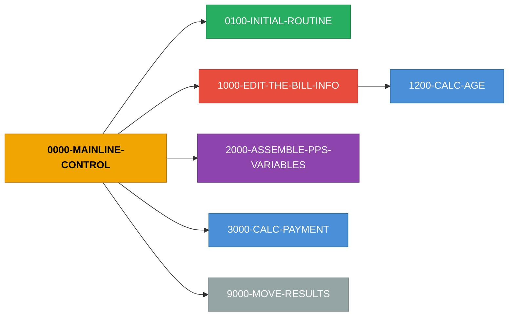

# Program Detail - Part 2/6

---

# COBOL Program: `ESCAL056`

**Source:** `ESCAL056`  
**Lines:** 434 total / 263 code / 119 comments

## Inter-Service Narrative (ISN)

> **ESCAL056 - 8 paragraphs, 9 return codes, 0 state flags, 2 external copybooks**

COBOL program `ESCAL056` orchestrates a 1-step business flow. It emits 9 distinct return-code value(s) across 9 assignment site(s), driven by 0 state-machine flag group(s). Depends on 2 external copybook(s): BILLCPY, WAGECPY.

**Entry point:** `0000-PROCEDURE-START`

**Top decision points (most branched paragraphs):**

- `1000-EDIT-THE-BILL-INFO` - 17 branches - sets: PPS-RTC=53 when P-SPEC-PYMT-IND NOT = '1' AND ' ' / PPS-RTC=54 when (B-DOB-DATE = ZERO) OR (B-DOB-DATE NOT NUMERIC) / PPS-RTC=55 when (B-PATIENT-WGT = 0) OR (B-PATIENT-WGT NOT NUMERIC)
- `1200-CALC-AGE` - 7 branches
- `9000-MOVE-RESULTS` - 4 branches

**Return-code catalog (value -> emission sites):**

| RC | Sites | Variables | Sample condition |
|---|---|---|---|
| **52** | 1 | `PPS-RTC` | P-PROV-TYPE = '41' |
| **53** | 1 | `PPS-RTC` | P-SPEC-PYMT-IND NOT = '1' AND ' ' |
| **54** | 1 | `PPS-RTC` | (B-DOB-DATE = ZERO) OR (B-DOB-DATE NOT NUMERIC) |
| **55** | 1 | `PPS-RTC` | (B-PATIENT-WGT = 0) OR (B-PATIENT-WGT NOT NUMERIC) |
| **56** | 1 | `PPS-RTC` | (B-PATIENT-HGT = 0) OR (B-PATIENT-HGT NOT NUMERIC) |
| **57** | 1 | `PPS-RTC` | B-REV-CODE = '0821' OR '0831' OR '0841' OR '0851' OR '0880' OR '0881' NEXT SENT? |
| **58** | 1 | `PPS-RTC` | B-COND-CODE NOT = '73' AND '74' AND ' ' |
| **71** | 1 | `PPS-RTC` | B-PATIENT-HGT > 300.00 |
| **72** | 1 | `PPS-RTC` | B-PATIENT-WGT > 500.00 |

## Stats

- Paragraphs: **8**
- PERFORM/CALL edges: **6**
- COPY references: **2**
- WORKING-STORAGE items: **31**, LINKAGE items: **198**
- Return code assignments: **9**, State machines: **0**
- Cyclomatic complexity (est): **37**

## Business Rules (Magic Numbers)

**Total:** 41 rules (16 thresholds, 18 defaults)

| Type | Key | Value | Paragraph | Line |
|------|-----|-------|-----------|------|
| ?????? default | `0100_initial_routine.pps_rtc.default` | `52` | `0100-INITIAL-ROUTINE` | 188 |
| ?????? default | `1000_edit_the_bill_info.pps_rtc.default` | `53` | `1000-EDIT-THE-BILL-INFO` | 221 |
| ?????? default | `1000_edit_the_bill_info.pps_rtc.default` | `54` | `1000-EDIT-THE-BILL-INFO` | 227 |
| ?????? default | `1000_edit_the_bill_info.pps_rtc.default` | `55` | `1000-EDIT-THE-BILL-INFO` | 233 |
| ?????? default | `1000_edit_the_bill_info.pps_rtc.default` | `56` | `1000-EDIT-THE-BILL-INFO` | 239 |
| ?????? default | `1000_edit_the_bill_info.pps_rtc.default` | `57` | `1000-EDIT-THE-BILL-INFO` | 245 |
| ?????? default | `1000_edit_the_bill_info.pps_rtc.default` | `58` | `1000-EDIT-THE-BILL-INFO` | 254 |
| ?? threshold | `1000_edit_the_bill_info.b_patient_hgt.threshold` | `300.00` | `1000-EDIT-THE-BILL-INFO` | 260 |
| ?????? default | `1000_edit_the_bill_info.pps_rtc.default` | `71` | `1000-EDIT-THE-BILL-INFO` | 260 |
| ?? threshold | `1000_edit_the_bill_info.b_patient_wgt.threshold` | `500.00` | `1000-EDIT-THE-BILL-INFO` | 266 |
| ?????? default | `1000_edit_the_bill_info.pps_rtc.default` | `72` | `1000-EDIT-THE-BILL-INFO` | 266 |
| ?? threshold | `1200_calc_age.h_patient_age.threshold` | `18` | `1200-CALC-AGE` | 292 |
| ?????? default | `1200_calc_age.h_age_factor.default` | `1.620` | `1200-CALC-AGE` | 292 |
| ?? threshold | `1200_calc_age.h_patient_age.threshold` | `17` | `1200-CALC-AGE` | 292 |
| ?? threshold | `1200_calc_age.h_patient_age.threshold` | `45` | `1200-CALC-AGE` | 292 |
| ?????? default | `1200_calc_age.h_age_factor.default` | `1.223` | `1200-CALC-AGE` | 292 |
| ?? threshold | `1200_calc_age.h_patient_age.threshold` | `44` | `1200-CALC-AGE` | 292 |
| ?? threshold | `1200_calc_age.h_patient_age.threshold` | `60` | `1200-CALC-AGE` | 292 |
| ?????? default | `1200_calc_age.h_age_factor.default` | `1.055` | `1200-CALC-AGE` | 292 |
| ?? threshold | `1200_calc_age.h_patient_age.threshold` | `59` | `1200-CALC-AGE` | 292 |
| ?? threshold | `1200_calc_age.h_patient_age.threshold` | `70` | `1200-CALC-AGE` | 292 |
| ?????? default | `1200_calc_age.h_age_factor.default` | `1.000` | `1200-CALC-AGE` | 292 |
| ?? threshold | `1200_calc_age.h_patient_age.threshold` | `69` | `1200-CALC-AGE` | 292 |
| ?? threshold | `1200_calc_age.h_patient_age.threshold` | `80` | `1200-CALC-AGE` | 292 |
| ?????? default | `1200_calc_age.h_age_factor.default` | `1.094` | `1200-CALC-AGE` | 292 |
| ?? threshold | `1200_calc_age.h_patient_age.threshold` | `79` | `1200-CALC-AGE` | 292 |
| ?????? default | `1200_calc_age.h_age_factor.default` | `1.174` | `1200-CALC-AGE` | 292 |
| ?? constant | `2000_assemble_pps_variables.h_bsa_rounded.constant` | `.007184` | `2000-ASSEMBLE-PPS-VARIABLES` | 324 |
| ?? constant | `2000_assemble_pps_variables.h_bsa_rounded.constant` | `.725` | `2000-ASSEMBLE-PPS-VARIABLES` | 324 |
| ?? constant | `2000_assemble_pps_variables.h_bsa_rounded.constant` | `.425` | `2000-ASSEMBLE-PPS-VARIABLES` | 324 |

_... +11 more rules in `--extract-rules` output_

## Business Logic (Computed Values & Lookups)

_What this program actually calculates: 20 formulas/lookups/loops/call-params across 5 paragraphs._

### `0100-INITIAL-ROUTINE`

- **INITIALIZE** `PPS-DATA-ALL` (L181)
- **INITIALIZE** `BILL-DATA-TEST` (L182)
- **INITIALIZE** `HOLD-PPS-COMPONENTS` (L183)

### `1200-CALC-AGE`

- **COMPUTE** `H-PATIENT-AGE` = `B-THRU-CCYY - B-DOB-CCYY.` (L282)
- **COMPUTE** `H-PATIENT-AGE` = `H-PATIENT-AGE - 1` (L284)

### `2000-ASSEMBLE-PPS-VARIABLES`

- **COMPUTE** `H-BSA ROUNDED` = `(.007184 * (B-PATIENT-HGT ** .725) * (B-PATIENT-WGT ** .425))` (L324)
- **COMPUTE** `H-BMI ROUNDED` = `(B-PATIENT-WGT / (B-PATIENT-HGT ** 2)) * 10000.` (L324)
- **COMPUTE** `H-BSA-FACTOR ROUNDED` = `1.037 ** ((H-BSA - 1.84) / .1)` (L330)

### `3000-CALC-PAYMENT`

- **COMPUTE** `H-PYMT-AMT ROUNDED` = `H-WAGE-ADJ-PYMT-AMT * H-BMI-FACTOR * H-BSA-FACTOR * PPS-BDGT-NEUT-RATE * H-AGE-FACTOR * H-DRUG-ADDON.` (L351)
- **COMPUTE** `H-PYMT-AMT` = `H-PYMT-AMT + HEMO-PERI-CCPD-AMT` (L358)
- **COMPUTE** `H-PYMT-AMT` = `H-PYMT-AMT + CAPD-AMT` (L358)
- **COMPUTE** `H-PYMT-AMT ROUNDED` = `H-PYMT-AMT * CAPD-OR-CCPD-FACTOR` (L358)

### `9000-MOVE-RESULTS`

- **INITIALIZE** `PPS-COND-CODE` (L386)
- **INITIALIZE** `PPS-REV-CODE` (L386)
- **INITIALIZE** `PPS-MSA` (L386)
- **INITIALIZE** `PPS-CBSA` (L386)
- **INITIALIZE** `PPS-AGE-FACTOR` (L386)
- **INITIALIZE** `PPS-BSA-FACTOR` (L386)
- **INITIALIZE** `PPS-BMI-FACTOR` (L386)
- **INITIALIZE** `DRUG-ADD-ON-RETURN` (L386)

## Copybooks

- `BILLCPY`
- `WAGECPY`

## Paragraphs (Action Graph)

| Paragraph | Lines | PERFORM | CALL | GO TO | IF | RC set |
|---|---|---|---|---|---|---|
| `0000-PROCEDURE-START` | 134-158 | 0 | 0 | 0 | 0 | 0 |
| `0000-MAINLINE-CONTROL` | 159-175 | 5 | 0 | 0 | 2 | 0 |
| `0100-INITIAL-ROUTINE` | 176-218 | 0 | 0 | 0 | 2 | 1 |
| `1000-EDIT-THE-BILL-INFO` | 219-276 | 1 | 0 | 0 | 17 | 8 |
| `1200-CALC-AGE` | 277-316 | 0 | 0 | 0 | 7 | 0 |
| `2000-ASSEMBLE-PPS-VARIABLES` | 317-348 | 0 | 0 | 0 | 2 | 0 |
| `3000-CALC-PAYMENT` | 349-383 | 0 | 0 | 0 | 3 | 0 |
| `9000-MOVE-RESULTS` | 384-434 | 0 | 0 | 0 | 4 | 0 |

## Execution Logic Summary (ELS)

_Auto-generated narrative per paragraph - what each routine does, which branches it evaluates, and which side effects it produces._

### `0000-PROCEDURE-START` (L134-158)

Main control routine - leaf logic block.


### `0000-MAINLINE-CONTROL` (L159-175)

Main control routine - orchestrates 0100-INITIAL-ROUTINE, 1000-EDIT-THE-BILL-INFO, 2000-ASSEMBLE-PPS-VARIABLES, 3000-CALC-PAYMENT (+1 more). Contains 2 IF/branchs.

- **Calls:** `0100-INITIAL-ROUTINE`, `1000-EDIT-THE-BILL-INFO`, `2000-ASSEMBLE-PPS-VARIABLES`, `3000-CALC-PAYMENT`, `9000-MOVE-RESULTS`

### `0100-INITIAL-ROUTINE` (L176-218)

Initialization routine - assigns return codes based on input state. Contains 2 IF/branchs. Sets: PPS-RTC=52 when P-PROV-TYPE = '41'.

- **Side effects:**
  - PPS-RTC=52 when P-PROV-TYPE = '41'

### `1000-EDIT-THE-BILL-INFO` (L219-276)

Business routine - orchestrates 1200-CALC-AGE. Contains 17 IF/branchs. Sets: PPS-RTC=53 when P-SPEC-PYMT-IND NOT = '1' AND ' '; PPS-RTC=54 when (B-DOB-DATE = ZERO) OR (B-DOB-DATE NOT NUMERIC); PPS-RTC=55 when (B-PATIENT-WGT = 0) OR (B-PATIENT-WGT NOT NUMERIC) (+5 more).

- **Calls:** `1200-CALC-AGE`
- **Side effects:**
  - PPS-RTC=53 when P-SPEC-PYMT-IND NOT = '1' AND ' '
  - PPS-RTC=54 when (B-DOB-DATE = ZERO) OR (B-DOB-DATE NOT NUMERIC)
  - PPS-RTC=55 when (B-PATIENT-WGT = 0) OR (B-PATIENT-WGT NOT NUMERIC)
  - PPS-RTC=56 when (B-PATIENT-HGT = 0) OR (B-PATIENT-HGT NOT NUMERIC)
  - PPS-RTC=57 when B-REV-CODE = '0821' OR '0831' OR '0841' OR '0851' OR '0880' OR '0881'?
  - PPS-RTC=58 when B-COND-CODE NOT = '73' AND '74' AND ' '
  - PPS-RTC=71 when B-PATIENT-HGT > 300.00
  - PPS-RTC=72 when B-PATIENT-WGT > 500.00

### `1200-CALC-AGE` (L277-316)

Calculation routine - evaluates 7 branch conditions. Contains 7 IF/branchs.


### `2000-ASSEMBLE-PPS-VARIABLES` (L317-348)

Business routine - evaluates 2 branch conditions. Contains 2 IF/branchs.


### `3000-CALC-PAYMENT` (L349-383)

Calculation routine - evaluates 3 branch conditions. Contains 3 IF/branchs.


### `9000-MOVE-RESULTS` (L384-434)

Business routine - evaluates 4 branch conditions. Contains 4 IF/branchs.


## TSB Risk Metric Summary (Technical & Structural Breakdown Risk)

**Average risk:** [OK] 19 / 100 (LOW)  
**Max paragraph risk:** [E] 84 / 100 (CRITICAL)  
**Distribution:** 1 CRITICAL ?. 0 HIGH ?. 0 MEDIUM ?. 7 LOW (of 8 paragraphs)

### Top 10 risky paragraphs

| Paragraph | Lines | Score | Category | Top factors |
|---|---|---|---|---|
| `1000-EDIT-THE-BILL-INFO` | 219-276 | **84** | [E] CRITICAL | 17 IF/EVAL branches, 8 return-code emissions, 1 PERFORM calls |
| `1200-CALC-AGE` | 277-316 | **21** | [OK] LOW | 7 IF/EVAL branches |
| `9000-MOVE-RESULTS` | 384-434 | **12** | [OK] LOW | 4 IF/EVAL branches |
| `0000-MAINLINE-CONTROL` | 159-175 | **11** | [OK] LOW | 2 IF/EVAL branches, 5 PERFORM calls |
| `0100-INITIAL-ROUTINE` | 176-218 | **10** | [OK] LOW | 2 IF/EVAL branches, 1 return-code emissions |
| `3000-CALC-PAYMENT` | 349-383 | **9** | [OK] LOW | 3 IF/EVAL branches |
| `2000-ASSEMBLE-PPS-VARIABLES` | 317-348 | **6** | [OK] LOW | 2 IF/EVAL branches |
| `0000-PROCEDURE-START` | 134-158 | **0** | [OK] LOW | - |

## Call Graph



## Call Graph Edges

```
         0000-MAINLINE-CONTROL  --PERFORM-->  0100-INITIAL-ROUTINE (L161)
         0000-MAINLINE-CONTROL  --PERFORM-->  1000-EDIT-THE-BILL-INFO (L163)
         0000-MAINLINE-CONTROL  --PERFORM-->  2000-ASSEMBLE-PPS-VARIABLES (L167)
         0000-MAINLINE-CONTROL  --PERFORM-->  3000-CALC-PAYMENT (L167)
         0000-MAINLINE-CONTROL  --PERFORM-->  9000-MOVE-RESULTS (L172)
       1000-EDIT-THE-BILL-INFO  --PERFORM-->  1200-CALC-AGE (L272)
```

## Return Codes (Trigger Summary)

| Paragraph | Line | RC Var | Value | Condition |
|---|---|---|---|---|
| `0100-INITIAL-ROUTINE` | 188 | `PPS-RTC` | **52** | P-PROV-TYPE = '41' |
| `1000-EDIT-THE-BILL-INFO` | 221 | `PPS-RTC` | **53** | P-SPEC-PYMT-IND NOT = '1' AND ' ' |
| `1000-EDIT-THE-BILL-INFO` | 227 | `PPS-RTC` | **54** | (B-DOB-DATE = ZERO) OR (B-DOB-DATE NOT NUMERIC) |
| `1000-EDIT-THE-BILL-INFO` | 233 | `PPS-RTC` | **55** | (B-PATIENT-WGT = 0) OR (B-PATIENT-WGT NOT NUMERIC) |
| `1000-EDIT-THE-BILL-INFO` | 239 | `PPS-RTC` | **56** | (B-PATIENT-HGT = 0) OR (B-PATIENT-HGT NOT NUMERIC) |
| `1000-EDIT-THE-BILL-INFO` | 245 | `PPS-RTC` | **57** | B-REV-CODE  = '0821' OR '0831' OR '0841' OR '0851' OR '0880' OR '0881' NEXT SENT |
| `1000-EDIT-THE-BILL-INFO` | 254 | `PPS-RTC` | **58** | B-COND-CODE NOT = '73' AND '74' AND '  ' |
| `1000-EDIT-THE-BILL-INFO` | 260 | `PPS-RTC` | **71** | B-PATIENT-HGT > 300.00 |
| `1000-EDIT-THE-BILL-INFO` | 266 | `PPS-RTC` | **72** | B-PATIENT-WGT > 500.00 |

---

# COBOL Program: `ESCAL062`

**Source:** `ESCAL062`  
**Lines:** 454 total / 279 code / 120 comments

## Inter-Service Narrative (ISN)

> **ESCAL062 - 8 paragraphs, 9 return codes, 0 state flags, 2 external copybooks**

COBOL program `ESCAL062` orchestrates a 1-step business flow. It emits 9 distinct return-code value(s) across 9 assignment site(s), driven by 0 state-machine flag group(s). Depends on 2 external copybook(s): BILLCPY, WAGECPY.

**Entry point:** `0000-PROCEDURE-START`

**Top decision points (most branched paragraphs):**

- `1000-EDIT-THE-BILL-INFO` - 17 branches - sets: PPS-RTC=53 when P-SPEC-PYMT-IND NOT = '1' AND ' ' / PPS-RTC=54 when (B-DOB-DATE = ZERO) OR (B-DOB-DATE NOT NUMERIC) / PPS-RTC=55 when (B-PATIENT-WGT = 0) OR (B-PATIENT-WGT NOT NUMERIC)
- `1200-CALC-AGE` - 7 branches

**Return-code catalog (value -> emission sites):**

| RC | Sites | Variables | Sample condition |
|---|---|---|---|
| **52** | 1 | `PPS-RTC` | P-PROV-TYPE = '41' |
| **53** | 1 | `PPS-RTC` | P-SPEC-PYMT-IND NOT = '1' AND ' ' |
| **54** | 1 | `PPS-RTC` | (B-DOB-DATE = ZERO) OR (B-DOB-DATE NOT NUMERIC) |
| **55** | 1 | `PPS-RTC` | (B-PATIENT-WGT = 0) OR (B-PATIENT-WGT NOT NUMERIC) |
| **56** | 1 | `PPS-RTC` | (B-PATIENT-HGT = 0) OR (B-PATIENT-HGT NOT NUMERIC) |
| **57** | 1 | `PPS-RTC` | B-REV-CODE = '0821' OR '0831' OR '0841' OR '0851' OR '0880' OR '0881' NEXT SENT? |
| **58** | 1 | `PPS-RTC` | B-COND-CODE NOT = '73' AND '74' AND ' ' |
| **71** | 1 | `PPS-RTC` | B-PATIENT-HGT > 300.00 |
| **72** | 1 | `PPS-RTC` | B-PATIENT-WGT > 500.00 |

## Stats

- Paragraphs: **8**
- PERFORM/CALL edges: **6**
- COPY references: **2**
- WORKING-STORAGE items: **40**, LINKAGE items: **198**
- Return code assignments: **9**, State machines: **0**
- Cyclomatic complexity (est): **36**

## Business Rules (Magic Numbers)

**Total:** 43 rules (16 thresholds, 18 defaults)

| Type | Key | Value | Paragraph | Line |
|------|-----|-------|-----------|------|
| ?? constant | `0100_initial_routine.h_2006_wage_adj_pymt_rounded.constant` | `2006` | `0100-INITIAL-ROUTINE` | 199 |
| ?? constant | `0100_initial_routine.h_2006_wage_adj_pymt_rounded.constant` | `2006` | `0100-INITIAL-ROUTINE` | 199 |
| ?????? default | `0100_initial_routine.pps_rtc.default` | `52` | `0100-INITIAL-ROUTINE` | 199 |
| ?????? default | `1000_edit_the_bill_info.pps_rtc.default` | `53` | `1000-EDIT-THE-BILL-INFO` | 240 |
| ?????? default | `1000_edit_the_bill_info.pps_rtc.default` | `54` | `1000-EDIT-THE-BILL-INFO` | 246 |
| ?????? default | `1000_edit_the_bill_info.pps_rtc.default` | `55` | `1000-EDIT-THE-BILL-INFO` | 252 |
| ?????? default | `1000_edit_the_bill_info.pps_rtc.default` | `56` | `1000-EDIT-THE-BILL-INFO` | 258 |
| ?????? default | `1000_edit_the_bill_info.pps_rtc.default` | `57` | `1000-EDIT-THE-BILL-INFO` | 264 |
| ?????? default | `1000_edit_the_bill_info.pps_rtc.default` | `58` | `1000-EDIT-THE-BILL-INFO` | 273 |
| ?? threshold | `1000_edit_the_bill_info.b_patient_hgt.threshold` | `300.00` | `1000-EDIT-THE-BILL-INFO` | 279 |
| ?????? default | `1000_edit_the_bill_info.pps_rtc.default` | `71` | `1000-EDIT-THE-BILL-INFO` | 279 |
| ?? threshold | `1000_edit_the_bill_info.b_patient_wgt.threshold` | `500.00` | `1000-EDIT-THE-BILL-INFO` | 285 |
| ?????? default | `1000_edit_the_bill_info.pps_rtc.default` | `72` | `1000-EDIT-THE-BILL-INFO` | 285 |
| ?? threshold | `1200_calc_age.h_patient_age.threshold` | `18` | `1200-CALC-AGE` | 311 |
| ?????? default | `1200_calc_age.h_age_factor.default` | `1.620` | `1200-CALC-AGE` | 311 |
| ?? threshold | `1200_calc_age.h_patient_age.threshold` | `17` | `1200-CALC-AGE` | 311 |
| ?? threshold | `1200_calc_age.h_patient_age.threshold` | `45` | `1200-CALC-AGE` | 311 |
| ?????? default | `1200_calc_age.h_age_factor.default` | `1.223` | `1200-CALC-AGE` | 311 |
| ?? threshold | `1200_calc_age.h_patient_age.threshold` | `44` | `1200-CALC-AGE` | 311 |
| ?? threshold | `1200_calc_age.h_patient_age.threshold` | `60` | `1200-CALC-AGE` | 311 |
| ?????? default | `1200_calc_age.h_age_factor.default` | `1.055` | `1200-CALC-AGE` | 311 |
| ?? threshold | `1200_calc_age.h_patient_age.threshold` | `59` | `1200-CALC-AGE` | 311 |
| ?? threshold | `1200_calc_age.h_patient_age.threshold` | `70` | `1200-CALC-AGE` | 311 |
| ?????? default | `1200_calc_age.h_age_factor.default` | `1.000` | `1200-CALC-AGE` | 311 |
| ?? threshold | `1200_calc_age.h_patient_age.threshold` | `69` | `1200-CALC-AGE` | 311 |
| ?? threshold | `1200_calc_age.h_patient_age.threshold` | `80` | `1200-CALC-AGE` | 311 |
| ?????? default | `1200_calc_age.h_age_factor.default` | `1.094` | `1200-CALC-AGE` | 311 |
| ?? threshold | `1200_calc_age.h_patient_age.threshold` | `79` | `1200-CALC-AGE` | 311 |
| ?????? default | `1200_calc_age.h_age_factor.default` | `1.174` | `1200-CALC-AGE` | 311 |
| ?? constant | `2000_assemble_pps_variables.h_bsa_rounded.constant` | `.007184` | `2000-ASSEMBLE-PPS-VARIABLES` | 341 |

_... +13 more rules in `--extract-rules` output_

## Business Logic (Computed Values & Lookups)

_What this program actually calculates: 25 formulas/lookups/loops/call-params across 5 paragraphs._

### `0100-INITIAL-ROUTINE`

- **INITIALIZE** `PPS-DATA-ALL` (L192)
- **INITIALIZE** `BILL-DATA-TEST` (L193)
- **INITIALIZE** `HOLD-PPS-COMPONENTS` (L194)
- **COMPUTE** `H-2006-WAGE-ADJ-PYMT ROUNDED` = `W-NEW-RATE1-RECORD    *  MSA-WAGE-FACTOR-2006` (L199)
- **COMPUTE** `H-2006-WAGE-ADJ-PYMT ROUNDED` = `W-NEW-RATE2-RECORD    *  MSA-WAGE-FACTOR-2006` (L199)

### `1200-CALC-AGE`

- **COMPUTE** `H-PATIENT-AGE` = `B-THRU-CCYY - B-DOB-CCYY.` (L301)
- **COMPUTE** `H-PATIENT-AGE` = `H-PATIENT-AGE - 1` (L303)

### `2000-ASSEMBLE-PPS-VARIABLES`

- **COMPUTE** `H-BSA ROUNDED` = `(.007184 * (B-PATIENT-HGT ** .725) * (B-PATIENT-WGT ** .425))` (L341)
- **COMPUTE** `H-BMI ROUNDED` = `(B-PATIENT-WGT / (B-PATIENT-HGT ** 2)) * 10000.` (L341)
- **COMPUTE** `H-BSA-FACTOR ROUNDED` = `1.037 ** ((H-BSA - 1.84) / .1)` (L347)

### `3000-CALC-PAYMENT`

- **COMPUTE** `H-WAGE-ADJ-PYMT-OLD ROUNDED` = `(H-WAGE-ADJ-PYMT-OLD * MSA-BLEND-PCT).` (L369)
- **COMPUTE** `H-WAGE-ADJ-PYMT-NEW ROUNDED` = `(((H-PYMT-RATE * PPS-NAT-LABOR-PCT) * H-WAGE-ADJ) + (H-PYMT-RATE * PPS-NAT-NONLABOR-PCT)) * CBSA-BLEND-PCT.` (L372)
- **COMPUTE** `H-WAGE-ADJ-PYMT-AMT` = `H-WAGE-ADJ-PYMT-NEW + H-WAGE-ADJ-PYMT-OLD.` (L376)
- **COMPUTE** `H-PYMT-AMT ROUNDED` = `H-WAGE-ADJ-PYMT-AMT * H-BMI-FACTOR * H-BSA-FACTOR * PPS-BDGT-NEUT-RATE * H-AGE-FACTOR * H-DRUG-ADDON.` (L379)
- **COMPUTE** `H-PYMT-AMT` = `H-PYMT-AMT + HEMO-PERI-CCPD-AMT` (L386)
- **COMPUTE** `H-PYMT-AMT` = `H-PYMT-AMT + CAPD-AMT` (L386)
- **COMPUTE** `H-PYMT-AMT ROUNDED` = `H-PYMT-AMT * CAPD-OR-CCPD-FACTOR` (L386)

### `9000-MOVE-RESULTS`

- **INITIALIZE** `PPS-COND-CODE` (L414)
- **INITIALIZE** `PPS-REV-CODE` (L414)
- **INITIALIZE** `PPS-MSA` (L414)
- **INITIALIZE** `PPS-CBSA` (L414)
- **INITIALIZE** `PPS-AGE-FACTOR` (L414)
- **INITIALIZE** `PPS-BSA-FACTOR` (L414)
- **INITIALIZE** `PPS-BMI-FACTOR` (L414)
- **INITIALIZE** `DRUG-ADD-ON-RETURN` (L414)

## Copybooks

- `BILLCPY`
- `WAGECPY`

## Paragraphs (Action Graph)

| Paragraph | Lines | PERFORM | CALL | GO TO | IF | RC set |
|---|---|---|---|---|---|---|
| `0000-PROCEDURE-START` | 144-169 | 0 | 0 | 0 | 0 | 0 |
| `0000-MAINLINE-CONTROL` | 170-186 | 5 | 0 | 0 | 2 | 0 |
| `0100-INITIAL-ROUTINE` | 187-237 | 0 | 0 | 0 | 2 | 1 |
| `1000-EDIT-THE-BILL-INFO` | 238-295 | 1 | 0 | 0 | 17 | 8 |
| `1200-CALC-AGE` | 296-335 | 0 | 0 | 0 | 7 | 0 |
| `2000-ASSEMBLE-PPS-VARIABLES` | 336-365 | 0 | 0 | 0 | 2 | 0 |
| `3000-CALC-PAYMENT` | 366-411 | 0 | 0 | 0 | 3 | 0 |
| `9000-MOVE-RESULTS` | 412-454 | 0 | 0 | 0 | 3 | 0 |

## Execution Logic Summary (ELS)

_Auto-generated narrative per paragraph - what each routine does, which branches it evaluates, and which side effects it produces._

### `0000-PROCEDURE-START` (L144-169)

Main control routine - leaf logic block.


### `0000-MAINLINE-CONTROL` (L170-186)

Main control routine - orchestrates 0100-INITIAL-ROUTINE, 1000-EDIT-THE-BILL-INFO, 2000-ASSEMBLE-PPS-VARIABLES, 3000-CALC-PAYMENT (+1 more). Contains 2 IF/branchs.

- **Calls:** `0100-INITIAL-ROUTINE`, `1000-EDIT-THE-BILL-INFO`, `2000-ASSEMBLE-PPS-VARIABLES`, `3000-CALC-PAYMENT`, `9000-MOVE-RESULTS`

### `0100-INITIAL-ROUTINE` (L187-237)

Initialization routine - assigns return codes based on input state. Contains 2 IF/branchs. Sets: PPS-RTC=52 when P-PROV-TYPE = '41'.

- **Side effects:**
  - PPS-RTC=52 when P-PROV-TYPE = '41'

### `1000-EDIT-THE-BILL-INFO` (L238-295)

Business routine - orchestrates 1200-CALC-AGE. Contains 17 IF/branchs. Sets: PPS-RTC=53 when P-SPEC-PYMT-IND NOT = '1' AND ' '; PPS-RTC=54 when (B-DOB-DATE = ZERO) OR (B-DOB-DATE NOT NUMERIC); PPS-RTC=55 when (B-PATIENT-WGT = 0) OR (B-PATIENT-WGT NOT NUMERIC) (+5 more).

- **Calls:** `1200-CALC-AGE`
- **Side effects:**
  - PPS-RTC=53 when P-SPEC-PYMT-IND NOT = '1' AND ' '
  - PPS-RTC=54 when (B-DOB-DATE = ZERO) OR (B-DOB-DATE NOT NUMERIC)
  - PPS-RTC=55 when (B-PATIENT-WGT = 0) OR (B-PATIENT-WGT NOT NUMERIC)
  - PPS-RTC=56 when (B-PATIENT-HGT = 0) OR (B-PATIENT-HGT NOT NUMERIC)
  - PPS-RTC=57 when B-REV-CODE = '0821' OR '0831' OR '0841' OR '0851' OR '0880' OR '0881'?
  - PPS-RTC=58 when B-COND-CODE NOT = '73' AND '74' AND ' '
  - PPS-RTC=71 when B-PATIENT-HGT > 300.00
  - PPS-RTC=72 when B-PATIENT-WGT > 500.00

### `1200-CALC-AGE` (L296-335)

Calculation routine - evaluates 7 branch conditions. Contains 7 IF/branchs.


### `2000-ASSEMBLE-PPS-VARIABLES` (L336-365)

Business routine - evaluates 2 branch conditions. Contains 2 IF/branchs.


### `3000-CALC-PAYMENT` (L366-411)

Calculation routine - evaluates 3 branch conditions. Contains 3 IF/branchs.


### `9000-MOVE-RESULTS` (L412-454)

Business routine - evaluates 3 branch conditions. Contains 3 IF/branchs.


## TSB Risk Metric Summary (Technical & Structural Breakdown Risk)

**Average risk:** [OK] 18 / 100 (LOW)  
**Max paragraph risk:** [E] 84 / 100 (CRITICAL)  
**Distribution:** 1 CRITICAL ?. 0 HIGH ?. 0 MEDIUM ?. 7 LOW (of 8 paragraphs)

### Top 10 risky paragraphs

| Paragraph | Lines | Score | Category | Top factors |
|---|---|---|---|---|
| `1000-EDIT-THE-BILL-INFO` | 238-295 | **84** | [E] CRITICAL | 17 IF/EVAL branches, 8 return-code emissions, 1 PERFORM calls |
| `1200-CALC-AGE` | 296-335 | **21** | [OK] LOW | 7 IF/EVAL branches |
| `0000-MAINLINE-CONTROL` | 170-186 | **11** | [OK] LOW | 2 IF/EVAL branches, 5 PERFORM calls |
| `0100-INITIAL-ROUTINE` | 187-237 | **10** | [OK] LOW | 2 IF/EVAL branches, 1 return-code emissions |
| `3000-CALC-PAYMENT` | 366-411 | **9** | [OK] LOW | 3 IF/EVAL branches |
| `9000-MOVE-RESULTS` | 412-454 | **9** | [OK] LOW | 3 IF/EVAL branches |
| `2000-ASSEMBLE-PPS-VARIABLES` | 336-365 | **6** | [OK] LOW | 2 IF/EVAL branches |
| `0000-PROCEDURE-START` | 144-169 | **0** | [OK] LOW | - |

> **Call Graph:** Structure identical to `ESCAL056` - diagram not repeated.


## Call Graph Edges

```
         0000-MAINLINE-CONTROL  --PERFORM-->  0100-INITIAL-ROUTINE (L172)
         0000-MAINLINE-CONTROL  --PERFORM-->  1000-EDIT-THE-BILL-INFO (L174)
         0000-MAINLINE-CONTROL  --PERFORM-->  2000-ASSEMBLE-PPS-VARIABLES (L178)
         0000-MAINLINE-CONTROL  --PERFORM-->  3000-CALC-PAYMENT (L178)
         0000-MAINLINE-CONTROL  --PERFORM-->  9000-MOVE-RESULTS (L183)
       1000-EDIT-THE-BILL-INFO  --PERFORM-->  1200-CALC-AGE (L291)
```

## Return Codes (Trigger Summary)

| Paragraph | Line | RC Var | Value | Condition |
|---|---|---|---|---|
| `0100-INITIAL-ROUTINE` | 199 | `PPS-RTC` | **52** | P-PROV-TYPE = '41' |
| `1000-EDIT-THE-BILL-INFO` | 240 | `PPS-RTC` | **53** | P-SPEC-PYMT-IND NOT = '1' AND ' ' |
| `1000-EDIT-THE-BILL-INFO` | 246 | `PPS-RTC` | **54** | (B-DOB-DATE = ZERO) OR (B-DOB-DATE NOT NUMERIC) |
| `1000-EDIT-THE-BILL-INFO` | 252 | `PPS-RTC` | **55** | (B-PATIENT-WGT = 0) OR (B-PATIENT-WGT NOT NUMERIC) |
| `1000-EDIT-THE-BILL-INFO` | 258 | `PPS-RTC` | **56** | (B-PATIENT-HGT = 0) OR (B-PATIENT-HGT NOT NUMERIC) |
| `1000-EDIT-THE-BILL-INFO` | 264 | `PPS-RTC` | **57** | B-REV-CODE  = '0821' OR '0831' OR '0841' OR '0851' OR '0880' OR '0881' NEXT SENT |
| `1000-EDIT-THE-BILL-INFO` | 273 | `PPS-RTC` | **58** | B-COND-CODE NOT = '73' AND '74' AND '  ' |
| `1000-EDIT-THE-BILL-INFO` | 279 | `PPS-RTC` | **71** | B-PATIENT-HGT > 300.00 |
| `1000-EDIT-THE-BILL-INFO` | 285 | `PPS-RTC` | **72** | B-PATIENT-WGT > 500.00 |

---

# COBOL Program: `ESCAL070`

**Source:** `ESCAL070`  
**Lines:** 446 total / 279 code / 112 comments

## Inter-Service Narrative (ISN)

> **ESCAL070 - 8 paragraphs, 9 return codes, 0 state flags, 2 external copybooks**

COBOL program `ESCAL070` orchestrates a 1-step business flow. It emits 9 distinct return-code value(s) across 9 assignment site(s), driven by 0 state-machine flag group(s). Depends on 2 external copybook(s): BILLCPY, WAGECPY.

**Entry point:** `0000-PROCEDURE-START`

**Top decision points (most branched paragraphs):**

- `1000-EDIT-THE-BILL-INFO` - 17 branches - sets: PPS-RTC=53 when P-SPEC-PYMT-IND NOT = '1' AND ' ' / PPS-RTC=54 when (B-DOB-DATE = ZERO) OR (B-DOB-DATE NOT NUMERIC) / PPS-RTC=55 when (B-PATIENT-WGT = 0) OR (B-PATIENT-WGT NOT NUMERIC)
- `1200-CALC-AGE` - 7 branches

**Return-code catalog (value -> emission sites):**

| RC | Sites | Variables | Sample condition |
|---|---|---|---|
| **52** | 1 | `PPS-RTC` | P-PROV-TYPE = '41' |
| **53** | 1 | `PPS-RTC` | P-SPEC-PYMT-IND NOT = '1' AND ' ' |
| **54** | 1 | `PPS-RTC` | (B-DOB-DATE = ZERO) OR (B-DOB-DATE NOT NUMERIC) |
| **55** | 1 | `PPS-RTC` | (B-PATIENT-WGT = 0) OR (B-PATIENT-WGT NOT NUMERIC) |
| **56** | 1 | `PPS-RTC` | (B-PATIENT-HGT = 0) OR (B-PATIENT-HGT NOT NUMERIC) |
| **57** | 1 | `PPS-RTC` | B-REV-CODE = '0821' OR '0831' OR '0841' OR '0851' OR '0880' OR '0881' NEXT SENT? |
| **58** | 1 | `PPS-RTC` | B-COND-CODE NOT = '73' AND '74' AND ' ' |
| **71** | 1 | `PPS-RTC` | B-PATIENT-HGT > 300.00 |
| **72** | 1 | `PPS-RTC` | B-PATIENT-WGT > 500.00 |

## Stats

- Paragraphs: **8**
- PERFORM/CALL edges: **6**
- COPY references: **2**
- WORKING-STORAGE items: **40**, LINKAGE items: **198**
- Return code assignments: **9**, State machines: **0**
- Cyclomatic complexity (est): **36**

## Business Rules (Magic Numbers)

**Total:** 43 rules (16 thresholds, 18 defaults)

| Type | Key | Value | Paragraph | Line |
|------|-----|-------|-----------|------|
| ?? constant | `0100_initial_routine.h_2006_wage_adj_pymt_rounded.constant` | `2006` | `0100-INITIAL-ROUTINE` | 191 |
| ?? constant | `0100_initial_routine.h_2006_wage_adj_pymt_rounded.constant` | `2006` | `0100-INITIAL-ROUTINE` | 191 |
| ?????? default | `0100_initial_routine.pps_rtc.default` | `52` | `0100-INITIAL-ROUTINE` | 191 |
| ?????? default | `1000_edit_the_bill_info.pps_rtc.default` | `53` | `1000-EDIT-THE-BILL-INFO` | 232 |
| ?????? default | `1000_edit_the_bill_info.pps_rtc.default` | `54` | `1000-EDIT-THE-BILL-INFO` | 238 |
| ?????? default | `1000_edit_the_bill_info.pps_rtc.default` | `55` | `1000-EDIT-THE-BILL-INFO` | 244 |
| ?????? default | `1000_edit_the_bill_info.pps_rtc.default` | `56` | `1000-EDIT-THE-BILL-INFO` | 250 |
| ?????? default | `1000_edit_the_bill_info.pps_rtc.default` | `57` | `1000-EDIT-THE-BILL-INFO` | 256 |
| ?????? default | `1000_edit_the_bill_info.pps_rtc.default` | `58` | `1000-EDIT-THE-BILL-INFO` | 265 |
| ?? threshold | `1000_edit_the_bill_info.b_patient_hgt.threshold` | `300.00` | `1000-EDIT-THE-BILL-INFO` | 271 |
| ?????? default | `1000_edit_the_bill_info.pps_rtc.default` | `71` | `1000-EDIT-THE-BILL-INFO` | 271 |
| ?? threshold | `1000_edit_the_bill_info.b_patient_wgt.threshold` | `500.00` | `1000-EDIT-THE-BILL-INFO` | 277 |
| ?????? default | `1000_edit_the_bill_info.pps_rtc.default` | `72` | `1000-EDIT-THE-BILL-INFO` | 277 |
| ?? threshold | `1200_calc_age.h_patient_age.threshold` | `18` | `1200-CALC-AGE` | 303 |
| ?????? default | `1200_calc_age.h_age_factor.default` | `1.620` | `1200-CALC-AGE` | 303 |
| ?? threshold | `1200_calc_age.h_patient_age.threshold` | `17` | `1200-CALC-AGE` | 303 |
| ?? threshold | `1200_calc_age.h_patient_age.threshold` | `45` | `1200-CALC-AGE` | 303 |
| ?????? default | `1200_calc_age.h_age_factor.default` | `1.223` | `1200-CALC-AGE` | 303 |
| ?? threshold | `1200_calc_age.h_patient_age.threshold` | `44` | `1200-CALC-AGE` | 303 |
| ?? threshold | `1200_calc_age.h_patient_age.threshold` | `60` | `1200-CALC-AGE` | 303 |
| ?????? default | `1200_calc_age.h_age_factor.default` | `1.055` | `1200-CALC-AGE` | 303 |
| ?? threshold | `1200_calc_age.h_patient_age.threshold` | `59` | `1200-CALC-AGE` | 303 |
| ?? threshold | `1200_calc_age.h_patient_age.threshold` | `70` | `1200-CALC-AGE` | 303 |
| ?????? default | `1200_calc_age.h_age_factor.default` | `1.000` | `1200-CALC-AGE` | 303 |
| ?? threshold | `1200_calc_age.h_patient_age.threshold` | `69` | `1200-CALC-AGE` | 303 |
| ?? threshold | `1200_calc_age.h_patient_age.threshold` | `80` | `1200-CALC-AGE` | 303 |
| ?????? default | `1200_calc_age.h_age_factor.default` | `1.094` | `1200-CALC-AGE` | 303 |
| ?? threshold | `1200_calc_age.h_patient_age.threshold` | `79` | `1200-CALC-AGE` | 303 |
| ?????? default | `1200_calc_age.h_age_factor.default` | `1.174` | `1200-CALC-AGE` | 303 |
| ?? constant | `2000_assemble_pps_variables.h_bsa_rounded.constant` | `.007184` | `2000-ASSEMBLE-PPS-VARIABLES` | 333 |

_... +13 more rules in `--extract-rules` output_

## Business Logic (Computed Values & Lookups)

_What this program actually calculates: 25 formulas/lookups/loops/call-params across 5 paragraphs._

### `0100-INITIAL-ROUTINE`

- **INITIALIZE** `PPS-DATA-ALL` (L184)
- **INITIALIZE** `BILL-DATA-TEST` (L185)
- **INITIALIZE** `HOLD-PPS-COMPONENTS` (L186)
- **COMPUTE** `H-2006-WAGE-ADJ-PYMT ROUNDED` = `W-NEW-RATE1-RECORD    *  MSA-WAGE-FACTOR-2006` (L191)
- **COMPUTE** `H-2006-WAGE-ADJ-PYMT ROUNDED` = `W-NEW-RATE2-RECORD    *  MSA-WAGE-FACTOR-2006` (L191)

### `1200-CALC-AGE`

- **COMPUTE** `H-PATIENT-AGE` = `B-THRU-CCYY - B-DOB-CCYY.` (L293)
- **COMPUTE** `H-PATIENT-AGE` = `H-PATIENT-AGE - 1` (L295)

### `2000-ASSEMBLE-PPS-VARIABLES`

- **COMPUTE** `H-BSA ROUNDED` = `(.007184 * (B-PATIENT-HGT ** .725) * (B-PATIENT-WGT ** .425))` (L333)
- **COMPUTE** `H-BMI ROUNDED` = `(B-PATIENT-WGT / (B-PATIENT-HGT ** 2)) * 10000.` (L333)
- **COMPUTE** `H-BSA-FACTOR ROUNDED` = `1.037 ** ((H-BSA - 1.84) / .1)` (L339)

### `3000-CALC-PAYMENT`

- **COMPUTE** `H-WAGE-ADJ-PYMT-OLD ROUNDED` = `(H-WAGE-ADJ-PYMT-OLD * MSA-BLEND-PCT).` (L361)
- **COMPUTE** `H-WAGE-ADJ-PYMT-NEW ROUNDED` = `(((H-PYMT-RATE * PPS-NAT-LABOR-PCT) * H-WAGE-ADJ) + (H-PYMT-RATE * PPS-NAT-NONLABOR-PCT)) * CBSA-BLEND-PCT.` (L364)
- **COMPUTE** `H-WAGE-ADJ-PYMT-AMT` = `H-WAGE-ADJ-PYMT-NEW + H-WAGE-ADJ-PYMT-OLD.` (L368)
- **COMPUTE** `H-PYMT-AMT ROUNDED` = `H-WAGE-ADJ-PYMT-AMT * H-BMI-FACTOR * H-BSA-FACTOR * PPS-BDGT-NEUT-RATE * H-AGE-FACTOR * H-DRUG-ADDON.` (L371)
- **COMPUTE** `H-PYMT-AMT` = `H-PYMT-AMT + HEMO-PERI-CCPD-AMT` (L378)
- **COMPUTE** `H-PYMT-AMT` = `H-PYMT-AMT + CAPD-AMT` (L378)
- **COMPUTE** `H-PYMT-AMT ROUNDED` = `H-PYMT-AMT * CAPD-OR-CCPD-FACTOR` (L378)

### `9000-MOVE-RESULTS`

- **INITIALIZE** `PPS-COND-CODE` (L406)
- **INITIALIZE** `PPS-REV-CODE` (L406)
- **INITIALIZE** `PPS-MSA` (L406)
- **INITIALIZE** `PPS-CBSA` (L406)
- **INITIALIZE** `PPS-AGE-FACTOR` (L406)
- **INITIALIZE** `PPS-BSA-FACTOR` (L406)
- **INITIALIZE** `PPS-BMI-FACTOR` (L406)
- **INITIALIZE** `DRUG-ADD-ON-RETURN` (L406)

## Copybooks

- `BILLCPY`
- `WAGECPY`

## Paragraphs (Action Graph)

| Paragraph | Lines | PERFORM | CALL | GO TO | IF | RC set |
|---|---|---|---|---|---|---|
| `0000-PROCEDURE-START` | 136-161 | 0 | 0 | 0 | 0 | 0 |
| `0000-MAINLINE-CONTROL` | 162-178 | 5 | 0 | 0 | 2 | 0 |
| `0100-INITIAL-ROUTINE` | 179-229 | 0 | 0 | 0 | 2 | 1 |
| `1000-EDIT-THE-BILL-INFO` | 230-287 | 1 | 0 | 0 | 17 | 8 |
| `1200-CALC-AGE` | 288-327 | 0 | 0 | 0 | 7 | 0 |
| `2000-ASSEMBLE-PPS-VARIABLES` | 328-357 | 0 | 0 | 0 | 2 | 0 |
| `3000-CALC-PAYMENT` | 358-403 | 0 | 0 | 0 | 3 | 0 |
| `9000-MOVE-RESULTS` | 404-446 | 0 | 0 | 0 | 3 | 0 |

## Execution Logic Summary (ELS)

_Auto-generated narrative per paragraph - what each routine does, which branches it evaluates, and which side effects it produces._

### `0000-PROCEDURE-START` (L136-161)

Main control routine - leaf logic block.


### `0000-MAINLINE-CONTROL` (L162-178)

Main control routine - orchestrates 0100-INITIAL-ROUTINE, 1000-EDIT-THE-BILL-INFO, 2000-ASSEMBLE-PPS-VARIABLES, 3000-CALC-PAYMENT (+1 more). Contains 2 IF/branchs.

- **Calls:** `0100-INITIAL-ROUTINE`, `1000-EDIT-THE-BILL-INFO`, `2000-ASSEMBLE-PPS-VARIABLES`, `3000-CALC-PAYMENT`, `9000-MOVE-RESULTS`

### `0100-INITIAL-ROUTINE` (L179-229)

Initialization routine - assigns return codes based on input state. Contains 2 IF/branchs. Sets: PPS-RTC=52 when P-PROV-TYPE = '41'.

- **Side effects:**
  - PPS-RTC=52 when P-PROV-TYPE = '41'

### `1000-EDIT-THE-BILL-INFO` (L230-287)

Business routine - orchestrates 1200-CALC-AGE. Contains 17 IF/branchs. Sets: PPS-RTC=53 when P-SPEC-PYMT-IND NOT = '1' AND ' '; PPS-RTC=54 when (B-DOB-DATE = ZERO) OR (B-DOB-DATE NOT NUMERIC); PPS-RTC=55 when (B-PATIENT-WGT = 0) OR (B-PATIENT-WGT NOT NUMERIC) (+5 more).

- **Calls:** `1200-CALC-AGE`
- **Side effects:**
  - PPS-RTC=53 when P-SPEC-PYMT-IND NOT = '1' AND ' '
  - PPS-RTC=54 when (B-DOB-DATE = ZERO) OR (B-DOB-DATE NOT NUMERIC)
  - PPS-RTC=55 when (B-PATIENT-WGT = 0) OR (B-PATIENT-WGT NOT NUMERIC)
  - PPS-RTC=56 when (B-PATIENT-HGT = 0) OR (B-PATIENT-HGT NOT NUMERIC)
  - PPS-RTC=57 when B-REV-CODE = '0821' OR '0831' OR '0841' OR '0851' OR '0880' OR '0881'?
  - PPS-RTC=58 when B-COND-CODE NOT = '73' AND '74' AND ' '
  - PPS-RTC=71 when B-PATIENT-HGT > 300.00
  - PPS-RTC=72 when B-PATIENT-WGT > 500.00

### `1200-CALC-AGE` (L288-327)

Calculation routine - evaluates 7 branch conditions. Contains 7 IF/branchs.


### `2000-ASSEMBLE-PPS-VARIABLES` (L328-357)

Business routine - evaluates 2 branch conditions. Contains 2 IF/branchs.


### `3000-CALC-PAYMENT` (L358-403)

Calculation routine - evaluates 3 branch conditions. Contains 3 IF/branchs.


### `9000-MOVE-RESULTS` (L404-446)

Business routine - evaluates 3 branch conditions. Contains 3 IF/branchs.


## TSB Risk Metric Summary (Technical & Structural Breakdown Risk)

**Average risk:** [OK] 18 / 100 (LOW)  
**Max paragraph risk:** [E] 84 / 100 (CRITICAL)  
**Distribution:** 1 CRITICAL ?. 0 HIGH ?. 0 MEDIUM ?. 7 LOW (of 8 paragraphs)

### Top 10 risky paragraphs

| Paragraph | Lines | Score | Category | Top factors |
|---|---|---|---|---|
| `1000-EDIT-THE-BILL-INFO` | 230-287 | **84** | [E] CRITICAL | 17 IF/EVAL branches, 8 return-code emissions, 1 PERFORM calls |
| `1200-CALC-AGE` | 288-327 | **21** | [OK] LOW | 7 IF/EVAL branches |
| `0000-MAINLINE-CONTROL` | 162-178 | **11** | [OK] LOW | 2 IF/EVAL branches, 5 PERFORM calls |
| `0100-INITIAL-ROUTINE` | 179-229 | **10** | [OK] LOW | 2 IF/EVAL branches, 1 return-code emissions |
| `3000-CALC-PAYMENT` | 358-403 | **9** | [OK] LOW | 3 IF/EVAL branches |
| `9000-MOVE-RESULTS` | 404-446 | **9** | [OK] LOW | 3 IF/EVAL branches |
| `2000-ASSEMBLE-PPS-VARIABLES` | 328-357 | **6** | [OK] LOW | 2 IF/EVAL branches |
| `0000-PROCEDURE-START` | 136-161 | **0** | [OK] LOW | - |

> **Call Graph:** Structure identical to `ESCAL056` - diagram not repeated.


## Call Graph Edges

```
         0000-MAINLINE-CONTROL  --PERFORM-->  0100-INITIAL-ROUTINE (L164)
         0000-MAINLINE-CONTROL  --PERFORM-->  1000-EDIT-THE-BILL-INFO (L166)
         0000-MAINLINE-CONTROL  --PERFORM-->  2000-ASSEMBLE-PPS-VARIABLES (L170)
         0000-MAINLINE-CONTROL  --PERFORM-->  3000-CALC-PAYMENT (L170)
         0000-MAINLINE-CONTROL  --PERFORM-->  9000-MOVE-RESULTS (L175)
       1000-EDIT-THE-BILL-INFO  --PERFORM-->  1200-CALC-AGE (L283)
```

## Return Codes (Trigger Summary)

| Paragraph | Line | RC Var | Value | Condition |
|---|---|---|---|---|
| `0100-INITIAL-ROUTINE` | 191 | `PPS-RTC` | **52** | P-PROV-TYPE = '41' |
| `1000-EDIT-THE-BILL-INFO` | 232 | `PPS-RTC` | **53** | P-SPEC-PYMT-IND NOT = '1' AND ' ' |
| `1000-EDIT-THE-BILL-INFO` | 238 | `PPS-RTC` | **54** | (B-DOB-DATE = ZERO) OR (B-DOB-DATE NOT NUMERIC) |
| `1000-EDIT-THE-BILL-INFO` | 244 | `PPS-RTC` | **55** | (B-PATIENT-WGT = 0) OR (B-PATIENT-WGT NOT NUMERIC) |
| `1000-EDIT-THE-BILL-INFO` | 250 | `PPS-RTC` | **56** | (B-PATIENT-HGT = 0) OR (B-PATIENT-HGT NOT NUMERIC) |
| `1000-EDIT-THE-BILL-INFO` | 256 | `PPS-RTC` | **57** | B-REV-CODE  = '0821' OR '0831' OR '0841' OR '0851' OR '0880' OR '0881' NEXT SENT |
| `1000-EDIT-THE-BILL-INFO` | 265 | `PPS-RTC` | **58** | B-COND-CODE NOT = '73' AND '74' AND '  ' |
| `1000-EDIT-THE-BILL-INFO` | 271 | `PPS-RTC` | **71** | B-PATIENT-HGT > 300.00 |
| `1000-EDIT-THE-BILL-INFO` | 277 | `PPS-RTC` | **72** | B-PATIENT-WGT > 500.00 |

---

# COBOL Program: `ESCAL071`

**Source:** `ESCAL071`  
**Lines:** 461 total / 285 code / 122 comments

## Inter-Service Narrative (ISN)

> **ESCAL071 - 8 paragraphs, 9 return codes, 0 state flags, 2 external copybooks**

COBOL program `ESCAL071` orchestrates a 1-step business flow. It emits 9 distinct return-code value(s) across 9 assignment site(s), driven by 0 state-machine flag group(s). Depends on 2 external copybook(s): BILLCPY, WAGECPY.

**Entry point:** `0000-PROCEDURE-START`

**Top decision points (most branched paragraphs):**

- `1000-EDIT-THE-BILL-INFO` - 17 branches - sets: PPS-RTC=53 when P-SPEC-PYMT-IND NOT = '1' AND ' ' / PPS-RTC=54 when (B-DOB-DATE = ZERO) OR (B-DOB-DATE NOT NUMERIC) / PPS-RTC=55 when (B-PATIENT-WGT = 0) OR (B-PATIENT-WGT NOT NUMERIC)
- `1200-CALC-AGE` - 7 branches

**Return-code catalog (value -> emission sites):**

| RC | Sites | Variables | Sample condition |
|---|---|---|---|
| **52** | 1 | `PPS-RTC` | P-PROV-TYPE = '41' |
| **53** | 1 | `PPS-RTC` | P-SPEC-PYMT-IND NOT = '1' AND ' ' |
| **54** | 1 | `PPS-RTC` | (B-DOB-DATE = ZERO) OR (B-DOB-DATE NOT NUMERIC) |
| **55** | 1 | `PPS-RTC` | (B-PATIENT-WGT = 0) OR (B-PATIENT-WGT NOT NUMERIC) |
| **56** | 1 | `PPS-RTC` | (B-PATIENT-HGT = 0) OR (B-PATIENT-HGT NOT NUMERIC) |
| **57** | 1 | `PPS-RTC` | B-REV-CODE = '0821' OR '0831' OR '0841' OR '0851' OR '0880' OR '0881' NEXT SENT? |
| **58** | 1 | `PPS-RTC` | B-COND-CODE NOT = '73' AND '74' AND ' ' |
| **71** | 1 | `PPS-RTC` | B-PATIENT-HGT > 300.00 |
| **72** | 1 | `PPS-RTC` | B-PATIENT-WGT > 500.00 |

## Stats

- Paragraphs: **8**
- PERFORM/CALL edges: **6**
- COPY references: **2**
- WORKING-STORAGE items: **42**, LINKAGE items: **198**
- Return code assignments: **9**, State machines: **0**
- Cyclomatic complexity (est): **36**

## Business Rules (Magic Numbers)

**Total:** 47 rules (16 thresholds, 18 defaults)

| Type | Key | Value | Paragraph | Line |
|------|-----|-------|-----------|------|
| ?? constant | `0100_initial_routine.h_2006_wage_adj_pymt_rounded.constant` | `2006` | `0100-INITIAL-ROUTINE` | 202 |
| ?? constant | `0100_initial_routine.h_2007_wage_adj_pymt_rounded.constant` | `2006` | `0100-INITIAL-ROUTINE` | 202 |
| ?? constant | `0100_initial_routine.h_2007_wage_adj_pymt_rounded.constant` | `2007` | `0100-INITIAL-ROUTINE` | 202 |
| ?? constant | `0100_initial_routine.h_2006_wage_adj_pymt_rounded.constant` | `2006` | `0100-INITIAL-ROUTINE` | 202 |
| ?? constant | `0100_initial_routine.h_2007_wage_adj_pymt_rounded.constant` | `2006` | `0100-INITIAL-ROUTINE` | 202 |
| ?? constant | `0100_initial_routine.h_2007_wage_adj_pymt_rounded.constant` | `2007` | `0100-INITIAL-ROUTINE` | 202 |
| ?????? default | `0100_initial_routine.pps_rtc.default` | `52` | `0100-INITIAL-ROUTINE` | 202 |
| ?????? default | `1000_edit_the_bill_info.pps_rtc.default` | `53` | `1000-EDIT-THE-BILL-INFO` | 247 |
| ?????? default | `1000_edit_the_bill_info.pps_rtc.default` | `54` | `1000-EDIT-THE-BILL-INFO` | 253 |
| ?????? default | `1000_edit_the_bill_info.pps_rtc.default` | `55` | `1000-EDIT-THE-BILL-INFO` | 259 |
| ?????? default | `1000_edit_the_bill_info.pps_rtc.default` | `56` | `1000-EDIT-THE-BILL-INFO` | 265 |
| ?????? default | `1000_edit_the_bill_info.pps_rtc.default` | `57` | `1000-EDIT-THE-BILL-INFO` | 271 |
| ?????? default | `1000_edit_the_bill_info.pps_rtc.default` | `58` | `1000-EDIT-THE-BILL-INFO` | 280 |
| ?? threshold | `1000_edit_the_bill_info.b_patient_hgt.threshold` | `300.00` | `1000-EDIT-THE-BILL-INFO` | 286 |
| ?????? default | `1000_edit_the_bill_info.pps_rtc.default` | `71` | `1000-EDIT-THE-BILL-INFO` | 286 |
| ?? threshold | `1000_edit_the_bill_info.b_patient_wgt.threshold` | `500.00` | `1000-EDIT-THE-BILL-INFO` | 292 |
| ?????? default | `1000_edit_the_bill_info.pps_rtc.default` | `72` | `1000-EDIT-THE-BILL-INFO` | 292 |
| ?? threshold | `1200_calc_age.h_patient_age.threshold` | `18` | `1200-CALC-AGE` | 318 |
| ?????? default | `1200_calc_age.h_age_factor.default` | `1.620` | `1200-CALC-AGE` | 318 |
| ?? threshold | `1200_calc_age.h_patient_age.threshold` | `17` | `1200-CALC-AGE` | 318 |
| ?? threshold | `1200_calc_age.h_patient_age.threshold` | `45` | `1200-CALC-AGE` | 318 |
| ?????? default | `1200_calc_age.h_age_factor.default` | `1.223` | `1200-CALC-AGE` | 318 |
| ?? threshold | `1200_calc_age.h_patient_age.threshold` | `44` | `1200-CALC-AGE` | 318 |
| ?? threshold | `1200_calc_age.h_patient_age.threshold` | `60` | `1200-CALC-AGE` | 318 |
| ?????? default | `1200_calc_age.h_age_factor.default` | `1.055` | `1200-CALC-AGE` | 318 |
| ?? threshold | `1200_calc_age.h_patient_age.threshold` | `59` | `1200-CALC-AGE` | 318 |
| ?? threshold | `1200_calc_age.h_patient_age.threshold` | `70` | `1200-CALC-AGE` | 318 |
| ?????? default | `1200_calc_age.h_age_factor.default` | `1.000` | `1200-CALC-AGE` | 318 |
| ?? threshold | `1200_calc_age.h_patient_age.threshold` | `69` | `1200-CALC-AGE` | 318 |
| ?? threshold | `1200_calc_age.h_patient_age.threshold` | `80` | `1200-CALC-AGE` | 318 |

_... +17 more rules in `--extract-rules` output_

## Business Logic (Computed Values & Lookups)

_What this program actually calculates: 27 formulas/lookups/loops/call-params across 5 paragraphs._

### `0100-INITIAL-ROUTINE`

- **INITIALIZE** `PPS-DATA-ALL` (L195)
- **INITIALIZE** `BILL-DATA-TEST` (L196)
- **INITIALIZE** `HOLD-PPS-COMPONENTS` (L197)
- **COMPUTE** `H-2006-WAGE-ADJ-PYMT ROUNDED` = `W-NEW-RATE1-RECORD    *  MSA-WAGE-FACTOR-2006` (L202)
- **COMPUTE** `H-2007-WAGE-ADJ-PYMT ROUNDED` = `H-2006-WAGE-ADJ-PYMT  *  MSA-WAGE-FACTOR-2007` (L202)
- **COMPUTE** `H-2006-WAGE-ADJ-PYMT ROUNDED` = `W-NEW-RATE2-RECORD    *  MSA-WAGE-FACTOR-2006` (L202)
- **COMPUTE** `H-2007-WAGE-ADJ-PYMT ROUNDED` = `H-2006-WAGE-ADJ-PYMT  *  MSA-WAGE-FACTOR-2007` (L202)

### `1200-CALC-AGE`

- **COMPUTE** `H-PATIENT-AGE` = `B-THRU-CCYY - B-DOB-CCYY.` (L308)
- **COMPUTE** `H-PATIENT-AGE` = `H-PATIENT-AGE - 1` (L310)

### `2000-ASSEMBLE-PPS-VARIABLES`

- **COMPUTE** `H-BSA ROUNDED` = `(.007184 * (B-PATIENT-HGT ** .725) * (B-PATIENT-WGT ** .425))` (L348)
- **COMPUTE** `H-BMI ROUNDED` = `(B-PATIENT-WGT / (B-PATIENT-HGT ** 2)) * 10000.` (L348)
- **COMPUTE** `H-BSA-FACTOR ROUNDED` = `1.037 ** ((H-BSA - 1.84) / .1)` (L354)

### `3000-CALC-PAYMENT`

- **COMPUTE** `H-WAGE-ADJ-PYMT-OLD ROUNDED` = `(H-WAGE-ADJ-PYMT-OLD * MSA-BLEND-PCT).` (L376)
- **COMPUTE** `H-WAGE-ADJ-PYMT-NEW ROUNDED` = `(((H-PYMT-RATE * PPS-NAT-LABOR-PCT) * H-WAGE-ADJ) + (H-PYMT-RATE * PPS-NAT-NONLABOR-PCT)) * CBSA-BLEND-PCT.` (L379)
- **COMPUTE** `H-WAGE-ADJ-PYMT-AMT` = `H-WAGE-ADJ-PYMT-NEW + H-WAGE-ADJ-PYMT-OLD.` (L383)
- **COMPUTE** `H-PYMT-AMT ROUNDED` = `H-WAGE-ADJ-PYMT-AMT * H-BMI-FACTOR * H-BSA-FACTOR * PPS-BDGT-NEUT-RATE * H-AGE-FACTOR * H-DRUG-ADDON.` (L386)
- **COMPUTE** `H-PYMT-AMT` = `H-PYMT-AMT + HEMO-PERI-CCPD-AMT` (L393)
- **COMPUTE** `H-PYMT-AMT` = `H-PYMT-AMT + CAPD-AMT` (L393)
- **COMPUTE** `H-PYMT-AMT ROUNDED` = `H-PYMT-AMT * CAPD-OR-CCPD-FACTOR` (L393)

### `9000-MOVE-RESULTS`

- **INITIALIZE** `PPS-COND-CODE` (L421)
- **INITIALIZE** `PPS-REV-CODE` (L421)
- **INITIALIZE** `PPS-MSA` (L421)
- **INITIALIZE** `PPS-CBSA` (L421)
- **INITIALIZE** `PPS-AGE-FACTOR` (L421)
- **INITIALIZE** `PPS-BSA-FACTOR` (L421)
- **INITIALIZE** `PPS-BMI-FACTOR` (L421)
- **INITIALIZE** `DRUG-ADD-ON-RETURN` (L421)

## Copybooks

- `BILLCPY`
- `WAGECPY`

## Paragraphs (Action Graph)

| Paragraph | Lines | PERFORM | CALL | GO TO | IF | RC set |
|---|---|---|---|---|---|---|
| `0000-PROCEDURE-START` | 147-172 | 0 | 0 | 0 | 0 | 0 |
| `0000-MAINLINE-CONTROL` | 173-189 | 5 | 0 | 0 | 2 | 0 |
| `0100-INITIAL-ROUTINE` | 190-244 | 0 | 0 | 0 | 2 | 1 |
| `1000-EDIT-THE-BILL-INFO` | 245-302 | 1 | 0 | 0 | 17 | 8 |
| `1200-CALC-AGE` | 303-342 | 0 | 0 | 0 | 7 | 0 |
| `2000-ASSEMBLE-PPS-VARIABLES` | 343-372 | 0 | 0 | 0 | 2 | 0 |
| `3000-CALC-PAYMENT` | 373-418 | 0 | 0 | 0 | 3 | 0 |
| `9000-MOVE-RESULTS` | 419-461 | 0 | 0 | 0 | 3 | 0 |

## Execution Logic Summary (ELS)

_Auto-generated narrative per paragraph - what each routine does, which branches it evaluates, and which side effects it produces._

### `0000-PROCEDURE-START` (L147-172)

Main control routine - leaf logic block.


### `0000-MAINLINE-CONTROL` (L173-189)

Main control routine - orchestrates 0100-INITIAL-ROUTINE, 1000-EDIT-THE-BILL-INFO, 2000-ASSEMBLE-PPS-VARIABLES, 3000-CALC-PAYMENT (+1 more). Contains 2 IF/branchs.

- **Calls:** `0100-INITIAL-ROUTINE`, `1000-EDIT-THE-BILL-INFO`, `2000-ASSEMBLE-PPS-VARIABLES`, `3000-CALC-PAYMENT`, `9000-MOVE-RESULTS`

### `0100-INITIAL-ROUTINE` (L190-244)

Initialization routine - assigns return codes based on input state. Contains 2 IF/branchs. Sets: PPS-RTC=52 when P-PROV-TYPE = '41'.

- **Side effects:**
  - PPS-RTC=52 when P-PROV-TYPE = '41'

### `1000-EDIT-THE-BILL-INFO` (L245-302)

Business routine - orchestrates 1200-CALC-AGE. Contains 17 IF/branchs. Sets: PPS-RTC=53 when P-SPEC-PYMT-IND NOT = '1' AND ' '; PPS-RTC=54 when (B-DOB-DATE = ZERO) OR (B-DOB-DATE NOT NUMERIC); PPS-RTC=55 when (B-PATIENT-WGT = 0) OR (B-PATIENT-WGT NOT NUMERIC) (+5 more).

- **Calls:** `1200-CALC-AGE`
- **Side effects:**
  - PPS-RTC=53 when P-SPEC-PYMT-IND NOT = '1' AND ' '
  - PPS-RTC=54 when (B-DOB-DATE = ZERO) OR (B-DOB-DATE NOT NUMERIC)
  - PPS-RTC=55 when (B-PATIENT-WGT = 0) OR (B-PATIENT-WGT NOT NUMERIC)
  - PPS-RTC=56 when (B-PATIENT-HGT = 0) OR (B-PATIENT-HGT NOT NUMERIC)
  - PPS-RTC=57 when B-REV-CODE = '0821' OR '0831' OR '0841' OR '0851' OR '0880' OR '0881'?
  - PPS-RTC=58 when B-COND-CODE NOT = '73' AND '74' AND ' '
  - PPS-RTC=71 when B-PATIENT-HGT > 300.00
  - PPS-RTC=72 when B-PATIENT-WGT > 500.00

### `1200-CALC-AGE` (L303-342)

Calculation routine - evaluates 7 branch conditions. Contains 7 IF/branchs.


### `2000-ASSEMBLE-PPS-VARIABLES` (L343-372)

Business routine - evaluates 2 branch conditions. Contains 2 IF/branchs.


### `3000-CALC-PAYMENT` (L373-418)

Calculation routine - evaluates 3 branch conditions. Contains 3 IF/branchs.


### `9000-MOVE-RESULTS` (L419-461)

Business routine - evaluates 3 branch conditions. Contains 3 IF/branchs.


## TSB Risk Metric Summary (Technical & Structural Breakdown Risk)

**Average risk:** [OK] 18 / 100 (LOW)  
**Max paragraph risk:** [E] 84 / 100 (CRITICAL)  
**Distribution:** 1 CRITICAL ?. 0 HIGH ?. 0 MEDIUM ?. 7 LOW (of 8 paragraphs)

### Top 10 risky paragraphs

| Paragraph | Lines | Score | Category | Top factors |
|---|---|---|---|---|
| `1000-EDIT-THE-BILL-INFO` | 245-302 | **84** | [E] CRITICAL | 17 IF/EVAL branches, 8 return-code emissions, 1 PERFORM calls |
| `1200-CALC-AGE` | 303-342 | **21** | [OK] LOW | 7 IF/EVAL branches |
| `0000-MAINLINE-CONTROL` | 173-189 | **11** | [OK] LOW | 2 IF/EVAL branches, 5 PERFORM calls |
| `0100-INITIAL-ROUTINE` | 190-244 | **10** | [OK] LOW | 2 IF/EVAL branches, 1 return-code emissions |
| `3000-CALC-PAYMENT` | 373-418 | **9** | [OK] LOW | 3 IF/EVAL branches |
| `9000-MOVE-RESULTS` | 419-461 | **9** | [OK] LOW | 3 IF/EVAL branches |
| `2000-ASSEMBLE-PPS-VARIABLES` | 343-372 | **6** | [OK] LOW | 2 IF/EVAL branches |
| `0000-PROCEDURE-START` | 147-172 | **0** | [OK] LOW | - |

> **Call Graph:** Structure identical to `ESCAL056` - diagram not repeated.


## Call Graph Edges

```
         0000-MAINLINE-CONTROL  --PERFORM-->  0100-INITIAL-ROUTINE (L175)
         0000-MAINLINE-CONTROL  --PERFORM-->  1000-EDIT-THE-BILL-INFO (L177)
         0000-MAINLINE-CONTROL  --PERFORM-->  2000-ASSEMBLE-PPS-VARIABLES (L181)
         0000-MAINLINE-CONTROL  --PERFORM-->  3000-CALC-PAYMENT (L181)
         0000-MAINLINE-CONTROL  --PERFORM-->  9000-MOVE-RESULTS (L186)
       1000-EDIT-THE-BILL-INFO  --PERFORM-->  1200-CALC-AGE (L298)
```

## Return Codes (Trigger Summary)

| Paragraph | Line | RC Var | Value | Condition |
|---|---|---|---|---|
| `0100-INITIAL-ROUTINE` | 202 | `PPS-RTC` | **52** | P-PROV-TYPE = '41' |
| `1000-EDIT-THE-BILL-INFO` | 247 | `PPS-RTC` | **53** | P-SPEC-PYMT-IND NOT = '1' AND ' ' |
| `1000-EDIT-THE-BILL-INFO` | 253 | `PPS-RTC` | **54** | (B-DOB-DATE = ZERO) OR (B-DOB-DATE NOT NUMERIC) |
| `1000-EDIT-THE-BILL-INFO` | 259 | `PPS-RTC` | **55** | (B-PATIENT-WGT = 0) OR (B-PATIENT-WGT NOT NUMERIC) |
| `1000-EDIT-THE-BILL-INFO` | 265 | `PPS-RTC` | **56** | (B-PATIENT-HGT = 0) OR (B-PATIENT-HGT NOT NUMERIC) |
| `1000-EDIT-THE-BILL-INFO` | 271 | `PPS-RTC` | **57** | B-REV-CODE  = '0821' OR '0831' OR '0841' OR '0851' OR '0880' OR '0881' NEXT SENT |
| `1000-EDIT-THE-BILL-INFO` | 280 | `PPS-RTC` | **58** | B-COND-CODE NOT = '73' AND '74' AND '  ' |
| `1000-EDIT-THE-BILL-INFO` | 286 | `PPS-RTC` | **71** | B-PATIENT-HGT > 300.00 |
| `1000-EDIT-THE-BILL-INFO` | 292 | `PPS-RTC` | **72** | B-PATIENT-WGT > 500.00 |

---

# COBOL Program: `ESCAL080`

**Source:** `ESCAL080`  
**Lines:** 509 total / 290 code / 164 comments

## Inter-Service Narrative (ISN)

> **ESCAL080 - 8 paragraphs, 9 return codes, 0 state flags, 2 external copybooks**

COBOL program `ESCAL080` orchestrates a 1-step business flow. It emits 9 distinct return-code value(s) across 9 assignment site(s), driven by 0 state-machine flag group(s). Depends on 2 external copybook(s): BILLCPY, WAGECPY.

**Entry point:** `0000-PROCEDURE-START`

**Top decision points (most branched paragraphs):**

- `1000-EDIT-THE-BILL-INFO` - 17 branches - sets: PPS-RTC=53 when P-SPEC-PYMT-IND NOT = '1' AND ' ' THEN / PPS-RTC=54 when (B-DOB-DATE = ZERO) OR (B-DOB-DATE NOT NUMERIC) THEN / PPS-RTC=55 when (B-PATIENT-WGT = 0) OR (B-PATIENT-WGT NOT NUMERIC)
- `1200-CALC-AGE` - 7 branches

**Return-code catalog (value -> emission sites):**

| RC | Sites | Variables | Sample condition |
|---|---|---|---|
| **52** | 1 | `PPS-RTC` | P-PROV-TYPE = '41' THEN |
| **53** | 1 | `PPS-RTC` | P-SPEC-PYMT-IND NOT = '1' AND ' ' THEN |
| **54** | 1 | `PPS-RTC` | (B-DOB-DATE = ZERO) OR (B-DOB-DATE NOT NUMERIC) THEN |
| **55** | 1 | `PPS-RTC` | (B-PATIENT-WGT = 0) OR (B-PATIENT-WGT NOT NUMERIC) |
| **56** | 1 | `PPS-RTC` | (B-PATIENT-HGT = 0) OR (B-PATIENT-HGT NOT NUMERIC) |
| **57** | 1 | `PPS-RTC` | B-REV-CODE = '0821' OR '0831' OR '0841' OR '0851' OR '0880' OR '0881' NEXT SENT? |
| **58** | 1 | `PPS-RTC` | B-COND-CODE NOT = '73' AND '74' AND ' ' |
| **71** | 1 | `PPS-RTC` | B-PATIENT-HGT > 300.00 |
| **72** | 1 | `PPS-RTC` | B-PATIENT-WGT > 500.00 THEN |

## Stats

- Paragraphs: **8**
- PERFORM/CALL edges: **6**
- COPY references: **2**
- WORKING-STORAGE items: **44**, LINKAGE items: **198**
- Return code assignments: **9**, State machines: **0**
- Cyclomatic complexity (est): **36**

## Business Rules (Magic Numbers)

**Total:** 51 rules (16 thresholds, 18 defaults)

| Type | Key | Value | Paragraph | Line |
|------|-----|-------|-----------|------|
| ?? constant | `0100_initial_routine.h_2006_wage_adj_pymt_rounded.constant` | `2006` | `0100-INITIAL-ROUTINE` | 247 |
| ?? constant | `0100_initial_routine.h_2007_wage_adj_pymt_rounded.constant` | `2006` | `0100-INITIAL-ROUTINE` | 247 |
| ?? constant | `0100_initial_routine.h_2007_wage_adj_pymt_rounded.constant` | `2007` | `0100-INITIAL-ROUTINE` | 247 |
| ?? constant | `0100_initial_routine.h_2008_wage_adj_pymt_rounded.constant` | `2007` | `0100-INITIAL-ROUTINE` | 247 |
| ?? constant | `0100_initial_routine.h_2008_wage_adj_pymt_rounded.constant` | `2008` | `0100-INITIAL-ROUTINE` | 247 |
| ?? constant | `0100_initial_routine.h_2006_wage_adj_pymt_rounded.constant` | `2006` | `0100-INITIAL-ROUTINE` | 247 |
| ?? constant | `0100_initial_routine.h_2007_wage_adj_pymt_rounded.constant` | `2006` | `0100-INITIAL-ROUTINE` | 247 |
| ?? constant | `0100_initial_routine.h_2007_wage_adj_pymt_rounded.constant` | `2007` | `0100-INITIAL-ROUTINE` | 247 |
| ?? constant | `0100_initial_routine.h_2008_wage_adj_pymt_rounded.constant` | `2007` | `0100-INITIAL-ROUTINE` | 247 |
| ?? constant | `0100_initial_routine.h_2008_wage_adj_pymt_rounded.constant` | `2008` | `0100-INITIAL-ROUTINE` | 247 |
| ?????? default | `0100_initial_routine.pps_rtc.default` | `52` | `0100-INITIAL-ROUTINE` | 247 |
| ?????? default | `1000_edit_the_bill_info.pps_rtc.default` | `53` | `1000-EDIT-THE-BILL-INFO` | 296 |
| ?????? default | `1000_edit_the_bill_info.pps_rtc.default` | `54` | `1000-EDIT-THE-BILL-INFO` | 302 |
| ?????? default | `1000_edit_the_bill_info.pps_rtc.default` | `55` | `1000-EDIT-THE-BILL-INFO` | 308 |
| ?????? default | `1000_edit_the_bill_info.pps_rtc.default` | `56` | `1000-EDIT-THE-BILL-INFO` | 314 |
| ?????? default | `1000_edit_the_bill_info.pps_rtc.default` | `57` | `1000-EDIT-THE-BILL-INFO` | 320 |
| ?????? default | `1000_edit_the_bill_info.pps_rtc.default` | `58` | `1000-EDIT-THE-BILL-INFO` | 329 |
| ?? threshold | `1000_edit_the_bill_info.b_patient_hgt.threshold` | `300.00` | `1000-EDIT-THE-BILL-INFO` | 335 |
| ?????? default | `1000_edit_the_bill_info.pps_rtc.default` | `71` | `1000-EDIT-THE-BILL-INFO` | 335 |
| ?? threshold | `1000_edit_the_bill_info.b_patient_wgt.threshold` | `500.00` | `1000-EDIT-THE-BILL-INFO` | 341 |
| ?????? default | `1000_edit_the_bill_info.pps_rtc.default` | `72` | `1000-EDIT-THE-BILL-INFO` | 341 |
| ?? threshold | `1200_calc_age.h_patient_age.threshold` | `18` | `1200-CALC-AGE` | 367 |
| ?????? default | `1200_calc_age.h_age_factor.default` | `1.620` | `1200-CALC-AGE` | 367 |
| ?? threshold | `1200_calc_age.h_patient_age.threshold` | `17` | `1200-CALC-AGE` | 367 |
| ?? threshold | `1200_calc_age.h_patient_age.threshold` | `45` | `1200-CALC-AGE` | 367 |
| ?????? default | `1200_calc_age.h_age_factor.default` | `1.223` | `1200-CALC-AGE` | 367 |
| ?? threshold | `1200_calc_age.h_patient_age.threshold` | `44` | `1200-CALC-AGE` | 367 |
| ?? threshold | `1200_calc_age.h_patient_age.threshold` | `60` | `1200-CALC-AGE` | 367 |
| ?????? default | `1200_calc_age.h_age_factor.default` | `1.055` | `1200-CALC-AGE` | 367 |
| ?? threshold | `1200_calc_age.h_patient_age.threshold` | `59` | `1200-CALC-AGE` | 367 |

_... +21 more rules in `--extract-rules` output_

## Business Logic (Computed Values & Lookups)

_What this program actually calculates: 28 formulas/lookups/loops/call-params across 5 paragraphs._

### `0100-INITIAL-ROUTINE`

- **INITIALIZE** `PPS-DATA-ALL` (L240)
- **INITIALIZE** `BILL-DATA-TEST` (L241)
- **INITIALIZE** `HOLD-PPS-COMPONENTS` (L242)
- **COMPUTE** `H-2006-WAGE-ADJ-PYMT ROUNDED` = `W-NEW-RATE1-RECORD    *  MSA-WAGE-FACTOR-2006` (L247)
- **COMPUTE** `H-2007-WAGE-ADJ-PYMT ROUNDED` = `H-2006-WAGE-ADJ-PYMT  *  MSA-WAGE-FACTOR-2007` (L247)
- **COMPUTE** `H-2008-WAGE-ADJ-PYMT ROUNDED` = `H-2007-WAGE-ADJ-PYMT  *  MSA-WAGE-FACTOR-2008` (L247)
- **COMPUTE** `H-2006-WAGE-ADJ-PYMT ROUNDED` = `W-NEW-RATE2-RECORD    *  MSA-WAGE-FACTOR-2006` (L247)
- **COMPUTE** `H-2007-WAGE-ADJ-PYMT ROUNDED` = `H-2006-WAGE-ADJ-PYMT  *  MSA-WAGE-FACTOR-2007` (L247)

### `1200-CALC-AGE`

- **COMPUTE** `H-PATIENT-AGE` = `B-THRU-CCYY - B-DOB-CCYY.` (L357)
- **COMPUTE** `H-PATIENT-AGE` = `H-PATIENT-AGE - 1` (L359)

### `2000-ASSEMBLE-PPS-VARIABLES`

- **COMPUTE** `H-BSA ROUNDED` = `(.007184 * (B-PATIENT-HGT ** .725) * (B-PATIENT-WGT ** .425))` (L397)
- **COMPUTE** `H-BMI ROUNDED` = `(B-PATIENT-WGT / (B-PATIENT-HGT ** 2)) * 10000.` (L397)
- **COMPUTE** `H-BSA-FACTOR ROUNDED` = `1.037 ** ((H-BSA - 1.84) / .1)` (L403)

### `3000-CALC-PAYMENT`

- **COMPUTE** `H-WAGE-ADJ-PYMT-OLD ROUNDED` = `(H-WAGE-ADJ-PYMT-OLD * MSA-BLEND-PCT).` (L425)
- **COMPUTE** `H-WAGE-ADJ-PYMT-NEW ROUNDED` = `(((H-PYMT-RATE * PPS-NAT-LABOR-PCT) * H-WAGE-ADJ) + (H-PYMT-RATE * PPS-NAT-NONLABOR-PCT)) * CBSA-BLEND-PCT.` (L428)
- **COMPUTE** `H-WAGE-ADJ-PYMT-AMT` = `H-WAGE-ADJ-PYMT-NEW + H-WAGE-ADJ-PYMT-OLD.` (L432)
- **COMPUTE** `H-PYMT-AMT ROUNDED` = `H-WAGE-ADJ-PYMT-AMT * H-BMI-FACTOR * H-BSA-FACTOR * PPS-BDGT-NEUT-RATE * H-AGE-FACTOR * H-DRUG-ADDON.` (L435)
- **COMPUTE** `H-PYMT-AMT` = `H-PYMT-AMT + HEMO-PERI-CCPD-AMT` (L442)
- **COMPUTE** `H-PYMT-AMT` = `H-PYMT-AMT + CAPD-AMT` (L442)
- **COMPUTE** `H-PYMT-AMT ROUNDED` = `H-PYMT-AMT * CAPD-OR-CCPD-FACTOR` (L442)

### `9000-MOVE-RESULTS`

- **INITIALIZE** `PPS-COND-CODE` (L470)
- **INITIALIZE** `PPS-REV-CODE` (L470)
- **INITIALIZE** `PPS-MSA` (L470)
- **INITIALIZE** `PPS-CBSA` (L470)
- **INITIALIZE** `PPS-AGE-FACTOR` (L470)
- **INITIALIZE** `PPS-BSA-FACTOR` (L470)
- **INITIALIZE** `PPS-BMI-FACTOR` (L470)
- **INITIALIZE** `DRUG-ADD-ON-RETURN` (L470)

## Copybooks

- `BILLCPY`
- `WAGECPY`

## Paragraphs (Action Graph)

| Paragraph | Lines | PERFORM | CALL | GO TO | IF | RC set |
|---|---|---|---|---|---|---|
| `0000-PROCEDURE-START` | 192-217 | 0 | 0 | 0 | 0 | 0 |
| `0000-MAINLINE-CONTROL` | 218-234 | 5 | 0 | 0 | 2 | 0 |
| `0100-INITIAL-ROUTINE` | 235-293 | 0 | 0 | 0 | 2 | 1 |
| `1000-EDIT-THE-BILL-INFO` | 294-351 | 1 | 0 | 0 | 17 | 8 |
| `1200-CALC-AGE` | 352-391 | 0 | 0 | 0 | 7 | 0 |
| `2000-ASSEMBLE-PPS-VARIABLES` | 392-421 | 0 | 0 | 0 | 2 | 0 |
| `3000-CALC-PAYMENT` | 422-467 | 0 | 0 | 0 | 3 | 0 |
| `9000-MOVE-RESULTS` | 468-509 | 0 | 0 | 0 | 3 | 0 |

## Execution Logic Summary (ELS)

_Auto-generated narrative per paragraph - what each routine does, which branches it evaluates, and which side effects it produces._

### `0000-PROCEDURE-START` (L192-217)

Main control routine - leaf logic block.


### `0000-MAINLINE-CONTROL` (L218-234)

Main control routine - orchestrates 0100-INITIAL-ROUTINE, 1000-EDIT-THE-BILL-INFO, 2000-ASSEMBLE-PPS-VARIABLES, 3000-CALC-PAYMENT (+1 more). Contains 2 IF/branchs.

- **Calls:** `0100-INITIAL-ROUTINE`, `1000-EDIT-THE-BILL-INFO`, `2000-ASSEMBLE-PPS-VARIABLES`, `3000-CALC-PAYMENT`, `9000-MOVE-RESULTS`

### `0100-INITIAL-ROUTINE` (L235-293)

Initialization routine - assigns return codes based on input state. Contains 2 IF/branchs. Sets: PPS-RTC=52 when P-PROV-TYPE = '41' THEN.

- **Side effects:**
  - PPS-RTC=52 when P-PROV-TYPE = '41' THEN

### `1000-EDIT-THE-BILL-INFO` (L294-351)

Business routine - orchestrates 1200-CALC-AGE. Contains 17 IF/branchs. Sets: PPS-RTC=53 when P-SPEC-PYMT-IND NOT = '1' AND ' ' THEN; PPS-RTC=54 when (B-DOB-DATE = ZERO) OR (B-DOB-DATE NOT NUMERIC) THEN; PPS-RTC=55 when (B-PATIENT-WGT = 0) OR (B-PATIENT-WGT NOT NUMERIC) (+5 more).

- **Calls:** `1200-CALC-AGE`
- **Side effects:**
  - PPS-RTC=53 when P-SPEC-PYMT-IND NOT = '1' AND ' ' THEN
  - PPS-RTC=54 when (B-DOB-DATE = ZERO) OR (B-DOB-DATE NOT NUMERIC) THEN
  - PPS-RTC=55 when (B-PATIENT-WGT = 0) OR (B-PATIENT-WGT NOT NUMERIC)
  - PPS-RTC=56 when (B-PATIENT-HGT = 0) OR (B-PATIENT-HGT NOT NUMERIC)
  - PPS-RTC=57 when B-REV-CODE = '0821' OR '0831' OR '0841' OR '0851' OR '0880' OR '0881'?
  - PPS-RTC=58 when B-COND-CODE NOT = '73' AND '74' AND ' '
  - PPS-RTC=71 when B-PATIENT-HGT > 300.00
  - PPS-RTC=72 when B-PATIENT-WGT > 500.00 THEN

### `1200-CALC-AGE` (L352-391)

Calculation routine - evaluates 7 branch conditions. Contains 7 IF/branchs.


### `2000-ASSEMBLE-PPS-VARIABLES` (L392-421)

Business routine - evaluates 2 branch conditions. Contains 2 IF/branchs.


### `3000-CALC-PAYMENT` (L422-467)

Calculation routine - evaluates 3 branch conditions. Contains 3 IF/branchs.


### `9000-MOVE-RESULTS` (L468-509)

Business routine - evaluates 3 branch conditions. Contains 3 IF/branchs.


## TSB Risk Metric Summary (Technical & Structural Breakdown Risk)

**Average risk:** [OK] 18 / 100 (LOW)  
**Max paragraph risk:** [E] 84 / 100 (CRITICAL)  
**Distribution:** 1 CRITICAL ?. 0 HIGH ?. 0 MEDIUM ?. 7 LOW (of 8 paragraphs)

### Top 10 risky paragraphs

| Paragraph | Lines | Score | Category | Top factors |
|---|---|---|---|---|
| `1000-EDIT-THE-BILL-INFO` | 294-351 | **84** | [E] CRITICAL | 17 IF/EVAL branches, 8 return-code emissions, 1 PERFORM calls |
| `1200-CALC-AGE` | 352-391 | **21** | [OK] LOW | 7 IF/EVAL branches |
| `0000-MAINLINE-CONTROL` | 218-234 | **11** | [OK] LOW | 2 IF/EVAL branches, 5 PERFORM calls |
| `0100-INITIAL-ROUTINE` | 235-293 | **10** | [OK] LOW | 2 IF/EVAL branches, 1 return-code emissions |
| `3000-CALC-PAYMENT` | 422-467 | **9** | [OK] LOW | 3 IF/EVAL branches |
| `9000-MOVE-RESULTS` | 468-509 | **9** | [OK] LOW | 3 IF/EVAL branches |
| `2000-ASSEMBLE-PPS-VARIABLES` | 392-421 | **6** | [OK] LOW | 2 IF/EVAL branches |
| `0000-PROCEDURE-START` | 192-217 | **0** | [OK] LOW | - |

> **Call Graph:** Structure identical to `ESCAL056` - diagram not repeated.


## Call Graph Edges

```
         0000-MAINLINE-CONTROL  --PERFORM-->  0100-INITIAL-ROUTINE (L220)
         0000-MAINLINE-CONTROL  --PERFORM-->  1000-EDIT-THE-BILL-INFO (L222)
         0000-MAINLINE-CONTROL  --PERFORM-->  2000-ASSEMBLE-PPS-VARIABLES (L226)
         0000-MAINLINE-CONTROL  --PERFORM-->  3000-CALC-PAYMENT (L226)
         0000-MAINLINE-CONTROL  --PERFORM-->  9000-MOVE-RESULTS (L231)
       1000-EDIT-THE-BILL-INFO  --PERFORM-->  1200-CALC-AGE (L347)
```

## Return Codes (Trigger Summary)

| Paragraph | Line | RC Var | Value | Condition |
|---|---|---|---|---|
| `0100-INITIAL-ROUTINE` | 247 | `PPS-RTC` | **52** | P-PROV-TYPE = '41'  THEN |
| `1000-EDIT-THE-BILL-INFO` | 296 | `PPS-RTC` | **53** | P-SPEC-PYMT-IND NOT = '1' AND ' '  THEN |
| `1000-EDIT-THE-BILL-INFO` | 302 | `PPS-RTC` | **54** | (B-DOB-DATE = ZERO)  OR  (B-DOB-DATE NOT NUMERIC)  THEN |
| `1000-EDIT-THE-BILL-INFO` | 308 | `PPS-RTC` | **55** | (B-PATIENT-WGT = 0)  OR  (B-PATIENT-WGT NOT NUMERIC) |
| `1000-EDIT-THE-BILL-INFO` | 314 | `PPS-RTC` | **56** | (B-PATIENT-HGT = 0)  OR  (B-PATIENT-HGT NOT NUMERIC) |
| `1000-EDIT-THE-BILL-INFO` | 320 | `PPS-RTC` | **57** | B-REV-CODE  = '0821' OR '0831' OR '0841' OR '0851' OR '0880' OR '0881' NEXT SENT |
| `1000-EDIT-THE-BILL-INFO` | 329 | `PPS-RTC` | **58** | B-COND-CODE NOT = '73' AND '74' AND '  ' |
| `1000-EDIT-THE-BILL-INFO` | 335 | `PPS-RTC` | **71** | B-PATIENT-HGT > 300.00 |
| `1000-EDIT-THE-BILL-INFO` | 341 | `PPS-RTC` | **72** | B-PATIENT-WGT > 500.00  THEN |

