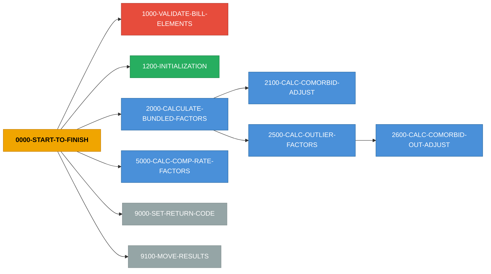
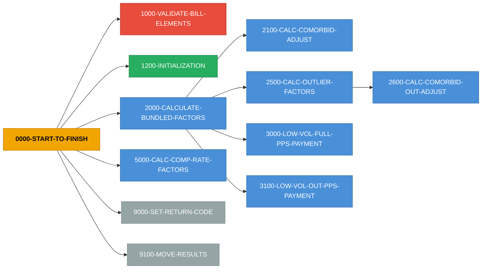

# Program Detail - Part 3/6

---

# COBOL Program: `ESCAL091`

**Source:** `ESCAL091`  
**Lines:** 514 total / 270 code / 189 comments

## Inter-Service Narrative (ISN)

> **ESCAL091 - 8 paragraphs, 9 return codes, 0 state flags, 2 external copybooks**

COBOL program `ESCAL091` orchestrates a 1-step business flow. It emits 9 distinct return-code value(s) across 9 assignment site(s), driven by 0 state-machine flag group(s). Depends on 2 external copybook(s): BILLCPY, WAGECPY.

**Entry point:** `0000-PROCEDURE-START`

**Top decision points (most branched paragraphs):**

- `1000-EDIT-THE-BILL-INFO` - 17 branches - sets: PPS-RTC=53 when P-SPEC-PYMT-IND NOT = '1' AND ' ' THEN / PPS-RTC=54 when (B-DOB-DATE = ZERO) OR (B-DOB-DATE NOT NUMERIC) THEN / PPS-RTC=55 when (B-PATIENT-WGT = 0) OR (B-PATIENT-WGT NOT NUMERIC)
- `1200-CALC-AGE` - 7 branches

**Return-code catalog (value -> emission sites):**

| RC | Sites | Variables | Sample condition |
|---|---|---|---|
| **52** | 1 | `PPS-RTC` | P-PROV-TYPE = '41' THEN |
| **53** | 1 | `PPS-RTC` | P-SPEC-PYMT-IND NOT = '1' AND ' ' THEN |
| **54** | 1 | `PPS-RTC` | (B-DOB-DATE = ZERO) OR (B-DOB-DATE NOT NUMERIC) THEN |
| **55** | 1 | `PPS-RTC` | (B-PATIENT-WGT = 0) OR (B-PATIENT-WGT NOT NUMERIC) |
| **56** | 1 | `PPS-RTC` | (B-PATIENT-HGT = 0) OR (B-PATIENT-HGT NOT NUMERIC) |
| **57** | 1 | `PPS-RTC` | B-REV-CODE = '0821' OR '0831' OR '0841' OR '0851' OR '0880' OR '0881' NEXT SENT? |
| **58** | 1 | `PPS-RTC` | B-COND-CODE NOT = '73' AND '74' AND ' ' |
| **71** | 1 | `PPS-RTC` | B-PATIENT-HGT > 300.00 |
| **72** | 1 | `PPS-RTC` | B-PATIENT-WGT > 500.00 THEN |

## Stats

- Paragraphs: **8**
- PERFORM/CALL edges: **6**
- COPY references: **2**
- WORKING-STORAGE items: **38**, LINKAGE items: **198**
- Return code assignments: **9**, State machines: **0**
- Cyclomatic complexity (est): **36**

## Business Rules (Magic Numbers)

**Total:** 41 rules (16 thresholds, 18 defaults)

| Type | Key | Value | Paragraph | Line |
|------|-----|-------|-----------|------|
| ?????? default | `0100_initial_routine.pps_rtc.default` | `52` | `0100-INITIAL-ROUTINE` | 266 |
| ?????? default | `1000_edit_the_bill_info.pps_rtc.default` | `53` | `1000-EDIT-THE-BILL-INFO` | 303 |
| ?????? default | `1000_edit_the_bill_info.pps_rtc.default` | `54` | `1000-EDIT-THE-BILL-INFO` | 309 |
| ?????? default | `1000_edit_the_bill_info.pps_rtc.default` | `55` | `1000-EDIT-THE-BILL-INFO` | 315 |
| ?????? default | `1000_edit_the_bill_info.pps_rtc.default` | `56` | `1000-EDIT-THE-BILL-INFO` | 321 |
| ?????? default | `1000_edit_the_bill_info.pps_rtc.default` | `57` | `1000-EDIT-THE-BILL-INFO` | 327 |
| ?????? default | `1000_edit_the_bill_info.pps_rtc.default` | `58` | `1000-EDIT-THE-BILL-INFO` | 336 |
| ?? threshold | `1000_edit_the_bill_info.b_patient_hgt.threshold` | `300.00` | `1000-EDIT-THE-BILL-INFO` | 342 |
| ?????? default | `1000_edit_the_bill_info.pps_rtc.default` | `71` | `1000-EDIT-THE-BILL-INFO` | 342 |
| ?? threshold | `1000_edit_the_bill_info.b_patient_wgt.threshold` | `500.00` | `1000-EDIT-THE-BILL-INFO` | 348 |
| ?????? default | `1000_edit_the_bill_info.pps_rtc.default` | `72` | `1000-EDIT-THE-BILL-INFO` | 348 |
| ?? threshold | `1200_calc_age.h_patient_age.threshold` | `18` | `1200-CALC-AGE` | 374 |
| ?????? default | `1200_calc_age.h_age_factor.default` | `1.620` | `1200-CALC-AGE` | 374 |
| ?? threshold | `1200_calc_age.h_patient_age.threshold` | `17` | `1200-CALC-AGE` | 374 |
| ?? threshold | `1200_calc_age.h_patient_age.threshold` | `45` | `1200-CALC-AGE` | 374 |
| ?????? default | `1200_calc_age.h_age_factor.default` | `1.223` | `1200-CALC-AGE` | 374 |
| ?? threshold | `1200_calc_age.h_patient_age.threshold` | `44` | `1200-CALC-AGE` | 374 |
| ?? threshold | `1200_calc_age.h_patient_age.threshold` | `60` | `1200-CALC-AGE` | 374 |
| ?????? default | `1200_calc_age.h_age_factor.default` | `1.055` | `1200-CALC-AGE` | 374 |
| ?? threshold | `1200_calc_age.h_patient_age.threshold` | `59` | `1200-CALC-AGE` | 374 |
| ?? threshold | `1200_calc_age.h_patient_age.threshold` | `70` | `1200-CALC-AGE` | 374 |
| ?????? default | `1200_calc_age.h_age_factor.default` | `1.000` | `1200-CALC-AGE` | 374 |
| ?? threshold | `1200_calc_age.h_patient_age.threshold` | `69` | `1200-CALC-AGE` | 374 |
| ?? threshold | `1200_calc_age.h_patient_age.threshold` | `80` | `1200-CALC-AGE` | 374 |
| ?????? default | `1200_calc_age.h_age_factor.default` | `1.094` | `1200-CALC-AGE` | 374 |
| ?? threshold | `1200_calc_age.h_patient_age.threshold` | `79` | `1200-CALC-AGE` | 374 |
| ?????? default | `1200_calc_age.h_age_factor.default` | `1.174` | `1200-CALC-AGE` | 374 |
| ?? constant | `2000_assemble_pps_variables.h_bsa_rounded.constant` | `.007184` | `2000-ASSEMBLE-PPS-VARIABLES` | 404 |
| ?? constant | `2000_assemble_pps_variables.h_bsa_rounded.constant` | `.725` | `2000-ASSEMBLE-PPS-VARIABLES` | 404 |
| ?? constant | `2000_assemble_pps_variables.h_bsa_rounded.constant` | `.425` | `2000-ASSEMBLE-PPS-VARIABLES` | 404 |

_... +11 more rules in `--extract-rules` output_

## Business Logic (Computed Values & Lookups)

_What this program actually calculates: 22 formulas/lookups/loops/call-params across 5 paragraphs._

### `0100-INITIAL-ROUTINE`

- **INITIALIZE** `PPS-DATA-ALL` (L259)
- **INITIALIZE** `BILL-DATA-TEST` (L260)
- **INITIALIZE** `HOLD-PPS-COMPONENTS` (L261)

### `1200-CALC-AGE`

- **COMPUTE** `H-PATIENT-AGE` = `B-THRU-CCYY - B-DOB-CCYY.` (L364)
- **COMPUTE** `H-PATIENT-AGE` = `H-PATIENT-AGE - 1` (L366)

### `2000-ASSEMBLE-PPS-VARIABLES`

- **COMPUTE** `H-BSA ROUNDED` = `(.007184 * (B-PATIENT-HGT ** .725) * (B-PATIENT-WGT ** .425))` (L404)
- **COMPUTE** `H-BMI ROUNDED` = `(B-PATIENT-WGT / (B-PATIENT-HGT ** 2)) * 10000.` (L404)
- **COMPUTE** `H-BSA-FACTOR ROUNDED` = `1.037 ** ((H-BSA - 1.84) / .1)` (L410)

### `3000-CALC-PAYMENT`

- **COMPUTE** `H-WAGE-ADJ-PYMT-NEW ROUNDED` = `(((H-PYMT-RATE * PPS-NAT-LABOR-PCT) * H-WAGE-ADJ) + (H-PYMT-RATE * PPS-NAT-NONLABOR-PCT)) * CBSA-BLEND-PCT.` (L433)
- **COMPUTE** `H-WAGE-ADJ-PYMT-AMT` = `H-WAGE-ADJ-PYMT-NEW + H-WAGE-ADJ-PYMT-OLD.` (L437)
- **COMPUTE** `H-PYMT-AMT ROUNDED` = `H-WAGE-ADJ-PYMT-AMT * H-BMI-FACTOR * H-BSA-FACTOR * PPS-BDGT-NEUT-RATE * H-AGE-FACTOR * H-DRUG-ADDON.` (L440)
- **COMPUTE** `H-PYMT-AMT` = `H-PYMT-AMT + HEMO-PERI-CCPD-AMT` (L447)
- **COMPUTE** `H-PYMT-AMT` = `H-PYMT-AMT + CAPD-AMT` (L447)
- **COMPUTE** `H-PYMT-AMT ROUNDED` = `H-PYMT-AMT * CAPD-OR-CCPD-FACTOR` (L447)

### `9000-MOVE-RESULTS`

- **INITIALIZE** `PPS-COND-CODE` (L475)
- **INITIALIZE** `PPS-REV-CODE` (L475)
- **INITIALIZE** `PPS-MSA` (L475)
- **INITIALIZE** `PPS-CBSA` (L475)
- **INITIALIZE** `PPS-AGE-FACTOR` (L475)
- **INITIALIZE** `PPS-BSA-FACTOR` (L475)
- **INITIALIZE** `PPS-BMI-FACTOR` (L475)
- **INITIALIZE** `DRUG-ADD-ON-RETURN` (L475)

## Copybooks

- `BILLCPY`
- `WAGECPY`

## Paragraphs (Action Graph)

| Paragraph | Lines | PERFORM | CALL | GO TO | IF | RC set |
|---|---|---|---|---|---|---|
| `0000-PROCEDURE-START` | 211-236 | 0 | 0 | 0 | 0 | 0 |
| `0000-MAINLINE-CONTROL` | 237-253 | 5 | 0 | 0 | 2 | 0 |
| `0100-INITIAL-ROUTINE` | 254-300 | 0 | 0 | 0 | 2 | 1 |
| `1000-EDIT-THE-BILL-INFO` | 301-358 | 1 | 0 | 0 | 17 | 8 |
| `1200-CALC-AGE` | 359-398 | 0 | 0 | 0 | 7 | 0 |
| `2000-ASSEMBLE-PPS-VARIABLES` | 399-428 | 0 | 0 | 0 | 2 | 0 |
| `3000-CALC-PAYMENT` | 429-472 | 0 | 0 | 0 | 3 | 0 |
| `9000-MOVE-RESULTS` | 473-514 | 0 | 0 | 0 | 3 | 0 |

## Execution Logic Summary (ELS)

_Auto-generated narrative per paragraph - what each routine does, which branches it evaluates, and which side effects it produces._

### `0000-PROCEDURE-START` (L211-236)

Main control routine - leaf logic block.


### `0000-MAINLINE-CONTROL` (L237-253)

Main control routine - orchestrates 0100-INITIAL-ROUTINE, 1000-EDIT-THE-BILL-INFO, 2000-ASSEMBLE-PPS-VARIABLES, 3000-CALC-PAYMENT (+1 more). Contains 2 IF/branchs.

- **Calls:** `0100-INITIAL-ROUTINE`, `1000-EDIT-THE-BILL-INFO`, `2000-ASSEMBLE-PPS-VARIABLES`, `3000-CALC-PAYMENT`, `9000-MOVE-RESULTS`

### `0100-INITIAL-ROUTINE` (L254-300)

Initialization routine - assigns return codes based on input state. Contains 2 IF/branchs. Sets: PPS-RTC=52 when P-PROV-TYPE = '41' THEN.

- **Side effects:**
  - PPS-RTC=52 when P-PROV-TYPE = '41' THEN

### `1000-EDIT-THE-BILL-INFO` (L301-358)

Business routine - orchestrates 1200-CALC-AGE. Contains 17 IF/branchs. Sets: PPS-RTC=53 when P-SPEC-PYMT-IND NOT = '1' AND ' ' THEN; PPS-RTC=54 when (B-DOB-DATE = ZERO) OR (B-DOB-DATE NOT NUMERIC) THEN; PPS-RTC=55 when (B-PATIENT-WGT = 0) OR (B-PATIENT-WGT NOT NUMERIC) (+5 more).

- **Calls:** `1200-CALC-AGE`
- **Side effects:**
  - PPS-RTC=53 when P-SPEC-PYMT-IND NOT = '1' AND ' ' THEN
  - PPS-RTC=54 when (B-DOB-DATE = ZERO) OR (B-DOB-DATE NOT NUMERIC) THEN
  - PPS-RTC=55 when (B-PATIENT-WGT = 0) OR (B-PATIENT-WGT NOT NUMERIC)
  - PPS-RTC=56 when (B-PATIENT-HGT = 0) OR (B-PATIENT-HGT NOT NUMERIC)
  - PPS-RTC=57 when B-REV-CODE = '0821' OR '0831' OR '0841' OR '0851' OR '0880' OR '0881'?
  - PPS-RTC=58 when B-COND-CODE NOT = '73' AND '74' AND ' '
  - PPS-RTC=71 when B-PATIENT-HGT > 300.00
  - PPS-RTC=72 when B-PATIENT-WGT > 500.00 THEN

### `1200-CALC-AGE` (L359-398)

Calculation routine - evaluates 7 branch conditions. Contains 7 IF/branchs.


### `2000-ASSEMBLE-PPS-VARIABLES` (L399-428)

Business routine - evaluates 2 branch conditions. Contains 2 IF/branchs.


### `3000-CALC-PAYMENT` (L429-472)

Calculation routine - evaluates 3 branch conditions. Contains 3 IF/branchs.


### `9000-MOVE-RESULTS` (L473-514)

Business routine - evaluates 3 branch conditions. Contains 3 IF/branchs.


## TSB Risk Metric Summary (Technical & Structural Breakdown Risk)

**Average risk:** [OK] 18 / 100 (LOW)  
**Max paragraph risk:** [E] 84 / 100 (CRITICAL)  
**Distribution:** 1 CRITICAL ?. 0 HIGH ?. 0 MEDIUM ?. 7 LOW (of 8 paragraphs)

### Top 10 risky paragraphs

| Paragraph | Lines | Score | Category | Top factors |
|---|---|---|---|---|
| `1000-EDIT-THE-BILL-INFO` | 301-358 | **84** | [E] CRITICAL | 17 IF/EVAL branches, 8 return-code emissions, 1 PERFORM calls |
| `1200-CALC-AGE` | 359-398 | **21** | [OK] LOW | 7 IF/EVAL branches |
| `0000-MAINLINE-CONTROL` | 237-253 | **11** | [OK] LOW | 2 IF/EVAL branches, 5 PERFORM calls |
| `0100-INITIAL-ROUTINE` | 254-300 | **10** | [OK] LOW | 2 IF/EVAL branches, 1 return-code emissions |
| `3000-CALC-PAYMENT` | 429-472 | **9** | [OK] LOW | 3 IF/EVAL branches |
| `9000-MOVE-RESULTS` | 473-514 | **9** | [OK] LOW | 3 IF/EVAL branches |
| `2000-ASSEMBLE-PPS-VARIABLES` | 399-428 | **6** | [OK] LOW | 2 IF/EVAL branches |
| `0000-PROCEDURE-START` | 211-236 | **0** | [OK] LOW | - |

> **Call Graph:** Structure identical to `ESCAL056` - diagram not repeated.


## Call Graph Edges

```
         0000-MAINLINE-CONTROL  --PERFORM-->  0100-INITIAL-ROUTINE (L239)
         0000-MAINLINE-CONTROL  --PERFORM-->  1000-EDIT-THE-BILL-INFO (L241)
         0000-MAINLINE-CONTROL  --PERFORM-->  2000-ASSEMBLE-PPS-VARIABLES (L245)
         0000-MAINLINE-CONTROL  --PERFORM-->  3000-CALC-PAYMENT (L245)
         0000-MAINLINE-CONTROL  --PERFORM-->  9000-MOVE-RESULTS (L250)
       1000-EDIT-THE-BILL-INFO  --PERFORM-->  1200-CALC-AGE (L354)
```

## Return Codes (Trigger Summary)

| Paragraph | Line | RC Var | Value | Condition |
|---|---|---|---|---|
| `0100-INITIAL-ROUTINE` | 266 | `PPS-RTC` | **52** | P-PROV-TYPE = '41'  THEN |
| `1000-EDIT-THE-BILL-INFO` | 303 | `PPS-RTC` | **53** | P-SPEC-PYMT-IND NOT = '1' AND ' '  THEN |
| `1000-EDIT-THE-BILL-INFO` | 309 | `PPS-RTC` | **54** | (B-DOB-DATE = ZERO)  OR  (B-DOB-DATE NOT NUMERIC)  THEN |
| `1000-EDIT-THE-BILL-INFO` | 315 | `PPS-RTC` | **55** | (B-PATIENT-WGT = 0)  OR  (B-PATIENT-WGT NOT NUMERIC) |
| `1000-EDIT-THE-BILL-INFO` | 321 | `PPS-RTC` | **56** | (B-PATIENT-HGT = 0)  OR  (B-PATIENT-HGT NOT NUMERIC) |
| `1000-EDIT-THE-BILL-INFO` | 327 | `PPS-RTC` | **57** | B-REV-CODE  = '0821' OR '0831' OR '0841' OR '0851' OR '0880' OR '0881' NEXT SENT |
| `1000-EDIT-THE-BILL-INFO` | 336 | `PPS-RTC` | **58** | B-COND-CODE NOT = '73' AND '74' AND '  ' |
| `1000-EDIT-THE-BILL-INFO` | 342 | `PPS-RTC` | **71** | B-PATIENT-HGT > 300.00 |
| `1000-EDIT-THE-BILL-INFO` | 348 | `PPS-RTC` | **72** | B-PATIENT-WGT > 500.00  THEN |

---

# COBOL Program: `ESCAL100`

**Source:** `ESCAL100`  
**Lines:** 525 total / 272 code / 197 comments

## Inter-Service Narrative (ISN)

> **ESCAL100 - 8 paragraphs, 9 return codes, 0 state flags, 2 external copybooks**

COBOL program `ESCAL100` orchestrates a 1-step business flow. It emits 9 distinct return-code value(s) across 9 assignment site(s), driven by 0 state-machine flag group(s). Depends on 2 external copybook(s): BILLCPY, WAGECPY.

**Entry point:** `0000-PROCEDURE-START`

**Top decision points (most branched paragraphs):**

- `1000-EDIT-THE-BILL-INFO` - 17 branches - sets: PPS-RTC=53 when P-SPEC-PYMT-IND NOT = '1' AND ' ' THEN / PPS-RTC=54 when (B-DOB-DATE = ZERO) OR (B-DOB-DATE NOT NUMERIC) THEN / PPS-RTC=55 when (B-PATIENT-WGT = 0) OR (B-PATIENT-WGT NOT NUMERIC)
- `1200-CALC-AGE` - 7 branches

**Return-code catalog (value -> emission sites):**

| RC | Sites | Variables | Sample condition |
|---|---|---|---|
| **52** | 1 | `PPS-RTC` | P-PROV-TYPE = '41' THEN |
| **53** | 1 | `PPS-RTC` | P-SPEC-PYMT-IND NOT = '1' AND ' ' THEN |
| **54** | 1 | `PPS-RTC` | (B-DOB-DATE = ZERO) OR (B-DOB-DATE NOT NUMERIC) THEN |
| **55** | 1 | `PPS-RTC` | (B-PATIENT-WGT = 0) OR (B-PATIENT-WGT NOT NUMERIC) |
| **56** | 1 | `PPS-RTC` | (B-PATIENT-HGT = 0) OR (B-PATIENT-HGT NOT NUMERIC) |
| **57** | 1 | `PPS-RTC` | B-REV-CODE = '0821' OR '0831' OR '0841' OR '0851' OR '0880' OR '0881' NEXT SENT? |
| **58** | 1 | `PPS-RTC` | B-COND-CODE NOT = '73' AND '74' AND ' ' |
| **71** | 1 | `PPS-RTC` | B-PATIENT-HGT > 300.00 |
| **72** | 1 | `PPS-RTC` | B-PATIENT-WGT > 500.00 THEN |

## Stats

- Paragraphs: **8**
- PERFORM/CALL edges: **6**
- COPY references: **2**
- WORKING-STORAGE items: **40**, LINKAGE items: **198**
- Return code assignments: **9**, State machines: **0**
- Cyclomatic complexity (est): **36**

## Business Rules (Magic Numbers)

**Total:** 41 rules (16 thresholds, 18 defaults)

| Type | Key | Value | Paragraph | Line |
|------|-----|-------|-----------|------|
| ?????? default | `0100_initial_routine.pps_rtc.default` | `52` | `0100-INITIAL-ROUTINE` | 276 |
| ?????? default | `1000_edit_the_bill_info.pps_rtc.default` | `53` | `1000-EDIT-THE-BILL-INFO` | 313 |
| ?????? default | `1000_edit_the_bill_info.pps_rtc.default` | `54` | `1000-EDIT-THE-BILL-INFO` | 319 |
| ?????? default | `1000_edit_the_bill_info.pps_rtc.default` | `55` | `1000-EDIT-THE-BILL-INFO` | 325 |
| ?????? default | `1000_edit_the_bill_info.pps_rtc.default` | `56` | `1000-EDIT-THE-BILL-INFO` | 331 |
| ?????? default | `1000_edit_the_bill_info.pps_rtc.default` | `57` | `1000-EDIT-THE-BILL-INFO` | 337 |
| ?????? default | `1000_edit_the_bill_info.pps_rtc.default` | `58` | `1000-EDIT-THE-BILL-INFO` | 346 |
| ?? threshold | `1000_edit_the_bill_info.b_patient_hgt.threshold` | `300.00` | `1000-EDIT-THE-BILL-INFO` | 352 |
| ?????? default | `1000_edit_the_bill_info.pps_rtc.default` | `71` | `1000-EDIT-THE-BILL-INFO` | 352 |
| ?? threshold | `1000_edit_the_bill_info.b_patient_wgt.threshold` | `500.00` | `1000-EDIT-THE-BILL-INFO` | 358 |
| ?????? default | `1000_edit_the_bill_info.pps_rtc.default` | `72` | `1000-EDIT-THE-BILL-INFO` | 358 |
| ?? threshold | `1200_calc_age.h_patient_age.threshold` | `18` | `1200-CALC-AGE` | 384 |
| ?????? default | `1200_calc_age.h_age_factor.default` | `1.620` | `1200-CALC-AGE` | 384 |
| ?? threshold | `1200_calc_age.h_patient_age.threshold` | `17` | `1200-CALC-AGE` | 384 |
| ?? threshold | `1200_calc_age.h_patient_age.threshold` | `45` | `1200-CALC-AGE` | 384 |
| ?????? default | `1200_calc_age.h_age_factor.default` | `1.223` | `1200-CALC-AGE` | 384 |
| ?? threshold | `1200_calc_age.h_patient_age.threshold` | `44` | `1200-CALC-AGE` | 384 |
| ?? threshold | `1200_calc_age.h_patient_age.threshold` | `60` | `1200-CALC-AGE` | 384 |
| ?????? default | `1200_calc_age.h_age_factor.default` | `1.055` | `1200-CALC-AGE` | 384 |
| ?? threshold | `1200_calc_age.h_patient_age.threshold` | `59` | `1200-CALC-AGE` | 384 |
| ?? threshold | `1200_calc_age.h_patient_age.threshold` | `70` | `1200-CALC-AGE` | 384 |
| ?????? default | `1200_calc_age.h_age_factor.default` | `1.000` | `1200-CALC-AGE` | 384 |
| ?? threshold | `1200_calc_age.h_patient_age.threshold` | `69` | `1200-CALC-AGE` | 384 |
| ?? threshold | `1200_calc_age.h_patient_age.threshold` | `80` | `1200-CALC-AGE` | 384 |
| ?????? default | `1200_calc_age.h_age_factor.default` | `1.094` | `1200-CALC-AGE` | 384 |
| ?? threshold | `1200_calc_age.h_patient_age.threshold` | `79` | `1200-CALC-AGE` | 384 |
| ?????? default | `1200_calc_age.h_age_factor.default` | `1.174` | `1200-CALC-AGE` | 384 |
| ?? constant | `2000_assemble_pps_variables.h_bsa_rounded.constant` | `.007184` | `2000-ASSEMBLE-PPS-VARIABLES` | 414 |
| ?? constant | `2000_assemble_pps_variables.h_bsa_rounded.constant` | `.725` | `2000-ASSEMBLE-PPS-VARIABLES` | 414 |
| ?? constant | `2000_assemble_pps_variables.h_bsa_rounded.constant` | `.425` | `2000-ASSEMBLE-PPS-VARIABLES` | 414 |

_... +11 more rules in `--extract-rules` output_

## Business Logic (Computed Values & Lookups)

_What this program actually calculates: 22 formulas/lookups/loops/call-params across 5 paragraphs._

### `0100-INITIAL-ROUTINE`

- **INITIALIZE** `PPS-DATA-ALL` (L270)
- **INITIALIZE** `BILL-DATA-TEST` (L271)
- **INITIALIZE** `HOLD-PPS-COMPONENTS` (L272)

### `1200-CALC-AGE`

- **COMPUTE** `H-PATIENT-AGE` = `B-THRU-CCYY - B-DOB-CCYY.` (L374)
- **COMPUTE** `H-PATIENT-AGE` = `H-PATIENT-AGE - 1` (L376)

### `2000-ASSEMBLE-PPS-VARIABLES`

- **COMPUTE** `H-BSA ROUNDED` = `(.007184 * (B-PATIENT-HGT ** .725) * (B-PATIENT-WGT ** .425))` (L414)
- **COMPUTE** `H-BMI ROUNDED` = `(B-PATIENT-WGT / (B-PATIENT-HGT ** 2)) * 10000.` (L414)
- **COMPUTE** `H-BSA-FACTOR ROUNDED` = `1.037 ** ((H-BSA - 1.84) / .1)` (L420)

### `3000-CALC-PAYMENT`

- **COMPUTE** `H-WAGE-ADJ-PYMT-NEW ROUNDED` = `(((H-PYMT-RATE * PPS-NAT-LABOR-PCT) * H-WAGE-ADJ) + (H-PYMT-RATE * PPS-NAT-NONLABOR-PCT)) * CBSA-BLEND-PCT.` (L443)
- **COMPUTE** `H-WAGE-ADJ-PYMT-AMT` = `H-WAGE-ADJ-PYMT-NEW + H-WAGE-ADJ-PYMT-OLD.` (L448)
- **COMPUTE** `H-PYMT-AMT ROUNDED` = `H-WAGE-ADJ-PYMT-AMT * H-BMI-FACTOR * H-BSA-FACTOR * PPS-BDGT-NEUT-RATE * H-AGE-FACTOR * H-DRUG-ADDON.` (L451)
- **COMPUTE** `H-PYMT-AMT` = `H-PYMT-AMT + HEMO-PERI-CCPD-AMT` (L458)
- **COMPUTE** `H-PYMT-AMT` = `H-PYMT-AMT + CAPD-AMT` (L458)
- **COMPUTE** `H-PYMT-AMT ROUNDED` = `H-PYMT-AMT * CAPD-OR-CCPD-FACTOR` (L458)

### `9000-MOVE-RESULTS`

- **INITIALIZE** `PPS-COND-CODE` (L486)
- **INITIALIZE** `PPS-REV-CODE` (L486)
- **INITIALIZE** `PPS-MSA` (L486)
- **INITIALIZE** `PPS-CBSA` (L486)
- **INITIALIZE** `PPS-AGE-FACTOR` (L486)
- **INITIALIZE** `PPS-BSA-FACTOR` (L486)
- **INITIALIZE** `PPS-BMI-FACTOR` (L486)
- **INITIALIZE** `DRUG-ADD-ON-RETURN` (L486)

## Copybooks

- `BILLCPY`
- `WAGECPY`

## Paragraphs (Action Graph)

| Paragraph | Lines | PERFORM | CALL | GO TO | IF | RC set |
|---|---|---|---|---|---|---|
| `0000-PROCEDURE-START` | 222-247 | 0 | 0 | 0 | 0 | 0 |
| `0000-MAINLINE-CONTROL` | 248-264 | 5 | 0 | 0 | 2 | 0 |
| `0100-INITIAL-ROUTINE` | 265-310 | 0 | 0 | 0 | 2 | 1 |
| `1000-EDIT-THE-BILL-INFO` | 311-368 | 1 | 0 | 0 | 17 | 8 |
| `1200-CALC-AGE` | 369-408 | 0 | 0 | 0 | 7 | 0 |
| `2000-ASSEMBLE-PPS-VARIABLES` | 409-438 | 0 | 0 | 0 | 2 | 0 |
| `3000-CALC-PAYMENT` | 439-483 | 0 | 0 | 0 | 3 | 0 |
| `9000-MOVE-RESULTS` | 484-525 | 0 | 0 | 0 | 3 | 0 |

## Execution Logic Summary (ELS)

_Auto-generated narrative per paragraph - what each routine does, which branches it evaluates, and which side effects it produces._

### `0000-PROCEDURE-START` (L222-247)

Main control routine - leaf logic block.


### `0000-MAINLINE-CONTROL` (L248-264)

Main control routine - orchestrates 0100-INITIAL-ROUTINE, 1000-EDIT-THE-BILL-INFO, 2000-ASSEMBLE-PPS-VARIABLES, 3000-CALC-PAYMENT (+1 more). Contains 2 IF/branchs.

- **Calls:** `0100-INITIAL-ROUTINE`, `1000-EDIT-THE-BILL-INFO`, `2000-ASSEMBLE-PPS-VARIABLES`, `3000-CALC-PAYMENT`, `9000-MOVE-RESULTS`

### `0100-INITIAL-ROUTINE` (L265-310)

Initialization routine - assigns return codes based on input state. Contains 2 IF/branchs. Sets: PPS-RTC=52 when P-PROV-TYPE = '41' THEN.

- **Side effects:**
  - PPS-RTC=52 when P-PROV-TYPE = '41' THEN

### `1000-EDIT-THE-BILL-INFO` (L311-368)

Business routine - orchestrates 1200-CALC-AGE. Contains 17 IF/branchs. Sets: PPS-RTC=53 when P-SPEC-PYMT-IND NOT = '1' AND ' ' THEN; PPS-RTC=54 when (B-DOB-DATE = ZERO) OR (B-DOB-DATE NOT NUMERIC) THEN; PPS-RTC=55 when (B-PATIENT-WGT = 0) OR (B-PATIENT-WGT NOT NUMERIC) (+5 more).

- **Calls:** `1200-CALC-AGE`
- **Side effects:**
  - PPS-RTC=53 when P-SPEC-PYMT-IND NOT = '1' AND ' ' THEN
  - PPS-RTC=54 when (B-DOB-DATE = ZERO) OR (B-DOB-DATE NOT NUMERIC) THEN
  - PPS-RTC=55 when (B-PATIENT-WGT = 0) OR (B-PATIENT-WGT NOT NUMERIC)
  - PPS-RTC=56 when (B-PATIENT-HGT = 0) OR (B-PATIENT-HGT NOT NUMERIC)
  - PPS-RTC=57 when B-REV-CODE = '0821' OR '0831' OR '0841' OR '0851' OR '0880' OR '0881'?
  - PPS-RTC=58 when B-COND-CODE NOT = '73' AND '74' AND ' '
  - PPS-RTC=71 when B-PATIENT-HGT > 300.00
  - PPS-RTC=72 when B-PATIENT-WGT > 500.00 THEN

### `1200-CALC-AGE` (L369-408)

Calculation routine - evaluates 7 branch conditions. Contains 7 IF/branchs.


### `2000-ASSEMBLE-PPS-VARIABLES` (L409-438)

Business routine - evaluates 2 branch conditions. Contains 2 IF/branchs.


### `3000-CALC-PAYMENT` (L439-483)

Calculation routine - evaluates 3 branch conditions. Contains 3 IF/branchs.


### `9000-MOVE-RESULTS` (L484-525)

Business routine - evaluates 3 branch conditions. Contains 3 IF/branchs.


## TSB Risk Metric Summary (Technical & Structural Breakdown Risk)

**Average risk:** [OK] 18 / 100 (LOW)  
**Max paragraph risk:** [E] 84 / 100 (CRITICAL)  
**Distribution:** 1 CRITICAL ?. 0 HIGH ?. 0 MEDIUM ?. 7 LOW (of 8 paragraphs)

### Top 10 risky paragraphs

| Paragraph | Lines | Score | Category | Top factors |
|---|---|---|---|---|
| `1000-EDIT-THE-BILL-INFO` | 311-368 | **84** | [E] CRITICAL | 17 IF/EVAL branches, 8 return-code emissions, 1 PERFORM calls |
| `1200-CALC-AGE` | 369-408 | **21** | [OK] LOW | 7 IF/EVAL branches |
| `0000-MAINLINE-CONTROL` | 248-264 | **11** | [OK] LOW | 2 IF/EVAL branches, 5 PERFORM calls |
| `0100-INITIAL-ROUTINE` | 265-310 | **10** | [OK] LOW | 2 IF/EVAL branches, 1 return-code emissions |
| `3000-CALC-PAYMENT` | 439-483 | **9** | [OK] LOW | 3 IF/EVAL branches |
| `9000-MOVE-RESULTS` | 484-525 | **9** | [OK] LOW | 3 IF/EVAL branches |
| `2000-ASSEMBLE-PPS-VARIABLES` | 409-438 | **6** | [OK] LOW | 2 IF/EVAL branches |
| `0000-PROCEDURE-START` | 222-247 | **0** | [OK] LOW | - |

> **Call Graph:** Structure identical to `ESCAL056` - diagram not repeated.


## Call Graph Edges

```
         0000-MAINLINE-CONTROL  --PERFORM-->  0100-INITIAL-ROUTINE (L250)
         0000-MAINLINE-CONTROL  --PERFORM-->  1000-EDIT-THE-BILL-INFO (L252)
         0000-MAINLINE-CONTROL  --PERFORM-->  2000-ASSEMBLE-PPS-VARIABLES (L256)
         0000-MAINLINE-CONTROL  --PERFORM-->  3000-CALC-PAYMENT (L256)
         0000-MAINLINE-CONTROL  --PERFORM-->  9000-MOVE-RESULTS (L261)
       1000-EDIT-THE-BILL-INFO  --PERFORM-->  1200-CALC-AGE (L364)
```

## Return Codes (Trigger Summary)

| Paragraph | Line | RC Var | Value | Condition |
|---|---|---|---|---|
| `0100-INITIAL-ROUTINE` | 276 | `PPS-RTC` | **52** | P-PROV-TYPE = '41'  THEN |
| `1000-EDIT-THE-BILL-INFO` | 313 | `PPS-RTC` | **53** | P-SPEC-PYMT-IND NOT = '1' AND ' '  THEN |
| `1000-EDIT-THE-BILL-INFO` | 319 | `PPS-RTC` | **54** | (B-DOB-DATE = ZERO)  OR  (B-DOB-DATE NOT NUMERIC)  THEN |
| `1000-EDIT-THE-BILL-INFO` | 325 | `PPS-RTC` | **55** | (B-PATIENT-WGT = 0)  OR  (B-PATIENT-WGT NOT NUMERIC) |
| `1000-EDIT-THE-BILL-INFO` | 331 | `PPS-RTC` | **56** | (B-PATIENT-HGT = 0)  OR  (B-PATIENT-HGT NOT NUMERIC) |
| `1000-EDIT-THE-BILL-INFO` | 337 | `PPS-RTC` | **57** | B-REV-CODE  = '0821' OR '0831' OR '0841' OR '0851' OR '0880' OR '0881' NEXT SENT |
| `1000-EDIT-THE-BILL-INFO` | 346 | `PPS-RTC` | **58** | B-COND-CODE NOT = '73' AND '74' AND '  ' |
| `1000-EDIT-THE-BILL-INFO` | 352 | `PPS-RTC` | **71** | B-PATIENT-HGT > 300.00 |
| `1000-EDIT-THE-BILL-INFO` | 358 | `PPS-RTC` | **72** | B-PATIENT-WGT > 500.00  THEN |

---

# COBOL Program: `ESCAL117`

**Source:** `ESCAL117`  
**Lines:** 1678 total / 1173 code / 404 comments

## Inter-Service Narrative (ISN)

> **ESCAL117 - 11 paragraphs, 47 return codes, 1 state flags, 3 external copybooks**

COBOL program `ESCAL117` orchestrates a 1-step business flow. It emits 47 distinct return-code value(s) across 47 assignment site(s), driven by 1 state-machine flag group(s). Depends on 3 external copybook(s): RTCCPY, BILLCPY, WAGECPY.

**Entry point:** `0000-PROCEDURE-START`

**Top decision points (most branched paragraphs):**

- `9000-SET-RETURN-CODE` - 32 branches - sets: PPS-RTC=17 when TRAINING-TRACK = "Y" THEN / PPS-RTC=16 when TRAINING-TRACK = "Y" THEN / PPS-RTC=15 when TRAINING-TRACK = "Y" THEN
- `2500-CALC-OUTLIER-FACTORS` - 28 branches
- `1000-VALIDATE-BILL-ELEMENTS` - 27 branches - sets: PPS-RTC=52 when P-PROV-TYPE = '40' OR '41' OR '05' THEN NEXT SENTENCE / PPS-RTC=53 when P-SPEC-PYMT-IND NOT = '1' AND ' ' THEN / PPS-RTC=54 when (B-DOB-DATE = ZERO) OR (B-DOB-DATE NOT NUMERIC) THEN
- `2000-CALCULATE-BUNDLED-FACTORS` - 26 branches
- `2100-CALC-COMORBID-ADJUST` - 11 branches

**Return-code catalog (value -> emission sites):**

| RC | Sites | Variables | Sample condition |
|---|---|---|---|
| **02** | 1 | `PPS-RTC` | LOW-BMI-TRACK = "Y" THEN |
| **03** | 1 | `PPS-RTC` | ONSET-TRACK = "Y" THEN |
| **04** | 1 | `PPS-RTC` | ACUTE-COMORBID-TRACK = "Y" THEN |
| **05** | 1 | `PPS-RTC` | CHRONIC-COMORBID-TRACK = "Y" THEN |
| **06** | 1 | `PPS-RTC` | ACUTE-COMORBID-TRACK = "Y" THEN |
| **07** | 1 | `PPS-RTC` | CHRONIC-COMORBID-TRACK = "Y" THEN |
| **08** | 1 | `PPS-RTC` | ONSET-TRACK = "Y" THEN |
| **09** | 1 | `PPS-RTC` | ONSET-TRACK = "Y" THEN |
| **10** | 1 | `PPS-RTC` | ONSET-TRACK = "Y" THEN |
| **11** | 1 | `PPS-RTC` | ACUTE-COMORBID-TRACK = "Y" THEN |
| **12** | 1 | `PPS-RTC` | ACUTE-COMORBID-TRACK = "Y" THEN |
| **14** | 1 | `PPS-RTC` | TRAINING-TRACK = "Y" THEN |
| **15** | 1 | `PPS-RTC` | TRAINING-TRACK = "Y" THEN |
| **16** | 1 | `PPS-RTC` | TRAINING-TRACK = "Y" THEN |
| **17** | 1 | `PPS-RTC` | TRAINING-TRACK = "Y" THEN |
| **18** | 1 | `PPS-RTC` | ACUTE-COMORBID-TRACK = "Y" THEN |
| **19** | 1 | `PPS-RTC` | ACUTE-COMORBID-TRACK = "Y" THEN |
| **20** | 1 | `PPS-RTC` | ACUTE-COMORBID-TRACK = "Y" THEN |
| **21** | 1 | `PPS-RTC` | ACUTE-COMORBID-TRACK = "Y" THEN |
| **22** | 1 | `PPS-RTC` | ACUTE-COMORBID-TRACK = "Y" THEN |
| **23** | 1 | `PPS-RTC` | CHRONIC-COMORBID-TRACK = "Y" THEN |
| **24** | 1 | `PPS-RTC` | CHRONIC-COMORBID-TRACK = "Y" THEN |
| **25** | 1 | `PPS-RTC` | CHRONIC-COMORBID-TRACK = "Y" THEN |
| **26** | 1 | `PPS-RTC` | CHRONIC-COMORBID-TRACK = "Y" THEN |
| **27** | 1 | `PPS-RTC` | CHRONIC-COMORBID-TRACK = "Y" THEN |
| **28** | 1 | `PPS-RTC` | ONSET-TRACK = "Y" THEN |
| **29** | 1 | `PPS-RTC` | ACUTE-COMORBID-TRACK = "Y" THEN |
| **30** | 1 | `PPS-RTC` | ONSET-TRACK = "Y" THEN |
| **31** | 1 | `PPS-RTC` | LOW-BMI-TRACK = "Y" THEN |
| **32** | 1 | `PPS-RTC` | ONSET-TRACK = "Y" THEN |
| **33** | 1 | `PPS-RTC` | ACUTE-COMORBID-TRACK = "Y" THEN |
| **34** | 1 | `PPS-RTC` | CHRONIC-COMORBID-TRACK = "Y" THEN |
| **35** | 1 | `PPS-RTC` | ACUTE-COMORBID-TRACK = "Y" THEN |
| **52** | 1 | `PPS-RTC` | P-PROV-TYPE = '40' OR '41' OR '05' THEN NEXT SENTENCE |
| **53** | 1 | `PPS-RTC` | P-SPEC-PYMT-IND NOT = '1' AND ' ' THEN |
| **54** | 1 | `PPS-RTC` | (B-DOB-DATE = ZERO) OR (B-DOB-DATE NOT NUMERIC) THEN |
| **55** | 1 | `PPS-RTC` | (B-PATIENT-WGT = 0) OR (B-PATIENT-WGT NOT NUMERIC) |
| **56** | 1 | `PPS-RTC` | (B-PATIENT-HGT = 0) OR (B-PATIENT-HGT NOT NUMERIC) |
| **57** | 1 | `PPS-RTC` | B-REV-CODE = '0821' OR '0831' OR '0841' OR '0851' OR '0881' NEXT SENTENCE |
| **58** | 1 | `PPS-RTC` | B-COND-CODE NOT = '73' AND '74' AND ' ' |
| **71** | 1 | `PPS-RTC` | B-PATIENT-HGT > 300.00 |
| **72** | 1 | `PPS-RTC` | B-PATIENT-WGT > 500.00 THEN |
| **73** | 1 | `PPS-RTC` | (B-CLAIM-NUM-DIALYSIS-SESSIONS = ZERO) OR (B-CLAIM-NUM-DIALYSIS-SESSIONS NOT NU? |
| **74** | 1 | `PPS-RTC` | (B-LINE-ITEM-DATE-SERVICE = ZERO) OR (B-LINE-ITEM-DATE-SERVICE NOT NUMERIC) THEN |
| **75** | 1 | `PPS-RTC` | (B-DIALYSIS-START-DATE NOT NUMERIC) THEN |
| **76** | 1 | `PPS-RTC` | (B-TOT-PRICE-SB-OUTLIER NOT NUMERIC) THEN |
| **81** | 1 | `PPS-RTC` | (COMORBID-CWF-RETURN-CODE = SPACES) OR VALID-COMORBID-CWF-RETURN-CD THEN NEXT S? |

## Stats

- Paragraphs: **11**
- PERFORM/CALL edges: **11**
- COPY references: **3**
- WORKING-STORAGE items: **159**, LINKAGE items: **198**
- Return code assignments: **47**, State machines: **1**
- Cyclomatic complexity (est): **165**

## Business Rules (Magic Numbers)

**Total:** 133 rules (42 thresholds, 65 defaults)

| Type | Key | Value | Paragraph | Line |
|------|-----|-------|-----------|------|
| ?? threshold | `0000_start_to_finish.h_patient_age.threshold` | `18` | `0000-START-TO-FINISH` | 455 |
| ?????? default | `1000_validate_bill_elements.pps_rtc.default` | `52` | `1000-VALIDATE-BILL-ELEMENTS` | 476 |
| ?????? default | `1000_validate_bill_elements.pps_rtc.default` | `53` | `1000-VALIDATE-BILL-ELEMENTS` | 482 |
| ?????? default | `1000_validate_bill_elements.pps_rtc.default` | `54` | `1000-VALIDATE-BILL-ELEMENTS` | 488 |
| ?????? default | `1000_validate_bill_elements.pps_rtc.default` | `55` | `1000-VALIDATE-BILL-ELEMENTS` | 494 |
| ?????? default | `1000_validate_bill_elements.pps_rtc.default` | `56` | `1000-VALIDATE-BILL-ELEMENTS` | 500 |
| ?????? default | `1000_validate_bill_elements.pps_rtc.default` | `57` | `1000-VALIDATE-BILL-ELEMENTS` | 506 |
| ?????? default | `1000_validate_bill_elements.pps_rtc.default` | `58` | `1000-VALIDATE-BILL-ELEMENTS` | 515 |
| ?? threshold | `1000_validate_bill_elements.b_patient_hgt.threshold` | `300.00` | `1000-VALIDATE-BILL-ELEMENTS` | 521 |
| ?????? default | `1000_validate_bill_elements.pps_rtc.default` | `71` | `1000-VALIDATE-BILL-ELEMENTS` | 521 |
| ?? threshold | `1000_validate_bill_elements.b_patient_wgt.threshold` | `500.00` | `1000-VALIDATE-BILL-ELEMENTS` | 527 |
| ?????? default | `1000_validate_bill_elements.pps_rtc.default` | `72` | `1000-VALIDATE-BILL-ELEMENTS` | 527 |
| ?????? default | `1000_validate_bill_elements.pps_rtc.default` | `73` | `1000-VALIDATE-BILL-ELEMENTS` | 538 |
| ?????? default | `1000_validate_bill_elements.pps_rtc.default` | `74` | `1000-VALIDATE-BILL-ELEMENTS` | 545 |
| ?????? default | `1000_validate_bill_elements.pps_rtc.default` | `75` | `1000-VALIDATE-BILL-ELEMENTS` | 552 |
| ?????? default | `1000_validate_bill_elements.pps_rtc.default` | `76` | `1000-VALIDATE-BILL-ELEMENTS` | 558 |
| ?????? default | `1000_validate_bill_elements.pps_rtc.default` | `81` | `1000-VALIDATE-BILL-ELEMENTS` | 564 |
| ?? threshold | `2000_calculate_bundled_factors.h_patient_age.threshold` | `13` | `2000-CALCULATE-BUNDLED-FACTORS` | 689 |
| ?? threshold | `2000_calculate_bundled_factors.h_patient_age.threshold` | `18` | `2000-CALCULATE-BUNDLED-FACTORS` | 689 |
| ?? threshold | `2000_calculate_bundled_factors.h_patient_age.threshold` | `45` | `2000-CALCULATE-BUNDLED-FACTORS` | 689 |
| ?? threshold | `2000_calculate_bundled_factors.h_patient_age.threshold` | `60` | `2000-CALCULATE-BUNDLED-FACTORS` | 689 |
| ?? threshold | `2000_calculate_bundled_factors.h_patient_age.threshold` | `70` | `2000-CALCULATE-BUNDLED-FACTORS` | 689 |
| ?? threshold | `2000_calculate_bundled_factors.h_patient_age.threshold` | `80` | `2000-CALCULATE-BUNDLED-FACTORS` | 689 |
| ?? constant | `2000_calculate_bundled_factors.h_bun_bsa__rounded.constant` | `.007184` | `2000-CALCULATE-BUNDLED-FACTORS` | 730 |
| ?? constant | `2000_calculate_bundled_factors.h_bun_bsa__rounded.constant` | `.725` | `2000-CALCULATE-BUNDLED-FACTORS` | 730 |
| ?? constant | `2000_calculate_bundled_factors.h_bun_bsa__rounded.constant` | `.425` | `2000-CALCULATE-BUNDLED-FACTORS` | 730 |
| ?? threshold | `2000_calculate_bundled_factors.h_patient_age.threshold` | `17` | `2000-CALCULATE-BUNDLED-FACTORS` | 730 |
| ?? constant | `2000_calculate_bundled_factors.h_bun_bsa_factor__rounded.constant` | `1.87` | `2000-CALCULATE-BUNDLED-FACTORS` | 730 |
| ?? constant | `2000_calculate_bundled_factors.h_bun_bsa_factor__rounded.constant` | `.1` | `2000-CALCULATE-BUNDLED-FACTORS` | 730 |
| ?????? default | `2000_calculate_bundled_factors.h_bun_bsa_factor.default` | `1.000` | `2000-CALCULATE-BUNDLED-FACTORS` | 730 |

_... +103 more rules in `--extract-rules` output_

## Business Logic (Computed Values & Lookups)

_What this program actually calculates: 42 formulas/lookups/loops/call-params across 8 paragraphs._

### `0000-START-TO-FINISH`

- **INITIALIZE** `PPS-DATA-ALL` (L444)
- **INITIALIZE** `BILL-DATA-TEST` (L446)
- **INITIALIZE** `COND-CD-73` (L446)
- **COMPUTE** `H-PATIENT-AGE` = `B-THRU-CCYY - B-DOB-CCYY` (L455)
- **COMPUTE** `H-PATIENT-AGE` = `H-PATIENT-AGE - 1` (L455)

### `1200-INITIALIZATION`

- **INITIALIZE** `HOLD-COMP-RATE-PPS-COMPONENTS` (L574)
- **INITIALIZE** `HOLD-BUNDLED-PPS-COMPONENTS` (L575)
- **INITIALIZE** `HOLD-OUTLIER-PPS-COMPONENTS` (L576)
- **INITIALIZE** `PAID-RETURN-CODE-TRACKERS` (L577)
- **COMPUTE** `H-BUN-NAT-LABOR-AMT ROUNDED` = `(BUNDLED-BASE-PMT-RATE * BUN-NAT-LABOR-PCT) * BUN-CBSA-W-INDEX.` (L675)
- **COMPUTE** `H-BUN-NAT-NONLABOR-AMT ROUNDED` = `BUNDLED-BASE-PMT-RATE * BUN-NAT-NONLABOR-PCT` (L679)
- **COMPUTE** `H-BUN-BASE-WAGE-AMT ROUNDED` = `H-BUN-NAT-LABOR-AMT + H-BUN-NAT-NONLABOR-AMT.` (L679)

### `2000-CALCULATE-BUNDLED-FACTORS`

- **COMPUTE** `H-BUN-BSA  ROUNDED` = `(.007184 * (B-PATIENT-HGT ** .725) * (B-PATIENT-WGT ** .425))` (L730)
- **COMPUTE** `H-BUN-BSA-FACTOR  ROUNDED` = `CM-BSA ** ((H-BUN-BSA - 1.87) / .1)` (L730)
- **COMPUTE** `H-BUN-BMI  ROUNDED` = `(B-PATIENT-WGT / (B-PATIENT-HGT ** 2)) * 10000.` (L743)
- **COMPUTE** `INTEGER-LINE-ITEM-DATE` = `FUNCTION INTEGER-OF-DATE(THE-DATE)` (L756)
- **COMPUTE** `INTEGER-DIALYSIS-DATE` = `FUNCTION INTEGER-OF-DATE(THE-DATE)` (L756)
- **COMPUTE** `ONSET-DATE` = `(INTEGER-LINE-ITEM-DATE - INTEGER-DIALYSIS-DATE) + 1` (L756)
- **COMPUTE** `H-BUN-ADJUSTED-BASE-WAGE-AMT  ROUNDED` = `(H-BUN-BASE-WAGE-AMT * H-BUN-AGE-FACTOR)    * (H-BUN-BSA-FACTOR    * H-BUN-BMI-FACTOR)    * (H-BUN-ONSET-FACTOR  * H-BUN` (L845)
- **COMPUTE** `H-BUN-WAGE-ADJ-TRAINING-AMT  ROUNDED` = `TRAINING-ADD-ON-PMT-AMT * BUN-CBSA-W-INDEX` (L856)

### `2100-CALC-COMORBID-ADJUST`

- **PERFORM** `` UNTIL SUB   >  6   OR   HIGH-COMORBID-FOUND (L915)

### `2500-CALC-OUTLIER-FACTORS`

- **COMPUTE** `H-OUT-BSA  ROUNDED` = `(.007184 * (B-PATIENT-HGT ** .725) * (B-PATIENT-WGT ** .425))` (L1017)
- **COMPUTE** `H-OUT-BSA-FACTOR  ROUNDED` = `SB-BSA ** ((H-OUT-BSA - 1.87) / .1)` (L1017)
- **COMPUTE** `H-OUT-BMI  ROUNDED` = `(B-PATIENT-WGT / (B-PATIENT-HGT ** 2)) * 10000.` (L1030)
- **COMPUTE** `H-OUT-PREDICTED-SERVICES-MAP  ROUNDED` = `(H-OUT-AGE-FACTOR             * H-OUT-BSA-FACTOR             * H-OUT-BMI-FACTOR             * H-OUT-ONSET-FACTOR        ` (L1112)
- **COMPUTE** `H-OUT-CM-ADJ-PREDICT-MAP-TRT  ROUNDED` = `(H-OUT-PREDICTED-SERVICES-MAP * ADJ-AVG-MAP-AMT-LT-18)` (L1123)
- **COMPUTE** `H-OUT-CM-ADJ-PREDICT-MAP-TRT  ROUNDED` = `(H-OUT-PREDICTED-SERVICES-MAP * ADJ-AVG-MAP-AMT-GT-17)` (L1123)
- **COMPUTE** `H-HEMO-EQUIV-DIAL-SESSIONS  ROUNDED` = `((B-CLAIM-NUM-DIALYSIS-SESSIONS * 3) / 7)` (L1137)
- **COMPUTE** `H-OUT-IMPUTED-MAP  ROUNDED` = `(B-TOT-PRICE-SB-OUTLIER / H-HEMO-EQUIV-DIAL-SESSIONS)` (L1137)

### `2600-CALC-COMORBID-OUT-ADJUST`

- **PERFORM** `` UNTIL SUB   >  6   OR   HIGH-COMORBID-FOUND (L1202)

### `5000-CALC-COMP-RATE-FACTORS`

- **COMPUTE** `H-BSA  ROUNDED` = `(.007184 * (B-PATIENT-HGT ** .725) * (B-PATIENT-WGT ** .425))` (L1286)
- **COMPUTE** `H-BSA-FACTOR  ROUNDED` = `CR-BSA ** ((H-BSA - 1.84) / .1)` (L1286)
- **COMPUTE** `H-BMI  ROUNDED` = `(B-PATIENT-WGT / (B-PATIENT-HGT ** 2)) * 10000.` (L1299)
- **COMPUTE** `H-WAGE-ADJ-PYMT-AMT ROUNDED` = `(((H-PAYMENT-RATE * NAT-LABOR-PCT) * COM-CBSA-W-INDEX) + (H-PAYMENT-RATE * NAT-NONLABOR-PCT)) * CBSA-BLEND-PCT.` (L1325)
- **COMPUTE** `H-PYMT-AMT ROUNDED` = `(H-WAGE-ADJ-PYMT-AMT * H-BMI-FACTOR * H-BSA-FACTOR * CASE-MIX-BDGT-NEUT-FACTOR * H-AGE-FACTOR * DRUG-ADDON) + A-49-CENT-` (L1330)
- **COMPUTE** `H-PYMT-AMT` = `H-PYMT-AMT + HEMO-PERI-CCPD-AMT` (L1342)
- **COMPUTE** `H-PYMT-AMT` = `H-PYMT-AMT + CAPD-AMT` (L1342)
- **COMPUTE** `H-PYMT-AMT ROUNDED` = `H-PYMT-AMT * CAPD-OR-CCPD-FACTOR` (L1342)

### `9100-MOVE-RESULTS`

- **COMPUTE** `H-OUT-PAYMENT ROUNDED` = `H-OUT-PAYMENT / B-CLAIM-NUM-DIALYSIS-SESSIONS` (L1587)
- **COMPUTE** `PPS-2011-BLEND-COMP-RATE    ROUNDED` = `H-PYMT-AMT           *  COM-CBSA-BLEND-PCT` (L1593)
- **COMPUTE** `PPS-2011-BLEND-PPS-RATE     ROUNDED` = `H-PPS-FINAL-PAY-AMT  *  BUN-CBSA-BLEND-PCT` (L1593)
- **COMPUTE** `PPS-2011-BLEND-OUTLIER-RATE ROUNDED` = `H-OUT-PAYMENT        *  BUN-CBSA-BLEND-PCT` (L1593)

## Copybooks

- `RTCCPY`
- `BILLCPY`
- `WAGECPY`

## Paragraphs (Action Graph)

| Paragraph | Lines | PERFORM | CALL | GO TO | IF | RC set |
|---|---|---|---|---|---|---|
| `0000-PROCEDURE-START` | 416-442 | 0 | 0 | 0 | 0 | 0 |
| `0000-START-TO-FINISH` | 443-474 | 6 | 0 | 0 | 5 | 0 |
| `1000-VALIDATE-BILL-ELEMENTS` | 475-572 | 0 | 0 | 0 | 27 | 14 |
| `1200-INITIALIZATION` | 573-684 | 0 | 0 | 0 | 7 | 0 |
| `2000-CALCULATE-BUNDLED-FACTORS` | 685-902 | 2 | 0 | 0 | 26 | 0 |
| `2100-CALC-COMORBID-ADJUST` | 903-971 | 1 | 0 | 0 | 11 | 0 |
| `2500-CALC-OUTLIER-FACTORS` | 972-1188 | 1 | 0 | 0 | 28 | 0 |
| `2600-CALC-COMORBID-OUT-ADJUST` | 1189-1255 | 1 | 0 | 0 | 11 | 0 |
| `5000-CALC-COMP-RATE-FACTORS` | 1256-1367 | 0 | 0 | 0 | 11 | 0 |
| `9000-SET-RETURN-CODE` | 1368-1548 | 0 | 0 | 0 | 32 | 33 |
| `9100-MOVE-RESULTS` | 1549-1678 | 0 | 0 | 0 | 5 | 0 |

## Execution Logic Summary (ELS)

_Auto-generated narrative per paragraph - what each routine does, which branches it evaluates, and which side effects it produces._

### `0000-PROCEDURE-START` (L416-442)

Main control routine - leaf logic block.


### `0000-START-TO-FINISH` (L443-474)

Main control routine - orchestrates 1000-VALIDATE-BILL-ELEMENTS, 1200-INITIALIZATION, 2000-CALCULATE-BUNDLED-FACTORS, 5000-CALC-COMP-RATE-FACTORS (+2 more). Contains 5 IF/branchs.

- **Calls:** `1000-VALIDATE-BILL-ELEMENTS`, `1200-INITIALIZATION`, `2000-CALCULATE-BUNDLED-FACTORS`, `5000-CALC-COMP-RATE-FACTORS`, `9000-SET-RETURN-CODE`, `9100-MOVE-RESULTS`

### `1000-VALIDATE-BILL-ELEMENTS` (L475-572)

Validation routine - assigns return codes based on input state. Contains 27 IF/branchs. Sets: PPS-RTC=52 when P-PROV-TYPE = '40' OR '41' OR '05' THEN NEXT SENTENCE; PPS-RTC=53 when P-SPEC-PYMT-IND NOT = '1' AND ' ' THEN; PPS-RTC=54 when (B-DOB-DATE = ZERO) OR (B-DOB-DATE NOT NUMERIC) THEN (+11 more).

- **Side effects:**
  - PPS-RTC=52 when P-PROV-TYPE = '40' OR '41' OR '05' THEN NEXT SENTENCE
  - PPS-RTC=53 when P-SPEC-PYMT-IND NOT = '1' AND ' ' THEN
  - PPS-RTC=54 when (B-DOB-DATE = ZERO) OR (B-DOB-DATE NOT NUMERIC) THEN
  - PPS-RTC=55 when (B-PATIENT-WGT = 0) OR (B-PATIENT-WGT NOT NUMERIC)
  - PPS-RTC=56 when (B-PATIENT-HGT = 0) OR (B-PATIENT-HGT NOT NUMERIC)
  - PPS-RTC=57 when B-REV-CODE = '0821' OR '0831' OR '0841' OR '0851' OR '0881' NEXT SENT?
  - PPS-RTC=58 when B-COND-CODE NOT = '73' AND '74' AND ' '
  - PPS-RTC=71 when B-PATIENT-HGT > 300.00
  - PPS-RTC=72 when B-PATIENT-WGT > 500.00 THEN
  - PPS-RTC=73 when (B-CLAIM-NUM-DIALYSIS-SESSIONS = ZERO) OR (B-CLAIM-NUM-DIALYSIS-SESSI?
  - PPS-RTC=74 when (B-LINE-ITEM-DATE-SERVICE = ZERO) OR (B-LINE-ITEM-DATE-SERVICE NOT NU?
  - PPS-RTC=75 when (B-DIALYSIS-START-DATE NOT NUMERIC) THEN
  - PPS-RTC=76 when (B-TOT-PRICE-SB-OUTLIER NOT NUMERIC) THEN
  - PPS-RTC=81 when (COMORBID-CWF-RETURN-CODE = SPACES) OR VALID-COMORBID-CWF-RETURN-CD T?

### `1200-INITIALIZATION` (L573-684)

Initialization routine - evaluates 7 branch conditions. Contains 7 IF/branchs.


### `2000-CALCULATE-BUNDLED-FACTORS` (L685-902)

Calculation routine - orchestrates 2100-CALC-COMORBID-ADJUST, 2500-CALC-OUTLIER-FACTORS. Contains 26 IF/branchs.

- **Calls:** `2100-CALC-COMORBID-ADJUST`, `2500-CALC-OUTLIER-FACTORS`

### `2100-CALC-COMORBID-ADJUST` (L903-971)

Calculation routine - orchestrates . Contains 11 IF/branchs.

- **Calls:** ``

### `2500-CALC-OUTLIER-FACTORS` (L972-1188)

Calculation routine - orchestrates 2600-CALC-COMORBID-OUT-ADJUST. Contains 28 IF/branchs.

- **Calls:** `2600-CALC-COMORBID-OUT-ADJUST`

### `2600-CALC-COMORBID-OUT-ADJUST` (L1189-1255)

Calculation routine - orchestrates . Contains 11 IF/branchs.

- **Calls:** ``

### `5000-CALC-COMP-RATE-FACTORS` (L1256-1367)

Calculation routine - evaluates 11 branch conditions. Contains 11 IF/branchs.


### `9000-SET-RETURN-CODE` (L1368-1548)

Business routine - assigns return codes based on input state. Contains 32 IF/branchs. Sets: PPS-RTC=17 when TRAINING-TRACK = "Y" THEN; PPS-RTC=16 when TRAINING-TRACK = "Y" THEN; PPS-RTC=15 when TRAINING-TRACK = "Y" THEN (+30 more).

- **Side effects:**
  - PPS-RTC=17 when TRAINING-TRACK = "Y" THEN
  - PPS-RTC=16 when TRAINING-TRACK = "Y" THEN
  - PPS-RTC=15 when TRAINING-TRACK = "Y" THEN
  - PPS-RTC=14 when TRAINING-TRACK = "Y" THEN
  - PPS-RTC=24 when CHRONIC-COMORBID-TRACK = "Y" THEN
  - PPS-RTC=19 when ACUTE-COMORBID-TRACK = "Y" THEN
  - PPS-RTC=29 when ACUTE-COMORBID-TRACK = "Y" THEN
  - PPS-RTC=23 when CHRONIC-COMORBID-TRACK = "Y" THEN
  - PPS-RTC=18 when ACUTE-COMORBID-TRACK = "Y" THEN
  - PPS-RTC=30 when ONSET-TRACK = "Y" THEN
  - PPS-RTC=28 when ONSET-TRACK = "Y" THEN
  - PPS-RTC=34 when CHRONIC-COMORBID-TRACK = "Y" THEN
  - PPS-RTC=35 when ACUTE-COMORBID-TRACK = "Y" THEN
  - PPS-RTC=33 when ACUTE-COMORBID-TRACK = "Y" THEN
  - PPS-RTC=07 when CHRONIC-COMORBID-TRACK = "Y" THEN
  - PPS-RTC=06 when ACUTE-COMORBID-TRACK = "Y" THEN
  - PPS-RTC=09 when ONSET-TRACK = "Y" THEN
  - PPS-RTC=03 when ONSET-TRACK = "Y" THEN
  - PPS-RTC=26 when CHRONIC-COMORBID-TRACK = "Y" THEN
  - PPS-RTC=21 when ACUTE-COMORBID-TRACK = "Y" THEN
  - PPS-RTC=12 when ACUTE-COMORBID-TRACK = "Y" THEN
  - PPS-RTC=25 when CHRONIC-COMORBID-TRACK = "Y" THEN
  - PPS-RTC=20 when ACUTE-COMORBID-TRACK = "Y" THEN
  - PPS-RTC=32 when ONSET-TRACK = "Y" THEN
  - PPS-RTC=10 when ONSET-TRACK = "Y" THEN
  - PPS-RTC=27 when CHRONIC-COMORBID-TRACK = "Y" THEN
  - PPS-RTC=22 when ACUTE-COMORBID-TRACK = "Y" THEN
  - PPS-RTC=11 when ACUTE-COMORBID-TRACK = "Y" THEN
  - PPS-RTC=08 when ONSET-TRACK = "Y" THEN
  - PPS-RTC=04 when ACUTE-COMORBID-TRACK = "Y" THEN
  - PPS-RTC=05 when CHRONIC-COMORBID-TRACK = "Y" THEN
  - PPS-RTC=31 when LOW-BMI-TRACK = "Y" THEN
  - PPS-RTC=02 when LOW-BMI-TRACK = "Y" THEN

### `9100-MOVE-RESULTS` (L1549-1678)

Business routine - evaluates 5 branch conditions. Contains 5 IF/branchs.


## TSB Risk Metric Summary (Technical & Structural Breakdown Risk)

**Average risk:** [H] 53 / 100 (HIGH)  
**Max paragraph risk:** [E] 100 / 100 (CRITICAL)  
**Distribution:** 4 CRITICAL ?. 0 HIGH ?. 4 MEDIUM ?. 3 LOW (of 11 paragraphs)

### Top 10 risky paragraphs

| Paragraph | Lines | Score | Category | Top factors |
|---|---|---|---|---|
| `1000-VALIDATE-BILL-ELEMENTS` | 475-572 | **100** | [E] CRITICAL | 27 IF/EVAL branches, 14 return-code emissions |
| `2000-CALCULATE-BUNDLED-FACTORS` | 685-902 | **100** | [E] CRITICAL | 26 IF/EVAL branches, 217 lines (size penalty), 2 PERFORM calls |
| `2500-CALC-OUTLIER-FACTORS` | 972-1188 | **100** | [E] CRITICAL | 28 IF/EVAL branches, 216 lines (size penalty), 1 PERFORM calls |
| `9000-SET-RETURN-CODE` | 1368-1548 | **100** | [E] CRITICAL | 33 return-code emissions, 32 IF/EVAL branches, 180 lines (size penalty) |
| `5000-CALC-COMP-RATE-FACTORS` | 1256-1367 | **43** | [W] MEDIUM | 11 IF/EVAL branches, 111 lines (size penalty) |
| `2100-CALC-COMORBID-ADJUST` | 903-971 | **34** | [W] MEDIUM | 11 IF/EVAL branches, 1 PERFORM calls |
| `2600-CALC-COMORBID-OUT-ADJUST` | 1189-1255 | **34** | [W] MEDIUM | 11 IF/EVAL branches, 1 PERFORM calls |
| `1200-INITIALIZATION` | 573-684 | **31** | [W] MEDIUM | 7 IF/EVAL branches, 111 lines (size penalty) |
| `9100-MOVE-RESULTS` | 1549-1678 | **25** | [OK] LOW | 5 IF/EVAL branches, 129 lines (size penalty) |
| `0000-START-TO-FINISH` | 443-474 | **21** | [OK] LOW | 5 IF/EVAL branches, 6 PERFORM calls |

## Issues

- [W] **WARNING**  `escal117.cbl:L443`: Potential state leak: Flag `PEDIATRIC-TRACK` is set to 'Y' in paragraph `0000-START-TO-FINISH` but is never reset to 'N' or INITIALIZEd here. Subsequent paragraph calls will reuse the dirty state.
- [W] **WARNING**  `escal117.cbl:L573`: Potential state leak: Flag `MOVED-CORMORBIDS` is set to 'Y' in paragraph `1200-INITIALIZATION` but is never reset to 'N' or INITIALIZEd here. Subsequent paragraph calls will reuse the dirty state.
- [W] **WARNING**  `escal117.cbl:L685`: Potential state leak: Flag `ONSET-TRACK` is set to 'Y' in paragraph `2000-CALCULATE-BUNDLED-FACTORS` but is never reset to 'N' or INITIALIZEd here. Subsequent paragraph calls will reuse the dirty state.
- [W] **WARNING**  `escal117.cbl:L685`: Potential state leak: Flag `H-BUN-ONSET-FACTOR` is set to 'Y' in paragraph `2000-CALCULATE-BUNDLED-FACTORS` but is never reset to 'N' or INITIALIZEd here. Subsequent paragraph calls will reuse the dirty state.
- [W] **WARNING**  `escal117.cbl:L685`: Potential state leak: Flag `LOW-BMI-TRACK` is set to 'Y' in paragraph `2000-CALCULATE-BUNDLED-FACTORS` but is never reset to 'N' or INITIALIZEd here. Subsequent paragraph calls will reuse the dirty state.
- [W] **WARNING**  `escal117.cbl:L685`: Potential state leak: Flag `LOW-VOLUME-TRACK` is set to 'Y' in paragraph `2000-CALCULATE-BUNDLED-FACTORS` but is never reset to 'N' or INITIALIZEd here. Subsequent paragraph calls will reuse the dirty state.
- [W] **WARNING**  `escal117.cbl:L685`: Potential state leak: Flag `TRAINING-TRACK` is set to 'Y' in paragraph `2000-CALCULATE-BUNDLED-FACTORS` but is never reset to 'N' or INITIALIZEd here. Subsequent paragraph calls will reuse the dirty state.
- [W] **WARNING**  `escal117.cbl:L903`: Potential state leak: Flag `ACUTE-COMORBID-TRACK` is set to 'Y' in paragraph `2100-CALC-COMORBID-ADJUST` but is never reset to 'N' or INITIALIZEd here. Subsequent paragraph calls will reuse the dirty state.
- [W] **WARNING**  `escal117.cbl:L903`: Potential state leak: Flag `CHRONIC-COMORBID-TRACK` is set to 'Y' in paragraph `2100-CALC-COMORBID-ADJUST` but is never reset to 'N' or INITIALIZEd here. Subsequent paragraph calls will reuse the dirty state.
- [W] **WARNING**  `escal117.cbl:L972`: Potential state leak: Flag `OUTLIER-TRACK` is set to 'Y' in paragraph `2500-CALC-OUTLIER-FACTORS` but is never reset to 'N' or INITIALIZEd here. Subsequent paragraph calls will reuse the dirty state.
- [W] **WARNING**  `escal117.cbl:L972`: Potential state leak: Flag `H-OUT-ONSET-FACTOR` is set to 'Y' in paragraph `2500-CALC-OUTLIER-FACTORS` but is never reset to 'N' or INITIALIZEd here. Subsequent paragraph calls will reuse the dirty state.
- [W] **WARNING**  `escal117.cbl:L972`: Potential state leak: Flag `H-OUT-LOW-VOL-MULTIPLIER` is set to 'Y' in paragraph `2500-CALC-OUTLIER-FACTORS` but is never reset to 'N' or INITIALIZEd here. Subsequent paragraph calls will reuse the dirty state.
- [W] **WARNING**  `escal117.cbl:L972`: Potential state leak: Flag `LOW-VOLUME-TRACK` is set to 'Y' in paragraph `2500-CALC-OUTLIER-FACTORS` but is never reset to 'N' or INITIALIZEd here. Subsequent paragraph calls will reuse the dirty state.
- [W] **WARNING**  `escal117.cbl:L1189`: Potential state leak: Flag `ACUTE-COMORBID-TRACK` is set to 'Y' in paragraph `2600-CALC-COMORBID-OUT-ADJUST` but is never reset to 'N' or INITIALIZEd here. Subsequent paragraph calls will reuse the dirty state.
- [W] **WARNING**  `escal117.cbl:L1189`: Potential state leak: Flag `CHRONIC-COMORBID-TRACK` is set to 'Y' in paragraph `2600-CALC-COMORBID-OUT-ADJUST` but is never reset to 'N' or INITIALIZEd here. Subsequent paragraph calls will reuse the dirty state.

## Call Graph



## Call Graph Edges

```
          0000-START-TO-FINISH  --PERFORM-->  1000-VALIDATE-BILL-ELEMENTS (L453)
          0000-START-TO-FINISH  --PERFORM-->  1200-INITIALIZATION (L455)
          0000-START-TO-FINISH  --PERFORM-->  2000-CALCULATE-BUNDLED-FACTORS (L455)
          0000-START-TO-FINISH  --PERFORM-->  5000-CALC-COMP-RATE-FACTORS (L455)
          0000-START-TO-FINISH  --PERFORM-->  9000-SET-RETURN-CODE (L455)
          0000-START-TO-FINISH  --PERFORM-->  9100-MOVE-RESULTS (L455)
2000-CALCULATE-BUNDLED-FACTORS  --PERFORM-->  2100-CALC-COMORBID-ADJUST (L782)
2000-CALCULATE-BUNDLED-FACTORS  --PERFORM-->  2500-CALC-OUTLIER-FACTORS (L883)
     2100-CALC-COMORBID-ADJUST  --PERFORM-->   (L915)
     2500-CALC-OUTLIER-FACTORS  --PERFORM-->  2600-CALC-COMORBID-OUT-ADJUST (L1059)
 2600-CALC-COMORBID-OUT-ADJUST  --PERFORM-->   (L1202)
```

## Return Codes (Trigger Summary)

| Paragraph | Line | RC Var | Value | Condition |
|---|---|---|---|---|
| `1000-VALIDATE-BILL-ELEMENTS` | 476 | `PPS-RTC` | **52** | P-PROV-TYPE = '40'  OR  '41' OR '05'  THEN NEXT SENTENCE |
| `1000-VALIDATE-BILL-ELEMENTS` | 482 | `PPS-RTC` | **53** | P-SPEC-PYMT-IND NOT = '1' AND ' '  THEN |
| `1000-VALIDATE-BILL-ELEMENTS` | 488 | `PPS-RTC` | **54** | (B-DOB-DATE = ZERO)  OR  (B-DOB-DATE NOT NUMERIC)  THEN |
| `1000-VALIDATE-BILL-ELEMENTS` | 494 | `PPS-RTC` | **55** | (B-PATIENT-WGT = 0)  OR  (B-PATIENT-WGT NOT NUMERIC) |
| `1000-VALIDATE-BILL-ELEMENTS` | 500 | `PPS-RTC` | **56** | (B-PATIENT-HGT = 0)  OR  (B-PATIENT-HGT NOT NUMERIC) |
| `1000-VALIDATE-BILL-ELEMENTS` | 506 | `PPS-RTC` | **57** | B-REV-CODE  = '0821' OR '0831' OR '0841' OR '0851' OR '0881' NEXT SENTENCE |
| `1000-VALIDATE-BILL-ELEMENTS` | 515 | `PPS-RTC` | **58** | B-COND-CODE NOT = '73' AND '74' AND '  ' |
| `1000-VALIDATE-BILL-ELEMENTS` | 521 | `PPS-RTC` | **71** | B-PATIENT-HGT > 300.00 |
| `1000-VALIDATE-BILL-ELEMENTS` | 527 | `PPS-RTC` | **72** | B-PATIENT-WGT > 500.00  THEN |
| `1000-VALIDATE-BILL-ELEMENTS` | 538 | `PPS-RTC` | **73** | (B-CLAIM-NUM-DIALYSIS-SESSIONS = ZERO) OR (B-CLAIM-NUM-DIALYSIS-SESSIONS NOT NUM |
| `1000-VALIDATE-BILL-ELEMENTS` | 545 | `PPS-RTC` | **74** | (B-LINE-ITEM-DATE-SERVICE = ZERO) OR (B-LINE-ITEM-DATE-SERVICE NOT NUMERIC)  THE |
| `1000-VALIDATE-BILL-ELEMENTS` | 552 | `PPS-RTC` | **75** | (B-DIALYSIS-START-DATE NOT NUMERIC)  THEN |
| `1000-VALIDATE-BILL-ELEMENTS` | 558 | `PPS-RTC` | **76** | (B-TOT-PRICE-SB-OUTLIER NOT NUMERIC) THEN |
| `1000-VALIDATE-BILL-ELEMENTS` | 564 | `PPS-RTC` | **81** | (COMORBID-CWF-RETURN-CODE = SPACES) OR VALID-COMORBID-CWF-RETURN-CD       THEN N |
| `9000-SET-RETURN-CODE` | 1419 | `PPS-RTC` | **17** | TRAINING-TRACK                  = "Y"  THEN |
| `9000-SET-RETURN-CODE` | 1419 | `PPS-RTC` | **16** | TRAINING-TRACK                  = "Y"  THEN |
| `9000-SET-RETURN-CODE` | 1419 | `PPS-RTC` | **15** | TRAINING-TRACK                  = "Y"  THEN |
| `9000-SET-RETURN-CODE` | 1419 | `PPS-RTC` | **14** | TRAINING-TRACK                  = "Y"  THEN |
| `9000-SET-RETURN-CODE` | 1419 | `PPS-RTC` | **24** | CHRONIC-COMORBID-TRACK    = "Y"  THEN |
| `9000-SET-RETURN-CODE` | 1419 | `PPS-RTC` | **19** | ACUTE-COMORBID-TRACK   = "Y"  THEN |
| `9000-SET-RETURN-CODE` | 1419 | `PPS-RTC` | **29** | ACUTE-COMORBID-TRACK   = "Y"  THEN |
| `9000-SET-RETURN-CODE` | 1419 | `PPS-RTC` | **23** | CHRONIC-COMORBID-TRACK    = "Y"  THEN |
| `9000-SET-RETURN-CODE` | 1419 | `PPS-RTC` | **18** | ACUTE-COMORBID-TRACK   = "Y"  THEN |
| `9000-SET-RETURN-CODE` | 1419 | `PPS-RTC` | **30** | ONSET-TRACK         = "Y"  THEN |
| `9000-SET-RETURN-CODE` | 1419 | `PPS-RTC` | **28** | ONSET-TRACK         = "Y"  THEN |
| `9000-SET-RETURN-CODE` | 1419 | `PPS-RTC` | **34** | CHRONIC-COMORBID-TRACK    = "Y"  THEN |
| `9000-SET-RETURN-CODE` | 1419 | `PPS-RTC` | **35** | ACUTE-COMORBID-TRACK   = "Y"  THEN |
| `9000-SET-RETURN-CODE` | 1419 | `PPS-RTC` | **33** | ACUTE-COMORBID-TRACK   = "Y"  THEN |
| `9000-SET-RETURN-CODE` | 1419 | `PPS-RTC` | **07** | CHRONIC-COMORBID-TRACK    = "Y"  THEN |
| `9000-SET-RETURN-CODE` | 1419 | `PPS-RTC` | **06** | ACUTE-COMORBID-TRACK   = "Y"  THEN |
| `9000-SET-RETURN-CODE` | 1419 | `PPS-RTC` | **09** | ONSET-TRACK         = "Y"  THEN |
| `9000-SET-RETURN-CODE` | 1419 | `PPS-RTC` | **03** | ONSET-TRACK         = "Y"  THEN |
| `9000-SET-RETURN-CODE` | 1419 | `PPS-RTC` | **26** | CHRONIC-COMORBID-TRACK    = "Y"  THEN |
| `9000-SET-RETURN-CODE` | 1419 | `PPS-RTC` | **21** | ACUTE-COMORBID-TRACK   = "Y"  THEN |
| `9000-SET-RETURN-CODE` | 1419 | `PPS-RTC` | **12** | ACUTE-COMORBID-TRACK   = "Y"  THEN |
| `9000-SET-RETURN-CODE` | 1419 | `PPS-RTC` | **25** | CHRONIC-COMORBID-TRACK    = "Y"  THEN |
| `9000-SET-RETURN-CODE` | 1419 | `PPS-RTC` | **20** | ACUTE-COMORBID-TRACK   = "Y"  THEN |
| `9000-SET-RETURN-CODE` | 1419 | `PPS-RTC` | **32** | ONSET-TRACK         = "Y"  THEN |
| `9000-SET-RETURN-CODE` | 1419 | `PPS-RTC` | **10** | ONSET-TRACK         = "Y"  THEN |
| `9000-SET-RETURN-CODE` | 1419 | `PPS-RTC` | **27** | CHRONIC-COMORBID-TRACK    = "Y"  THEN |
| `9000-SET-RETURN-CODE` | 1419 | `PPS-RTC` | **22** | ACUTE-COMORBID-TRACK   = "Y"  THEN |
| `9000-SET-RETURN-CODE` | 1419 | `PPS-RTC` | **11** | ACUTE-COMORBID-TRACK   = "Y"  THEN |
| `9000-SET-RETURN-CODE` | 1419 | `PPS-RTC` | **08** | ONSET-TRACK               = "Y"  THEN |
| `9000-SET-RETURN-CODE` | 1419 | `PPS-RTC` | **04** | ACUTE-COMORBID-TRACK   = "Y"  THEN |
| `9000-SET-RETURN-CODE` | 1419 | `PPS-RTC` | **05** | CHRONIC-COMORBID-TRACK = "Y"  THEN |
| `9000-SET-RETURN-CODE` | 1419 | `PPS-RTC` | **31** | LOW-BMI-TRACK = "Y"  THEN |
| `9000-SET-RETURN-CODE` | 1419 | `PPS-RTC` | **02** | LOW-BMI-TRACK = "Y"  THEN |

## State Machines (88-level)

### `IS-HIGH-COMORBID-FOUND`

- **'Y'** = HIGH-COMORBID-FOUND (L257)

---

# COBOL Program: `ESCAL122`

**Source:** `ESCAL122`  
**Lines:** 1909 total / 1321 code / 470 comments

## Inter-Service Narrative (ISN)

> **ESCAL122 - 13 paragraphs, 48 return codes, 1 state flags, 3 external copybooks**

COBOL program `ESCAL122` orchestrates a 1-step business flow. It emits 47 distinct return-code value(s) across 48 assignment site(s), driven by 1 state-machine flag group(s). Depends on 3 external copybook(s): RTCCPY, BILLCPY, WAGECPY.

**Entry point:** `0000-PROCEDURE-START`

**Top decision points (most branched paragraphs):**

- `9000-SET-RETURN-CODE` - 32 branches - sets: PPS-RTC=17 when TRAINING-TRACK = "Y" THEN / PPS-RTC=16 when TRAINING-TRACK = "Y" THEN / PPS-RTC=15 when TRAINING-TRACK = "Y" THEN
- `1000-VALIDATE-BILL-ELEMENTS` - 29 branches - sets: PPS-RTC=52 when P-PROV-TYPE = '40' OR '41' OR '05' THEN NEXT SENTENCE / PPS-RTC=53 when P-SPEC-PYMT-IND NOT = '1' AND ' ' THEN / PPS-RTC=54 when (B-DOB-DATE = ZERO) OR (B-DOB-DATE NOT NUMERIC) THEN
- `2000-CALCULATE-BUNDLED-FACTORS` - 28 branches
- `2500-CALC-OUTLIER-FACTORS` - 28 branches
- `1200-INITIALIZATION` - 11 branches

**Return-code catalog (value -> emission sites):**

| RC | Sites | Variables | Sample condition |
|---|---|---|---|
| **02** | 1 | `PPS-RTC` | LOW-BMI-TRACK = "Y" THEN |
| **03** | 1 | `PPS-RTC` | ONSET-TRACK = "Y" THEN |
| **04** | 1 | `PPS-RTC` | ACUTE-COMORBID-TRACK = "Y" THEN |
| **05** | 1 | `PPS-RTC` | CHRONIC-COMORBID-TRACK = "Y" THEN |
| **06** | 1 | `PPS-RTC` | ACUTE-COMORBID-TRACK = "Y" THEN |
| **07** | 1 | `PPS-RTC` | CHRONIC-COMORBID-TRACK = "Y" THEN |
| **08** | 1 | `PPS-RTC` | ONSET-TRACK = "Y" THEN |
| **09** | 1 | `PPS-RTC` | ONSET-TRACK = "Y" THEN |
| **10** | 1 | `PPS-RTC` | ONSET-TRACK = "Y" THEN |
| **11** | 1 | `PPS-RTC` | ACUTE-COMORBID-TRACK = "Y" THEN |
| **12** | 1 | `PPS-RTC` | ACUTE-COMORBID-TRACK = "Y" THEN |
| **14** | 1 | `PPS-RTC` | TRAINING-TRACK = "Y" THEN |
| **15** | 1 | `PPS-RTC` | TRAINING-TRACK = "Y" THEN |
| **16** | 1 | `PPS-RTC` | TRAINING-TRACK = "Y" THEN |
| **17** | 1 | `PPS-RTC` | TRAINING-TRACK = "Y" THEN |
| **18** | 1 | `PPS-RTC` | ACUTE-COMORBID-TRACK = "Y" THEN |
| **19** | 1 | `PPS-RTC` | ACUTE-COMORBID-TRACK = "Y" THEN |
| **20** | 1 | `PPS-RTC` | ACUTE-COMORBID-TRACK = "Y" THEN |
| **21** | 1 | `PPS-RTC` | ACUTE-COMORBID-TRACK = "Y" THEN |
| **22** | 1 | `PPS-RTC` | ACUTE-COMORBID-TRACK = "Y" THEN |
| **23** | 1 | `PPS-RTC` | CHRONIC-COMORBID-TRACK = "Y" THEN |
| **24** | 1 | `PPS-RTC` | CHRONIC-COMORBID-TRACK = "Y" THEN |
| **25** | 1 | `PPS-RTC` | CHRONIC-COMORBID-TRACK = "Y" THEN |
| **26** | 1 | `PPS-RTC` | CHRONIC-COMORBID-TRACK = "Y" THEN |
| **27** | 1 | `PPS-RTC` | CHRONIC-COMORBID-TRACK = "Y" THEN |
| **28** | 1 | `PPS-RTC` | ONSET-TRACK = "Y" THEN |
| **29** | 1 | `PPS-RTC` | ACUTE-COMORBID-TRACK = "Y" THEN |
| **30** | 1 | `PPS-RTC` | ONSET-TRACK = "Y" THEN |
| **31** | 1 | `PPS-RTC` | LOW-BMI-TRACK = "Y" THEN |
| **32** | 1 | `PPS-RTC` | ONSET-TRACK = "Y" THEN |
| **33** | 1 | `PPS-RTC` | ACUTE-COMORBID-TRACK = "Y" THEN |
| **34** | 1 | `PPS-RTC` | CHRONIC-COMORBID-TRACK = "Y" THEN |
| **35** | 1 | `PPS-RTC` | ACUTE-COMORBID-TRACK = "Y" THEN |
| **52** | 1 | `PPS-RTC` | P-PROV-TYPE = '40' OR '41' OR '05' THEN NEXT SENTENCE |
| **53** | 2 | `PPS-RTC` | P-SPEC-PYMT-IND NOT = '1' AND ' ' THEN |
| **54** | 1 | `PPS-RTC` | (B-DOB-DATE = ZERO) OR (B-DOB-DATE NOT NUMERIC) THEN |
| **55** | 1 | `PPS-RTC` | (B-PATIENT-WGT = 0) OR (B-PATIENT-WGT NOT NUMERIC) |
| **56** | 1 | `PPS-RTC` | (B-PATIENT-HGT = 0) OR (B-PATIENT-HGT NOT NUMERIC) |
| **57** | 1 | `PPS-RTC` | B-REV-CODE = '0821' OR '0831' OR '0841' OR '0851' OR '0881' NEXT SENTENCE |
| **58** | 1 | `PPS-RTC` | B-COND-CODE NOT = '73' AND '74' AND ' ' |
| **71** | 1 | `PPS-RTC` | B-PATIENT-HGT > 300.00 |
| **72** | 1 | `PPS-RTC` | B-PATIENT-WGT > 500.00 THEN |
| **73** | 1 | `PPS-RTC` | (B-CLAIM-NUM-DIALYSIS-SESSIONS = ZERO) OR (B-CLAIM-NUM-DIALYSIS-SESSIONS NOT NU? |
| **74** | 1 | `PPS-RTC` | (B-LINE-ITEM-DATE-SERVICE = ZERO) OR (B-LINE-ITEM-DATE-SERVICE NOT NUMERIC) THEN |
| **75** | 1 | `PPS-RTC` | (B-DIALYSIS-START-DATE NOT NUMERIC) THEN |
| **76** | 1 | `PPS-RTC` | (B-TOT-PRICE-SB-OUTLIER NOT NUMERIC) THEN |
| **81** | 1 | `PPS-RTC` | (COMORBID-CWF-RETURN-CODE = SPACES) OR VALID-COMORBID-CWF-RETURN-CD THEN NEXT S? |

## Stats

- Paragraphs: **13**
- PERFORM/CALL edges: **13**
- COPY references: **3**
- WORKING-STORAGE items: **166**, LINKAGE items: **198**
- Return code assignments: **48**, State machines: **1**
- Cyclomatic complexity (est): **183**

## Business Rules (Magic Numbers)

**Total:** 154 rules (45 thresholds, 71 defaults)

| Type | Key | Value | Paragraph | Line |
|------|-----|-------|-----------|------|
| ?? threshold | `0000_start_to_finish.h_patient_age.threshold` | `18` | `0000-START-TO-FINISH` | 493 |
| ?????? default | `1000_validate_bill_elements.pps_rtc.default` | `52` | `1000-VALIDATE-BILL-ELEMENTS` | 514 |
| ?????? default | `1000_validate_bill_elements.pps_rtc.default` | `53` | `1000-VALIDATE-BILL-ELEMENTS` | 520 |
| ?????? default | `1000_validate_bill_elements.pps_rtc.default` | `54` | `1000-VALIDATE-BILL-ELEMENTS` | 526 |
| ?????? default | `1000_validate_bill_elements.pps_rtc.default` | `55` | `1000-VALIDATE-BILL-ELEMENTS` | 532 |
| ?????? default | `1000_validate_bill_elements.pps_rtc.default` | `56` | `1000-VALIDATE-BILL-ELEMENTS` | 538 |
| ?????? default | `1000_validate_bill_elements.pps_rtc.default` | `57` | `1000-VALIDATE-BILL-ELEMENTS` | 544 |
| ?????? default | `1000_validate_bill_elements.pps_rtc.default` | `58` | `1000-VALIDATE-BILL-ELEMENTS` | 553 |
| ?????? default | `1000_validate_bill_elements.pps_rtc.default` | `53` | `1000-VALIDATE-BILL-ELEMENTS` | 559 |
| ?? threshold | `1000_validate_bill_elements.b_patient_hgt.threshold` | `300.00` | `1000-VALIDATE-BILL-ELEMENTS` | 569 |
| ?????? default | `1000_validate_bill_elements.pps_rtc.default` | `71` | `1000-VALIDATE-BILL-ELEMENTS` | 569 |
| ?? threshold | `1000_validate_bill_elements.b_patient_wgt.threshold` | `500.00` | `1000-VALIDATE-BILL-ELEMENTS` | 575 |
| ?????? default | `1000_validate_bill_elements.pps_rtc.default` | `72` | `1000-VALIDATE-BILL-ELEMENTS` | 575 |
| ?????? default | `1000_validate_bill_elements.pps_rtc.default` | `73` | `1000-VALIDATE-BILL-ELEMENTS` | 586 |
| ?????? default | `1000_validate_bill_elements.pps_rtc.default` | `74` | `1000-VALIDATE-BILL-ELEMENTS` | 593 |
| ?????? default | `1000_validate_bill_elements.pps_rtc.default` | `75` | `1000-VALIDATE-BILL-ELEMENTS` | 600 |
| ?????? default | `1000_validate_bill_elements.pps_rtc.default` | `76` | `1000-VALIDATE-BILL-ELEMENTS` | 606 |
| ?????? default | `1000_validate_bill_elements.pps_rtc.default` | `81` | `1000-VALIDATE-BILL-ELEMENTS` | 612 |
| ?????? default | `1200_initialization.qip_reduction.default` | `1.000` | `1200-INITIALIZATION` | 629 |
| ?????? default | `1200_initialization.qip_reduction.default` | `0.995` | `1200-INITIALIZATION` | 629 |
| ?????? default | `1200_initialization.qip_reduction.default` | `0.990` | `1200-INITIALIZATION` | 629 |
| ?????? default | `1200_initialization.qip_reduction.default` | `0.985` | `1200-INITIALIZATION` | 629 |
| ?????? default | `1200_initialization.qip_reduction.default` | `0.980` | `1200-INITIALIZATION` | 629 |
| ?? threshold | `2000_calculate_bundled_factors.h_patient_age.threshold` | `13` | `2000-CALCULATE-BUNDLED-FACTORS` | 760 |
| ?? threshold | `2000_calculate_bundled_factors.h_patient_age.threshold` | `18` | `2000-CALCULATE-BUNDLED-FACTORS` | 760 |
| ?? threshold | `2000_calculate_bundled_factors.h_patient_age.threshold` | `45` | `2000-CALCULATE-BUNDLED-FACTORS` | 760 |
| ?? threshold | `2000_calculate_bundled_factors.h_patient_age.threshold` | `60` | `2000-CALCULATE-BUNDLED-FACTORS` | 760 |
| ?? threshold | `2000_calculate_bundled_factors.h_patient_age.threshold` | `70` | `2000-CALCULATE-BUNDLED-FACTORS` | 760 |
| ?? threshold | `2000_calculate_bundled_factors.h_patient_age.threshold` | `80` | `2000-CALCULATE-BUNDLED-FACTORS` | 760 |
| ?? constant | `2000_calculate_bundled_factors.h_bun_bsa__rounded.constant` | `.007184` | `2000-CALCULATE-BUNDLED-FACTORS` | 801 |

_... +124 more rules in `--extract-rules` output_

## Business Logic (Computed Values & Lookups)

_What this program actually calculates: 59 formulas/lookups/loops/call-params across 10 paragraphs._

### `0000-START-TO-FINISH`

- **INITIALIZE** `PPS-DATA-ALL` (L482)
- **INITIALIZE** `BILL-DATA-TEST` (L484)
- **INITIALIZE** `COND-CD-73` (L484)
- **COMPUTE** `H-PATIENT-AGE` = `B-THRU-CCYY - B-DOB-CCYY` (L493)
- **COMPUTE** `H-PATIENT-AGE` = `H-PATIENT-AGE - 1` (L493)

### `1200-INITIALIZATION`

- **INITIALIZE** `HOLD-COMP-RATE-PPS-COMPONENTS` (L622)
- **INITIALIZE** `HOLD-BUNDLED-PPS-COMPONENTS` (L623)
- **INITIALIZE** `HOLD-OUTLIER-PPS-COMPONENTS` (L624)
- **INITIALIZE** `PAID-RETURN-CODE-TRACKERS` (L625)
- **COMPUTE** `H-BUN-NAT-LABOR-AMT ROUNDED` = `(BUNDLED-BASE-PMT-RATE * BUN-NAT-LABOR-PCT) * BUN-CBSA-W-INDEX.` (L746)
- **COMPUTE** `H-BUN-NAT-NONLABOR-AMT ROUNDED` = `BUNDLED-BASE-PMT-RATE * BUN-NAT-NONLABOR-PCT` (L750)
- **COMPUTE** `H-BUN-BASE-WAGE-AMT ROUNDED` = `H-BUN-NAT-LABOR-AMT + H-BUN-NAT-NONLABOR-AMT.` (L750)

### `2000-CALCULATE-BUNDLED-FACTORS`

- **COMPUTE** `H-BUN-BSA  ROUNDED` = `(.007184 * (B-PATIENT-HGT ** .725) * (B-PATIENT-WGT ** .425))` (L801)
- **COMPUTE** `H-BUN-BSA-FACTOR  ROUNDED` = `CM-BSA ** ((H-BUN-BSA - 1.87) / .1)` (L801)
- **COMPUTE** `H-BUN-BMI  ROUNDED` = `(B-PATIENT-WGT / (B-PATIENT-HGT ** 2)) * 10000.` (L814)
- **COMPUTE** `INTEGER-LINE-ITEM-DATE` = `FUNCTION INTEGER-OF-DATE(THE-DATE)` (L827)
- **COMPUTE** `INTEGER-DIALYSIS-DATE` = `FUNCTION INTEGER-OF-DATE(THE-DATE)` (L827)
- **COMPUTE** `ONSET-DATE` = `(INTEGER-LINE-ITEM-DATE - INTEGER-DIALYSIS-DATE) + 1` (L827)
- **COMPUTE** `H-BUN-ADJUSTED-BASE-WAGE-AMT  ROUNDED` = `(H-BUN-BASE-WAGE-AMT * H-BUN-AGE-FACTOR)    * (H-BUN-BSA-FACTOR    * H-BUN-BMI-FACTOR)    * (H-BUN-ONSET-FACTOR  * H-BUN` (L917)
- **COMPUTE** `H-BUN-WAGE-ADJ-TRAINING-AMT  ROUNDED` = `TRAINING-ADD-ON-PMT-AMT * BUN-CBSA-W-INDEX` (L927)

### `2100-CALC-COMORBID-ADJUST`

- **PERFORM** `` UNTIL SUB   >  6   OR   HIGH-COMORBID-FOUND (L1010)

### `2500-CALC-OUTLIER-FACTORS`

- **COMPUTE** `H-OUT-BSA  ROUNDED` = `(.007184 * (B-PATIENT-HGT ** .725) * (B-PATIENT-WGT ** .425))` (L1112)
- **COMPUTE** `H-OUT-BSA-FACTOR  ROUNDED` = `SB-BSA ** ((H-OUT-BSA - 1.87) / .1)` (L1112)
- **COMPUTE** `H-OUT-BMI  ROUNDED` = `(B-PATIENT-WGT / (B-PATIENT-HGT ** 2)) * 10000.` (L1125)
- **COMPUTE** `H-OUT-PREDICTED-SERVICES-MAP  ROUNDED` = `(H-OUT-AGE-FACTOR             * H-OUT-BSA-FACTOR             * H-OUT-BMI-FACTOR             * H-OUT-ONSET-FACTOR        ` (L1207)
- **COMPUTE** `H-OUT-CM-ADJ-PREDICT-MAP-TRT  ROUNDED` = `(H-OUT-PREDICTED-SERVICES-MAP * ADJ-AVG-MAP-AMT-LT-18)` (L1218)
- **COMPUTE** `H-OUT-CM-ADJ-PREDICT-MAP-TRT  ROUNDED` = `(H-OUT-PREDICTED-SERVICES-MAP * ADJ-AVG-MAP-AMT-GT-17)` (L1218)
- **COMPUTE** `H-HEMO-EQUIV-DIAL-SESSIONS  ROUNDED` = `((B-CLAIM-NUM-DIALYSIS-SESSIONS * 3) / 7)` (L1232)
- **COMPUTE** `H-OUT-IMPUTED-MAP  ROUNDED` = `(B-TOT-PRICE-SB-OUTLIER / H-HEMO-EQUIV-DIAL-SESSIONS)` (L1232)

### `2600-CALC-COMORBID-OUT-ADJUST`

- **PERFORM** `` UNTIL SUB   >  6   OR   HIGH-COMORBID-FOUND (L1297)

### `3000-LOW-VOL-FULL-PPS-PAYMENT`

- **COMPUTE** `H-LV-BUN-ADJUST-BASE-WAGE-AMT  ROUNDED` = `(H-BUN-BASE-WAGE-AMT * H-BUN-AGE-FACTOR)     * (H-BUN-BSA-FACTOR    * H-BUN-BMI-FACTOR)     * (H-BUN-ONSET-FACTOR  * H-B` (L1357)
- **COMPUTE** `H-BUN-WAGE-ADJ-TRAINING-AMT  ROUNDED` = `TRAINING-ADD-ON-PMT-AMT * BUN-CBSA-W-INDEX` (L1365)
- **COMPUTE** `H-CC-74-PER-DIEM-AMT  ROUNDED` = `(H-LV-BUN-ADJUST-BASE-WAGE-AMT * 3) / 7` (L1365)
- **COMPUTE** `H-LV-PPS-FINAL-PAY-AMT  ROUNDED` = `H-CC-74-PER-DIEM-AMT` (L1391)
- **COMPUTE** `H-LV-PPS-FINAL-PAY-AMT  ROUNDED` = `H-LV-BUN-ADJUST-BASE-WAGE-AMT + H-BUN-WAGE-ADJ-TRAINING-AMT` (L1391)

### `3100-LOW-VOL-OUT-PPS-PAYMENT`

- **COMPUTE** `H-LV-OUT-PREDICT-SERVICES-MAP  ROUNDED` = `(H-OUT-AGE-FACTOR             * H-OUT-BSA-FACTOR             * H-OUT-BMI-FACTOR             * H-OUT-ONSET-FACTOR        ` (L1408)
- **COMPUTE** `H-LV-OUT-CM-ADJ-PREDICT-M-TRT  ROUNDED` = `(H-LV-OUT-PREDICT-SERVICES-MAP * ADJ-AVG-MAP-AMT-LT-18)` (L1417)
- **COMPUTE** `H-LV-OUT-CM-ADJ-PREDICT-M-TRT  ROUNDED` = `(H-LV-OUT-PREDICT-SERVICES-MAP * ADJ-AVG-MAP-AMT-GT-17)` (L1417)
- **COMPUTE** `H-LV-OUT-PREDICTED-MAP  ROUNDED` = `H-LV-OUT-CM-ADJ-PREDICT-M-TRT + FIX-DOLLAR-LOSS-LT-18` (L1433)
- **COMPUTE** `H-LV-OUT-PAYMENT  ROUNDED` = `(H-OUT-IMPUTED-MAP  -  H-LV-OUT-PREDICTED-MAP)  * LOSS-SHARING-PCT-LT-18` (L1433)
- **COMPUTE** `H-LV-OUT-PREDICTED-MAP  ROUNDED` = `H-LV-OUT-CM-ADJ-PREDICT-M-TRT + FIX-DOLLAR-LOSS-GT-17` (L1433)
- **COMPUTE** `H-LV-OUT-PAYMENT  ROUNDED` = `(H-OUT-IMPUTED-MAP  -  H-LV-OUT-PREDICTED-MAP)  * LOSS-SHARING-PCT-GT-17` (L1433)
- **COMPUTE** `H-LV-OUT-PAYMENT ROUNDED` = `H-LV-OUT-PAYMENT * (((B-CLAIM-NUM-DIALYSIS-SESSIONS) * 3) / 7)` (L1460)

### `5000-CALC-COMP-RATE-FACTORS`

- **COMPUTE** `H-BSA  ROUNDED` = `(.007184 * (B-PATIENT-HGT ** .725) * (B-PATIENT-WGT ** .425))` (L1499)
- **COMPUTE** `H-BSA-FACTOR  ROUNDED` = `CR-BSA ** ((H-BSA - 1.87) / .1)` (L1499)
- **COMPUTE** `H-BMI  ROUNDED` = `(B-PATIENT-WGT / (B-PATIENT-HGT ** 2)) * 10000.` (L1512)
- **COMPUTE** `H-WAGE-ADJ-PYMT-AMT ROUNDED` = `(((H-PAYMENT-RATE * NAT-LABOR-PCT) * COM-CBSA-W-INDEX) + (H-PAYMENT-RATE * NAT-NONLABOR-PCT)) * CBSA-BLEND-PCT.` (L1538)
- **COMPUTE** `H-PYMT-AMT ROUNDED` = `(H-WAGE-ADJ-PYMT-AMT * H-BMI-FACTOR * H-BSA-FACTOR * CASE-MIX-BDGT-NEUT-FACTOR * H-AGE-FACTOR * DRUG-ADDON).` (L1543)
- **COMPUTE** `H-PYMT-AMT` = `H-PYMT-AMT + HEMO-PERI-CCPD-AMT` (L1555)
- **COMPUTE** `H-PYMT-AMT` = `H-PYMT-AMT + CAPD-AMT` (L1555)
- **COMPUTE** `H-PYMT-AMT ROUNDED` = `H-PYMT-AMT * CAPD-OR-CCPD-FACTOR` (L1555)

### `9100-MOVE-RESULTS`

- **COMPUTE** `H-OUT-PAYMENT ROUNDED` = `H-OUT-PAYMENT / B-CLAIM-NUM-DIALYSIS-SESSIONS` (L1800)
- **COMPUTE** `PPS-2011-BLEND-COMP-RATE    ROUNDED` = `H-PYMT-AMT              *  COM-CBSA-BLEND-PCT` (L1806)
- **COMPUTE** `PPS-2011-BLEND-PPS-RATE     ROUNDED` = `H-PPS-FINAL-PAY-AMT     *  BUN-CBSA-BLEND-PCT` (L1806)
- **COMPUTE** `PPS-2011-BLEND-OUTLIER-RATE ROUNDED` = `H-OUT-PAYMENT           *  BUN-CBSA-BLEND-PCT` (L1806)
- **COMPUTE** `PPS-2011-BLEND-COMP-RATE    ROUNDED` = `PPS-2011-BLEND-COMP-RATE    *  QIP-REDUCTION` (L1830)
- **COMPUTE** `PPS-2011-FULL-COMP-RATE     ROUNDED` = `PPS-2011-FULL-COMP-RATE     *  QIP-REDUCTION` (L1830)
- **COMPUTE** `PPS-2011-BLEND-PPS-RATE     ROUNDED` = `PPS-2011-BLEND-PPS-RATE     *  QIP-REDUCTION` (L1830)
- **COMPUTE** `PPS-2011-FULL-PPS-RATE      ROUNDED` = `PPS-2011-FULL-PPS-RATE      *  QIP-REDUCTION` (L1830)

## Copybooks

- `RTCCPY`
- `BILLCPY`
- `WAGECPY`

## Paragraphs (Action Graph)

| Paragraph | Lines | PERFORM | CALL | GO TO | IF | RC set |
|---|---|---|---|---|---|---|
| `0000-PROCEDURE-START` | 454-480 | 0 | 0 | 0 | 0 | 0 |
| `0000-START-TO-FINISH` | 481-512 | 6 | 0 | 0 | 5 | 0 |
| `1000-VALIDATE-BILL-ELEMENTS` | 513-620 | 0 | 0 | 0 | 29 | 15 |
| `1200-INITIALIZATION` | 621-755 | 0 | 0 | 0 | 11 | 0 |
| `2000-CALCULATE-BUNDLED-FACTORS` | 756-997 | 4 | 0 | 0 | 28 | 0 |
| `2100-CALC-COMORBID-ADJUST` | 998-1066 | 1 | 0 | 0 | 11 | 0 |
| `2500-CALC-OUTLIER-FACTORS` | 1067-1283 | 1 | 0 | 0 | 28 | 0 |
| `2600-CALC-COMORBID-OUT-ADJUST` | 1284-1353 | 1 | 0 | 0 | 11 | 0 |
| `3000-LOW-VOL-FULL-PPS-PAYMENT` | 1354-1404 | 0 | 0 | 0 | 4 | 0 |
| `3100-LOW-VOL-OUT-PPS-PAYMENT` | 1405-1468 | 0 | 0 | 0 | 5 | 0 |
| `5000-CALC-COMP-RATE-FACTORS` | 1469-1580 | 0 | 0 | 0 | 11 | 0 |
| `9000-SET-RETURN-CODE` | 1581-1761 | 0 | 0 | 0 | 32 | 33 |
| `9100-MOVE-RESULTS` | 1762-1909 | 0 | 0 | 0 | 6 | 0 |

## Execution Logic Summary (ELS)

_Auto-generated narrative per paragraph - what each routine does, which branches it evaluates, and which side effects it produces._

### `0000-PROCEDURE-START` (L454-480)

Main control routine - leaf logic block.


### `0000-START-TO-FINISH` (L481-512)

Main control routine - orchestrates 1000-VALIDATE-BILL-ELEMENTS, 1200-INITIALIZATION, 2000-CALCULATE-BUNDLED-FACTORS, 5000-CALC-COMP-RATE-FACTORS (+2 more). Contains 5 IF/branchs.

- **Calls:** `1000-VALIDATE-BILL-ELEMENTS`, `1200-INITIALIZATION`, `2000-CALCULATE-BUNDLED-FACTORS`, `5000-CALC-COMP-RATE-FACTORS`, `9000-SET-RETURN-CODE`, `9100-MOVE-RESULTS`

### `1000-VALIDATE-BILL-ELEMENTS` (L513-620)

Validation routine - assigns return codes based on input state. Contains 29 IF/branchs. Sets: PPS-RTC=52 when P-PROV-TYPE = '40' OR '41' OR '05' THEN NEXT SENTENCE; PPS-RTC=53 when P-SPEC-PYMT-IND NOT = '1' AND ' ' THEN; PPS-RTC=54 when (B-DOB-DATE = ZERO) OR (B-DOB-DATE NOT NUMERIC) THEN (+12 more).

- **Side effects:**
  - PPS-RTC=52 when P-PROV-TYPE = '40' OR '41' OR '05' THEN NEXT SENTENCE
  - PPS-RTC=53 when P-SPEC-PYMT-IND NOT = '1' AND ' ' THEN
  - PPS-RTC=54 when (B-DOB-DATE = ZERO) OR (B-DOB-DATE NOT NUMERIC) THEN
  - PPS-RTC=55 when (B-PATIENT-WGT = 0) OR (B-PATIENT-WGT NOT NUMERIC)
  - PPS-RTC=56 when (B-PATIENT-HGT = 0) OR (B-PATIENT-HGT NOT NUMERIC)
  - PPS-RTC=57 when B-REV-CODE = '0821' OR '0831' OR '0841' OR '0851' OR '0881' NEXT SENT?
  - PPS-RTC=58 when B-COND-CODE NOT = '73' AND '74' AND ' '
  - PPS-RTC=53 when P-QIP-REDUCTION NOT = '1' AND '2' AND '3' AND '4' AND ' ' THEN
  - PPS-RTC=71 when B-PATIENT-HGT > 300.00
  - PPS-RTC=72 when B-PATIENT-WGT > 500.00 THEN
  - PPS-RTC=73 when (B-CLAIM-NUM-DIALYSIS-SESSIONS = ZERO) OR (B-CLAIM-NUM-DIALYSIS-SESSI?
  - PPS-RTC=74 when (B-LINE-ITEM-DATE-SERVICE = ZERO) OR (B-LINE-ITEM-DATE-SERVICE NOT NU?
  - PPS-RTC=75 when (B-DIALYSIS-START-DATE NOT NUMERIC) THEN
  - PPS-RTC=76 when (B-TOT-PRICE-SB-OUTLIER NOT NUMERIC) THEN
  - PPS-RTC=81 when (COMORBID-CWF-RETURN-CODE = SPACES) OR VALID-COMORBID-CWF-RETURN-CD T?

### `1200-INITIALIZATION` (L621-755)

Initialization routine - evaluates 11 branch conditions. Contains 11 IF/branchs.


### `2000-CALCULATE-BUNDLED-FACTORS` (L756-997)

Calculation routine - orchestrates 2100-CALC-COMORBID-ADJUST, 2500-CALC-OUTLIER-FACTORS, 3000-LOW-VOL-FULL-PPS-PAYMENT, 3100-LOW-VOL-OUT-PPS-PAYMENT. Contains 28 IF/branchs.

- **Calls:** `2100-CALC-COMORBID-ADJUST`, `2500-CALC-OUTLIER-FACTORS`, `3000-LOW-VOL-FULL-PPS-PAYMENT`, `3100-LOW-VOL-OUT-PPS-PAYMENT`

### `2100-CALC-COMORBID-ADJUST` (L998-1066)

Calculation routine - orchestrates . Contains 11 IF/branchs.

- **Calls:** ``

### `2500-CALC-OUTLIER-FACTORS` (L1067-1283)

Calculation routine - orchestrates 2600-CALC-COMORBID-OUT-ADJUST. Contains 28 IF/branchs.

- **Calls:** `2600-CALC-COMORBID-OUT-ADJUST`

### `2600-CALC-COMORBID-OUT-ADJUST` (L1284-1353)

Calculation routine - orchestrates . Contains 11 IF/branchs.

- **Calls:** ``

### `3000-LOW-VOL-FULL-PPS-PAYMENT` (L1354-1404)

Business routine - evaluates 4 branch conditions. Contains 4 IF/branchs.


### `3100-LOW-VOL-OUT-PPS-PAYMENT` (L1405-1468)

Business routine - evaluates 5 branch conditions. Contains 5 IF/branchs.


### `5000-CALC-COMP-RATE-FACTORS` (L1469-1580)

Calculation routine - evaluates 11 branch conditions. Contains 11 IF/branchs.


### `9000-SET-RETURN-CODE` (L1581-1761)

Business routine - assigns return codes based on input state. Contains 32 IF/branchs. Sets: PPS-RTC=17 when TRAINING-TRACK = "Y" THEN; PPS-RTC=16 when TRAINING-TRACK = "Y" THEN; PPS-RTC=15 when TRAINING-TRACK = "Y" THEN (+30 more).

- **Side effects:**
  - PPS-RTC=17 when TRAINING-TRACK = "Y" THEN
  - PPS-RTC=16 when TRAINING-TRACK = "Y" THEN
  - PPS-RTC=15 when TRAINING-TRACK = "Y" THEN
  - PPS-RTC=14 when TRAINING-TRACK = "Y" THEN
  - PPS-RTC=24 when CHRONIC-COMORBID-TRACK = "Y" THEN
  - PPS-RTC=19 when ACUTE-COMORBID-TRACK = "Y" THEN
  - PPS-RTC=29 when ACUTE-COMORBID-TRACK = "Y" THEN
  - PPS-RTC=23 when CHRONIC-COMORBID-TRACK = "Y" THEN
  - PPS-RTC=18 when ACUTE-COMORBID-TRACK = "Y" THEN
  - PPS-RTC=30 when ONSET-TRACK = "Y" THEN
  - PPS-RTC=28 when ONSET-TRACK = "Y" THEN
  - PPS-RTC=34 when CHRONIC-COMORBID-TRACK = "Y" THEN
  - PPS-RTC=35 when ACUTE-COMORBID-TRACK = "Y" THEN
  - PPS-RTC=33 when ACUTE-COMORBID-TRACK = "Y" THEN
  - PPS-RTC=07 when CHRONIC-COMORBID-TRACK = "Y" THEN
  - PPS-RTC=06 when ACUTE-COMORBID-TRACK = "Y" THEN
  - PPS-RTC=09 when ONSET-TRACK = "Y" THEN
  - PPS-RTC=03 when ONSET-TRACK = "Y" THEN
  - PPS-RTC=26 when CHRONIC-COMORBID-TRACK = "Y" THEN
  - PPS-RTC=21 when ACUTE-COMORBID-TRACK = "Y" THEN
  - PPS-RTC=12 when ACUTE-COMORBID-TRACK = "Y" THEN
  - PPS-RTC=25 when CHRONIC-COMORBID-TRACK = "Y" THEN
  - PPS-RTC=20 when ACUTE-COMORBID-TRACK = "Y" THEN
  - PPS-RTC=32 when ONSET-TRACK = "Y" THEN
  - PPS-RTC=10 when ONSET-TRACK = "Y" THEN
  - PPS-RTC=27 when CHRONIC-COMORBID-TRACK = "Y" THEN
  - PPS-RTC=22 when ACUTE-COMORBID-TRACK = "Y" THEN
  - PPS-RTC=11 when ACUTE-COMORBID-TRACK = "Y" THEN
  - PPS-RTC=08 when ONSET-TRACK = "Y" THEN
  - PPS-RTC=04 when ACUTE-COMORBID-TRACK = "Y" THEN
  - PPS-RTC=05 when CHRONIC-COMORBID-TRACK = "Y" THEN
  - PPS-RTC=31 when LOW-BMI-TRACK = "Y" THEN
  - PPS-RTC=02 when LOW-BMI-TRACK = "Y" THEN

### `9100-MOVE-RESULTS` (L1762-1909)

Business routine - evaluates 6 branch conditions. Contains 6 IF/branchs.


## TSB Risk Metric Summary (Technical & Structural Breakdown Risk)

**Average risk:** [W] 48 / 100 (MEDIUM)  
**Max paragraph risk:** [E] 100 / 100 (CRITICAL)  
**Distribution:** 4 CRITICAL ?. 0 HIGH ?. 5 MEDIUM ?. 4 LOW (of 13 paragraphs)

### Top 10 risky paragraphs

| Paragraph | Lines | Score | Category | Top factors |
|---|---|---|---|---|
| `1000-VALIDATE-BILL-ELEMENTS` | 513-620 | **100** | [E] CRITICAL | 29 IF/EVAL branches, 15 return-code emissions, 107 lines (size penalty) |
| `2000-CALCULATE-BUNDLED-FACTORS` | 756-997 | **100** | [E] CRITICAL | 28 IF/EVAL branches, 241 lines (size penalty), 4 PERFORM calls |
| `2500-CALC-OUTLIER-FACTORS` | 1067-1283 | **100** | [E] CRITICAL | 28 IF/EVAL branches, 216 lines (size penalty), 1 PERFORM calls |
| `9000-SET-RETURN-CODE` | 1581-1761 | **100** | [E] CRITICAL | 33 return-code emissions, 32 IF/EVAL branches, 180 lines (size penalty) |
| `1200-INITIALIZATION` | 621-755 | **43** | [W] MEDIUM | 11 IF/EVAL branches, 134 lines (size penalty) |
| `5000-CALC-COMP-RATE-FACTORS` | 1469-1580 | **43** | [W] MEDIUM | 11 IF/EVAL branches, 111 lines (size penalty) |
| `2100-CALC-COMORBID-ADJUST` | 998-1066 | **34** | [W] MEDIUM | 11 IF/EVAL branches, 1 PERFORM calls |
| `2600-CALC-COMORBID-OUT-ADJUST` | 1284-1353 | **34** | [W] MEDIUM | 11 IF/EVAL branches, 1 PERFORM calls |
| `9100-MOVE-RESULTS` | 1762-1909 | **28** | [W] MEDIUM | 6 IF/EVAL branches, 147 lines (size penalty) |
| `0000-START-TO-FINISH` | 481-512 | **21** | [OK] LOW | 5 IF/EVAL branches, 6 PERFORM calls |

## Issues

- [W] **WARNING**  `escal122.cbl:L481`: Potential state leak: Flag `PEDIATRIC-TRACK` is set to 'Y' in paragraph `0000-START-TO-FINISH` but is never reset to 'N' or INITIALIZEd here. Subsequent paragraph calls will reuse the dirty state.
- [W] **WARNING**  `escal122.cbl:L621`: Potential state leak: Flag `MOVED-CORMORBIDS` is set to 'Y' in paragraph `1200-INITIALIZATION` but is never reset to 'N' or INITIALIZEd here. Subsequent paragraph calls will reuse the dirty state.
- [W] **WARNING**  `escal122.cbl:L756`: Potential state leak: Flag `ONSET-TRACK` is set to 'Y' in paragraph `2000-CALCULATE-BUNDLED-FACTORS` but is never reset to 'N' or INITIALIZEd here. Subsequent paragraph calls will reuse the dirty state.
- [W] **WARNING**  `escal122.cbl:L756`: Potential state leak: Flag `LOW-VOLUME-TRACK` is set to 'Y' in paragraph `2000-CALCULATE-BUNDLED-FACTORS` but is never reset to 'N' or INITIALIZEd here. Subsequent paragraph calls will reuse the dirty state.
- [W] **WARNING**  `escal122.cbl:L756`: Potential state leak: Flag `TRAINING-TRACK` is set to 'Y' in paragraph `2000-CALCULATE-BUNDLED-FACTORS` but is never reset to 'N' or INITIALIZEd here. Subsequent paragraph calls will reuse the dirty state.
- [W] **WARNING**  `escal122.cbl:L756`: Potential state leak: Flag `H-BUN-ONSET-FACTOR` is set to 'Y' in paragraph `2000-CALCULATE-BUNDLED-FACTORS` but is never reset to 'N' or INITIALIZEd here. Subsequent paragraph calls will reuse the dirty state.
- [W] **WARNING**  `escal122.cbl:L756`: Potential state leak: Flag `LOW-BMI-TRACK` is set to 'Y' in paragraph `2000-CALCULATE-BUNDLED-FACTORS` but is never reset to 'N' or INITIALIZEd here. Subsequent paragraph calls will reuse the dirty state.
- [W] **WARNING**  `escal122.cbl:L998`: Potential state leak: Flag `ACUTE-COMORBID-TRACK` is set to 'Y' in paragraph `2100-CALC-COMORBID-ADJUST` but is never reset to 'N' or INITIALIZEd here. Subsequent paragraph calls will reuse the dirty state.
- [W] **WARNING**  `escal122.cbl:L998`: Potential state leak: Flag `CHRONIC-COMORBID-TRACK` is set to 'Y' in paragraph `2100-CALC-COMORBID-ADJUST` but is never reset to 'N' or INITIALIZEd here. Subsequent paragraph calls will reuse the dirty state.
- [W] **WARNING**  `escal122.cbl:L1067`: Potential state leak: Flag `OUTLIER-TRACK` is set to 'Y' in paragraph `2500-CALC-OUTLIER-FACTORS` but is never reset to 'N' or INITIALIZEd here. Subsequent paragraph calls will reuse the dirty state.
- [W] **WARNING**  `escal122.cbl:L1067`: Potential state leak: Flag `H-OUT-ONSET-FACTOR` is set to 'Y' in paragraph `2500-CALC-OUTLIER-FACTORS` but is never reset to 'N' or INITIALIZEd here. Subsequent paragraph calls will reuse the dirty state.
- [W] **WARNING**  `escal122.cbl:L1067`: Potential state leak: Flag `H-OUT-LOW-VOL-MULTIPLIER` is set to 'Y' in paragraph `2500-CALC-OUTLIER-FACTORS` but is never reset to 'N' or INITIALIZEd here. Subsequent paragraph calls will reuse the dirty state.
- [W] **WARNING**  `escal122.cbl:L1067`: Potential state leak: Flag `LOW-VOLUME-TRACK` is set to 'Y' in paragraph `2500-CALC-OUTLIER-FACTORS` but is never reset to 'N' or INITIALIZEd here. Subsequent paragraph calls will reuse the dirty state.
- [W] **WARNING**  `escal122.cbl:L1284`: Potential state leak: Flag `CHRONIC-COMORBID-TRACK` is set to 'Y' in paragraph `2600-CALC-COMORBID-OUT-ADJUST` but is never reset to 'N' or INITIALIZEd here. Subsequent paragraph calls will reuse the dirty state.
- [W] **WARNING**  `escal122.cbl:L1284`: Potential state leak: Flag `ACUTE-COMORBID-TRACK` is set to 'Y' in paragraph `2600-CALC-COMORBID-OUT-ADJUST` but is never reset to 'N' or INITIALIZEd here. Subsequent paragraph calls will reuse the dirty state.
- [W] **WARNING**  `escal122.cbl:L1354`: Potential state leak: Flag `TRAINING-TRACK` is set to 'Y' in paragraph `3000-LOW-VOL-FULL-PPS-PAYMENT` but is never reset to 'N' or INITIALIZEd here. Subsequent paragraph calls will reuse the dirty state.

## Call Graph



## Call Graph Edges

```
          0000-START-TO-FINISH  --PERFORM-->  1000-VALIDATE-BILL-ELEMENTS (L491)
          0000-START-TO-FINISH  --PERFORM-->  1200-INITIALIZATION (L493)
          0000-START-TO-FINISH  --PERFORM-->  2000-CALCULATE-BUNDLED-FACTORS (L493)
          0000-START-TO-FINISH  --PERFORM-->  5000-CALC-COMP-RATE-FACTORS (L493)
          0000-START-TO-FINISH  --PERFORM-->  9000-SET-RETURN-CODE (L493)
          0000-START-TO-FINISH  --PERFORM-->  9100-MOVE-RESULTS (L493)
2000-CALCULATE-BUNDLED-FACTORS  --PERFORM-->  2100-CALC-COMORBID-ADJUST (L855)
2000-CALCULATE-BUNDLED-FACTORS  --PERFORM-->  2500-CALC-OUTLIER-FACTORS (L970)
2000-CALCULATE-BUNDLED-FACTORS  --PERFORM-->  3000-LOW-VOL-FULL-PPS-PAYMENT (L975)
2000-CALCULATE-BUNDLED-FACTORS  --PERFORM-->  3100-LOW-VOL-OUT-PPS-PAYMENT (L975)
     2100-CALC-COMORBID-ADJUST  --PERFORM-->   (L1010)
     2500-CALC-OUTLIER-FACTORS  --PERFORM-->  2600-CALC-COMORBID-OUT-ADJUST (L1154)
 2600-CALC-COMORBID-OUT-ADJUST  --PERFORM-->   (L1297)
```

## Return Codes (Trigger Summary)

| Paragraph | Line | RC Var | Value | Condition |
|---|---|---|---|---|
| `1000-VALIDATE-BILL-ELEMENTS` | 514 | `PPS-RTC` | **52** | P-PROV-TYPE = '40'  OR  '41' OR '05'  THEN NEXT SENTENCE |
| `1000-VALIDATE-BILL-ELEMENTS` | 520 | `PPS-RTC` | **53** | P-SPEC-PYMT-IND NOT = '1' AND ' '  THEN |
| `1000-VALIDATE-BILL-ELEMENTS` | 526 | `PPS-RTC` | **54** | (B-DOB-DATE = ZERO)  OR  (B-DOB-DATE NOT NUMERIC)  THEN |
| `1000-VALIDATE-BILL-ELEMENTS` | 532 | `PPS-RTC` | **55** | (B-PATIENT-WGT = 0)  OR  (B-PATIENT-WGT NOT NUMERIC) |
| `1000-VALIDATE-BILL-ELEMENTS` | 538 | `PPS-RTC` | **56** | (B-PATIENT-HGT = 0)  OR  (B-PATIENT-HGT NOT NUMERIC) |
| `1000-VALIDATE-BILL-ELEMENTS` | 544 | `PPS-RTC` | **57** | B-REV-CODE  = '0821' OR '0831' OR '0841' OR '0851' OR '0881' NEXT SENTENCE |
| `1000-VALIDATE-BILL-ELEMENTS` | 553 | `PPS-RTC` | **58** | B-COND-CODE NOT = '73' AND '74' AND '  ' |
| `1000-VALIDATE-BILL-ELEMENTS` | 559 | `PPS-RTC` | **53** | P-QIP-REDUCTION NOT = '1' AND '2' AND '3' AND '4' AND ' '  THEN |
| `1000-VALIDATE-BILL-ELEMENTS` | 569 | `PPS-RTC` | **71** | B-PATIENT-HGT > 300.00 |
| `1000-VALIDATE-BILL-ELEMENTS` | 575 | `PPS-RTC` | **72** | B-PATIENT-WGT > 500.00  THEN |
| `1000-VALIDATE-BILL-ELEMENTS` | 586 | `PPS-RTC` | **73** | (B-CLAIM-NUM-DIALYSIS-SESSIONS = ZERO) OR (B-CLAIM-NUM-DIALYSIS-SESSIONS NOT NUM |
| `1000-VALIDATE-BILL-ELEMENTS` | 593 | `PPS-RTC` | **74** | (B-LINE-ITEM-DATE-SERVICE = ZERO) OR (B-LINE-ITEM-DATE-SERVICE NOT NUMERIC)  THE |
| `1000-VALIDATE-BILL-ELEMENTS` | 600 | `PPS-RTC` | **75** | (B-DIALYSIS-START-DATE NOT NUMERIC)  THEN |
| `1000-VALIDATE-BILL-ELEMENTS` | 606 | `PPS-RTC` | **76** | (B-TOT-PRICE-SB-OUTLIER NOT NUMERIC) THEN |
| `1000-VALIDATE-BILL-ELEMENTS` | 612 | `PPS-RTC` | **81** | (COMORBID-CWF-RETURN-CODE = SPACES) OR VALID-COMORBID-CWF-RETURN-CD       THEN N |
| `9000-SET-RETURN-CODE` | 1632 | `PPS-RTC` | **17** | TRAINING-TRACK                  = "Y"  THEN |
| `9000-SET-RETURN-CODE` | 1632 | `PPS-RTC` | **16** | TRAINING-TRACK                  = "Y"  THEN |
| `9000-SET-RETURN-CODE` | 1632 | `PPS-RTC` | **15** | TRAINING-TRACK                  = "Y"  THEN |
| `9000-SET-RETURN-CODE` | 1632 | `PPS-RTC` | **14** | TRAINING-TRACK                  = "Y"  THEN |
| `9000-SET-RETURN-CODE` | 1632 | `PPS-RTC` | **24** | CHRONIC-COMORBID-TRACK    = "Y"  THEN |
| `9000-SET-RETURN-CODE` | 1632 | `PPS-RTC` | **19** | ACUTE-COMORBID-TRACK   = "Y"  THEN |
| `9000-SET-RETURN-CODE` | 1632 | `PPS-RTC` | **29** | ACUTE-COMORBID-TRACK   = "Y"  THEN |
| `9000-SET-RETURN-CODE` | 1632 | `PPS-RTC` | **23** | CHRONIC-COMORBID-TRACK    = "Y"  THEN |
| `9000-SET-RETURN-CODE` | 1632 | `PPS-RTC` | **18** | ACUTE-COMORBID-TRACK   = "Y"  THEN |
| `9000-SET-RETURN-CODE` | 1632 | `PPS-RTC` | **30** | ONSET-TRACK         = "Y"  THEN |
| `9000-SET-RETURN-CODE` | 1632 | `PPS-RTC` | **28** | ONSET-TRACK         = "Y"  THEN |
| `9000-SET-RETURN-CODE` | 1632 | `PPS-RTC` | **34** | CHRONIC-COMORBID-TRACK    = "Y"  THEN |
| `9000-SET-RETURN-CODE` | 1632 | `PPS-RTC` | **35** | ACUTE-COMORBID-TRACK   = "Y"  THEN |
| `9000-SET-RETURN-CODE` | 1632 | `PPS-RTC` | **33** | ACUTE-COMORBID-TRACK   = "Y"  THEN |
| `9000-SET-RETURN-CODE` | 1632 | `PPS-RTC` | **07** | CHRONIC-COMORBID-TRACK    = "Y"  THEN |
| `9000-SET-RETURN-CODE` | 1632 | `PPS-RTC` | **06** | ACUTE-COMORBID-TRACK   = "Y"  THEN |
| `9000-SET-RETURN-CODE` | 1632 | `PPS-RTC` | **09** | ONSET-TRACK         = "Y"  THEN |
| `9000-SET-RETURN-CODE` | 1632 | `PPS-RTC` | **03** | ONSET-TRACK         = "Y"  THEN |
| `9000-SET-RETURN-CODE` | 1632 | `PPS-RTC` | **26** | CHRONIC-COMORBID-TRACK    = "Y"  THEN |
| `9000-SET-RETURN-CODE` | 1632 | `PPS-RTC` | **21** | ACUTE-COMORBID-TRACK   = "Y"  THEN |
| `9000-SET-RETURN-CODE` | 1632 | `PPS-RTC` | **12** | ACUTE-COMORBID-TRACK   = "Y"  THEN |
| `9000-SET-RETURN-CODE` | 1632 | `PPS-RTC` | **25** | CHRONIC-COMORBID-TRACK    = "Y"  THEN |
| `9000-SET-RETURN-CODE` | 1632 | `PPS-RTC` | **20** | ACUTE-COMORBID-TRACK   = "Y"  THEN |
| `9000-SET-RETURN-CODE` | 1632 | `PPS-RTC` | **32** | ONSET-TRACK         = "Y"  THEN |
| `9000-SET-RETURN-CODE` | 1632 | `PPS-RTC` | **10** | ONSET-TRACK         = "Y"  THEN |
| `9000-SET-RETURN-CODE` | 1632 | `PPS-RTC` | **27** | CHRONIC-COMORBID-TRACK    = "Y"  THEN |
| `9000-SET-RETURN-CODE` | 1632 | `PPS-RTC` | **22** | ACUTE-COMORBID-TRACK   = "Y"  THEN |
| `9000-SET-RETURN-CODE` | 1632 | `PPS-RTC` | **11** | ACUTE-COMORBID-TRACK   = "Y"  THEN |
| `9000-SET-RETURN-CODE` | 1632 | `PPS-RTC` | **08** | ONSET-TRACK               = "Y"  THEN |
| `9000-SET-RETURN-CODE` | 1632 | `PPS-RTC` | **04** | ACUTE-COMORBID-TRACK   = "Y"  THEN |
| `9000-SET-RETURN-CODE` | 1632 | `PPS-RTC` | **05** | CHRONIC-COMORBID-TRACK = "Y"  THEN |
| `9000-SET-RETURN-CODE` | 1632 | `PPS-RTC` | **31** | LOW-BMI-TRACK = "Y"  THEN |
| `9000-SET-RETURN-CODE` | 1632 | `PPS-RTC` | **02** | LOW-BMI-TRACK = "Y"  THEN |

## State Machines (88-level)

### `IS-HIGH-COMORBID-FOUND`

- **'Y'** = HIGH-COMORBID-FOUND (L293)

---

# COBOL Program: `ESCAL130`

**Source:** `ESCAL130`  
**Lines:** 1938 total / 1321 code / 499 comments

## Inter-Service Narrative (ISN)

> **ESCAL130 - 13 paragraphs, 48 return codes, 1 state flags, 3 external copybooks**

COBOL program `ESCAL130` orchestrates a 1-step business flow. It emits 47 distinct return-code value(s) across 48 assignment site(s), driven by 1 state-machine flag group(s). Depends on 3 external copybook(s): RTCCPY, BILLCPY, WAGECPY.

**Entry point:** `0000-PROCEDURE-START`

**Top decision points (most branched paragraphs):**

- `9000-SET-RETURN-CODE` - 32 branches - sets: PPS-RTC=17 when TRAINING-TRACK = "Y" THEN / PPS-RTC=16 when TRAINING-TRACK = "Y" THEN / PPS-RTC=15 when TRAINING-TRACK = "Y" THEN
- `1000-VALIDATE-BILL-ELEMENTS` - 29 branches - sets: PPS-RTC=52 when P-PROV-TYPE = '40' OR '41' OR '05' THEN NEXT SENTENCE / PPS-RTC=53 when P-SPEC-PYMT-IND NOT = '1' AND ' ' THEN / PPS-RTC=54 when (B-DOB-DATE = ZERO) OR (B-DOB-DATE NOT NUMERIC) THEN
- `2000-CALCULATE-BUNDLED-FACTORS` - 28 branches
- `2500-CALC-OUTLIER-FACTORS` - 28 branches
- `1200-INITIALIZATION` - 11 branches

**Return-code catalog (value -> emission sites):**

| RC | Sites | Variables | Sample condition |
|---|---|---|---|
| **02** | 1 | `PPS-RTC` | LOW-BMI-TRACK = "Y" THEN |
| **03** | 1 | `PPS-RTC` | ONSET-TRACK = "Y" THEN |
| **04** | 1 | `PPS-RTC` | ACUTE-COMORBID-TRACK = "Y" THEN |
| **05** | 1 | `PPS-RTC` | CHRONIC-COMORBID-TRACK = "Y" THEN |
| **06** | 1 | `PPS-RTC` | ACUTE-COMORBID-TRACK = "Y" THEN |
| **07** | 1 | `PPS-RTC` | CHRONIC-COMORBID-TRACK = "Y" THEN |
| **08** | 1 | `PPS-RTC` | ONSET-TRACK = "Y" THEN |
| **09** | 1 | `PPS-RTC` | ONSET-TRACK = "Y" THEN |
| **10** | 1 | `PPS-RTC` | ONSET-TRACK = "Y" THEN |
| **11** | 1 | `PPS-RTC` | ACUTE-COMORBID-TRACK = "Y" THEN |
| **12** | 1 | `PPS-RTC` | ACUTE-COMORBID-TRACK = "Y" THEN |
| **14** | 1 | `PPS-RTC` | TRAINING-TRACK = "Y" THEN |
| **15** | 1 | `PPS-RTC` | TRAINING-TRACK = "Y" THEN |
| **16** | 1 | `PPS-RTC` | TRAINING-TRACK = "Y" THEN |
| **17** | 1 | `PPS-RTC` | TRAINING-TRACK = "Y" THEN |
| **18** | 1 | `PPS-RTC` | ACUTE-COMORBID-TRACK = "Y" THEN |
| **19** | 1 | `PPS-RTC` | ACUTE-COMORBID-TRACK = "Y" THEN |
| **20** | 1 | `PPS-RTC` | ACUTE-COMORBID-TRACK = "Y" THEN |
| **21** | 1 | `PPS-RTC` | ACUTE-COMORBID-TRACK = "Y" THEN |
| **22** | 1 | `PPS-RTC` | ACUTE-COMORBID-TRACK = "Y" THEN |
| **23** | 1 | `PPS-RTC` | CHRONIC-COMORBID-TRACK = "Y" THEN |
| **24** | 1 | `PPS-RTC` | CHRONIC-COMORBID-TRACK = "Y" THEN |
| **25** | 1 | `PPS-RTC` | CHRONIC-COMORBID-TRACK = "Y" THEN |
| **26** | 1 | `PPS-RTC` | CHRONIC-COMORBID-TRACK = "Y" THEN |
| **27** | 1 | `PPS-RTC` | CHRONIC-COMORBID-TRACK = "Y" THEN |
| **28** | 1 | `PPS-RTC` | ONSET-TRACK = "Y" THEN |
| **29** | 1 | `PPS-RTC` | ACUTE-COMORBID-TRACK = "Y" THEN |
| **30** | 1 | `PPS-RTC` | ONSET-TRACK = "Y" THEN |
| **31** | 1 | `PPS-RTC` | LOW-BMI-TRACK = "Y" THEN |
| **32** | 1 | `PPS-RTC` | ONSET-TRACK = "Y" THEN |
| **33** | 1 | `PPS-RTC` | ACUTE-COMORBID-TRACK = "Y" THEN |
| **34** | 1 | `PPS-RTC` | CHRONIC-COMORBID-TRACK = "Y" THEN |
| **35** | 1 | `PPS-RTC` | ACUTE-COMORBID-TRACK = "Y" THEN |
| **52** | 1 | `PPS-RTC` | P-PROV-TYPE = '40' OR '41' OR '05' THEN NEXT SENTENCE |
| **53** | 2 | `PPS-RTC` | P-SPEC-PYMT-IND NOT = '1' AND ' ' THEN |
| **54** | 1 | `PPS-RTC` | (B-DOB-DATE = ZERO) OR (B-DOB-DATE NOT NUMERIC) THEN |
| **55** | 1 | `PPS-RTC` | (B-PATIENT-WGT = 0) OR (B-PATIENT-WGT NOT NUMERIC) |
| **56** | 1 | `PPS-RTC` | (B-PATIENT-HGT = 0) OR (B-PATIENT-HGT NOT NUMERIC) |
| **57** | 1 | `PPS-RTC` | B-REV-CODE = '0821' OR '0831' OR '0841' OR '0851' OR '0881' NEXT SENTENCE |
| **58** | 1 | `PPS-RTC` | B-COND-CODE NOT = '73' AND '74' AND ' ' |
| **71** | 1 | `PPS-RTC` | B-PATIENT-HGT > 300.00 |
| **72** | 1 | `PPS-RTC` | B-PATIENT-WGT > 500.00 THEN |
| **73** | 1 | `PPS-RTC` | (B-CLAIM-NUM-DIALYSIS-SESSIONS = ZERO) OR (B-CLAIM-NUM-DIALYSIS-SESSIONS NOT NU? |
| **74** | 1 | `PPS-RTC` | (B-LINE-ITEM-DATE-SERVICE = ZERO) OR (B-LINE-ITEM-DATE-SERVICE NOT NUMERIC) THEN |
| **75** | 1 | `PPS-RTC` | (B-DIALYSIS-START-DATE NOT NUMERIC) THEN |
| **76** | 1 | `PPS-RTC` | (B-TOT-PRICE-SB-OUTLIER NOT NUMERIC) THEN |
| **81** | 1 | `PPS-RTC` | (COMORBID-CWF-RETURN-CODE = SPACES) OR VALID-COMORBID-CWF-RETURN-CD THEN NEXT S? |

## Stats

- Paragraphs: **13**
- PERFORM/CALL edges: **13**
- COPY references: **3**
- WORKING-STORAGE items: **166**, LINKAGE items: **198**
- Return code assignments: **48**, State machines: **1**
- Cyclomatic complexity (est): **183**

## Business Rules (Magic Numbers)

**Total:** 154 rules (45 thresholds, 71 defaults)

| Type | Key | Value | Paragraph | Line |
|------|-----|-------|-----------|------|
| ?? threshold | `0000_start_to_finish.h_patient_age.threshold` | `18` | `0000-START-TO-FINISH` | 522 |
| ?????? default | `1000_validate_bill_elements.pps_rtc.default` | `52` | `1000-VALIDATE-BILL-ELEMENTS` | 543 |
| ?????? default | `1000_validate_bill_elements.pps_rtc.default` | `53` | `1000-VALIDATE-BILL-ELEMENTS` | 549 |
| ?????? default | `1000_validate_bill_elements.pps_rtc.default` | `54` | `1000-VALIDATE-BILL-ELEMENTS` | 555 |
| ?????? default | `1000_validate_bill_elements.pps_rtc.default` | `55` | `1000-VALIDATE-BILL-ELEMENTS` | 561 |
| ?????? default | `1000_validate_bill_elements.pps_rtc.default` | `56` | `1000-VALIDATE-BILL-ELEMENTS` | 567 |
| ?????? default | `1000_validate_bill_elements.pps_rtc.default` | `57` | `1000-VALIDATE-BILL-ELEMENTS` | 573 |
| ?????? default | `1000_validate_bill_elements.pps_rtc.default` | `58` | `1000-VALIDATE-BILL-ELEMENTS` | 582 |
| ?????? default | `1000_validate_bill_elements.pps_rtc.default` | `53` | `1000-VALIDATE-BILL-ELEMENTS` | 588 |
| ?? threshold | `1000_validate_bill_elements.b_patient_hgt.threshold` | `300.00` | `1000-VALIDATE-BILL-ELEMENTS` | 598 |
| ?????? default | `1000_validate_bill_elements.pps_rtc.default` | `71` | `1000-VALIDATE-BILL-ELEMENTS` | 598 |
| ?? threshold | `1000_validate_bill_elements.b_patient_wgt.threshold` | `500.00` | `1000-VALIDATE-BILL-ELEMENTS` | 604 |
| ?????? default | `1000_validate_bill_elements.pps_rtc.default` | `72` | `1000-VALIDATE-BILL-ELEMENTS` | 604 |
| ?????? default | `1000_validate_bill_elements.pps_rtc.default` | `73` | `1000-VALIDATE-BILL-ELEMENTS` | 615 |
| ?????? default | `1000_validate_bill_elements.pps_rtc.default` | `74` | `1000-VALIDATE-BILL-ELEMENTS` | 622 |
| ?????? default | `1000_validate_bill_elements.pps_rtc.default` | `75` | `1000-VALIDATE-BILL-ELEMENTS` | 629 |
| ?????? default | `1000_validate_bill_elements.pps_rtc.default` | `76` | `1000-VALIDATE-BILL-ELEMENTS` | 635 |
| ?????? default | `1000_validate_bill_elements.pps_rtc.default` | `81` | `1000-VALIDATE-BILL-ELEMENTS` | 641 |
| ?????? default | `1200_initialization.qip_reduction.default` | `1.000` | `1200-INITIALIZATION` | 658 |
| ?????? default | `1200_initialization.qip_reduction.default` | `0.995` | `1200-INITIALIZATION` | 658 |
| ?????? default | `1200_initialization.qip_reduction.default` | `0.990` | `1200-INITIALIZATION` | 658 |
| ?????? default | `1200_initialization.qip_reduction.default` | `0.985` | `1200-INITIALIZATION` | 658 |
| ?????? default | `1200_initialization.qip_reduction.default` | `0.980` | `1200-INITIALIZATION` | 658 |
| ?? threshold | `2000_calculate_bundled_factors.h_patient_age.threshold` | `13` | `2000-CALCULATE-BUNDLED-FACTORS` | 789 |
| ?? threshold | `2000_calculate_bundled_factors.h_patient_age.threshold` | `18` | `2000-CALCULATE-BUNDLED-FACTORS` | 789 |
| ?? threshold | `2000_calculate_bundled_factors.h_patient_age.threshold` | `45` | `2000-CALCULATE-BUNDLED-FACTORS` | 789 |
| ?? threshold | `2000_calculate_bundled_factors.h_patient_age.threshold` | `60` | `2000-CALCULATE-BUNDLED-FACTORS` | 789 |
| ?? threshold | `2000_calculate_bundled_factors.h_patient_age.threshold` | `70` | `2000-CALCULATE-BUNDLED-FACTORS` | 789 |
| ?? threshold | `2000_calculate_bundled_factors.h_patient_age.threshold` | `80` | `2000-CALCULATE-BUNDLED-FACTORS` | 789 |
| ?? constant | `2000_calculate_bundled_factors.h_bun_bsa__rounded.constant` | `.007184` | `2000-CALCULATE-BUNDLED-FACTORS` | 830 |

_... +124 more rules in `--extract-rules` output_

## Business Logic (Computed Values & Lookups)

_What this program actually calculates: 59 formulas/lookups/loops/call-params across 10 paragraphs._

### `0000-START-TO-FINISH`

- **INITIALIZE** `PPS-DATA-ALL` (L511)
- **INITIALIZE** `BILL-DATA-TEST` (L513)
- **INITIALIZE** `COND-CD-73` (L513)
- **COMPUTE** `H-PATIENT-AGE` = `B-THRU-CCYY - B-DOB-CCYY` (L522)
- **COMPUTE** `H-PATIENT-AGE` = `H-PATIENT-AGE - 1` (L522)

### `1200-INITIALIZATION`

- **INITIALIZE** `HOLD-COMP-RATE-PPS-COMPONENTS` (L651)
- **INITIALIZE** `HOLD-BUNDLED-PPS-COMPONENTS` (L652)
- **INITIALIZE** `HOLD-OUTLIER-PPS-COMPONENTS` (L653)
- **INITIALIZE** `PAID-RETURN-CODE-TRACKERS` (L654)
- **COMPUTE** `H-BUN-NAT-LABOR-AMT ROUNDED` = `(BUNDLED-BASE-PMT-RATE * BUN-NAT-LABOR-PCT) * BUN-CBSA-W-INDEX.` (L775)
- **COMPUTE** `H-BUN-NAT-NONLABOR-AMT ROUNDED` = `BUNDLED-BASE-PMT-RATE * BUN-NAT-NONLABOR-PCT` (L779)
- **COMPUTE** `H-BUN-BASE-WAGE-AMT ROUNDED` = `H-BUN-NAT-LABOR-AMT + H-BUN-NAT-NONLABOR-AMT.` (L779)

### `2000-CALCULATE-BUNDLED-FACTORS`

- **COMPUTE** `H-BUN-BSA  ROUNDED` = `(.007184 * (B-PATIENT-HGT ** .725) * (B-PATIENT-WGT ** .425))` (L830)
- **COMPUTE** `H-BUN-BSA-FACTOR  ROUNDED` = `CM-BSA ** ((H-BUN-BSA - 1.87) / .1)` (L830)
- **COMPUTE** `H-BUN-BMI  ROUNDED` = `(B-PATIENT-WGT / (B-PATIENT-HGT ** 2)) * 10000.` (L843)
- **COMPUTE** `INTEGER-LINE-ITEM-DATE` = `FUNCTION INTEGER-OF-DATE(THE-DATE)` (L856)
- **COMPUTE** `INTEGER-DIALYSIS-DATE` = `FUNCTION INTEGER-OF-DATE(THE-DATE)` (L856)
- **COMPUTE** `ONSET-DATE` = `(INTEGER-LINE-ITEM-DATE - INTEGER-DIALYSIS-DATE) + 1` (L856)
- **COMPUTE** `H-BUN-ADJUSTED-BASE-WAGE-AMT  ROUNDED` = `(H-BUN-BASE-WAGE-AMT * H-BUN-AGE-FACTOR)    * (H-BUN-BSA-FACTOR    * H-BUN-BMI-FACTOR)    * (H-BUN-ONSET-FACTOR  * H-BUN` (L946)
- **COMPUTE** `H-BUN-WAGE-ADJ-TRAINING-AMT  ROUNDED` = `TRAINING-ADD-ON-PMT-AMT * BUN-CBSA-W-INDEX` (L956)

### `2100-CALC-COMORBID-ADJUST`

- **PERFORM** `` UNTIL SUB   >  6   OR   HIGH-COMORBID-FOUND (L1039)

### `2500-CALC-OUTLIER-FACTORS`

- **COMPUTE** `H-OUT-BSA  ROUNDED` = `(.007184 * (B-PATIENT-HGT ** .725) * (B-PATIENT-WGT ** .425))` (L1141)
- **COMPUTE** `H-OUT-BSA-FACTOR  ROUNDED` = `SB-BSA ** ((H-OUT-BSA - 1.87) / .1)` (L1141)
- **COMPUTE** `H-OUT-BMI  ROUNDED` = `(B-PATIENT-WGT / (B-PATIENT-HGT ** 2)) * 10000.` (L1154)
- **COMPUTE** `H-OUT-PREDICTED-SERVICES-MAP  ROUNDED` = `(H-OUT-AGE-FACTOR             * H-OUT-BSA-FACTOR             * H-OUT-BMI-FACTOR             * H-OUT-ONSET-FACTOR        ` (L1236)
- **COMPUTE** `H-OUT-CM-ADJ-PREDICT-MAP-TRT  ROUNDED` = `(H-OUT-PREDICTED-SERVICES-MAP * ADJ-AVG-MAP-AMT-LT-18)` (L1247)
- **COMPUTE** `H-OUT-CM-ADJ-PREDICT-MAP-TRT  ROUNDED` = `(H-OUT-PREDICTED-SERVICES-MAP * ADJ-AVG-MAP-AMT-GT-17)` (L1247)
- **COMPUTE** `H-HEMO-EQUIV-DIAL-SESSIONS  ROUNDED` = `((B-CLAIM-NUM-DIALYSIS-SESSIONS * 3) / 7)` (L1261)
- **COMPUTE** `H-OUT-IMPUTED-MAP  ROUNDED` = `(B-TOT-PRICE-SB-OUTLIER / H-HEMO-EQUIV-DIAL-SESSIONS)` (L1261)

### `2600-CALC-COMORBID-OUT-ADJUST`

- **PERFORM** `` UNTIL SUB   >  6   OR   HIGH-COMORBID-FOUND (L1326)

### `3000-LOW-VOL-FULL-PPS-PAYMENT`

- **COMPUTE** `H-LV-BUN-ADJUST-BASE-WAGE-AMT  ROUNDED` = `(H-BUN-BASE-WAGE-AMT * H-BUN-AGE-FACTOR)     * (H-BUN-BSA-FACTOR    * H-BUN-BMI-FACTOR)     * (H-BUN-ONSET-FACTOR  * H-B` (L1386)
- **COMPUTE** `H-BUN-WAGE-ADJ-TRAINING-AMT  ROUNDED` = `TRAINING-ADD-ON-PMT-AMT * BUN-CBSA-W-INDEX` (L1394)
- **COMPUTE** `H-CC-74-PER-DIEM-AMT  ROUNDED` = `(H-LV-BUN-ADJUST-BASE-WAGE-AMT * 3) / 7` (L1394)
- **COMPUTE** `H-LV-PPS-FINAL-PAY-AMT  ROUNDED` = `H-CC-74-PER-DIEM-AMT` (L1420)
- **COMPUTE** `H-LV-PPS-FINAL-PAY-AMT  ROUNDED` = `H-LV-BUN-ADJUST-BASE-WAGE-AMT + H-BUN-WAGE-ADJ-TRAINING-AMT` (L1420)

### `3100-LOW-VOL-OUT-PPS-PAYMENT`

- **COMPUTE** `H-LV-OUT-PREDICT-SERVICES-MAP  ROUNDED` = `(H-OUT-AGE-FACTOR             * H-OUT-BSA-FACTOR             * H-OUT-BMI-FACTOR             * H-OUT-ONSET-FACTOR        ` (L1437)
- **COMPUTE** `H-LV-OUT-CM-ADJ-PREDICT-M-TRT  ROUNDED` = `(H-LV-OUT-PREDICT-SERVICES-MAP * ADJ-AVG-MAP-AMT-LT-18)` (L1446)
- **COMPUTE** `H-LV-OUT-CM-ADJ-PREDICT-M-TRT  ROUNDED` = `(H-LV-OUT-PREDICT-SERVICES-MAP * ADJ-AVG-MAP-AMT-GT-17)` (L1446)
- **COMPUTE** `H-LV-OUT-PREDICTED-MAP  ROUNDED` = `H-LV-OUT-CM-ADJ-PREDICT-M-TRT + FIX-DOLLAR-LOSS-LT-18` (L1462)
- **COMPUTE** `H-LV-OUT-PAYMENT  ROUNDED` = `(H-OUT-IMPUTED-MAP  -  H-LV-OUT-PREDICTED-MAP)  * LOSS-SHARING-PCT-LT-18` (L1462)
- **COMPUTE** `H-LV-OUT-PREDICTED-MAP  ROUNDED` = `H-LV-OUT-CM-ADJ-PREDICT-M-TRT + FIX-DOLLAR-LOSS-GT-17` (L1462)
- **COMPUTE** `H-LV-OUT-PAYMENT  ROUNDED` = `(H-OUT-IMPUTED-MAP  -  H-LV-OUT-PREDICTED-MAP)  * LOSS-SHARING-PCT-GT-17` (L1462)
- **COMPUTE** `H-LV-OUT-PAYMENT ROUNDED` = `H-LV-OUT-PAYMENT * (((B-CLAIM-NUM-DIALYSIS-SESSIONS) * 3) / 7)` (L1489)

### `5000-CALC-COMP-RATE-FACTORS`

- **COMPUTE** `H-BSA  ROUNDED` = `(.007184 * (B-PATIENT-HGT ** .725) * (B-PATIENT-WGT ** .425))` (L1528)
- **COMPUTE** `H-BSA-FACTOR  ROUNDED` = `CR-BSA ** ((H-BSA - 1.87) / .1)` (L1528)
- **COMPUTE** `H-BMI  ROUNDED` = `(B-PATIENT-WGT / (B-PATIENT-HGT ** 2)) * 10000.` (L1541)
- **COMPUTE** `H-WAGE-ADJ-PYMT-AMT ROUNDED` = `(((H-PAYMENT-RATE * NAT-LABOR-PCT) * COM-CBSA-W-INDEX) + (H-PAYMENT-RATE * NAT-NONLABOR-PCT)) * CBSA-BLEND-PCT.` (L1567)
- **COMPUTE** `H-PYMT-AMT ROUNDED` = `(H-WAGE-ADJ-PYMT-AMT * H-BMI-FACTOR * H-BSA-FACTOR * CASE-MIX-BDGT-NEUT-FACTOR * H-AGE-FACTOR * DRUG-ADDON).` (L1572)
- **COMPUTE** `H-PYMT-AMT` = `H-PYMT-AMT + HEMO-PERI-CCPD-AMT` (L1584)
- **COMPUTE** `H-PYMT-AMT` = `H-PYMT-AMT + CAPD-AMT` (L1584)
- **COMPUTE** `H-PYMT-AMT ROUNDED` = `H-PYMT-AMT * CAPD-OR-CCPD-FACTOR` (L1584)

### `9100-MOVE-RESULTS`

- **COMPUTE** `H-OUT-PAYMENT ROUNDED` = `H-OUT-PAYMENT / B-CLAIM-NUM-DIALYSIS-SESSIONS` (L1829)
- **COMPUTE** `PPS-2011-BLEND-COMP-RATE    ROUNDED` = `H-PYMT-AMT              *  COM-CBSA-BLEND-PCT` (L1835)
- **COMPUTE** `PPS-2011-BLEND-PPS-RATE     ROUNDED` = `H-PPS-FINAL-PAY-AMT     *  BUN-CBSA-BLEND-PCT` (L1835)
- **COMPUTE** `PPS-2011-BLEND-OUTLIER-RATE ROUNDED` = `H-OUT-PAYMENT           *  BUN-CBSA-BLEND-PCT` (L1835)
- **COMPUTE** `PPS-2011-BLEND-COMP-RATE    ROUNDED` = `PPS-2011-BLEND-COMP-RATE    *  QIP-REDUCTION` (L1859)
- **COMPUTE** `PPS-2011-FULL-COMP-RATE     ROUNDED` = `PPS-2011-FULL-COMP-RATE     *  QIP-REDUCTION` (L1859)
- **COMPUTE** `PPS-2011-BLEND-PPS-RATE     ROUNDED` = `PPS-2011-BLEND-PPS-RATE     *  QIP-REDUCTION` (L1859)
- **COMPUTE** `PPS-2011-FULL-PPS-RATE      ROUNDED` = `PPS-2011-FULL-PPS-RATE      *  QIP-REDUCTION` (L1859)

## Copybooks

- `RTCCPY`
- `BILLCPY`
- `WAGECPY`

## Paragraphs (Action Graph)

| Paragraph | Lines | PERFORM | CALL | GO TO | IF | RC set |
|---|---|---|---|---|---|---|
| `0000-PROCEDURE-START` | 483-509 | 0 | 0 | 0 | 0 | 0 |
| `0000-START-TO-FINISH` | 510-541 | 6 | 0 | 0 | 5 | 0 |
| `1000-VALIDATE-BILL-ELEMENTS` | 542-649 | 0 | 0 | 0 | 29 | 15 |
| `1200-INITIALIZATION` | 650-784 | 0 | 0 | 0 | 11 | 0 |
| `2000-CALCULATE-BUNDLED-FACTORS` | 785-1026 | 4 | 0 | 0 | 28 | 0 |
| `2100-CALC-COMORBID-ADJUST` | 1027-1095 | 1 | 0 | 0 | 11 | 0 |
| `2500-CALC-OUTLIER-FACTORS` | 1096-1312 | 1 | 0 | 0 | 28 | 0 |
| `2600-CALC-COMORBID-OUT-ADJUST` | 1313-1382 | 1 | 0 | 0 | 11 | 0 |
| `3000-LOW-VOL-FULL-PPS-PAYMENT` | 1383-1433 | 0 | 0 | 0 | 4 | 0 |
| `3100-LOW-VOL-OUT-PPS-PAYMENT` | 1434-1497 | 0 | 0 | 0 | 5 | 0 |
| `5000-CALC-COMP-RATE-FACTORS` | 1498-1609 | 0 | 0 | 0 | 11 | 0 |
| `9000-SET-RETURN-CODE` | 1610-1790 | 0 | 0 | 0 | 32 | 33 |
| `9100-MOVE-RESULTS` | 1791-1938 | 0 | 0 | 0 | 6 | 0 |

## Execution Logic Summary (ELS)

_Auto-generated narrative per paragraph - what each routine does, which branches it evaluates, and which side effects it produces._

### `0000-PROCEDURE-START` (L483-509)

Main control routine - leaf logic block.


### `0000-START-TO-FINISH` (L510-541)

Main control routine - orchestrates 1000-VALIDATE-BILL-ELEMENTS, 1200-INITIALIZATION, 2000-CALCULATE-BUNDLED-FACTORS, 5000-CALC-COMP-RATE-FACTORS (+2 more). Contains 5 IF/branchs.

- **Calls:** `1000-VALIDATE-BILL-ELEMENTS`, `1200-INITIALIZATION`, `2000-CALCULATE-BUNDLED-FACTORS`, `5000-CALC-COMP-RATE-FACTORS`, `9000-SET-RETURN-CODE`, `9100-MOVE-RESULTS`

### `1000-VALIDATE-BILL-ELEMENTS` (L542-649)

Validation routine - assigns return codes based on input state. Contains 29 IF/branchs. Sets: PPS-RTC=52 when P-PROV-TYPE = '40' OR '41' OR '05' THEN NEXT SENTENCE; PPS-RTC=53 when P-SPEC-PYMT-IND NOT = '1' AND ' ' THEN; PPS-RTC=54 when (B-DOB-DATE = ZERO) OR (B-DOB-DATE NOT NUMERIC) THEN (+12 more).

- **Side effects:**
  - PPS-RTC=52 when P-PROV-TYPE = '40' OR '41' OR '05' THEN NEXT SENTENCE
  - PPS-RTC=53 when P-SPEC-PYMT-IND NOT = '1' AND ' ' THEN
  - PPS-RTC=54 when (B-DOB-DATE = ZERO) OR (B-DOB-DATE NOT NUMERIC) THEN
  - PPS-RTC=55 when (B-PATIENT-WGT = 0) OR (B-PATIENT-WGT NOT NUMERIC)
  - PPS-RTC=56 when (B-PATIENT-HGT = 0) OR (B-PATIENT-HGT NOT NUMERIC)
  - PPS-RTC=57 when B-REV-CODE = '0821' OR '0831' OR '0841' OR '0851' OR '0881' NEXT SENT?
  - PPS-RTC=58 when B-COND-CODE NOT = '73' AND '74' AND ' '
  - PPS-RTC=53 when P-QIP-REDUCTION NOT = '1' AND '2' AND '3' AND '4' AND ' ' THEN
  - PPS-RTC=71 when B-PATIENT-HGT > 300.00
  - PPS-RTC=72 when B-PATIENT-WGT > 500.00 THEN
  - PPS-RTC=73 when (B-CLAIM-NUM-DIALYSIS-SESSIONS = ZERO) OR (B-CLAIM-NUM-DIALYSIS-SESSI?
  - PPS-RTC=74 when (B-LINE-ITEM-DATE-SERVICE = ZERO) OR (B-LINE-ITEM-DATE-SERVICE NOT NU?
  - PPS-RTC=75 when (B-DIALYSIS-START-DATE NOT NUMERIC) THEN
  - PPS-RTC=76 when (B-TOT-PRICE-SB-OUTLIER NOT NUMERIC) THEN
  - PPS-RTC=81 when (COMORBID-CWF-RETURN-CODE = SPACES) OR VALID-COMORBID-CWF-RETURN-CD T?

### `1200-INITIALIZATION` (L650-784)

Initialization routine - evaluates 11 branch conditions. Contains 11 IF/branchs.


### `2000-CALCULATE-BUNDLED-FACTORS` (L785-1026)

Calculation routine - orchestrates 2100-CALC-COMORBID-ADJUST, 2500-CALC-OUTLIER-FACTORS, 3000-LOW-VOL-FULL-PPS-PAYMENT, 3100-LOW-VOL-OUT-PPS-PAYMENT. Contains 28 IF/branchs.

- **Calls:** `2100-CALC-COMORBID-ADJUST`, `2500-CALC-OUTLIER-FACTORS`, `3000-LOW-VOL-FULL-PPS-PAYMENT`, `3100-LOW-VOL-OUT-PPS-PAYMENT`

### `2100-CALC-COMORBID-ADJUST` (L1027-1095)

Calculation routine - orchestrates . Contains 11 IF/branchs.

- **Calls:** ``

### `2500-CALC-OUTLIER-FACTORS` (L1096-1312)

Calculation routine - orchestrates 2600-CALC-COMORBID-OUT-ADJUST. Contains 28 IF/branchs.

- **Calls:** `2600-CALC-COMORBID-OUT-ADJUST`

### `2600-CALC-COMORBID-OUT-ADJUST` (L1313-1382)

Calculation routine - orchestrates . Contains 11 IF/branchs.

- **Calls:** ``

### `3000-LOW-VOL-FULL-PPS-PAYMENT` (L1383-1433)

Business routine - evaluates 4 branch conditions. Contains 4 IF/branchs.


### `3100-LOW-VOL-OUT-PPS-PAYMENT` (L1434-1497)

Business routine - evaluates 5 branch conditions. Contains 5 IF/branchs.


### `5000-CALC-COMP-RATE-FACTORS` (L1498-1609)

Calculation routine - evaluates 11 branch conditions. Contains 11 IF/branchs.


### `9000-SET-RETURN-CODE` (L1610-1790)

Business routine - assigns return codes based on input state. Contains 32 IF/branchs. Sets: PPS-RTC=17 when TRAINING-TRACK = "Y" THEN; PPS-RTC=16 when TRAINING-TRACK = "Y" THEN; PPS-RTC=15 when TRAINING-TRACK = "Y" THEN (+30 more).

- **Side effects:**
  - PPS-RTC=17 when TRAINING-TRACK = "Y" THEN
  - PPS-RTC=16 when TRAINING-TRACK = "Y" THEN
  - PPS-RTC=15 when TRAINING-TRACK = "Y" THEN
  - PPS-RTC=14 when TRAINING-TRACK = "Y" THEN
  - PPS-RTC=24 when CHRONIC-COMORBID-TRACK = "Y" THEN
  - PPS-RTC=19 when ACUTE-COMORBID-TRACK = "Y" THEN
  - PPS-RTC=29 when ACUTE-COMORBID-TRACK = "Y" THEN
  - PPS-RTC=23 when CHRONIC-COMORBID-TRACK = "Y" THEN
  - PPS-RTC=18 when ACUTE-COMORBID-TRACK = "Y" THEN
  - PPS-RTC=30 when ONSET-TRACK = "Y" THEN
  - PPS-RTC=28 when ONSET-TRACK = "Y" THEN
  - PPS-RTC=34 when CHRONIC-COMORBID-TRACK = "Y" THEN
  - PPS-RTC=35 when ACUTE-COMORBID-TRACK = "Y" THEN
  - PPS-RTC=33 when ACUTE-COMORBID-TRACK = "Y" THEN
  - PPS-RTC=07 when CHRONIC-COMORBID-TRACK = "Y" THEN
  - PPS-RTC=06 when ACUTE-COMORBID-TRACK = "Y" THEN
  - PPS-RTC=09 when ONSET-TRACK = "Y" THEN
  - PPS-RTC=03 when ONSET-TRACK = "Y" THEN
  - PPS-RTC=26 when CHRONIC-COMORBID-TRACK = "Y" THEN
  - PPS-RTC=21 when ACUTE-COMORBID-TRACK = "Y" THEN
  - PPS-RTC=12 when ACUTE-COMORBID-TRACK = "Y" THEN
  - PPS-RTC=25 when CHRONIC-COMORBID-TRACK = "Y" THEN
  - PPS-RTC=20 when ACUTE-COMORBID-TRACK = "Y" THEN
  - PPS-RTC=32 when ONSET-TRACK = "Y" THEN
  - PPS-RTC=10 when ONSET-TRACK = "Y" THEN
  - PPS-RTC=27 when CHRONIC-COMORBID-TRACK = "Y" THEN
  - PPS-RTC=22 when ACUTE-COMORBID-TRACK = "Y" THEN
  - PPS-RTC=11 when ACUTE-COMORBID-TRACK = "Y" THEN
  - PPS-RTC=08 when ONSET-TRACK = "Y" THEN
  - PPS-RTC=04 when ACUTE-COMORBID-TRACK = "Y" THEN
  - PPS-RTC=05 when CHRONIC-COMORBID-TRACK = "Y" THEN
  - PPS-RTC=31 when LOW-BMI-TRACK = "Y" THEN
  - PPS-RTC=02 when LOW-BMI-TRACK = "Y" THEN

### `9100-MOVE-RESULTS` (L1791-1938)

Business routine - evaluates 6 branch conditions. Contains 6 IF/branchs.


## TSB Risk Metric Summary (Technical & Structural Breakdown Risk)

**Average risk:** [W] 48 / 100 (MEDIUM)  
**Max paragraph risk:** [E] 100 / 100 (CRITICAL)  
**Distribution:** 4 CRITICAL ?. 0 HIGH ?. 5 MEDIUM ?. 4 LOW (of 13 paragraphs)

### Top 10 risky paragraphs

| Paragraph | Lines | Score | Category | Top factors |
|---|---|---|---|---|
| `1000-VALIDATE-BILL-ELEMENTS` | 542-649 | **100** | [E] CRITICAL | 29 IF/EVAL branches, 15 return-code emissions, 107 lines (size penalty) |
| `2000-CALCULATE-BUNDLED-FACTORS` | 785-1026 | **100** | [E] CRITICAL | 28 IF/EVAL branches, 241 lines (size penalty), 4 PERFORM calls |
| `2500-CALC-OUTLIER-FACTORS` | 1096-1312 | **100** | [E] CRITICAL | 28 IF/EVAL branches, 216 lines (size penalty), 1 PERFORM calls |
| `9000-SET-RETURN-CODE` | 1610-1790 | **100** | [E] CRITICAL | 33 return-code emissions, 32 IF/EVAL branches, 180 lines (size penalty) |
| `1200-INITIALIZATION` | 650-784 | **43** | [W] MEDIUM | 11 IF/EVAL branches, 134 lines (size penalty) |
| `5000-CALC-COMP-RATE-FACTORS` | 1498-1609 | **43** | [W] MEDIUM | 11 IF/EVAL branches, 111 lines (size penalty) |
| `2100-CALC-COMORBID-ADJUST` | 1027-1095 | **34** | [W] MEDIUM | 11 IF/EVAL branches, 1 PERFORM calls |
| `2600-CALC-COMORBID-OUT-ADJUST` | 1313-1382 | **34** | [W] MEDIUM | 11 IF/EVAL branches, 1 PERFORM calls |
| `9100-MOVE-RESULTS` | 1791-1938 | **28** | [W] MEDIUM | 6 IF/EVAL branches, 147 lines (size penalty) |
| `0000-START-TO-FINISH` | 510-541 | **21** | [OK] LOW | 5 IF/EVAL branches, 6 PERFORM calls |

## Issues

- [W] **WARNING**  `escal130.cbl:L510`: Potential state leak: Flag `PEDIATRIC-TRACK` is set to 'Y' in paragraph `0000-START-TO-FINISH` but is never reset to 'N' or INITIALIZEd here. Subsequent paragraph calls will reuse the dirty state.
- [W] **WARNING**  `escal130.cbl:L650`: Potential state leak: Flag `MOVED-CORMORBIDS` is set to 'Y' in paragraph `1200-INITIALIZATION` but is never reset to 'N' or INITIALIZEd here. Subsequent paragraph calls will reuse the dirty state.
- [W] **WARNING**  `escal130.cbl:L785`: Potential state leak: Flag `H-BUN-ONSET-FACTOR` is set to 'Y' in paragraph `2000-CALCULATE-BUNDLED-FACTORS` but is never reset to 'N' or INITIALIZEd here. Subsequent paragraph calls will reuse the dirty state.
- [W] **WARNING**  `escal130.cbl:L785`: Potential state leak: Flag `ONSET-TRACK` is set to 'Y' in paragraph `2000-CALCULATE-BUNDLED-FACTORS` but is never reset to 'N' or INITIALIZEd here. Subsequent paragraph calls will reuse the dirty state.
- [W] **WARNING**  `escal130.cbl:L785`: Potential state leak: Flag `TRAINING-TRACK` is set to 'Y' in paragraph `2000-CALCULATE-BUNDLED-FACTORS` but is never reset to 'N' or INITIALIZEd here. Subsequent paragraph calls will reuse the dirty state.
- [W] **WARNING**  `escal130.cbl:L785`: Potential state leak: Flag `LOW-BMI-TRACK` is set to 'Y' in paragraph `2000-CALCULATE-BUNDLED-FACTORS` but is never reset to 'N' or INITIALIZEd here. Subsequent paragraph calls will reuse the dirty state.
- [W] **WARNING**  `escal130.cbl:L785`: Potential state leak: Flag `LOW-VOLUME-TRACK` is set to 'Y' in paragraph `2000-CALCULATE-BUNDLED-FACTORS` but is never reset to 'N' or INITIALIZEd here. Subsequent paragraph calls will reuse the dirty state.
- [W] **WARNING**  `escal130.cbl:L1027`: Potential state leak: Flag `ACUTE-COMORBID-TRACK` is set to 'Y' in paragraph `2100-CALC-COMORBID-ADJUST` but is never reset to 'N' or INITIALIZEd here. Subsequent paragraph calls will reuse the dirty state.
- [W] **WARNING**  `escal130.cbl:L1027`: Potential state leak: Flag `CHRONIC-COMORBID-TRACK` is set to 'Y' in paragraph `2100-CALC-COMORBID-ADJUST` but is never reset to 'N' or INITIALIZEd here. Subsequent paragraph calls will reuse the dirty state.
- [W] **WARNING**  `escal130.cbl:L1096`: Potential state leak: Flag `H-OUT-LOW-VOL-MULTIPLIER` is set to 'Y' in paragraph `2500-CALC-OUTLIER-FACTORS` but is never reset to 'N' or INITIALIZEd here. Subsequent paragraph calls will reuse the dirty state.
- [W] **WARNING**  `escal130.cbl:L1096`: Potential state leak: Flag `H-OUT-ONSET-FACTOR` is set to 'Y' in paragraph `2500-CALC-OUTLIER-FACTORS` but is never reset to 'N' or INITIALIZEd here. Subsequent paragraph calls will reuse the dirty state.
- [W] **WARNING**  `escal130.cbl:L1096`: Potential state leak: Flag `LOW-VOLUME-TRACK` is set to 'Y' in paragraph `2500-CALC-OUTLIER-FACTORS` but is never reset to 'N' or INITIALIZEd here. Subsequent paragraph calls will reuse the dirty state.
- [W] **WARNING**  `escal130.cbl:L1096`: Potential state leak: Flag `OUTLIER-TRACK` is set to 'Y' in paragraph `2500-CALC-OUTLIER-FACTORS` but is never reset to 'N' or INITIALIZEd here. Subsequent paragraph calls will reuse the dirty state.
- [W] **WARNING**  `escal130.cbl:L1313`: Potential state leak: Flag `ACUTE-COMORBID-TRACK` is set to 'Y' in paragraph `2600-CALC-COMORBID-OUT-ADJUST` but is never reset to 'N' or INITIALIZEd here. Subsequent paragraph calls will reuse the dirty state.
- [W] **WARNING**  `escal130.cbl:L1313`: Potential state leak: Flag `CHRONIC-COMORBID-TRACK` is set to 'Y' in paragraph `2600-CALC-COMORBID-OUT-ADJUST` but is never reset to 'N' or INITIALIZEd here. Subsequent paragraph calls will reuse the dirty state.
- [W] **WARNING**  `escal130.cbl:L1383`: Potential state leak: Flag `TRAINING-TRACK` is set to 'Y' in paragraph `3000-LOW-VOL-FULL-PPS-PAYMENT` but is never reset to 'N' or INITIALIZEd here. Subsequent paragraph calls will reuse the dirty state.

> **Call Graph:** Structure identical to `ESCAL122` - diagram not repeated.


## Call Graph Edges

```
          0000-START-TO-FINISH  --PERFORM-->  1000-VALIDATE-BILL-ELEMENTS (L520)
          0000-START-TO-FINISH  --PERFORM-->  1200-INITIALIZATION (L522)
          0000-START-TO-FINISH  --PERFORM-->  2000-CALCULATE-BUNDLED-FACTORS (L522)
          0000-START-TO-FINISH  --PERFORM-->  5000-CALC-COMP-RATE-FACTORS (L522)
          0000-START-TO-FINISH  --PERFORM-->  9000-SET-RETURN-CODE (L522)
          0000-START-TO-FINISH  --PERFORM-->  9100-MOVE-RESULTS (L522)
2000-CALCULATE-BUNDLED-FACTORS  --PERFORM-->  2100-CALC-COMORBID-ADJUST (L884)
2000-CALCULATE-BUNDLED-FACTORS  --PERFORM-->  2500-CALC-OUTLIER-FACTORS (L999)
2000-CALCULATE-BUNDLED-FACTORS  --PERFORM-->  3000-LOW-VOL-FULL-PPS-PAYMENT (L1004)
2000-CALCULATE-BUNDLED-FACTORS  --PERFORM-->  3100-LOW-VOL-OUT-PPS-PAYMENT (L1004)
     2100-CALC-COMORBID-ADJUST  --PERFORM-->   (L1039)
     2500-CALC-OUTLIER-FACTORS  --PERFORM-->  2600-CALC-COMORBID-OUT-ADJUST (L1183)
 2600-CALC-COMORBID-OUT-ADJUST  --PERFORM-->   (L1326)
```

## Return Codes (Trigger Summary)

| Paragraph | Line | RC Var | Value | Condition |
|---|---|---|---|---|
| `1000-VALIDATE-BILL-ELEMENTS` | 543 | `PPS-RTC` | **52** | P-PROV-TYPE = '40'  OR  '41' OR '05'  THEN NEXT SENTENCE |
| `1000-VALIDATE-BILL-ELEMENTS` | 549 | `PPS-RTC` | **53** | P-SPEC-PYMT-IND NOT = '1' AND ' '  THEN |
| `1000-VALIDATE-BILL-ELEMENTS` | 555 | `PPS-RTC` | **54** | (B-DOB-DATE = ZERO)  OR  (B-DOB-DATE NOT NUMERIC)  THEN |
| `1000-VALIDATE-BILL-ELEMENTS` | 561 | `PPS-RTC` | **55** | (B-PATIENT-WGT = 0)  OR  (B-PATIENT-WGT NOT NUMERIC) |
| `1000-VALIDATE-BILL-ELEMENTS` | 567 | `PPS-RTC` | **56** | (B-PATIENT-HGT = 0)  OR  (B-PATIENT-HGT NOT NUMERIC) |
| `1000-VALIDATE-BILL-ELEMENTS` | 573 | `PPS-RTC` | **57** | B-REV-CODE  = '0821' OR '0831' OR '0841' OR '0851' OR '0881' NEXT SENTENCE |
| `1000-VALIDATE-BILL-ELEMENTS` | 582 | `PPS-RTC` | **58** | B-COND-CODE NOT = '73' AND '74' AND '  ' |
| `1000-VALIDATE-BILL-ELEMENTS` | 588 | `PPS-RTC` | **53** | P-QIP-REDUCTION NOT = '1' AND '2' AND '3' AND '4' AND ' '  THEN |
| `1000-VALIDATE-BILL-ELEMENTS` | 598 | `PPS-RTC` | **71** | B-PATIENT-HGT > 300.00 |
| `1000-VALIDATE-BILL-ELEMENTS` | 604 | `PPS-RTC` | **72** | B-PATIENT-WGT > 500.00  THEN |
| `1000-VALIDATE-BILL-ELEMENTS` | 615 | `PPS-RTC` | **73** | (B-CLAIM-NUM-DIALYSIS-SESSIONS = ZERO) OR (B-CLAIM-NUM-DIALYSIS-SESSIONS NOT NUM |
| `1000-VALIDATE-BILL-ELEMENTS` | 622 | `PPS-RTC` | **74** | (B-LINE-ITEM-DATE-SERVICE = ZERO) OR (B-LINE-ITEM-DATE-SERVICE NOT NUMERIC)  THE |
| `1000-VALIDATE-BILL-ELEMENTS` | 629 | `PPS-RTC` | **75** | (B-DIALYSIS-START-DATE NOT NUMERIC)  THEN |
| `1000-VALIDATE-BILL-ELEMENTS` | 635 | `PPS-RTC` | **76** | (B-TOT-PRICE-SB-OUTLIER NOT NUMERIC) THEN |
| `1000-VALIDATE-BILL-ELEMENTS` | 641 | `PPS-RTC` | **81** | (COMORBID-CWF-RETURN-CODE = SPACES) OR VALID-COMORBID-CWF-RETURN-CD       THEN N |
| `9000-SET-RETURN-CODE` | 1661 | `PPS-RTC` | **17** | TRAINING-TRACK                  = "Y"  THEN |
| `9000-SET-RETURN-CODE` | 1661 | `PPS-RTC` | **16** | TRAINING-TRACK                  = "Y"  THEN |
| `9000-SET-RETURN-CODE` | 1661 | `PPS-RTC` | **15** | TRAINING-TRACK                  = "Y"  THEN |
| `9000-SET-RETURN-CODE` | 1661 | `PPS-RTC` | **14** | TRAINING-TRACK                  = "Y"  THEN |
| `9000-SET-RETURN-CODE` | 1661 | `PPS-RTC` | **24** | CHRONIC-COMORBID-TRACK    = "Y"  THEN |
| `9000-SET-RETURN-CODE` | 1661 | `PPS-RTC` | **19** | ACUTE-COMORBID-TRACK   = "Y"  THEN |
| `9000-SET-RETURN-CODE` | 1661 | `PPS-RTC` | **29** | ACUTE-COMORBID-TRACK   = "Y"  THEN |
| `9000-SET-RETURN-CODE` | 1661 | `PPS-RTC` | **23** | CHRONIC-COMORBID-TRACK    = "Y"  THEN |
| `9000-SET-RETURN-CODE` | 1661 | `PPS-RTC` | **18** | ACUTE-COMORBID-TRACK   = "Y"  THEN |
| `9000-SET-RETURN-CODE` | 1661 | `PPS-RTC` | **30** | ONSET-TRACK         = "Y"  THEN |
| `9000-SET-RETURN-CODE` | 1661 | `PPS-RTC` | **28** | ONSET-TRACK         = "Y"  THEN |
| `9000-SET-RETURN-CODE` | 1661 | `PPS-RTC` | **34** | CHRONIC-COMORBID-TRACK    = "Y"  THEN |
| `9000-SET-RETURN-CODE` | 1661 | `PPS-RTC` | **35** | ACUTE-COMORBID-TRACK   = "Y"  THEN |
| `9000-SET-RETURN-CODE` | 1661 | `PPS-RTC` | **33** | ACUTE-COMORBID-TRACK   = "Y"  THEN |
| `9000-SET-RETURN-CODE` | 1661 | `PPS-RTC` | **07** | CHRONIC-COMORBID-TRACK    = "Y"  THEN |
| `9000-SET-RETURN-CODE` | 1661 | `PPS-RTC` | **06** | ACUTE-COMORBID-TRACK   = "Y"  THEN |
| `9000-SET-RETURN-CODE` | 1661 | `PPS-RTC` | **09** | ONSET-TRACK         = "Y"  THEN |
| `9000-SET-RETURN-CODE` | 1661 | `PPS-RTC` | **03** | ONSET-TRACK         = "Y"  THEN |
| `9000-SET-RETURN-CODE` | 1661 | `PPS-RTC` | **26** | CHRONIC-COMORBID-TRACK    = "Y"  THEN |
| `9000-SET-RETURN-CODE` | 1661 | `PPS-RTC` | **21** | ACUTE-COMORBID-TRACK   = "Y"  THEN |
| `9000-SET-RETURN-CODE` | 1661 | `PPS-RTC` | **12** | ACUTE-COMORBID-TRACK   = "Y"  THEN |
| `9000-SET-RETURN-CODE` | 1661 | `PPS-RTC` | **25** | CHRONIC-COMORBID-TRACK    = "Y"  THEN |
| `9000-SET-RETURN-CODE` | 1661 | `PPS-RTC` | **20** | ACUTE-COMORBID-TRACK   = "Y"  THEN |
| `9000-SET-RETURN-CODE` | 1661 | `PPS-RTC` | **32** | ONSET-TRACK         = "Y"  THEN |
| `9000-SET-RETURN-CODE` | 1661 | `PPS-RTC` | **10** | ONSET-TRACK         = "Y"  THEN |
| `9000-SET-RETURN-CODE` | 1661 | `PPS-RTC` | **27** | CHRONIC-COMORBID-TRACK    = "Y"  THEN |
| `9000-SET-RETURN-CODE` | 1661 | `PPS-RTC` | **22** | ACUTE-COMORBID-TRACK   = "Y"  THEN |
| `9000-SET-RETURN-CODE` | 1661 | `PPS-RTC` | **11** | ACUTE-COMORBID-TRACK   = "Y"  THEN |
| `9000-SET-RETURN-CODE` | 1661 | `PPS-RTC` | **08** | ONSET-TRACK               = "Y"  THEN |
| `9000-SET-RETURN-CODE` | 1661 | `PPS-RTC` | **04** | ACUTE-COMORBID-TRACK   = "Y"  THEN |
| `9000-SET-RETURN-CODE` | 1661 | `PPS-RTC` | **05** | CHRONIC-COMORBID-TRACK = "Y"  THEN |
| `9000-SET-RETURN-CODE` | 1661 | `PPS-RTC` | **31** | LOW-BMI-TRACK = "Y"  THEN |
| `9000-SET-RETURN-CODE` | 1661 | `PPS-RTC` | **02** | LOW-BMI-TRACK = "Y"  THEN |

## State Machines (88-level)

### `IS-HIGH-COMORBID-FOUND`

- **'Y'** = HIGH-COMORBID-FOUND (L322)

