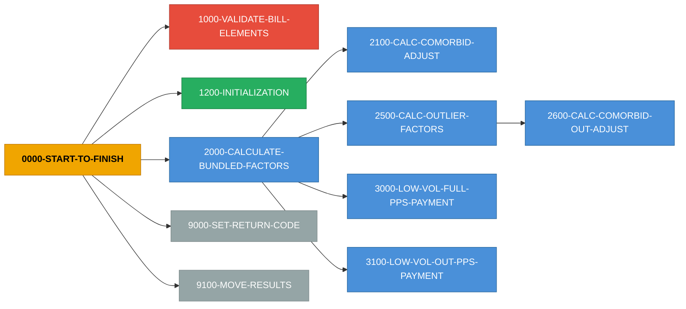

# Program Detail - Part 4/6

---

# COBOL Program: `ESCAL140`

**Source:** `ESCAL140`  
**Lines:** 1984 total / 1322 code / 543 comments

## Inter-Service Narrative (ISN)

> **ESCAL140 - 13 paragraphs, 48 return codes, 1 state flags, 3 external copybooks**

COBOL program `ESCAL140` orchestrates a 1-step business flow. It emits 47 distinct return-code value(s) across 48 assignment site(s), driven by 1 state-machine flag group(s). Depends on 3 external copybook(s): RTCCPY, BILLCPY, WAGECPY.

**Entry point:** `0000-PROCEDURE-START`

**Top decision points (most branched paragraphs):**

- `9000-SET-RETURN-CODE` - 32 branches - sets: PPS-RTC=17 when TRAINING-TRACK = "Y" THEN / PPS-RTC=16 when TRAINING-TRACK = "Y" THEN / PPS-RTC=15 when TRAINING-TRACK = "Y" THEN
- `1000-VALIDATE-BILL-ELEMENTS` - 29 branches - sets: PPS-RTC=52 when P-PROV-TYPE = '40' OR '41' OR '05' THEN NEXT SENTENCE / PPS-RTC=53 when P-SPEC-PYMT-IND NOT = '1' AND ' ' THEN / PPS-RTC=54 when (B-DOB-DATE = ZERO) OR (B-DOB-DATE NOT NUMERIC) THEN
- `2000-CALCULATE-BUNDLED-FACTORS` - 28 branches
- `2500-CALC-OUTLIER-FACTORS` - 28 branches
- `1200-INITIALIZATION` - 11 branches

**Return-code catalog (value -> emission sites):**

| RC | Sites | Variables | Sample condition |
|---|---|---|---|
| **02** | 1 | `PPS-RTC` | LOW-BMI-TRACK = "Y" THEN |
| **03** | 1 | `PPS-RTC` | ONSET-TRACK = "Y" THEN |
| **04** | 1 | `PPS-RTC` | ACUTE-COMORBID-TRACK = "Y" THEN |
| **05** | 1 | `PPS-RTC` | CHRONIC-COMORBID-TRACK = "Y" THEN |
| **06** | 1 | `PPS-RTC` | ACUTE-COMORBID-TRACK = "Y" THEN |
| **07** | 1 | `PPS-RTC` | CHRONIC-COMORBID-TRACK = "Y" THEN |
| **08** | 1 | `PPS-RTC` | ONSET-TRACK = "Y" THEN |
| **09** | 1 | `PPS-RTC` | ONSET-TRACK = "Y" THEN |
| **10** | 1 | `PPS-RTC` | ONSET-TRACK = "Y" THEN |
| **11** | 1 | `PPS-RTC` | ACUTE-COMORBID-TRACK = "Y" THEN |
| **12** | 1 | `PPS-RTC` | ACUTE-COMORBID-TRACK = "Y" THEN |
| **14** | 1 | `PPS-RTC` | TRAINING-TRACK = "Y" THEN |
| **15** | 1 | `PPS-RTC` | TRAINING-TRACK = "Y" THEN |
| **16** | 1 | `PPS-RTC` | TRAINING-TRACK = "Y" THEN |
| **17** | 1 | `PPS-RTC` | TRAINING-TRACK = "Y" THEN |
| **18** | 1 | `PPS-RTC` | ACUTE-COMORBID-TRACK = "Y" THEN |
| **19** | 1 | `PPS-RTC` | ACUTE-COMORBID-TRACK = "Y" THEN |
| **20** | 1 | `PPS-RTC` | ACUTE-COMORBID-TRACK = "Y" THEN |
| **21** | 1 | `PPS-RTC` | ACUTE-COMORBID-TRACK = "Y" THEN |
| **22** | 1 | `PPS-RTC` | ACUTE-COMORBID-TRACK = "Y" THEN |
| **23** | 1 | `PPS-RTC` | CHRONIC-COMORBID-TRACK = "Y" THEN |
| **24** | 1 | `PPS-RTC` | CHRONIC-COMORBID-TRACK = "Y" THEN |
| **25** | 1 | `PPS-RTC` | CHRONIC-COMORBID-TRACK = "Y" THEN |
| **26** | 1 | `PPS-RTC` | CHRONIC-COMORBID-TRACK = "Y" THEN |
| **27** | 1 | `PPS-RTC` | CHRONIC-COMORBID-TRACK = "Y" THEN |
| **28** | 1 | `PPS-RTC` | ONSET-TRACK = "Y" THEN |
| **29** | 1 | `PPS-RTC` | ACUTE-COMORBID-TRACK = "Y" THEN |
| **30** | 1 | `PPS-RTC` | ONSET-TRACK = "Y" THEN |
| **31** | 1 | `PPS-RTC` | LOW-BMI-TRACK = "Y" THEN |
| **32** | 1 | `PPS-RTC` | ONSET-TRACK = "Y" THEN |
| **33** | 1 | `PPS-RTC` | ACUTE-COMORBID-TRACK = "Y" THEN |
| **34** | 1 | `PPS-RTC` | CHRONIC-COMORBID-TRACK = "Y" THEN |
| **35** | 1 | `PPS-RTC` | ACUTE-COMORBID-TRACK = "Y" THEN |
| **52** | 1 | `PPS-RTC` | P-PROV-TYPE = '40' OR '41' OR '05' THEN NEXT SENTENCE |
| **53** | 2 | `PPS-RTC` | P-SPEC-PYMT-IND NOT = '1' AND ' ' THEN |
| **54** | 1 | `PPS-RTC` | (B-DOB-DATE = ZERO) OR (B-DOB-DATE NOT NUMERIC) THEN |
| **55** | 1 | `PPS-RTC` | (B-PATIENT-WGT = 0) OR (B-PATIENT-WGT NOT NUMERIC) |
| **56** | 1 | `PPS-RTC` | (B-PATIENT-HGT = 0) OR (B-PATIENT-HGT NOT NUMERIC) |
| **57** | 1 | `PPS-RTC` | B-REV-CODE = '0821' OR '0831' OR '0841' OR '0851' OR '0881' NEXT SENTENCE |
| **58** | 1 | `PPS-RTC` | B-COND-CODE NOT = '73' AND '74' AND ' ' |
| **71** | 1 | `PPS-RTC` | B-PATIENT-HGT > 300.00 |
| **72** | 1 | `PPS-RTC` | B-PATIENT-WGT > 500.00 THEN |
| **73** | 1 | `PPS-RTC` | (B-CLAIM-NUM-DIALYSIS-SESSIONS = ZERO) OR (B-CLAIM-NUM-DIALYSIS-SESSIONS NOT NU? |
| **74** | 1 | `PPS-RTC` | (B-LINE-ITEM-DATE-SERVICE = ZERO) OR (B-LINE-ITEM-DATE-SERVICE NOT NUMERIC) THEN |
| **75** | 1 | `PPS-RTC` | (B-DIALYSIS-START-DATE NOT NUMERIC) THEN |
| **76** | 1 | `PPS-RTC` | (B-TOT-PRICE-SB-OUTLIER NOT NUMERIC) THEN |
| **81** | 1 | `PPS-RTC` | (COMORBID-CWF-RETURN-CODE = SPACES) OR VALID-COMORBID-CWF-RETURN-CD THEN NEXT S? |

## Stats

- Paragraphs: **13**
- PERFORM/CALL edges: **13**
- COPY references: **3**
- WORKING-STORAGE items: **166**, LINKAGE items: **198**
- Return code assignments: **48**, State machines: **1**
- Cyclomatic complexity (est): **183**

## Business Rules (Magic Numbers)

**Total:** 154 rules (45 thresholds, 71 defaults)

| Type | Key | Value | Paragraph | Line |
|------|-----|-------|-----------|------|
| ?? threshold | `0000_start_to_finish.h_patient_age.threshold` | `18` | `0000-START-TO-FINISH` | 568 |
| ?????? default | `1000_validate_bill_elements.pps_rtc.default` | `52` | `1000-VALIDATE-BILL-ELEMENTS` | 589 |
| ?????? default | `1000_validate_bill_elements.pps_rtc.default` | `53` | `1000-VALIDATE-BILL-ELEMENTS` | 595 |
| ?????? default | `1000_validate_bill_elements.pps_rtc.default` | `54` | `1000-VALIDATE-BILL-ELEMENTS` | 601 |
| ?????? default | `1000_validate_bill_elements.pps_rtc.default` | `55` | `1000-VALIDATE-BILL-ELEMENTS` | 607 |
| ?????? default | `1000_validate_bill_elements.pps_rtc.default` | `56` | `1000-VALIDATE-BILL-ELEMENTS` | 613 |
| ?????? default | `1000_validate_bill_elements.pps_rtc.default` | `57` | `1000-VALIDATE-BILL-ELEMENTS` | 619 |
| ?????? default | `1000_validate_bill_elements.pps_rtc.default` | `58` | `1000-VALIDATE-BILL-ELEMENTS` | 628 |
| ?????? default | `1000_validate_bill_elements.pps_rtc.default` | `53` | `1000-VALIDATE-BILL-ELEMENTS` | 634 |
| ?? threshold | `1000_validate_bill_elements.b_patient_hgt.threshold` | `300.00` | `1000-VALIDATE-BILL-ELEMENTS` | 644 |
| ?????? default | `1000_validate_bill_elements.pps_rtc.default` | `71` | `1000-VALIDATE-BILL-ELEMENTS` | 644 |
| ?? threshold | `1000_validate_bill_elements.b_patient_wgt.threshold` | `500.00` | `1000-VALIDATE-BILL-ELEMENTS` | 650 |
| ?????? default | `1000_validate_bill_elements.pps_rtc.default` | `72` | `1000-VALIDATE-BILL-ELEMENTS` | 650 |
| ?????? default | `1000_validate_bill_elements.pps_rtc.default` | `73` | `1000-VALIDATE-BILL-ELEMENTS` | 661 |
| ?????? default | `1000_validate_bill_elements.pps_rtc.default` | `74` | `1000-VALIDATE-BILL-ELEMENTS` | 668 |
| ?????? default | `1000_validate_bill_elements.pps_rtc.default` | `75` | `1000-VALIDATE-BILL-ELEMENTS` | 675 |
| ?????? default | `1000_validate_bill_elements.pps_rtc.default` | `76` | `1000-VALIDATE-BILL-ELEMENTS` | 681 |
| ?????? default | `1000_validate_bill_elements.pps_rtc.default` | `81` | `1000-VALIDATE-BILL-ELEMENTS` | 687 |
| ?????? default | `1200_initialization.qip_reduction.default` | `1.000` | `1200-INITIALIZATION` | 704 |
| ?????? default | `1200_initialization.qip_reduction.default` | `0.995` | `1200-INITIALIZATION` | 704 |
| ?????? default | `1200_initialization.qip_reduction.default` | `0.990` | `1200-INITIALIZATION` | 704 |
| ?????? default | `1200_initialization.qip_reduction.default` | `0.985` | `1200-INITIALIZATION` | 704 |
| ?????? default | `1200_initialization.qip_reduction.default` | `0.980` | `1200-INITIALIZATION` | 704 |
| ?? threshold | `2000_calculate_bundled_factors.h_patient_age.threshold` | `13` | `2000-CALCULATE-BUNDLED-FACTORS` | 835 |
| ?? threshold | `2000_calculate_bundled_factors.h_patient_age.threshold` | `18` | `2000-CALCULATE-BUNDLED-FACTORS` | 835 |
| ?? threshold | `2000_calculate_bundled_factors.h_patient_age.threshold` | `45` | `2000-CALCULATE-BUNDLED-FACTORS` | 835 |
| ?? threshold | `2000_calculate_bundled_factors.h_patient_age.threshold` | `60` | `2000-CALCULATE-BUNDLED-FACTORS` | 835 |
| ?? threshold | `2000_calculate_bundled_factors.h_patient_age.threshold` | `70` | `2000-CALCULATE-BUNDLED-FACTORS` | 835 |
| ?? threshold | `2000_calculate_bundled_factors.h_patient_age.threshold` | `80` | `2000-CALCULATE-BUNDLED-FACTORS` | 835 |
| ?? constant | `2000_calculate_bundled_factors.h_bun_bsa__rounded.constant` | `.007184` | `2000-CALCULATE-BUNDLED-FACTORS` | 876 |

_... +124 more rules in `--extract-rules` output_

## Business Logic (Computed Values & Lookups)

_What this program actually calculates: 59 formulas/lookups/loops/call-params across 10 paragraphs._

### `0000-START-TO-FINISH`

- **INITIALIZE** `PPS-DATA-ALL` (L554)
- **INITIALIZE** `BILL-DATA-TEST` (L559)
- **INITIALIZE** `COND-CD-73` (L559)
- **COMPUTE** `H-PATIENT-AGE` = `B-THRU-CCYY - B-DOB-CCYY` (L568)
- **COMPUTE** `H-PATIENT-AGE` = `H-PATIENT-AGE - 1` (L568)

### `1200-INITIALIZATION`

- **INITIALIZE** `HOLD-COMP-RATE-PPS-COMPONENTS` (L697)
- **INITIALIZE** `HOLD-BUNDLED-PPS-COMPONENTS` (L698)
- **INITIALIZE** `HOLD-OUTLIER-PPS-COMPONENTS` (L699)
- **INITIALIZE** `PAID-RETURN-CODE-TRACKERS` (L700)
- **COMPUTE** `H-BUN-NAT-LABOR-AMT ROUNDED` = `(BUNDLED-BASE-PMT-RATE * BUN-NAT-LABOR-PCT) * BUN-CBSA-W-INDEX.` (L821)
- **COMPUTE** `H-BUN-NAT-NONLABOR-AMT ROUNDED` = `BUNDLED-BASE-PMT-RATE * BUN-NAT-NONLABOR-PCT` (L825)
- **COMPUTE** `H-BUN-BASE-WAGE-AMT ROUNDED` = `H-BUN-NAT-LABOR-AMT + H-BUN-NAT-NONLABOR-AMT.` (L825)

### `2000-CALCULATE-BUNDLED-FACTORS`

- **COMPUTE** `H-BUN-BSA  ROUNDED` = `(.007184 * (B-PATIENT-HGT ** .725) * (B-PATIENT-WGT ** .425))` (L876)
- **COMPUTE** `H-BUN-BSA-FACTOR  ROUNDED` = `CM-BSA ** ((H-BUN-BSA - 1.87) / .1)` (L876)
- **COMPUTE** `H-BUN-BMI  ROUNDED` = `(B-PATIENT-WGT / (B-PATIENT-HGT ** 2)) * 10000.` (L889)
- **COMPUTE** `INTEGER-LINE-ITEM-DATE` = `FUNCTION INTEGER-OF-DATE(THE-DATE)` (L902)
- **COMPUTE** `INTEGER-DIALYSIS-DATE` = `FUNCTION INTEGER-OF-DATE(THE-DATE)` (L902)
- **COMPUTE** `ONSET-DATE` = `(INTEGER-LINE-ITEM-DATE - INTEGER-DIALYSIS-DATE) + 1` (L902)
- **COMPUTE** `H-BUN-ADJUSTED-BASE-WAGE-AMT  ROUNDED` = `(H-BUN-BASE-WAGE-AMT * H-BUN-AGE-FACTOR)    * (H-BUN-BSA-FACTOR    * H-BUN-BMI-FACTOR)    * (H-BUN-ONSET-FACTOR  * H-BUN` (L992)
- **COMPUTE** `H-BUN-WAGE-ADJ-TRAINING-AMT  ROUNDED` = `TRAINING-ADD-ON-PMT-AMT * BUN-CBSA-W-INDEX` (L1002)

### `2100-CALC-COMORBID-ADJUST`

- **PERFORM** `` UNTIL SUB   >  6   OR   HIGH-COMORBID-FOUND (L1085)

### `2500-CALC-OUTLIER-FACTORS`

- **COMPUTE** `H-OUT-BSA  ROUNDED` = `(.007184 * (B-PATIENT-HGT ** .725) * (B-PATIENT-WGT ** .425))` (L1187)
- **COMPUTE** `H-OUT-BSA-FACTOR  ROUNDED` = `SB-BSA ** ((H-OUT-BSA - 1.87) / .1)` (L1187)
- **COMPUTE** `H-OUT-BMI  ROUNDED` = `(B-PATIENT-WGT / (B-PATIENT-HGT ** 2)) * 10000.` (L1200)
- **COMPUTE** `H-OUT-PREDICTED-SERVICES-MAP  ROUNDED` = `(H-OUT-AGE-FACTOR             * H-OUT-BSA-FACTOR             * H-OUT-BMI-FACTOR             * H-OUT-ONSET-FACTOR        ` (L1282)
- **COMPUTE** `H-OUT-CM-ADJ-PREDICT-MAP-TRT  ROUNDED` = `(H-OUT-PREDICTED-SERVICES-MAP * ADJ-AVG-MAP-AMT-LT-18)` (L1293)
- **COMPUTE** `H-OUT-CM-ADJ-PREDICT-MAP-TRT  ROUNDED` = `(H-OUT-PREDICTED-SERVICES-MAP * ADJ-AVG-MAP-AMT-GT-17)` (L1293)
- **COMPUTE** `H-HEMO-EQUIV-DIAL-SESSIONS  ROUNDED` = `((B-CLAIM-NUM-DIALYSIS-SESSIONS * 3) / 7)` (L1307)
- **COMPUTE** `H-OUT-IMPUTED-MAP  ROUNDED` = `(B-TOT-PRICE-SB-OUTLIER / H-HEMO-EQUIV-DIAL-SESSIONS)` (L1307)

### `2600-CALC-COMORBID-OUT-ADJUST`

- **PERFORM** `` UNTIL SUB   >  6   OR   HIGH-COMORBID-FOUND (L1372)

### `3000-LOW-VOL-FULL-PPS-PAYMENT`

- **COMPUTE** `H-LV-BUN-ADJUST-BASE-WAGE-AMT  ROUNDED` = `(H-BUN-BASE-WAGE-AMT * H-BUN-AGE-FACTOR)     * (H-BUN-BSA-FACTOR    * H-BUN-BMI-FACTOR)     * (H-BUN-ONSET-FACTOR  * H-B` (L1432)
- **COMPUTE** `H-BUN-WAGE-ADJ-TRAINING-AMT  ROUNDED` = `TRAINING-ADD-ON-PMT-AMT * BUN-CBSA-W-INDEX` (L1440)
- **COMPUTE** `H-CC-74-PER-DIEM-AMT  ROUNDED` = `(H-LV-BUN-ADJUST-BASE-WAGE-AMT * 3) / 7` (L1440)
- **COMPUTE** `H-LV-PPS-FINAL-PAY-AMT  ROUNDED` = `H-CC-74-PER-DIEM-AMT` (L1466)
- **COMPUTE** `H-LV-PPS-FINAL-PAY-AMT  ROUNDED` = `H-LV-BUN-ADJUST-BASE-WAGE-AMT + H-BUN-WAGE-ADJ-TRAINING-AMT` (L1466)

### `3100-LOW-VOL-OUT-PPS-PAYMENT`

- **COMPUTE** `H-LV-OUT-PREDICT-SERVICES-MAP  ROUNDED` = `(H-OUT-AGE-FACTOR             * H-OUT-BSA-FACTOR             * H-OUT-BMI-FACTOR             * H-OUT-ONSET-FACTOR        ` (L1483)
- **COMPUTE** `H-LV-OUT-CM-ADJ-PREDICT-M-TRT  ROUNDED` = `(H-LV-OUT-PREDICT-SERVICES-MAP * ADJ-AVG-MAP-AMT-LT-18)` (L1492)
- **COMPUTE** `H-LV-OUT-CM-ADJ-PREDICT-M-TRT  ROUNDED` = `(H-LV-OUT-PREDICT-SERVICES-MAP * ADJ-AVG-MAP-AMT-GT-17)` (L1492)
- **COMPUTE** `H-LV-OUT-PREDICTED-MAP  ROUNDED` = `H-LV-OUT-CM-ADJ-PREDICT-M-TRT + FIX-DOLLAR-LOSS-LT-18` (L1508)
- **COMPUTE** `H-LV-OUT-PAYMENT  ROUNDED` = `(H-OUT-IMPUTED-MAP  -  H-LV-OUT-PREDICTED-MAP)  * LOSS-SHARING-PCT-LT-18` (L1508)
- **COMPUTE** `H-LV-OUT-PREDICTED-MAP  ROUNDED` = `H-LV-OUT-CM-ADJ-PREDICT-M-TRT + FIX-DOLLAR-LOSS-GT-17` (L1508)
- **COMPUTE** `H-LV-OUT-PAYMENT  ROUNDED` = `(H-OUT-IMPUTED-MAP  -  H-LV-OUT-PREDICTED-MAP)  * LOSS-SHARING-PCT-GT-17` (L1508)
- **COMPUTE** `H-LV-OUT-PAYMENT ROUNDED` = `H-LV-OUT-PAYMENT * (((B-CLAIM-NUM-DIALYSIS-SESSIONS) * 3) / 7)` (L1535)

### `5000-CALC-COMP-RATE-FACTORS`

- **COMPUTE** `H-BSA  ROUNDED` = `(.007184 * (B-PATIENT-HGT ** .725) * (B-PATIENT-WGT ** .425))` (L1574)
- **COMPUTE** `H-BSA-FACTOR  ROUNDED` = `CR-BSA ** ((H-BSA - 1.87) / .1)` (L1574)
- **COMPUTE** `H-BMI  ROUNDED` = `(B-PATIENT-WGT / (B-PATIENT-HGT ** 2)) * 10000.` (L1587)
- **COMPUTE** `H-WAGE-ADJ-PYMT-AMT ROUNDED` = `(((H-PAYMENT-RATE * NAT-LABOR-PCT) * COM-CBSA-W-INDEX) + (H-PAYMENT-RATE * NAT-NONLABOR-PCT)) * CBSA-BLEND-PCT.` (L1613)
- **COMPUTE** `H-PYMT-AMT ROUNDED` = `(H-WAGE-ADJ-PYMT-AMT * H-BMI-FACTOR * H-BSA-FACTOR * CASE-MIX-BDGT-NEUT-FACTOR * H-AGE-FACTOR * DRUG-ADDON).` (L1618)
- **COMPUTE** `H-PYMT-AMT` = `H-PYMT-AMT + HEMO-PERI-CCPD-AMT` (L1630)
- **COMPUTE** `H-PYMT-AMT` = `H-PYMT-AMT + CAPD-AMT` (L1630)
- **COMPUTE** `H-PYMT-AMT ROUNDED` = `H-PYMT-AMT * CAPD-OR-CCPD-FACTOR` (L1630)

### `9100-MOVE-RESULTS`

- **COMPUTE** `H-OUT-PAYMENT ROUNDED` = `H-OUT-PAYMENT / B-CLAIM-NUM-DIALYSIS-SESSIONS` (L1875)
- **COMPUTE** `PPS-2011-BLEND-COMP-RATE    ROUNDED` = `H-PYMT-AMT              *  COM-CBSA-BLEND-PCT` (L1881)
- **COMPUTE** `PPS-2011-BLEND-PPS-RATE     ROUNDED` = `H-PPS-FINAL-PAY-AMT     *  BUN-CBSA-BLEND-PCT` (L1881)
- **COMPUTE** `PPS-2011-BLEND-OUTLIER-RATE ROUNDED` = `H-OUT-PAYMENT           *  BUN-CBSA-BLEND-PCT` (L1881)
- **COMPUTE** `PPS-2011-BLEND-COMP-RATE    ROUNDED` = `PPS-2011-BLEND-COMP-RATE    *  QIP-REDUCTION` (L1905)
- **COMPUTE** `PPS-2011-FULL-COMP-RATE     ROUNDED` = `PPS-2011-FULL-COMP-RATE     *  QIP-REDUCTION` (L1905)
- **COMPUTE** `PPS-2011-BLEND-PPS-RATE     ROUNDED` = `PPS-2011-BLEND-PPS-RATE     *  QIP-REDUCTION` (L1905)
- **COMPUTE** `PPS-2011-FULL-PPS-RATE      ROUNDED` = `PPS-2011-FULL-PPS-RATE      *  QIP-REDUCTION` (L1905)

## Copybooks

- `RTCCPY`
- `BILLCPY`
- `WAGECPY`

## Paragraphs (Action Graph)

| Paragraph | Lines | PERFORM | CALL | GO TO | IF | RC set |
|---|---|---|---|---|---|---|
| `0000-PROCEDURE-START` | 526-552 | 0 | 0 | 0 | 0 | 0 |
| `0000-START-TO-FINISH` | 553-587 | 6 | 0 | 0 | 5 | 0 |
| `1000-VALIDATE-BILL-ELEMENTS` | 588-695 | 0 | 0 | 0 | 29 | 15 |
| `1200-INITIALIZATION` | 696-830 | 0 | 0 | 0 | 11 | 0 |
| `2000-CALCULATE-BUNDLED-FACTORS` | 831-1072 | 4 | 0 | 0 | 28 | 0 |
| `2100-CALC-COMORBID-ADJUST` | 1073-1141 | 1 | 0 | 0 | 11 | 0 |
| `2500-CALC-OUTLIER-FACTORS` | 1142-1358 | 1 | 0 | 0 | 28 | 0 |
| `2600-CALC-COMORBID-OUT-ADJUST` | 1359-1428 | 1 | 0 | 0 | 11 | 0 |
| `3000-LOW-VOL-FULL-PPS-PAYMENT` | 1429-1479 | 0 | 0 | 0 | 4 | 0 |
| `3100-LOW-VOL-OUT-PPS-PAYMENT` | 1480-1543 | 0 | 0 | 0 | 5 | 0 |
| `5000-CALC-COMP-RATE-FACTORS` | 1544-1655 | 0 | 0 | 0 | 11 | 0 |
| `9000-SET-RETURN-CODE` | 1656-1836 | 0 | 0 | 0 | 32 | 33 |
| `9100-MOVE-RESULTS` | 1837-1984 | 0 | 0 | 0 | 6 | 0 |

## Execution Logic Summary (ELS)

_Auto-generated narrative per paragraph - what each routine does, which branches it evaluates, and which side effects it produces._

### `0000-PROCEDURE-START` (L526-552)

Main control routine - leaf logic block.


### `0000-START-TO-FINISH` (L553-587)

Main control routine - orchestrates 1000-VALIDATE-BILL-ELEMENTS, 1200-INITIALIZATION, 2000-CALCULATE-BUNDLED-FACTORS, 5000-CALC-COMP-RATE-FACTORS (+2 more). Contains 5 IF/branchs.

- **Calls:** `1000-VALIDATE-BILL-ELEMENTS`, `1200-INITIALIZATION`, `2000-CALCULATE-BUNDLED-FACTORS`, `5000-CALC-COMP-RATE-FACTORS`, `9000-SET-RETURN-CODE`, `9100-MOVE-RESULTS`

### `1000-VALIDATE-BILL-ELEMENTS` (L588-695)

Validation routine - assigns return codes based on input state. Contains 29 IF/branchs. Sets: PPS-RTC=52 when P-PROV-TYPE = '40' OR '41' OR '05' THEN NEXT SENTENCE; PPS-RTC=53 when P-SPEC-PYMT-IND NOT = '1' AND ' ' THEN; PPS-RTC=54 when (B-DOB-DATE = ZERO) OR (B-DOB-DATE NOT NUMERIC) THEN (+12 more).

- **Side effects:**
  - PPS-RTC=52 when P-PROV-TYPE = '40' OR '41' OR '05' THEN NEXT SENTENCE
  - PPS-RTC=53 when P-SPEC-PYMT-IND NOT = '1' AND ' ' THEN
  - PPS-RTC=54 when (B-DOB-DATE = ZERO) OR (B-DOB-DATE NOT NUMERIC) THEN
  - PPS-RTC=55 when (B-PATIENT-WGT = 0) OR (B-PATIENT-WGT NOT NUMERIC)
  - PPS-RTC=56 when (B-PATIENT-HGT = 0) OR (B-PATIENT-HGT NOT NUMERIC)
  - PPS-RTC=57 when B-REV-CODE = '0821' OR '0831' OR '0841' OR '0851' OR '0881' NEXT SENT?
  - PPS-RTC=58 when B-COND-CODE NOT = '73' AND '74' AND ' '
  - PPS-RTC=53 when P-QIP-REDUCTION NOT = '1' AND '2' AND '3' AND '4' AND ' ' THEN
  - PPS-RTC=71 when B-PATIENT-HGT > 300.00
  - PPS-RTC=72 when B-PATIENT-WGT > 500.00 THEN
  - PPS-RTC=73 when (B-CLAIM-NUM-DIALYSIS-SESSIONS = ZERO) OR (B-CLAIM-NUM-DIALYSIS-SESSI?
  - PPS-RTC=74 when (B-LINE-ITEM-DATE-SERVICE = ZERO) OR (B-LINE-ITEM-DATE-SERVICE NOT NU?
  - PPS-RTC=75 when (B-DIALYSIS-START-DATE NOT NUMERIC) THEN
  - PPS-RTC=76 when (B-TOT-PRICE-SB-OUTLIER NOT NUMERIC) THEN
  - PPS-RTC=81 when (COMORBID-CWF-RETURN-CODE = SPACES) OR VALID-COMORBID-CWF-RETURN-CD T?

### `1200-INITIALIZATION` (L696-830)

Initialization routine - evaluates 11 branch conditions. Contains 11 IF/branchs.


### `2000-CALCULATE-BUNDLED-FACTORS` (L831-1072)

Calculation routine - orchestrates 2100-CALC-COMORBID-ADJUST, 2500-CALC-OUTLIER-FACTORS, 3000-LOW-VOL-FULL-PPS-PAYMENT, 3100-LOW-VOL-OUT-PPS-PAYMENT. Contains 28 IF/branchs.

- **Calls:** `2100-CALC-COMORBID-ADJUST`, `2500-CALC-OUTLIER-FACTORS`, `3000-LOW-VOL-FULL-PPS-PAYMENT`, `3100-LOW-VOL-OUT-PPS-PAYMENT`

### `2100-CALC-COMORBID-ADJUST` (L1073-1141)

Calculation routine - orchestrates . Contains 11 IF/branchs.

- **Calls:** ``

### `2500-CALC-OUTLIER-FACTORS` (L1142-1358)

Calculation routine - orchestrates 2600-CALC-COMORBID-OUT-ADJUST. Contains 28 IF/branchs.

- **Calls:** `2600-CALC-COMORBID-OUT-ADJUST`

### `2600-CALC-COMORBID-OUT-ADJUST` (L1359-1428)

Calculation routine - orchestrates . Contains 11 IF/branchs.

- **Calls:** ``

### `3000-LOW-VOL-FULL-PPS-PAYMENT` (L1429-1479)

Business routine - evaluates 4 branch conditions. Contains 4 IF/branchs.


### `3100-LOW-VOL-OUT-PPS-PAYMENT` (L1480-1543)

Business routine - evaluates 5 branch conditions. Contains 5 IF/branchs.


### `5000-CALC-COMP-RATE-FACTORS` (L1544-1655)

Calculation routine - evaluates 11 branch conditions. Contains 11 IF/branchs.


### `9000-SET-RETURN-CODE` (L1656-1836)

Business routine - assigns return codes based on input state. Contains 32 IF/branchs. Sets: PPS-RTC=17 when TRAINING-TRACK = "Y" THEN; PPS-RTC=16 when TRAINING-TRACK = "Y" THEN; PPS-RTC=15 when TRAINING-TRACK = "Y" THEN (+30 more).

- **Side effects:**
  - PPS-RTC=17 when TRAINING-TRACK = "Y" THEN
  - PPS-RTC=16 when TRAINING-TRACK = "Y" THEN
  - PPS-RTC=15 when TRAINING-TRACK = "Y" THEN
  - PPS-RTC=14 when TRAINING-TRACK = "Y" THEN
  - PPS-RTC=24 when CHRONIC-COMORBID-TRACK = "Y" THEN
  - PPS-RTC=19 when ACUTE-COMORBID-TRACK = "Y" THEN
  - PPS-RTC=29 when ACUTE-COMORBID-TRACK = "Y" THEN
  - PPS-RTC=23 when CHRONIC-COMORBID-TRACK = "Y" THEN
  - PPS-RTC=18 when ACUTE-COMORBID-TRACK = "Y" THEN
  - PPS-RTC=30 when ONSET-TRACK = "Y" THEN
  - PPS-RTC=28 when ONSET-TRACK = "Y" THEN
  - PPS-RTC=34 when CHRONIC-COMORBID-TRACK = "Y" THEN
  - PPS-RTC=35 when ACUTE-COMORBID-TRACK = "Y" THEN
  - PPS-RTC=33 when ACUTE-COMORBID-TRACK = "Y" THEN
  - PPS-RTC=07 when CHRONIC-COMORBID-TRACK = "Y" THEN
  - PPS-RTC=06 when ACUTE-COMORBID-TRACK = "Y" THEN
  - PPS-RTC=09 when ONSET-TRACK = "Y" THEN
  - PPS-RTC=03 when ONSET-TRACK = "Y" THEN
  - PPS-RTC=26 when CHRONIC-COMORBID-TRACK = "Y" THEN
  - PPS-RTC=21 when ACUTE-COMORBID-TRACK = "Y" THEN
  - PPS-RTC=12 when ACUTE-COMORBID-TRACK = "Y" THEN
  - PPS-RTC=25 when CHRONIC-COMORBID-TRACK = "Y" THEN
  - PPS-RTC=20 when ACUTE-COMORBID-TRACK = "Y" THEN
  - PPS-RTC=32 when ONSET-TRACK = "Y" THEN
  - PPS-RTC=10 when ONSET-TRACK = "Y" THEN
  - PPS-RTC=27 when CHRONIC-COMORBID-TRACK = "Y" THEN
  - PPS-RTC=22 when ACUTE-COMORBID-TRACK = "Y" THEN
  - PPS-RTC=11 when ACUTE-COMORBID-TRACK = "Y" THEN
  - PPS-RTC=08 when ONSET-TRACK = "Y" THEN
  - PPS-RTC=04 when ACUTE-COMORBID-TRACK = "Y" THEN
  - PPS-RTC=05 when CHRONIC-COMORBID-TRACK = "Y" THEN
  - PPS-RTC=31 when LOW-BMI-TRACK = "Y" THEN
  - PPS-RTC=02 when LOW-BMI-TRACK = "Y" THEN

### `9100-MOVE-RESULTS` (L1837-1984)

Business routine - evaluates 6 branch conditions. Contains 6 IF/branchs.


## TSB Risk Metric Summary (Technical & Structural Breakdown Risk)

**Average risk:** [W] 48 / 100 (MEDIUM)  
**Max paragraph risk:** [E] 100 / 100 (CRITICAL)  
**Distribution:** 4 CRITICAL ?. 0 HIGH ?. 5 MEDIUM ?. 4 LOW (of 13 paragraphs)

### Top 10 risky paragraphs

| Paragraph | Lines | Score | Category | Top factors |
|---|---|---|---|---|
| `1000-VALIDATE-BILL-ELEMENTS` | 588-695 | **100** | [E] CRITICAL | 29 IF/EVAL branches, 15 return-code emissions, 107 lines (size penalty) |
| `2000-CALCULATE-BUNDLED-FACTORS` | 831-1072 | **100** | [E] CRITICAL | 28 IF/EVAL branches, 241 lines (size penalty), 4 PERFORM calls |
| `2500-CALC-OUTLIER-FACTORS` | 1142-1358 | **100** | [E] CRITICAL | 28 IF/EVAL branches, 216 lines (size penalty), 1 PERFORM calls |
| `9000-SET-RETURN-CODE` | 1656-1836 | **100** | [E] CRITICAL | 33 return-code emissions, 32 IF/EVAL branches, 180 lines (size penalty) |
| `1200-INITIALIZATION` | 696-830 | **43** | [W] MEDIUM | 11 IF/EVAL branches, 134 lines (size penalty) |
| `5000-CALC-COMP-RATE-FACTORS` | 1544-1655 | **43** | [W] MEDIUM | 11 IF/EVAL branches, 111 lines (size penalty) |
| `2100-CALC-COMORBID-ADJUST` | 1073-1141 | **34** | [W] MEDIUM | 11 IF/EVAL branches, 1 PERFORM calls |
| `2600-CALC-COMORBID-OUT-ADJUST` | 1359-1428 | **34** | [W] MEDIUM | 11 IF/EVAL branches, 1 PERFORM calls |
| `9100-MOVE-RESULTS` | 1837-1984 | **28** | [W] MEDIUM | 6 IF/EVAL branches, 147 lines (size penalty) |
| `0000-START-TO-FINISH` | 553-587 | **21** | [OK] LOW | 5 IF/EVAL branches, 6 PERFORM calls |

## Issues

- [W] **WARNING**  `escal140.cbl:L553`: Potential state leak: Flag `PEDIATRIC-TRACK` is set to 'Y' in paragraph `0000-START-TO-FINISH` but is never reset to 'N' or INITIALIZEd here. Subsequent paragraph calls will reuse the dirty state.
- [W] **WARNING**  `escal140.cbl:L553`: Potential state leak: Flag `P-PROV-WAIVE-BLEND-PAY-INDIC` is set to 'Y' in paragraph `0000-START-TO-FINISH` but is never reset to 'N' or INITIALIZEd here. Subsequent paragraph calls will reuse the dirty state.
- [W] **WARNING**  `escal140.cbl:L696`: Potential state leak: Flag `MOVED-CORMORBIDS` is set to 'Y' in paragraph `1200-INITIALIZATION` but is never reset to 'N' or INITIALIZEd here. Subsequent paragraph calls will reuse the dirty state.
- [W] **WARNING**  `escal140.cbl:L831`: Potential state leak: Flag `ONSET-TRACK` is set to 'Y' in paragraph `2000-CALCULATE-BUNDLED-FACTORS` but is never reset to 'N' or INITIALIZEd here. Subsequent paragraph calls will reuse the dirty state.
- [W] **WARNING**  `escal140.cbl:L831`: Potential state leak: Flag `LOW-BMI-TRACK` is set to 'Y' in paragraph `2000-CALCULATE-BUNDLED-FACTORS` but is never reset to 'N' or INITIALIZEd here. Subsequent paragraph calls will reuse the dirty state.
- [W] **WARNING**  `escal140.cbl:L831`: Potential state leak: Flag `H-BUN-ONSET-FACTOR` is set to 'Y' in paragraph `2000-CALCULATE-BUNDLED-FACTORS` but is never reset to 'N' or INITIALIZEd here. Subsequent paragraph calls will reuse the dirty state.
- [W] **WARNING**  `escal140.cbl:L831`: Potential state leak: Flag `LOW-VOLUME-TRACK` is set to 'Y' in paragraph `2000-CALCULATE-BUNDLED-FACTORS` but is never reset to 'N' or INITIALIZEd here. Subsequent paragraph calls will reuse the dirty state.
- [W] **WARNING**  `escal140.cbl:L831`: Potential state leak: Flag `TRAINING-TRACK` is set to 'Y' in paragraph `2000-CALCULATE-BUNDLED-FACTORS` but is never reset to 'N' or INITIALIZEd here. Subsequent paragraph calls will reuse the dirty state.
- [W] **WARNING**  `escal140.cbl:L1073`: Potential state leak: Flag `CHRONIC-COMORBID-TRACK` is set to 'Y' in paragraph `2100-CALC-COMORBID-ADJUST` but is never reset to 'N' or INITIALIZEd here. Subsequent paragraph calls will reuse the dirty state.
- [W] **WARNING**  `escal140.cbl:L1073`: Potential state leak: Flag `ACUTE-COMORBID-TRACK` is set to 'Y' in paragraph `2100-CALC-COMORBID-ADJUST` but is never reset to 'N' or INITIALIZEd here. Subsequent paragraph calls will reuse the dirty state.
- [W] **WARNING**  `escal140.cbl:L1142`: Potential state leak: Flag `H-OUT-ONSET-FACTOR` is set to 'Y' in paragraph `2500-CALC-OUTLIER-FACTORS` but is never reset to 'N' or INITIALIZEd here. Subsequent paragraph calls will reuse the dirty state.
- [W] **WARNING**  `escal140.cbl:L1142`: Potential state leak: Flag `OUTLIER-TRACK` is set to 'Y' in paragraph `2500-CALC-OUTLIER-FACTORS` but is never reset to 'N' or INITIALIZEd here. Subsequent paragraph calls will reuse the dirty state.
- [W] **WARNING**  `escal140.cbl:L1142`: Potential state leak: Flag `LOW-VOLUME-TRACK` is set to 'Y' in paragraph `2500-CALC-OUTLIER-FACTORS` but is never reset to 'N' or INITIALIZEd here. Subsequent paragraph calls will reuse the dirty state.
- [W] **WARNING**  `escal140.cbl:L1142`: Potential state leak: Flag `H-OUT-LOW-VOL-MULTIPLIER` is set to 'Y' in paragraph `2500-CALC-OUTLIER-FACTORS` but is never reset to 'N' or INITIALIZEd here. Subsequent paragraph calls will reuse the dirty state.
- [W] **WARNING**  `escal140.cbl:L1359`: Potential state leak: Flag `ACUTE-COMORBID-TRACK` is set to 'Y' in paragraph `2600-CALC-COMORBID-OUT-ADJUST` but is never reset to 'N' or INITIALIZEd here. Subsequent paragraph calls will reuse the dirty state.
- [W] **WARNING**  `escal140.cbl:L1359`: Potential state leak: Flag `CHRONIC-COMORBID-TRACK` is set to 'Y' in paragraph `2600-CALC-COMORBID-OUT-ADJUST` but is never reset to 'N' or INITIALIZEd here. Subsequent paragraph calls will reuse the dirty state.
- [W] **WARNING**  `escal140.cbl:L1429`: Potential state leak: Flag `TRAINING-TRACK` is set to 'Y' in paragraph `3000-LOW-VOL-FULL-PPS-PAYMENT` but is never reset to 'N' or INITIALIZEd here. Subsequent paragraph calls will reuse the dirty state.

> **Call Graph:** Structure identical to `ESCAL122` - diagram not repeated.


## Call Graph Edges

```
          0000-START-TO-FINISH  --PERFORM-->  1000-VALIDATE-BILL-ELEMENTS (L566)
          0000-START-TO-FINISH  --PERFORM-->  1200-INITIALIZATION (L568)
          0000-START-TO-FINISH  --PERFORM-->  2000-CALCULATE-BUNDLED-FACTORS (L568)
          0000-START-TO-FINISH  --PERFORM-->  5000-CALC-COMP-RATE-FACTORS (L568)
          0000-START-TO-FINISH  --PERFORM-->  9000-SET-RETURN-CODE (L568)
          0000-START-TO-FINISH  --PERFORM-->  9100-MOVE-RESULTS (L568)
2000-CALCULATE-BUNDLED-FACTORS  --PERFORM-->  2100-CALC-COMORBID-ADJUST (L930)
2000-CALCULATE-BUNDLED-FACTORS  --PERFORM-->  2500-CALC-OUTLIER-FACTORS (L1045)
2000-CALCULATE-BUNDLED-FACTORS  --PERFORM-->  3000-LOW-VOL-FULL-PPS-PAYMENT (L1050)
2000-CALCULATE-BUNDLED-FACTORS  --PERFORM-->  3100-LOW-VOL-OUT-PPS-PAYMENT (L1050)
     2100-CALC-COMORBID-ADJUST  --PERFORM-->   (L1085)
     2500-CALC-OUTLIER-FACTORS  --PERFORM-->  2600-CALC-COMORBID-OUT-ADJUST (L1229)
 2600-CALC-COMORBID-OUT-ADJUST  --PERFORM-->   (L1372)
```

## Return Codes (Trigger Summary)

| Paragraph | Line | RC Var | Value | Condition |
|---|---|---|---|---|
| `1000-VALIDATE-BILL-ELEMENTS` | 589 | `PPS-RTC` | **52** | P-PROV-TYPE = '40'  OR  '41' OR '05'  THEN NEXT SENTENCE |
| `1000-VALIDATE-BILL-ELEMENTS` | 595 | `PPS-RTC` | **53** | P-SPEC-PYMT-IND NOT = '1' AND ' '  THEN |
| `1000-VALIDATE-BILL-ELEMENTS` | 601 | `PPS-RTC` | **54** | (B-DOB-DATE = ZERO)  OR  (B-DOB-DATE NOT NUMERIC)  THEN |
| `1000-VALIDATE-BILL-ELEMENTS` | 607 | `PPS-RTC` | **55** | (B-PATIENT-WGT = 0)  OR  (B-PATIENT-WGT NOT NUMERIC) |
| `1000-VALIDATE-BILL-ELEMENTS` | 613 | `PPS-RTC` | **56** | (B-PATIENT-HGT = 0)  OR  (B-PATIENT-HGT NOT NUMERIC) |
| `1000-VALIDATE-BILL-ELEMENTS` | 619 | `PPS-RTC` | **57** | B-REV-CODE  = '0821' OR '0831' OR '0841' OR '0851' OR '0881' NEXT SENTENCE |
| `1000-VALIDATE-BILL-ELEMENTS` | 628 | `PPS-RTC` | **58** | B-COND-CODE NOT = '73' AND '74' AND '  ' |
| `1000-VALIDATE-BILL-ELEMENTS` | 634 | `PPS-RTC` | **53** | P-QIP-REDUCTION NOT = '1' AND '2' AND '3' AND '4' AND ' '  THEN |
| `1000-VALIDATE-BILL-ELEMENTS` | 644 | `PPS-RTC` | **71** | B-PATIENT-HGT > 300.00 |
| `1000-VALIDATE-BILL-ELEMENTS` | 650 | `PPS-RTC` | **72** | B-PATIENT-WGT > 500.00  THEN |
| `1000-VALIDATE-BILL-ELEMENTS` | 661 | `PPS-RTC` | **73** | (B-CLAIM-NUM-DIALYSIS-SESSIONS = ZERO) OR (B-CLAIM-NUM-DIALYSIS-SESSIONS NOT NUM |
| `1000-VALIDATE-BILL-ELEMENTS` | 668 | `PPS-RTC` | **74** | (B-LINE-ITEM-DATE-SERVICE = ZERO) OR (B-LINE-ITEM-DATE-SERVICE NOT NUMERIC)  THE |
| `1000-VALIDATE-BILL-ELEMENTS` | 675 | `PPS-RTC` | **75** | (B-DIALYSIS-START-DATE NOT NUMERIC)  THEN |
| `1000-VALIDATE-BILL-ELEMENTS` | 681 | `PPS-RTC` | **76** | (B-TOT-PRICE-SB-OUTLIER NOT NUMERIC) THEN |
| `1000-VALIDATE-BILL-ELEMENTS` | 687 | `PPS-RTC` | **81** | (COMORBID-CWF-RETURN-CODE = SPACES) OR VALID-COMORBID-CWF-RETURN-CD       THEN N |
| `9000-SET-RETURN-CODE` | 1707 | `PPS-RTC` | **17** | TRAINING-TRACK                  = "Y"  THEN |
| `9000-SET-RETURN-CODE` | 1707 | `PPS-RTC` | **16** | TRAINING-TRACK                  = "Y"  THEN |
| `9000-SET-RETURN-CODE` | 1707 | `PPS-RTC` | **15** | TRAINING-TRACK                  = "Y"  THEN |
| `9000-SET-RETURN-CODE` | 1707 | `PPS-RTC` | **14** | TRAINING-TRACK                  = "Y"  THEN |
| `9000-SET-RETURN-CODE` | 1707 | `PPS-RTC` | **24** | CHRONIC-COMORBID-TRACK    = "Y"  THEN |
| `9000-SET-RETURN-CODE` | 1707 | `PPS-RTC` | **19** | ACUTE-COMORBID-TRACK   = "Y"  THEN |
| `9000-SET-RETURN-CODE` | 1707 | `PPS-RTC` | **29** | ACUTE-COMORBID-TRACK   = "Y"  THEN |
| `9000-SET-RETURN-CODE` | 1707 | `PPS-RTC` | **23** | CHRONIC-COMORBID-TRACK    = "Y"  THEN |
| `9000-SET-RETURN-CODE` | 1707 | `PPS-RTC` | **18** | ACUTE-COMORBID-TRACK   = "Y"  THEN |
| `9000-SET-RETURN-CODE` | 1707 | `PPS-RTC` | **30** | ONSET-TRACK         = "Y"  THEN |
| `9000-SET-RETURN-CODE` | 1707 | `PPS-RTC` | **28** | ONSET-TRACK         = "Y"  THEN |
| `9000-SET-RETURN-CODE` | 1707 | `PPS-RTC` | **34** | CHRONIC-COMORBID-TRACK    = "Y"  THEN |
| `9000-SET-RETURN-CODE` | 1707 | `PPS-RTC` | **35** | ACUTE-COMORBID-TRACK   = "Y"  THEN |
| `9000-SET-RETURN-CODE` | 1707 | `PPS-RTC` | **33** | ACUTE-COMORBID-TRACK   = "Y"  THEN |
| `9000-SET-RETURN-CODE` | 1707 | `PPS-RTC` | **07** | CHRONIC-COMORBID-TRACK    = "Y"  THEN |
| `9000-SET-RETURN-CODE` | 1707 | `PPS-RTC` | **06** | ACUTE-COMORBID-TRACK   = "Y"  THEN |
| `9000-SET-RETURN-CODE` | 1707 | `PPS-RTC` | **09** | ONSET-TRACK         = "Y"  THEN |
| `9000-SET-RETURN-CODE` | 1707 | `PPS-RTC` | **03** | ONSET-TRACK         = "Y"  THEN |
| `9000-SET-RETURN-CODE` | 1707 | `PPS-RTC` | **26** | CHRONIC-COMORBID-TRACK    = "Y"  THEN |
| `9000-SET-RETURN-CODE` | 1707 | `PPS-RTC` | **21** | ACUTE-COMORBID-TRACK   = "Y"  THEN |
| `9000-SET-RETURN-CODE` | 1707 | `PPS-RTC` | **12** | ACUTE-COMORBID-TRACK   = "Y"  THEN |
| `9000-SET-RETURN-CODE` | 1707 | `PPS-RTC` | **25** | CHRONIC-COMORBID-TRACK    = "Y"  THEN |
| `9000-SET-RETURN-CODE` | 1707 | `PPS-RTC` | **20** | ACUTE-COMORBID-TRACK   = "Y"  THEN |
| `9000-SET-RETURN-CODE` | 1707 | `PPS-RTC` | **32** | ONSET-TRACK         = "Y"  THEN |
| `9000-SET-RETURN-CODE` | 1707 | `PPS-RTC` | **10** | ONSET-TRACK         = "Y"  THEN |
| `9000-SET-RETURN-CODE` | 1707 | `PPS-RTC` | **27** | CHRONIC-COMORBID-TRACK    = "Y"  THEN |
| `9000-SET-RETURN-CODE` | 1707 | `PPS-RTC` | **22** | ACUTE-COMORBID-TRACK   = "Y"  THEN |
| `9000-SET-RETURN-CODE` | 1707 | `PPS-RTC` | **11** | ACUTE-COMORBID-TRACK   = "Y"  THEN |
| `9000-SET-RETURN-CODE` | 1707 | `PPS-RTC` | **08** | ONSET-TRACK               = "Y"  THEN |
| `9000-SET-RETURN-CODE` | 1707 | `PPS-RTC` | **04** | ACUTE-COMORBID-TRACK   = "Y"  THEN |
| `9000-SET-RETURN-CODE` | 1707 | `PPS-RTC` | **05** | CHRONIC-COMORBID-TRACK = "Y"  THEN |
| `9000-SET-RETURN-CODE` | 1707 | `PPS-RTC` | **31** | LOW-BMI-TRACK = "Y"  THEN |
| `9000-SET-RETURN-CODE` | 1707 | `PPS-RTC` | **02** | LOW-BMI-TRACK = "Y"  THEN |

## State Machines (88-level)

### `IS-HIGH-COMORBID-FOUND`

- **'Y'** = HIGH-COMORBID-FOUND (L365)

---

# COBOL Program: `ESCAL151`

**Source:** `ESCAL151`  
**Lines:** 2017 total / 1322 code / 576 comments

## Inter-Service Narrative (ISN)

> **ESCAL151 - 13 paragraphs, 48 return codes, 1 state flags, 3 external copybooks**

COBOL program `ESCAL151` orchestrates a 1-step business flow. It emits 47 distinct return-code value(s) across 48 assignment site(s), driven by 1 state-machine flag group(s). Depends on 3 external copybook(s): RTCCPY, BILLCPY, WAGECPY.

**Entry point:** `0000-PROCEDURE-START`

**Top decision points (most branched paragraphs):**

- `9000-SET-RETURN-CODE` - 32 branches - sets: PPS-RTC=17 when TRAINING-TRACK = "Y" THEN / PPS-RTC=16 when TRAINING-TRACK = "Y" THEN / PPS-RTC=15 when TRAINING-TRACK = "Y" THEN
- `1000-VALIDATE-BILL-ELEMENTS` - 29 branches - sets: PPS-RTC=52 when P-PROV-TYPE = '40' OR '41' OR '05' THEN NEXT SENTENCE / PPS-RTC=53 when P-SPEC-PYMT-IND NOT = '1' AND ' ' THEN / PPS-RTC=54 when (B-DOB-DATE = ZERO) OR (B-DOB-DATE NOT NUMERIC) THEN
- `2000-CALCULATE-BUNDLED-FACTORS` - 28 branches
- `2500-CALC-OUTLIER-FACTORS` - 28 branches
- `1200-INITIALIZATION` - 11 branches

**Return-code catalog (value -> emission sites):**

| RC | Sites | Variables | Sample condition |
|---|---|---|---|
| **02** | 1 | `PPS-RTC` | LOW-BMI-TRACK = "Y" THEN |
| **03** | 1 | `PPS-RTC` | ONSET-TRACK = "Y" THEN |
| **04** | 1 | `PPS-RTC` | ACUTE-COMORBID-TRACK = "Y" THEN |
| **05** | 1 | `PPS-RTC` | CHRONIC-COMORBID-TRACK = "Y" THEN |
| **06** | 1 | `PPS-RTC` | ACUTE-COMORBID-TRACK = "Y" THEN |
| **07** | 1 | `PPS-RTC` | CHRONIC-COMORBID-TRACK = "Y" THEN |
| **08** | 1 | `PPS-RTC` | ONSET-TRACK = "Y" THEN |
| **09** | 1 | `PPS-RTC` | ONSET-TRACK = "Y" THEN |
| **10** | 1 | `PPS-RTC` | ONSET-TRACK = "Y" THEN |
| **11** | 1 | `PPS-RTC` | ACUTE-COMORBID-TRACK = "Y" THEN |
| **12** | 1 | `PPS-RTC` | ACUTE-COMORBID-TRACK = "Y" THEN |
| **14** | 1 | `PPS-RTC` | TRAINING-TRACK = "Y" THEN |
| **15** | 1 | `PPS-RTC` | TRAINING-TRACK = "Y" THEN |
| **16** | 1 | `PPS-RTC` | TRAINING-TRACK = "Y" THEN |
| **17** | 1 | `PPS-RTC` | TRAINING-TRACK = "Y" THEN |
| **18** | 1 | `PPS-RTC` | ACUTE-COMORBID-TRACK = "Y" THEN |
| **19** | 1 | `PPS-RTC` | ACUTE-COMORBID-TRACK = "Y" THEN |
| **20** | 1 | `PPS-RTC` | ACUTE-COMORBID-TRACK = "Y" THEN |
| **21** | 1 | `PPS-RTC` | ACUTE-COMORBID-TRACK = "Y" THEN |
| **22** | 1 | `PPS-RTC` | ACUTE-COMORBID-TRACK = "Y" THEN |
| **23** | 1 | `PPS-RTC` | CHRONIC-COMORBID-TRACK = "Y" THEN |
| **24** | 1 | `PPS-RTC` | CHRONIC-COMORBID-TRACK = "Y" THEN |
| **25** | 1 | `PPS-RTC` | CHRONIC-COMORBID-TRACK = "Y" THEN |
| **26** | 1 | `PPS-RTC` | CHRONIC-COMORBID-TRACK = "Y" THEN |
| **27** | 1 | `PPS-RTC` | CHRONIC-COMORBID-TRACK = "Y" THEN |
| **28** | 1 | `PPS-RTC` | ONSET-TRACK = "Y" THEN |
| **29** | 1 | `PPS-RTC` | ACUTE-COMORBID-TRACK = "Y" THEN |
| **30** | 1 | `PPS-RTC` | ONSET-TRACK = "Y" THEN |
| **31** | 1 | `PPS-RTC` | LOW-BMI-TRACK = "Y" THEN |
| **32** | 1 | `PPS-RTC` | ONSET-TRACK = "Y" THEN |
| **33** | 1 | `PPS-RTC` | ACUTE-COMORBID-TRACK = "Y" THEN |
| **34** | 1 | `PPS-RTC` | CHRONIC-COMORBID-TRACK = "Y" THEN |
| **35** | 1 | `PPS-RTC` | ACUTE-COMORBID-TRACK = "Y" THEN |
| **52** | 1 | `PPS-RTC` | P-PROV-TYPE = '40' OR '41' OR '05' THEN NEXT SENTENCE |
| **53** | 2 | `PPS-RTC` | P-SPEC-PYMT-IND NOT = '1' AND ' ' THEN |
| **54** | 1 | `PPS-RTC` | (B-DOB-DATE = ZERO) OR (B-DOB-DATE NOT NUMERIC) THEN |
| **55** | 1 | `PPS-RTC` | (B-PATIENT-WGT = 0) OR (B-PATIENT-WGT NOT NUMERIC) |
| **56** | 1 | `PPS-RTC` | (B-PATIENT-HGT = 0) OR (B-PATIENT-HGT NOT NUMERIC) |
| **57** | 1 | `PPS-RTC` | B-REV-CODE = '0821' OR '0831' OR '0841' OR '0851' OR '0881' NEXT SENTENCE |
| **58** | 1 | `PPS-RTC` | B-COND-CODE NOT = '73' AND '74' AND ' ' |
| **71** | 1 | `PPS-RTC` | B-PATIENT-HGT > 300.00 |
| **72** | 1 | `PPS-RTC` | B-PATIENT-WGT > 500.00 THEN |
| **73** | 1 | `PPS-RTC` | (B-CLAIM-NUM-DIALYSIS-SESSIONS = ZERO) OR (B-CLAIM-NUM-DIALYSIS-SESSIONS NOT NU? |
| **74** | 1 | `PPS-RTC` | (B-LINE-ITEM-DATE-SERVICE = ZERO) OR (B-LINE-ITEM-DATE-SERVICE NOT NUMERIC) THEN |
| **75** | 1 | `PPS-RTC` | (B-DIALYSIS-START-DATE NOT NUMERIC) THEN |
| **76** | 1 | `PPS-RTC` | (B-TOT-PRICE-SB-OUTLIER NOT NUMERIC) THEN |
| **81** | 1 | `PPS-RTC` | (COMORBID-CWF-RETURN-CODE = SPACES) OR VALID-COMORBID-CWF-RETURN-CD THEN NEXT S? |

## Stats

- Paragraphs: **13**
- PERFORM/CALL edges: **13**
- COPY references: **3**
- WORKING-STORAGE items: **166**, LINKAGE items: **198**
- Return code assignments: **48**, State machines: **1**
- Cyclomatic complexity (est): **183**

## Business Rules (Magic Numbers)

**Total:** 154 rules (45 thresholds, 71 defaults)

| Type | Key | Value | Paragraph | Line |
|------|-----|-------|-----------|------|
| ?? threshold | `0000_start_to_finish.h_patient_age.threshold` | `18` | `0000-START-TO-FINISH` | 601 |
| ?????? default | `1000_validate_bill_elements.pps_rtc.default` | `52` | `1000-VALIDATE-BILL-ELEMENTS` | 622 |
| ?????? default | `1000_validate_bill_elements.pps_rtc.default` | `53` | `1000-VALIDATE-BILL-ELEMENTS` | 628 |
| ?????? default | `1000_validate_bill_elements.pps_rtc.default` | `54` | `1000-VALIDATE-BILL-ELEMENTS` | 634 |
| ?????? default | `1000_validate_bill_elements.pps_rtc.default` | `55` | `1000-VALIDATE-BILL-ELEMENTS` | 640 |
| ?????? default | `1000_validate_bill_elements.pps_rtc.default` | `56` | `1000-VALIDATE-BILL-ELEMENTS` | 646 |
| ?????? default | `1000_validate_bill_elements.pps_rtc.default` | `57` | `1000-VALIDATE-BILL-ELEMENTS` | 652 |
| ?????? default | `1000_validate_bill_elements.pps_rtc.default` | `58` | `1000-VALIDATE-BILL-ELEMENTS` | 661 |
| ?????? default | `1000_validate_bill_elements.pps_rtc.default` | `53` | `1000-VALIDATE-BILL-ELEMENTS` | 667 |
| ?? threshold | `1000_validate_bill_elements.b_patient_hgt.threshold` | `300.00` | `1000-VALIDATE-BILL-ELEMENTS` | 677 |
| ?????? default | `1000_validate_bill_elements.pps_rtc.default` | `71` | `1000-VALIDATE-BILL-ELEMENTS` | 677 |
| ?? threshold | `1000_validate_bill_elements.b_patient_wgt.threshold` | `500.00` | `1000-VALIDATE-BILL-ELEMENTS` | 683 |
| ?????? default | `1000_validate_bill_elements.pps_rtc.default` | `72` | `1000-VALIDATE-BILL-ELEMENTS` | 683 |
| ?????? default | `1000_validate_bill_elements.pps_rtc.default` | `73` | `1000-VALIDATE-BILL-ELEMENTS` | 694 |
| ?????? default | `1000_validate_bill_elements.pps_rtc.default` | `74` | `1000-VALIDATE-BILL-ELEMENTS` | 701 |
| ?????? default | `1000_validate_bill_elements.pps_rtc.default` | `75` | `1000-VALIDATE-BILL-ELEMENTS` | 708 |
| ?????? default | `1000_validate_bill_elements.pps_rtc.default` | `76` | `1000-VALIDATE-BILL-ELEMENTS` | 714 |
| ?????? default | `1000_validate_bill_elements.pps_rtc.default` | `81` | `1000-VALIDATE-BILL-ELEMENTS` | 720 |
| ?????? default | `1200_initialization.qip_reduction.default` | `1.000` | `1200-INITIALIZATION` | 737 |
| ?????? default | `1200_initialization.qip_reduction.default` | `0.995` | `1200-INITIALIZATION` | 737 |
| ?????? default | `1200_initialization.qip_reduction.default` | `0.990` | `1200-INITIALIZATION` | 737 |
| ?????? default | `1200_initialization.qip_reduction.default` | `0.985` | `1200-INITIALIZATION` | 737 |
| ?????? default | `1200_initialization.qip_reduction.default` | `0.980` | `1200-INITIALIZATION` | 737 |
| ?? threshold | `2000_calculate_bundled_factors.h_patient_age.threshold` | `13` | `2000-CALCULATE-BUNDLED-FACTORS` | 868 |
| ?? threshold | `2000_calculate_bundled_factors.h_patient_age.threshold` | `18` | `2000-CALCULATE-BUNDLED-FACTORS` | 868 |
| ?? threshold | `2000_calculate_bundled_factors.h_patient_age.threshold` | `45` | `2000-CALCULATE-BUNDLED-FACTORS` | 868 |
| ?? threshold | `2000_calculate_bundled_factors.h_patient_age.threshold` | `60` | `2000-CALCULATE-BUNDLED-FACTORS` | 868 |
| ?? threshold | `2000_calculate_bundled_factors.h_patient_age.threshold` | `70` | `2000-CALCULATE-BUNDLED-FACTORS` | 868 |
| ?? threshold | `2000_calculate_bundled_factors.h_patient_age.threshold` | `80` | `2000-CALCULATE-BUNDLED-FACTORS` | 868 |
| ?? constant | `2000_calculate_bundled_factors.h_bun_bsa__rounded.constant` | `.007184` | `2000-CALCULATE-BUNDLED-FACTORS` | 909 |

_... +124 more rules in `--extract-rules` output_

## Business Logic (Computed Values & Lookups)

_What this program actually calculates: 59 formulas/lookups/loops/call-params across 10 paragraphs._

### `0000-START-TO-FINISH`

- **INITIALIZE** `PPS-DATA-ALL` (L587)
- **INITIALIZE** `BILL-DATA-TEST` (L592)
- **INITIALIZE** `COND-CD-73` (L592)
- **COMPUTE** `H-PATIENT-AGE` = `B-THRU-CCYY - B-DOB-CCYY` (L601)
- **COMPUTE** `H-PATIENT-AGE` = `H-PATIENT-AGE - 1` (L601)

### `1200-INITIALIZATION`

- **INITIALIZE** `HOLD-COMP-RATE-PPS-COMPONENTS` (L730)
- **INITIALIZE** `HOLD-BUNDLED-PPS-COMPONENTS` (L731)
- **INITIALIZE** `HOLD-OUTLIER-PPS-COMPONENTS` (L732)
- **INITIALIZE** `PAID-RETURN-CODE-TRACKERS` (L733)
- **COMPUTE** `H-BUN-NAT-LABOR-AMT ROUNDED` = `(BUNDLED-BASE-PMT-RATE * BUN-NAT-LABOR-PCT) * BUN-CBSA-W-INDEX.` (L854)
- **COMPUTE** `H-BUN-NAT-NONLABOR-AMT ROUNDED` = `BUNDLED-BASE-PMT-RATE * BUN-NAT-NONLABOR-PCT` (L858)
- **COMPUTE** `H-BUN-BASE-WAGE-AMT ROUNDED` = `H-BUN-NAT-LABOR-AMT + H-BUN-NAT-NONLABOR-AMT.` (L858)

### `2000-CALCULATE-BUNDLED-FACTORS`

- **COMPUTE** `H-BUN-BSA  ROUNDED` = `(.007184 * (B-PATIENT-HGT ** .725) * (B-PATIENT-WGT ** .425))` (L909)
- **COMPUTE** `H-BUN-BSA-FACTOR  ROUNDED` = `CM-BSA ** ((H-BUN-BSA - 1.87) / .1)` (L909)
- **COMPUTE** `H-BUN-BMI  ROUNDED` = `(B-PATIENT-WGT / (B-PATIENT-HGT ** 2)) * 10000.` (L922)
- **COMPUTE** `INTEGER-LINE-ITEM-DATE` = `FUNCTION INTEGER-OF-DATE(THE-DATE)` (L935)
- **COMPUTE** `INTEGER-DIALYSIS-DATE` = `FUNCTION INTEGER-OF-DATE(THE-DATE)` (L935)
- **COMPUTE** `ONSET-DATE` = `(INTEGER-LINE-ITEM-DATE - INTEGER-DIALYSIS-DATE) + 1` (L935)
- **COMPUTE** `H-BUN-ADJUSTED-BASE-WAGE-AMT  ROUNDED` = `(H-BUN-BASE-WAGE-AMT * H-BUN-AGE-FACTOR)    * (H-BUN-BSA-FACTOR    * H-BUN-BMI-FACTOR)    * (H-BUN-ONSET-FACTOR  * H-BUN` (L1025)
- **COMPUTE** `H-BUN-WAGE-ADJ-TRAINING-AMT  ROUNDED` = `TRAINING-ADD-ON-PMT-AMT * BUN-CBSA-W-INDEX` (L1035)

### `2100-CALC-COMORBID-ADJUST`

- **PERFORM** `` UNTIL SUB   >  6   OR   HIGH-COMORBID-FOUND (L1118)

### `2500-CALC-OUTLIER-FACTORS`

- **COMPUTE** `H-OUT-BSA  ROUNDED` = `(.007184 * (B-PATIENT-HGT ** .725) * (B-PATIENT-WGT ** .425))` (L1220)
- **COMPUTE** `H-OUT-BSA-FACTOR  ROUNDED` = `SB-BSA ** ((H-OUT-BSA - 1.87) / .1)` (L1220)
- **COMPUTE** `H-OUT-BMI  ROUNDED` = `(B-PATIENT-WGT / (B-PATIENT-HGT ** 2)) * 10000.` (L1233)
- **COMPUTE** `H-OUT-PREDICTED-SERVICES-MAP  ROUNDED` = `(H-OUT-AGE-FACTOR             * H-OUT-BSA-FACTOR             * H-OUT-BMI-FACTOR             * H-OUT-ONSET-FACTOR        ` (L1315)
- **COMPUTE** `H-OUT-CM-ADJ-PREDICT-MAP-TRT  ROUNDED` = `(H-OUT-PREDICTED-SERVICES-MAP * ADJ-AVG-MAP-AMT-LT-18)` (L1326)
- **COMPUTE** `H-OUT-CM-ADJ-PREDICT-MAP-TRT  ROUNDED` = `(H-OUT-PREDICTED-SERVICES-MAP * ADJ-AVG-MAP-AMT-GT-17)` (L1326)
- **COMPUTE** `H-HEMO-EQUIV-DIAL-SESSIONS  ROUNDED` = `((B-CLAIM-NUM-DIALYSIS-SESSIONS * 3) / 7)` (L1340)
- **COMPUTE** `H-OUT-IMPUTED-MAP  ROUNDED` = `(B-TOT-PRICE-SB-OUTLIER / H-HEMO-EQUIV-DIAL-SESSIONS)` (L1340)

### `2600-CALC-COMORBID-OUT-ADJUST`

- **PERFORM** `` UNTIL SUB   >  6   OR   HIGH-COMORBID-FOUND (L1405)

### `3000-LOW-VOL-FULL-PPS-PAYMENT`

- **COMPUTE** `H-LV-BUN-ADJUST-BASE-WAGE-AMT  ROUNDED` = `(H-BUN-BASE-WAGE-AMT * H-BUN-AGE-FACTOR)     * (H-BUN-BSA-FACTOR    * H-BUN-BMI-FACTOR)     * (H-BUN-ONSET-FACTOR  * H-B` (L1465)
- **COMPUTE** `H-BUN-WAGE-ADJ-TRAINING-AMT  ROUNDED` = `TRAINING-ADD-ON-PMT-AMT * BUN-CBSA-W-INDEX` (L1473)
- **COMPUTE** `H-CC-74-PER-DIEM-AMT  ROUNDED` = `(H-LV-BUN-ADJUST-BASE-WAGE-AMT * 3) / 7` (L1473)
- **COMPUTE** `H-LV-PPS-FINAL-PAY-AMT  ROUNDED` = `H-CC-74-PER-DIEM-AMT` (L1499)
- **COMPUTE** `H-LV-PPS-FINAL-PAY-AMT  ROUNDED` = `H-LV-BUN-ADJUST-BASE-WAGE-AMT + H-BUN-WAGE-ADJ-TRAINING-AMT` (L1499)

### `3100-LOW-VOL-OUT-PPS-PAYMENT`

- **COMPUTE** `H-LV-OUT-PREDICT-SERVICES-MAP  ROUNDED` = `(H-OUT-AGE-FACTOR             * H-OUT-BSA-FACTOR             * H-OUT-BMI-FACTOR             * H-OUT-ONSET-FACTOR        ` (L1516)
- **COMPUTE** `H-LV-OUT-CM-ADJ-PREDICT-M-TRT  ROUNDED` = `(H-LV-OUT-PREDICT-SERVICES-MAP * ADJ-AVG-MAP-AMT-LT-18)` (L1525)
- **COMPUTE** `H-LV-OUT-CM-ADJ-PREDICT-M-TRT  ROUNDED` = `(H-LV-OUT-PREDICT-SERVICES-MAP * ADJ-AVG-MAP-AMT-GT-17)` (L1525)
- **COMPUTE** `H-LV-OUT-PREDICTED-MAP  ROUNDED` = `H-LV-OUT-CM-ADJ-PREDICT-M-TRT + FIX-DOLLAR-LOSS-LT-18` (L1541)
- **COMPUTE** `H-LV-OUT-PAYMENT  ROUNDED` = `(H-OUT-IMPUTED-MAP  -  H-LV-OUT-PREDICTED-MAP)  * LOSS-SHARING-PCT-LT-18` (L1541)
- **COMPUTE** `H-LV-OUT-PREDICTED-MAP  ROUNDED` = `H-LV-OUT-CM-ADJ-PREDICT-M-TRT + FIX-DOLLAR-LOSS-GT-17` (L1541)
- **COMPUTE** `H-LV-OUT-PAYMENT  ROUNDED` = `(H-OUT-IMPUTED-MAP  -  H-LV-OUT-PREDICTED-MAP)  * LOSS-SHARING-PCT-GT-17` (L1541)
- **COMPUTE** `H-LV-OUT-PAYMENT ROUNDED` = `H-LV-OUT-PAYMENT * (((B-CLAIM-NUM-DIALYSIS-SESSIONS) * 3) / 7)` (L1568)

### `5000-CALC-COMP-RATE-FACTORS`

- **COMPUTE** `H-BSA  ROUNDED` = `(.007184 * (B-PATIENT-HGT ** .725) * (B-PATIENT-WGT ** .425))` (L1607)
- **COMPUTE** `H-BSA-FACTOR  ROUNDED` = `CR-BSA ** ((H-BSA - 1.87) / .1)` (L1607)
- **COMPUTE** `H-BMI  ROUNDED` = `(B-PATIENT-WGT / (B-PATIENT-HGT ** 2)) * 10000.` (L1620)
- **COMPUTE** `H-WAGE-ADJ-PYMT-AMT ROUNDED` = `(((H-PAYMENT-RATE * NAT-LABOR-PCT) * COM-CBSA-W-INDEX) + (H-PAYMENT-RATE * NAT-NONLABOR-PCT)) * CBSA-BLEND-PCT.` (L1646)
- **COMPUTE** `H-PYMT-AMT ROUNDED` = `(H-WAGE-ADJ-PYMT-AMT * H-BMI-FACTOR * H-BSA-FACTOR * CASE-MIX-BDGT-NEUT-FACTOR * H-AGE-FACTOR * DRUG-ADDON).` (L1651)
- **COMPUTE** `H-PYMT-AMT` = `H-PYMT-AMT + HEMO-PERI-CCPD-AMT` (L1663)
- **COMPUTE** `H-PYMT-AMT` = `H-PYMT-AMT + CAPD-AMT` (L1663)
- **COMPUTE** `H-PYMT-AMT ROUNDED` = `H-PYMT-AMT * CAPD-OR-CCPD-FACTOR` (L1663)

### `9100-MOVE-RESULTS`

- **COMPUTE** `H-OUT-PAYMENT ROUNDED` = `H-OUT-PAYMENT / B-CLAIM-NUM-DIALYSIS-SESSIONS` (L1908)
- **COMPUTE** `PPS-2011-BLEND-COMP-RATE    ROUNDED` = `H-PYMT-AMT              *  COM-CBSA-BLEND-PCT` (L1914)
- **COMPUTE** `PPS-2011-BLEND-PPS-RATE     ROUNDED` = `H-PPS-FINAL-PAY-AMT     *  BUN-CBSA-BLEND-PCT` (L1914)
- **COMPUTE** `PPS-2011-BLEND-OUTLIER-RATE ROUNDED` = `H-OUT-PAYMENT           *  BUN-CBSA-BLEND-PCT` (L1914)
- **COMPUTE** `PPS-2011-BLEND-COMP-RATE    ROUNDED` = `PPS-2011-BLEND-COMP-RATE    *  QIP-REDUCTION` (L1938)
- **COMPUTE** `PPS-2011-FULL-COMP-RATE     ROUNDED` = `PPS-2011-FULL-COMP-RATE     *  QIP-REDUCTION` (L1938)
- **COMPUTE** `PPS-2011-BLEND-PPS-RATE     ROUNDED` = `PPS-2011-BLEND-PPS-RATE     *  QIP-REDUCTION` (L1938)
- **COMPUTE** `PPS-2011-FULL-PPS-RATE      ROUNDED` = `PPS-2011-FULL-PPS-RATE      *  QIP-REDUCTION` (L1938)

## Copybooks

- `RTCCPY`
- `BILLCPY`
- `WAGECPY`

## Paragraphs (Action Graph)

| Paragraph | Lines | PERFORM | CALL | GO TO | IF | RC set |
|---|---|---|---|---|---|---|
| `0000-PROCEDURE-START` | 559-585 | 0 | 0 | 0 | 0 | 0 |
| `0000-START-TO-FINISH` | 586-620 | 6 | 0 | 0 | 5 | 0 |
| `1000-VALIDATE-BILL-ELEMENTS` | 621-728 | 0 | 0 | 0 | 29 | 15 |
| `1200-INITIALIZATION` | 729-863 | 0 | 0 | 0 | 11 | 0 |
| `2000-CALCULATE-BUNDLED-FACTORS` | 864-1105 | 4 | 0 | 0 | 28 | 0 |
| `2100-CALC-COMORBID-ADJUST` | 1106-1174 | 1 | 0 | 0 | 11 | 0 |
| `2500-CALC-OUTLIER-FACTORS` | 1175-1391 | 1 | 0 | 0 | 28 | 0 |
| `2600-CALC-COMORBID-OUT-ADJUST` | 1392-1461 | 1 | 0 | 0 | 11 | 0 |
| `3000-LOW-VOL-FULL-PPS-PAYMENT` | 1462-1512 | 0 | 0 | 0 | 4 | 0 |
| `3100-LOW-VOL-OUT-PPS-PAYMENT` | 1513-1576 | 0 | 0 | 0 | 5 | 0 |
| `5000-CALC-COMP-RATE-FACTORS` | 1577-1688 | 0 | 0 | 0 | 11 | 0 |
| `9000-SET-RETURN-CODE` | 1689-1869 | 0 | 0 | 0 | 32 | 33 |
| `9100-MOVE-RESULTS` | 1870-2017 | 0 | 0 | 0 | 6 | 0 |

## Execution Logic Summary (ELS)

_Auto-generated narrative per paragraph - what each routine does, which branches it evaluates, and which side effects it produces._

### `0000-PROCEDURE-START` (L559-585)

Main control routine - leaf logic block.


### `0000-START-TO-FINISH` (L586-620)

Main control routine - orchestrates 1000-VALIDATE-BILL-ELEMENTS, 1200-INITIALIZATION, 2000-CALCULATE-BUNDLED-FACTORS, 5000-CALC-COMP-RATE-FACTORS (+2 more). Contains 5 IF/branchs.

- **Calls:** `1000-VALIDATE-BILL-ELEMENTS`, `1200-INITIALIZATION`, `2000-CALCULATE-BUNDLED-FACTORS`, `5000-CALC-COMP-RATE-FACTORS`, `9000-SET-RETURN-CODE`, `9100-MOVE-RESULTS`

### `1000-VALIDATE-BILL-ELEMENTS` (L621-728)

Validation routine - assigns return codes based on input state. Contains 29 IF/branchs. Sets: PPS-RTC=52 when P-PROV-TYPE = '40' OR '41' OR '05' THEN NEXT SENTENCE; PPS-RTC=53 when P-SPEC-PYMT-IND NOT = '1' AND ' ' THEN; PPS-RTC=54 when (B-DOB-DATE = ZERO) OR (B-DOB-DATE NOT NUMERIC) THEN (+12 more).

- **Side effects:**
  - PPS-RTC=52 when P-PROV-TYPE = '40' OR '41' OR '05' THEN NEXT SENTENCE
  - PPS-RTC=53 when P-SPEC-PYMT-IND NOT = '1' AND ' ' THEN
  - PPS-RTC=54 when (B-DOB-DATE = ZERO) OR (B-DOB-DATE NOT NUMERIC) THEN
  - PPS-RTC=55 when (B-PATIENT-WGT = 0) OR (B-PATIENT-WGT NOT NUMERIC)
  - PPS-RTC=56 when (B-PATIENT-HGT = 0) OR (B-PATIENT-HGT NOT NUMERIC)
  - PPS-RTC=57 when B-REV-CODE = '0821' OR '0831' OR '0841' OR '0851' OR '0881' NEXT SENT?
  - PPS-RTC=58 when B-COND-CODE NOT = '73' AND '74' AND ' '
  - PPS-RTC=53 when P-QIP-REDUCTION NOT = '1' AND '2' AND '3' AND '4' AND ' ' THEN
  - PPS-RTC=71 when B-PATIENT-HGT > 300.00
  - PPS-RTC=72 when B-PATIENT-WGT > 500.00 THEN
  - PPS-RTC=73 when (B-CLAIM-NUM-DIALYSIS-SESSIONS = ZERO) OR (B-CLAIM-NUM-DIALYSIS-SESSI?
  - PPS-RTC=74 when (B-LINE-ITEM-DATE-SERVICE = ZERO) OR (B-LINE-ITEM-DATE-SERVICE NOT NU?
  - PPS-RTC=75 when (B-DIALYSIS-START-DATE NOT NUMERIC) THEN
  - PPS-RTC=76 when (B-TOT-PRICE-SB-OUTLIER NOT NUMERIC) THEN
  - PPS-RTC=81 when (COMORBID-CWF-RETURN-CODE = SPACES) OR VALID-COMORBID-CWF-RETURN-CD T?

### `1200-INITIALIZATION` (L729-863)

Initialization routine - evaluates 11 branch conditions. Contains 11 IF/branchs.


### `2000-CALCULATE-BUNDLED-FACTORS` (L864-1105)

Calculation routine - orchestrates 2100-CALC-COMORBID-ADJUST, 2500-CALC-OUTLIER-FACTORS, 3000-LOW-VOL-FULL-PPS-PAYMENT, 3100-LOW-VOL-OUT-PPS-PAYMENT. Contains 28 IF/branchs.

- **Calls:** `2100-CALC-COMORBID-ADJUST`, `2500-CALC-OUTLIER-FACTORS`, `3000-LOW-VOL-FULL-PPS-PAYMENT`, `3100-LOW-VOL-OUT-PPS-PAYMENT`

### `2100-CALC-COMORBID-ADJUST` (L1106-1174)

Calculation routine - orchestrates . Contains 11 IF/branchs.

- **Calls:** ``

### `2500-CALC-OUTLIER-FACTORS` (L1175-1391)

Calculation routine - orchestrates 2600-CALC-COMORBID-OUT-ADJUST. Contains 28 IF/branchs.

- **Calls:** `2600-CALC-COMORBID-OUT-ADJUST`

### `2600-CALC-COMORBID-OUT-ADJUST` (L1392-1461)

Calculation routine - orchestrates . Contains 11 IF/branchs.

- **Calls:** ``

### `3000-LOW-VOL-FULL-PPS-PAYMENT` (L1462-1512)

Business routine - evaluates 4 branch conditions. Contains 4 IF/branchs.


### `3100-LOW-VOL-OUT-PPS-PAYMENT` (L1513-1576)

Business routine - evaluates 5 branch conditions. Contains 5 IF/branchs.


### `5000-CALC-COMP-RATE-FACTORS` (L1577-1688)

Calculation routine - evaluates 11 branch conditions. Contains 11 IF/branchs.


### `9000-SET-RETURN-CODE` (L1689-1869)

Business routine - assigns return codes based on input state. Contains 32 IF/branchs. Sets: PPS-RTC=17 when TRAINING-TRACK = "Y" THEN; PPS-RTC=16 when TRAINING-TRACK = "Y" THEN; PPS-RTC=15 when TRAINING-TRACK = "Y" THEN (+30 more).

- **Side effects:**
  - PPS-RTC=17 when TRAINING-TRACK = "Y" THEN
  - PPS-RTC=16 when TRAINING-TRACK = "Y" THEN
  - PPS-RTC=15 when TRAINING-TRACK = "Y" THEN
  - PPS-RTC=14 when TRAINING-TRACK = "Y" THEN
  - PPS-RTC=24 when CHRONIC-COMORBID-TRACK = "Y" THEN
  - PPS-RTC=19 when ACUTE-COMORBID-TRACK = "Y" THEN
  - PPS-RTC=29 when ACUTE-COMORBID-TRACK = "Y" THEN
  - PPS-RTC=23 when CHRONIC-COMORBID-TRACK = "Y" THEN
  - PPS-RTC=18 when ACUTE-COMORBID-TRACK = "Y" THEN
  - PPS-RTC=30 when ONSET-TRACK = "Y" THEN
  - PPS-RTC=28 when ONSET-TRACK = "Y" THEN
  - PPS-RTC=34 when CHRONIC-COMORBID-TRACK = "Y" THEN
  - PPS-RTC=35 when ACUTE-COMORBID-TRACK = "Y" THEN
  - PPS-RTC=33 when ACUTE-COMORBID-TRACK = "Y" THEN
  - PPS-RTC=07 when CHRONIC-COMORBID-TRACK = "Y" THEN
  - PPS-RTC=06 when ACUTE-COMORBID-TRACK = "Y" THEN
  - PPS-RTC=09 when ONSET-TRACK = "Y" THEN
  - PPS-RTC=03 when ONSET-TRACK = "Y" THEN
  - PPS-RTC=26 when CHRONIC-COMORBID-TRACK = "Y" THEN
  - PPS-RTC=21 when ACUTE-COMORBID-TRACK = "Y" THEN
  - PPS-RTC=12 when ACUTE-COMORBID-TRACK = "Y" THEN
  - PPS-RTC=25 when CHRONIC-COMORBID-TRACK = "Y" THEN
  - PPS-RTC=20 when ACUTE-COMORBID-TRACK = "Y" THEN
  - PPS-RTC=32 when ONSET-TRACK = "Y" THEN
  - PPS-RTC=10 when ONSET-TRACK = "Y" THEN
  - PPS-RTC=27 when CHRONIC-COMORBID-TRACK = "Y" THEN
  - PPS-RTC=22 when ACUTE-COMORBID-TRACK = "Y" THEN
  - PPS-RTC=11 when ACUTE-COMORBID-TRACK = "Y" THEN
  - PPS-RTC=08 when ONSET-TRACK = "Y" THEN
  - PPS-RTC=04 when ACUTE-COMORBID-TRACK = "Y" THEN
  - PPS-RTC=05 when CHRONIC-COMORBID-TRACK = "Y" THEN
  - PPS-RTC=31 when LOW-BMI-TRACK = "Y" THEN
  - PPS-RTC=02 when LOW-BMI-TRACK = "Y" THEN

### `9100-MOVE-RESULTS` (L1870-2017)

Business routine - evaluates 6 branch conditions. Contains 6 IF/branchs.


## TSB Risk Metric Summary (Technical & Structural Breakdown Risk)

**Average risk:** [W] 48 / 100 (MEDIUM)  
**Max paragraph risk:** [E] 100 / 100 (CRITICAL)  
**Distribution:** 4 CRITICAL ?. 0 HIGH ?. 5 MEDIUM ?. 4 LOW (of 13 paragraphs)

### Top 10 risky paragraphs

| Paragraph | Lines | Score | Category | Top factors |
|---|---|---|---|---|
| `1000-VALIDATE-BILL-ELEMENTS` | 621-728 | **100** | [E] CRITICAL | 29 IF/EVAL branches, 15 return-code emissions, 107 lines (size penalty) |
| `2000-CALCULATE-BUNDLED-FACTORS` | 864-1105 | **100** | [E] CRITICAL | 28 IF/EVAL branches, 241 lines (size penalty), 4 PERFORM calls |
| `2500-CALC-OUTLIER-FACTORS` | 1175-1391 | **100** | [E] CRITICAL | 28 IF/EVAL branches, 216 lines (size penalty), 1 PERFORM calls |
| `9000-SET-RETURN-CODE` | 1689-1869 | **100** | [E] CRITICAL | 33 return-code emissions, 32 IF/EVAL branches, 180 lines (size penalty) |
| `1200-INITIALIZATION` | 729-863 | **43** | [W] MEDIUM | 11 IF/EVAL branches, 134 lines (size penalty) |
| `5000-CALC-COMP-RATE-FACTORS` | 1577-1688 | **43** | [W] MEDIUM | 11 IF/EVAL branches, 111 lines (size penalty) |
| `2100-CALC-COMORBID-ADJUST` | 1106-1174 | **34** | [W] MEDIUM | 11 IF/EVAL branches, 1 PERFORM calls |
| `2600-CALC-COMORBID-OUT-ADJUST` | 1392-1461 | **34** | [W] MEDIUM | 11 IF/EVAL branches, 1 PERFORM calls |
| `9100-MOVE-RESULTS` | 1870-2017 | **28** | [W] MEDIUM | 6 IF/EVAL branches, 147 lines (size penalty) |
| `0000-START-TO-FINISH` | 586-620 | **21** | [OK] LOW | 5 IF/EVAL branches, 6 PERFORM calls |

## Issues

- [W] **WARNING**  `escal151.cbl:L586`: Potential state leak: Flag `PEDIATRIC-TRACK` is set to 'Y' in paragraph `0000-START-TO-FINISH` but is never reset to 'N' or INITIALIZEd here. Subsequent paragraph calls will reuse the dirty state.
- [W] **WARNING**  `escal151.cbl:L586`: Potential state leak: Flag `P-PROV-WAIVE-BLEND-PAY-INDIC` is set to 'Y' in paragraph `0000-START-TO-FINISH` but is never reset to 'N' or INITIALIZEd here. Subsequent paragraph calls will reuse the dirty state.
- [W] **WARNING**  `escal151.cbl:L729`: Potential state leak: Flag `MOVED-CORMORBIDS` is set to 'Y' in paragraph `1200-INITIALIZATION` but is never reset to 'N' or INITIALIZEd here. Subsequent paragraph calls will reuse the dirty state.
- [W] **WARNING**  `escal151.cbl:L864`: Potential state leak: Flag `TRAINING-TRACK` is set to 'Y' in paragraph `2000-CALCULATE-BUNDLED-FACTORS` but is never reset to 'N' or INITIALIZEd here. Subsequent paragraph calls will reuse the dirty state.
- [W] **WARNING**  `escal151.cbl:L864`: Potential state leak: Flag `H-BUN-ONSET-FACTOR` is set to 'Y' in paragraph `2000-CALCULATE-BUNDLED-FACTORS` but is never reset to 'N' or INITIALIZEd here. Subsequent paragraph calls will reuse the dirty state.
- [W] **WARNING**  `escal151.cbl:L864`: Potential state leak: Flag `LOW-BMI-TRACK` is set to 'Y' in paragraph `2000-CALCULATE-BUNDLED-FACTORS` but is never reset to 'N' or INITIALIZEd here. Subsequent paragraph calls will reuse the dirty state.
- [W] **WARNING**  `escal151.cbl:L864`: Potential state leak: Flag `ONSET-TRACK` is set to 'Y' in paragraph `2000-CALCULATE-BUNDLED-FACTORS` but is never reset to 'N' or INITIALIZEd here. Subsequent paragraph calls will reuse the dirty state.
- [W] **WARNING**  `escal151.cbl:L864`: Potential state leak: Flag `LOW-VOLUME-TRACK` is set to 'Y' in paragraph `2000-CALCULATE-BUNDLED-FACTORS` but is never reset to 'N' or INITIALIZEd here. Subsequent paragraph calls will reuse the dirty state.
- [W] **WARNING**  `escal151.cbl:L1106`: Potential state leak: Flag `ACUTE-COMORBID-TRACK` is set to 'Y' in paragraph `2100-CALC-COMORBID-ADJUST` but is never reset to 'N' or INITIALIZEd here. Subsequent paragraph calls will reuse the dirty state.
- [W] **WARNING**  `escal151.cbl:L1106`: Potential state leak: Flag `CHRONIC-COMORBID-TRACK` is set to 'Y' in paragraph `2100-CALC-COMORBID-ADJUST` but is never reset to 'N' or INITIALIZEd here. Subsequent paragraph calls will reuse the dirty state.
- [W] **WARNING**  `escal151.cbl:L1175`: Potential state leak: Flag `LOW-VOLUME-TRACK` is set to 'Y' in paragraph `2500-CALC-OUTLIER-FACTORS` but is never reset to 'N' or INITIALIZEd here. Subsequent paragraph calls will reuse the dirty state.
- [W] **WARNING**  `escal151.cbl:L1175`: Potential state leak: Flag `H-OUT-LOW-VOL-MULTIPLIER` is set to 'Y' in paragraph `2500-CALC-OUTLIER-FACTORS` but is never reset to 'N' or INITIALIZEd here. Subsequent paragraph calls will reuse the dirty state.
- [W] **WARNING**  `escal151.cbl:L1175`: Potential state leak: Flag `OUTLIER-TRACK` is set to 'Y' in paragraph `2500-CALC-OUTLIER-FACTORS` but is never reset to 'N' or INITIALIZEd here. Subsequent paragraph calls will reuse the dirty state.
- [W] **WARNING**  `escal151.cbl:L1175`: Potential state leak: Flag `H-OUT-ONSET-FACTOR` is set to 'Y' in paragraph `2500-CALC-OUTLIER-FACTORS` but is never reset to 'N' or INITIALIZEd here. Subsequent paragraph calls will reuse the dirty state.
- [W] **WARNING**  `escal151.cbl:L1392`: Potential state leak: Flag `ACUTE-COMORBID-TRACK` is set to 'Y' in paragraph `2600-CALC-COMORBID-OUT-ADJUST` but is never reset to 'N' or INITIALIZEd here. Subsequent paragraph calls will reuse the dirty state.
- [W] **WARNING**  `escal151.cbl:L1392`: Potential state leak: Flag `CHRONIC-COMORBID-TRACK` is set to 'Y' in paragraph `2600-CALC-COMORBID-OUT-ADJUST` but is never reset to 'N' or INITIALIZEd here. Subsequent paragraph calls will reuse the dirty state.
- [W] **WARNING**  `escal151.cbl:L1462`: Potential state leak: Flag `TRAINING-TRACK` is set to 'Y' in paragraph `3000-LOW-VOL-FULL-PPS-PAYMENT` but is never reset to 'N' or INITIALIZEd here. Subsequent paragraph calls will reuse the dirty state.

> **Call Graph:** Structure identical to `ESCAL122` - diagram not repeated.


## Call Graph Edges

```
          0000-START-TO-FINISH  --PERFORM-->  1000-VALIDATE-BILL-ELEMENTS (L599)
          0000-START-TO-FINISH  --PERFORM-->  1200-INITIALIZATION (L601)
          0000-START-TO-FINISH  --PERFORM-->  2000-CALCULATE-BUNDLED-FACTORS (L601)
          0000-START-TO-FINISH  --PERFORM-->  5000-CALC-COMP-RATE-FACTORS (L601)
          0000-START-TO-FINISH  --PERFORM-->  9000-SET-RETURN-CODE (L601)
          0000-START-TO-FINISH  --PERFORM-->  9100-MOVE-RESULTS (L601)
2000-CALCULATE-BUNDLED-FACTORS  --PERFORM-->  2100-CALC-COMORBID-ADJUST (L963)
2000-CALCULATE-BUNDLED-FACTORS  --PERFORM-->  2500-CALC-OUTLIER-FACTORS (L1078)
2000-CALCULATE-BUNDLED-FACTORS  --PERFORM-->  3000-LOW-VOL-FULL-PPS-PAYMENT (L1083)
2000-CALCULATE-BUNDLED-FACTORS  --PERFORM-->  3100-LOW-VOL-OUT-PPS-PAYMENT (L1083)
     2100-CALC-COMORBID-ADJUST  --PERFORM-->   (L1118)
     2500-CALC-OUTLIER-FACTORS  --PERFORM-->  2600-CALC-COMORBID-OUT-ADJUST (L1262)
 2600-CALC-COMORBID-OUT-ADJUST  --PERFORM-->   (L1405)
```

## Return Codes (Trigger Summary)

| Paragraph | Line | RC Var | Value | Condition |
|---|---|---|---|---|
| `1000-VALIDATE-BILL-ELEMENTS` | 622 | `PPS-RTC` | **52** | P-PROV-TYPE = '40'  OR  '41' OR '05'  THEN NEXT SENTENCE |
| `1000-VALIDATE-BILL-ELEMENTS` | 628 | `PPS-RTC` | **53** | P-SPEC-PYMT-IND NOT = '1' AND ' '  THEN |
| `1000-VALIDATE-BILL-ELEMENTS` | 634 | `PPS-RTC` | **54** | (B-DOB-DATE = ZERO)  OR  (B-DOB-DATE NOT NUMERIC)  THEN |
| `1000-VALIDATE-BILL-ELEMENTS` | 640 | `PPS-RTC` | **55** | (B-PATIENT-WGT = 0)  OR  (B-PATIENT-WGT NOT NUMERIC) |
| `1000-VALIDATE-BILL-ELEMENTS` | 646 | `PPS-RTC` | **56** | (B-PATIENT-HGT = 0)  OR  (B-PATIENT-HGT NOT NUMERIC) |
| `1000-VALIDATE-BILL-ELEMENTS` | 652 | `PPS-RTC` | **57** | B-REV-CODE  = '0821' OR '0831' OR '0841' OR '0851' OR '0881' NEXT SENTENCE |
| `1000-VALIDATE-BILL-ELEMENTS` | 661 | `PPS-RTC` | **58** | B-COND-CODE NOT = '73' AND '74' AND '  ' |
| `1000-VALIDATE-BILL-ELEMENTS` | 667 | `PPS-RTC` | **53** | P-QIP-REDUCTION NOT = '1' AND '2' AND '3' AND '4' AND ' '  THEN |
| `1000-VALIDATE-BILL-ELEMENTS` | 677 | `PPS-RTC` | **71** | B-PATIENT-HGT > 300.00 |
| `1000-VALIDATE-BILL-ELEMENTS` | 683 | `PPS-RTC` | **72** | B-PATIENT-WGT > 500.00  THEN |
| `1000-VALIDATE-BILL-ELEMENTS` | 694 | `PPS-RTC` | **73** | (B-CLAIM-NUM-DIALYSIS-SESSIONS = ZERO) OR (B-CLAIM-NUM-DIALYSIS-SESSIONS NOT NUM |
| `1000-VALIDATE-BILL-ELEMENTS` | 701 | `PPS-RTC` | **74** | (B-LINE-ITEM-DATE-SERVICE = ZERO) OR (B-LINE-ITEM-DATE-SERVICE NOT NUMERIC)  THE |
| `1000-VALIDATE-BILL-ELEMENTS` | 708 | `PPS-RTC` | **75** | (B-DIALYSIS-START-DATE NOT NUMERIC)  THEN |
| `1000-VALIDATE-BILL-ELEMENTS` | 714 | `PPS-RTC` | **76** | (B-TOT-PRICE-SB-OUTLIER NOT NUMERIC) THEN |
| `1000-VALIDATE-BILL-ELEMENTS` | 720 | `PPS-RTC` | **81** | (COMORBID-CWF-RETURN-CODE = SPACES) OR VALID-COMORBID-CWF-RETURN-CD       THEN N |
| `9000-SET-RETURN-CODE` | 1740 | `PPS-RTC` | **17** | TRAINING-TRACK                  = "Y"  THEN |
| `9000-SET-RETURN-CODE` | 1740 | `PPS-RTC` | **16** | TRAINING-TRACK                  = "Y"  THEN |
| `9000-SET-RETURN-CODE` | 1740 | `PPS-RTC` | **15** | TRAINING-TRACK                  = "Y"  THEN |
| `9000-SET-RETURN-CODE` | 1740 | `PPS-RTC` | **14** | TRAINING-TRACK                  = "Y"  THEN |
| `9000-SET-RETURN-CODE` | 1740 | `PPS-RTC` | **24** | CHRONIC-COMORBID-TRACK    = "Y"  THEN |
| `9000-SET-RETURN-CODE` | 1740 | `PPS-RTC` | **19** | ACUTE-COMORBID-TRACK   = "Y"  THEN |
| `9000-SET-RETURN-CODE` | 1740 | `PPS-RTC` | **29** | ACUTE-COMORBID-TRACK   = "Y"  THEN |
| `9000-SET-RETURN-CODE` | 1740 | `PPS-RTC` | **23** | CHRONIC-COMORBID-TRACK    = "Y"  THEN |
| `9000-SET-RETURN-CODE` | 1740 | `PPS-RTC` | **18** | ACUTE-COMORBID-TRACK   = "Y"  THEN |
| `9000-SET-RETURN-CODE` | 1740 | `PPS-RTC` | **30** | ONSET-TRACK         = "Y"  THEN |
| `9000-SET-RETURN-CODE` | 1740 | `PPS-RTC` | **28** | ONSET-TRACK         = "Y"  THEN |
| `9000-SET-RETURN-CODE` | 1740 | `PPS-RTC` | **34** | CHRONIC-COMORBID-TRACK    = "Y"  THEN |
| `9000-SET-RETURN-CODE` | 1740 | `PPS-RTC` | **35** | ACUTE-COMORBID-TRACK   = "Y"  THEN |
| `9000-SET-RETURN-CODE` | 1740 | `PPS-RTC` | **33** | ACUTE-COMORBID-TRACK   = "Y"  THEN |
| `9000-SET-RETURN-CODE` | 1740 | `PPS-RTC` | **07** | CHRONIC-COMORBID-TRACK    = "Y"  THEN |
| `9000-SET-RETURN-CODE` | 1740 | `PPS-RTC` | **06** | ACUTE-COMORBID-TRACK   = "Y"  THEN |
| `9000-SET-RETURN-CODE` | 1740 | `PPS-RTC` | **09** | ONSET-TRACK         = "Y"  THEN |
| `9000-SET-RETURN-CODE` | 1740 | `PPS-RTC` | **03** | ONSET-TRACK         = "Y"  THEN |
| `9000-SET-RETURN-CODE` | 1740 | `PPS-RTC` | **26** | CHRONIC-COMORBID-TRACK    = "Y"  THEN |
| `9000-SET-RETURN-CODE` | 1740 | `PPS-RTC` | **21** | ACUTE-COMORBID-TRACK   = "Y"  THEN |
| `9000-SET-RETURN-CODE` | 1740 | `PPS-RTC` | **12** | ACUTE-COMORBID-TRACK   = "Y"  THEN |
| `9000-SET-RETURN-CODE` | 1740 | `PPS-RTC` | **25** | CHRONIC-COMORBID-TRACK    = "Y"  THEN |
| `9000-SET-RETURN-CODE` | 1740 | `PPS-RTC` | **20** | ACUTE-COMORBID-TRACK   = "Y"  THEN |
| `9000-SET-RETURN-CODE` | 1740 | `PPS-RTC` | **32** | ONSET-TRACK         = "Y"  THEN |
| `9000-SET-RETURN-CODE` | 1740 | `PPS-RTC` | **10** | ONSET-TRACK         = "Y"  THEN |
| `9000-SET-RETURN-CODE` | 1740 | `PPS-RTC` | **27** | CHRONIC-COMORBID-TRACK    = "Y"  THEN |
| `9000-SET-RETURN-CODE` | 1740 | `PPS-RTC` | **22** | ACUTE-COMORBID-TRACK   = "Y"  THEN |
| `9000-SET-RETURN-CODE` | 1740 | `PPS-RTC` | **11** | ACUTE-COMORBID-TRACK   = "Y"  THEN |
| `9000-SET-RETURN-CODE` | 1740 | `PPS-RTC` | **08** | ONSET-TRACK               = "Y"  THEN |
| `9000-SET-RETURN-CODE` | 1740 | `PPS-RTC` | **04** | ACUTE-COMORBID-TRACK   = "Y"  THEN |
| `9000-SET-RETURN-CODE` | 1740 | `PPS-RTC` | **05** | CHRONIC-COMORBID-TRACK = "Y"  THEN |
| `9000-SET-RETURN-CODE` | 1740 | `PPS-RTC` | **31** | LOW-BMI-TRACK = "Y"  THEN |
| `9000-SET-RETURN-CODE` | 1740 | `PPS-RTC` | **02** | LOW-BMI-TRACK = "Y"  THEN |

## State Machines (88-level)

### `IS-HIGH-COMORBID-FOUND`

- **'Y'** = HIGH-COMORBID-FOUND (L398)

---

# COBOL Program: `ESCAL160`

**Source:** `ESCAL160`  
**Lines:** 2082 total / 1267 code / 694 comments

## Inter-Service Narrative (ISN)

> **ESCAL160 - 13 paragraphs, 48 return codes, 1 state flags, 3 external copybooks**

COBOL program `ESCAL160` orchestrates a 1-step business flow. It emits 47 distinct return-code value(s) across 48 assignment site(s), driven by 1 state-machine flag group(s). Depends on 3 external copybook(s): RTCCPY, BILLCPY, WAGECPY.

**Entry point:** `0000-PROCEDURE-START`

**Top decision points (most branched paragraphs):**

- `9000-SET-RETURN-CODE` - 32 branches - sets: PPS-RTC=17 when TRAINING-TRACK = "Y" THEN / PPS-RTC=16 when TRAINING-TRACK = "Y" THEN / PPS-RTC=15 when TRAINING-TRACK = "Y" THEN
- `1000-VALIDATE-BILL-ELEMENTS` - 29 branches - sets: PPS-RTC=52 when P-PROV-TYPE = '40' OR '41' OR '05' THEN NEXT SENTENCE / PPS-RTC=53 when P-SPEC-PYMT-IND NOT = '1' AND ' ' THEN / PPS-RTC=54 when (B-DOB-DATE = ZERO) OR (B-DOB-DATE NOT NUMERIC) THEN
- `2000-CALCULATE-BUNDLED-FACTORS` - 28 branches
- `2500-CALC-OUTLIER-FACTORS` - 28 branches
- `5000-CALC-COMP-RATE-FACTORS` - 11 branches

**Return-code catalog (value -> emission sites):**

| RC | Sites | Variables | Sample condition |
|---|---|---|---|
| **02** | 1 | `PPS-RTC` | LOW-BMI-TRACK = "Y" THEN |
| **03** | 1 | `PPS-RTC` | ONSET-TRACK = "Y" THEN |
| **04** | 1 | `PPS-RTC` | ACUTE-COMORBID-TRACK = "Y" THEN |
| **05** | 1 | `PPS-RTC` | CHRONIC-COMORBID-TRACK = "Y" THEN |
| **06** | 1 | `PPS-RTC` | ACUTE-COMORBID-TRACK = "Y" THEN |
| **07** | 1 | `PPS-RTC` | CHRONIC-COMORBID-TRACK = "Y" THEN |
| **08** | 1 | `PPS-RTC` | ONSET-TRACK = "Y" THEN |
| **09** | 1 | `PPS-RTC` | ONSET-TRACK = "Y" THEN |
| **10** | 1 | `PPS-RTC` | ONSET-TRACK = "Y" THEN |
| **11** | 1 | `PPS-RTC` | ACUTE-COMORBID-TRACK = "Y" THEN |
| **12** | 1 | `PPS-RTC` | ACUTE-COMORBID-TRACK = "Y" THEN |
| **14** | 1 | `PPS-RTC` | TRAINING-TRACK = "Y" THEN |
| **15** | 1 | `PPS-RTC` | TRAINING-TRACK = "Y" THEN |
| **16** | 1 | `PPS-RTC` | TRAINING-TRACK = "Y" THEN |
| **17** | 1 | `PPS-RTC` | TRAINING-TRACK = "Y" THEN |
| **18** | 1 | `PPS-RTC` | ACUTE-COMORBID-TRACK = "Y" THEN |
| **19** | 1 | `PPS-RTC` | ACUTE-COMORBID-TRACK = "Y" THEN |
| **20** | 1 | `PPS-RTC` | ACUTE-COMORBID-TRACK = "Y" THEN |
| **21** | 1 | `PPS-RTC` | ACUTE-COMORBID-TRACK = "Y" THEN |
| **22** | 1 | `PPS-RTC` | ACUTE-COMORBID-TRACK = "Y" THEN |
| **23** | 1 | `PPS-RTC` | CHRONIC-COMORBID-TRACK = "Y" THEN |
| **24** | 1 | `PPS-RTC` | CHRONIC-COMORBID-TRACK = "Y" THEN |
| **25** | 1 | `PPS-RTC` | CHRONIC-COMORBID-TRACK = "Y" THEN |
| **26** | 1 | `PPS-RTC` | CHRONIC-COMORBID-TRACK = "Y" THEN |
| **27** | 1 | `PPS-RTC` | CHRONIC-COMORBID-TRACK = "Y" THEN |
| **28** | 1 | `PPS-RTC` | ONSET-TRACK = "Y" THEN |
| **29** | 1 | `PPS-RTC` | ACUTE-COMORBID-TRACK = "Y" THEN |
| **30** | 1 | `PPS-RTC` | ONSET-TRACK = "Y" THEN |
| **31** | 1 | `PPS-RTC` | LOW-BMI-TRACK = "Y" THEN |
| **32** | 1 | `PPS-RTC` | ONSET-TRACK = "Y" THEN |
| **33** | 1 | `PPS-RTC` | ACUTE-COMORBID-TRACK = "Y" THEN |
| **34** | 1 | `PPS-RTC` | CHRONIC-COMORBID-TRACK = "Y" THEN |
| **35** | 1 | `PPS-RTC` | ACUTE-COMORBID-TRACK = "Y" THEN |
| **52** | 1 | `PPS-RTC` | P-PROV-TYPE = '40' OR '41' OR '05' THEN NEXT SENTENCE |
| **53** | 2 | `PPS-RTC` | P-SPEC-PYMT-IND NOT = '1' AND ' ' THEN |
| **54** | 1 | `PPS-RTC` | (B-DOB-DATE = ZERO) OR (B-DOB-DATE NOT NUMERIC) THEN |
| **55** | 1 | `PPS-RTC` | (B-PATIENT-WGT = 0) OR (B-PATIENT-WGT NOT NUMERIC) |
| **56** | 1 | `PPS-RTC` | (B-PATIENT-HGT = 0) OR (B-PATIENT-HGT NOT NUMERIC) |
| **57** | 1 | `PPS-RTC` | B-REV-CODE = '0821' OR '0831' OR '0841' OR '0851' OR '0881' NEXT SENTENCE |
| **58** | 1 | `PPS-RTC` | B-COND-CODE NOT = '73' AND '74' AND ' ' |
| **71** | 1 | `PPS-RTC` | B-PATIENT-HGT > 300.00 |
| **72** | 1 | `PPS-RTC` | B-PATIENT-WGT > 500.00 THEN |
| **73** | 1 | `PPS-RTC` | (B-CLAIM-NUM-DIALYSIS-SESSIONS = ZERO) OR (B-CLAIM-NUM-DIALYSIS-SESSIONS NOT NU? |
| **74** | 1 | `PPS-RTC` | (B-LINE-ITEM-DATE-SERVICE = ZERO) OR (B-LINE-ITEM-DATE-SERVICE NOT NUMERIC) THEN |
| **75** | 1 | `PPS-RTC` | (B-DIALYSIS-START-DATE NOT NUMERIC) THEN |
| **76** | 1 | `PPS-RTC` | (B-TOT-PRICE-SB-OUTLIER NOT NUMERIC) THEN |
| **81** | 1 | `PPS-RTC` | COMORBID-CWF-RETURN-CODE = SPACES OR "10" OR "20" OR "40" OR "50" OR "60" THEN ? |

## Stats

- Paragraphs: **13**
- PERFORM/CALL edges: **13**
- COPY references: **3**
- WORKING-STORAGE items: **166**, LINKAGE items: **198**
- Return code assignments: **48**, State machines: **1**
- Cyclomatic complexity (est): **174**

## Business Rules (Magic Numbers)

**Total:** 160 rules (49 thresholds, 73 defaults)

| Type | Key | Value | Paragraph | Line |
|------|-----|-------|-----------|------|
| ?? threshold | `0000_start_to_finish.h_patient_age.threshold` | `18` | `0000-START-TO-FINISH` | 633 |
| ?????? default | `1000_validate_bill_elements.pps_rtc.default` | `52` | `1000-VALIDATE-BILL-ELEMENTS` | 654 |
| ?????? default | `1000_validate_bill_elements.pps_rtc.default` | `53` | `1000-VALIDATE-BILL-ELEMENTS` | 660 |
| ?????? default | `1000_validate_bill_elements.pps_rtc.default` | `54` | `1000-VALIDATE-BILL-ELEMENTS` | 666 |
| ?????? default | `1000_validate_bill_elements.pps_rtc.default` | `55` | `1000-VALIDATE-BILL-ELEMENTS` | 672 |
| ?????? default | `1000_validate_bill_elements.pps_rtc.default` | `56` | `1000-VALIDATE-BILL-ELEMENTS` | 678 |
| ?????? default | `1000_validate_bill_elements.pps_rtc.default` | `57` | `1000-VALIDATE-BILL-ELEMENTS` | 684 |
| ?????? default | `1000_validate_bill_elements.pps_rtc.default` | `58` | `1000-VALIDATE-BILL-ELEMENTS` | 693 |
| ?????? default | `1000_validate_bill_elements.pps_rtc.default` | `53` | `1000-VALIDATE-BILL-ELEMENTS` | 699 |
| ?? threshold | `1000_validate_bill_elements.b_patient_hgt.threshold` | `300.00` | `1000-VALIDATE-BILL-ELEMENTS` | 709 |
| ?????? default | `1000_validate_bill_elements.pps_rtc.default` | `71` | `1000-VALIDATE-BILL-ELEMENTS` | 709 |
| ?? threshold | `1000_validate_bill_elements.b_patient_wgt.threshold` | `500.00` | `1000-VALIDATE-BILL-ELEMENTS` | 715 |
| ?????? default | `1000_validate_bill_elements.pps_rtc.default` | `72` | `1000-VALIDATE-BILL-ELEMENTS` | 715 |
| ?????? default | `1000_validate_bill_elements.pps_rtc.default` | `73` | `1000-VALIDATE-BILL-ELEMENTS` | 726 |
| ?????? default | `1000_validate_bill_elements.pps_rtc.default` | `74` | `1000-VALIDATE-BILL-ELEMENTS` | 733 |
| ?????? default | `1000_validate_bill_elements.pps_rtc.default` | `75` | `1000-VALIDATE-BILL-ELEMENTS` | 740 |
| ?????? default | `1000_validate_bill_elements.pps_rtc.default` | `76` | `1000-VALIDATE-BILL-ELEMENTS` | 746 |
| ?????? default | `1000_validate_bill_elements.pps_rtc.default` | `81` | `1000-VALIDATE-BILL-ELEMENTS` | 763 |
| ?????? default | `1200_initialization.qip_reduction.default` | `1.000` | `1200-INITIALIZATION` | 780 |
| ?????? default | `1200_initialization.qip_reduction.default` | `0.995` | `1200-INITIALIZATION` | 780 |
| ?????? default | `1200_initialization.qip_reduction.default` | `0.990` | `1200-INITIALIZATION` | 780 |
| ?????? default | `1200_initialization.qip_reduction.default` | `0.985` | `1200-INITIALIZATION` | 780 |
| ?????? default | `1200_initialization.qip_reduction.default` | `0.980` | `1200-INITIALIZATION` | 780 |
| ?? threshold | `2000_calculate_bundled_factors.h_patient_age.threshold` | `13` | `2000-CALCULATE-BUNDLED-FACTORS` | 912 |
| ?? threshold | `2000_calculate_bundled_factors.h_patient_age.threshold` | `18` | `2000-CALCULATE-BUNDLED-FACTORS` | 912 |
| ?? threshold | `2000_calculate_bundled_factors.h_patient_age.threshold` | `45` | `2000-CALCULATE-BUNDLED-FACTORS` | 912 |
| ?? threshold | `2000_calculate_bundled_factors.h_patient_age.threshold` | `60` | `2000-CALCULATE-BUNDLED-FACTORS` | 912 |
| ?? threshold | `2000_calculate_bundled_factors.h_patient_age.threshold` | `70` | `2000-CALCULATE-BUNDLED-FACTORS` | 912 |
| ?? threshold | `2000_calculate_bundled_factors.h_patient_age.threshold` | `80` | `2000-CALCULATE-BUNDLED-FACTORS` | 912 |
| ?? constant | `2000_calculate_bundled_factors.h_bun_bsa__rounded.constant` | `.007184` | `2000-CALCULATE-BUNDLED-FACTORS` | 953 |

_... +130 more rules in `--extract-rules` output_

## Business Logic (Computed Values & Lookups)

_What this program actually calculates: 59 formulas/lookups/loops/call-params across 10 paragraphs._

### `0000-START-TO-FINISH`

- **INITIALIZE** `PPS-DATA-ALL` (L619)
- **INITIALIZE** `BILL-DATA-TEST` (L624)
- **INITIALIZE** `COND-CD-73` (L624)
- **COMPUTE** `H-PATIENT-AGE` = `B-THRU-CCYY - B-DOB-CCYY` (L633)
- **COMPUTE** `H-PATIENT-AGE` = `H-PATIENT-AGE - 1` (L633)

### `1200-INITIALIZATION`

- **INITIALIZE** `HOLD-COMP-RATE-PPS-COMPONENTS` (L773)
- **INITIALIZE** `HOLD-BUNDLED-PPS-COMPONENTS` (L774)
- **INITIALIZE** `HOLD-OUTLIER-PPS-COMPONENTS` (L775)
- **INITIALIZE** `PAID-RETURN-CODE-TRACKERS` (L776)
- **COMPUTE** `H-BUN-NAT-LABOR-AMT ROUNDED` = `(BUNDLED-BASE-PMT-RATE * BUN-NAT-LABOR-PCT) * BUN-CBSA-W-INDEX.` (L898)
- **COMPUTE** `H-BUN-NAT-NONLABOR-AMT ROUNDED` = `BUNDLED-BASE-PMT-RATE * BUN-NAT-NONLABOR-PCT` (L902)
- **COMPUTE** `H-BUN-BASE-WAGE-AMT ROUNDED` = `H-BUN-NAT-LABOR-AMT + H-BUN-NAT-NONLABOR-AMT.` (L902)

### `2000-CALCULATE-BUNDLED-FACTORS`

- **COMPUTE** `H-BUN-BSA  ROUNDED` = `(.007184 * (B-PATIENT-HGT ** .725) * (B-PATIENT-WGT ** .425))` (L953)
- **COMPUTE** `H-BUN-BSA-FACTOR  ROUNDED` = `CM-BSA ** ((H-BUN-BSA - 1.90) / .1)` (L953)
- **COMPUTE** `H-BUN-BMI  ROUNDED` = `(B-PATIENT-WGT / (B-PATIENT-HGT ** 2)) * 10000.` (L966)
- **COMPUTE** `INTEGER-LINE-ITEM-DATE` = `FUNCTION INTEGER-OF-DATE(THE-DATE)` (L979)
- **COMPUTE** `INTEGER-DIALYSIS-DATE` = `FUNCTION INTEGER-OF-DATE(THE-DATE)` (L979)
- **COMPUTE** `ONSET-DATE` = `(INTEGER-LINE-ITEM-DATE - INTEGER-DIALYSIS-DATE) + 1` (L979)
- **COMPUTE** `H-BUN-ADJUSTED-BASE-WAGE-AMT  ROUNDED` = `(H-BUN-BASE-WAGE-AMT * H-BUN-AGE-FACTOR)    * (H-BUN-BSA-FACTOR    * H-BUN-BMI-FACTOR)    * (H-BUN-ONSET-FACTOR  * H-BUN` (L1077)
- **COMPUTE** `H-BUN-WAGE-ADJ-TRAINING-AMT  ROUNDED` = `TRAINING-ADD-ON-PMT-AMT * BUN-CBSA-W-INDEX` (L1087)

### `2100-CALC-COMORBID-ADJUST`

- **PERFORM** `` UNTIL SUB   >  6   OR   HIGH-COMORBID-FOUND (L1170)

### `2500-CALC-OUTLIER-FACTORS`

- **COMPUTE** `H-OUT-BSA  ROUNDED` = `(.007184 * (B-PATIENT-HGT ** .725) * (B-PATIENT-WGT ** .425))` (L1272)
- **COMPUTE** `H-OUT-BSA-FACTOR  ROUNDED` = `SB-BSA ** ((H-OUT-BSA - 1.90) / .1)` (L1272)
- **COMPUTE** `H-OUT-BMI  ROUNDED` = `(B-PATIENT-WGT / (B-PATIENT-HGT ** 2)) * 10000.` (L1285)
- **COMPUTE** `H-OUT-PREDICTED-SERVICES-MAP  ROUNDED` = `(H-OUT-AGE-FACTOR             * H-OUT-BSA-FACTOR             * H-OUT-BMI-FACTOR             * H-OUT-ONSET-FACTOR        ` (L1377)
- **COMPUTE** `H-OUT-CM-ADJ-PREDICT-MAP-TRT  ROUNDED` = `(H-OUT-PREDICTED-SERVICES-MAP * ADJ-AVG-MAP-AMT-LT-18)` (L1389)
- **COMPUTE** `H-OUT-CM-ADJ-PREDICT-MAP-TRT  ROUNDED` = `(H-OUT-PREDICTED-SERVICES-MAP * ADJ-AVG-MAP-AMT-GT-17)` (L1389)
- **COMPUTE** `H-HEMO-EQUIV-DIAL-SESSIONS  ROUNDED` = `((B-CLAIM-NUM-DIALYSIS-SESSIONS * 3) / 7)` (L1403)
- **COMPUTE** `H-OUT-IMPUTED-MAP  ROUNDED` = `(B-TOT-PRICE-SB-OUTLIER / H-HEMO-EQUIV-DIAL-SESSIONS)` (L1403)

### `2600-CALC-COMORBID-OUT-ADJUST`

- **PERFORM** `` UNTIL SUB   >  6   OR   HIGH-COMORBID-FOUND (L1468)

### `3000-LOW-VOL-FULL-PPS-PAYMENT`

- **COMPUTE** `H-LV-BUN-ADJUST-BASE-WAGE-AMT  ROUNDED` = `(H-BUN-BASE-WAGE-AMT * H-BUN-AGE-FACTOR)     * (H-BUN-BSA-FACTOR    * H-BUN-BMI-FACTOR)     * (H-BUN-ONSET-FACTOR  * H-B` (L1528)
- **COMPUTE** `H-BUN-WAGE-ADJ-TRAINING-AMT  ROUNDED` = `TRAINING-ADD-ON-PMT-AMT * BUN-CBSA-W-INDEX` (L1537)
- **COMPUTE** `H-CC-74-PER-DIEM-AMT  ROUNDED` = `(H-LV-BUN-ADJUST-BASE-WAGE-AMT * 3) / 7` (L1537)
- **COMPUTE** `H-LV-PPS-FINAL-PAY-AMT  ROUNDED` = `H-CC-74-PER-DIEM-AMT` (L1563)
- **COMPUTE** `H-LV-PPS-FINAL-PAY-AMT  ROUNDED` = `H-LV-BUN-ADJUST-BASE-WAGE-AMT + H-BUN-WAGE-ADJ-TRAINING-AMT` (L1563)

### `3100-LOW-VOL-OUT-PPS-PAYMENT`

- **COMPUTE** `H-LV-OUT-PREDICT-SERVICES-MAP  ROUNDED` = `(H-OUT-AGE-FACTOR             * H-OUT-BSA-FACTOR             * H-OUT-BMI-FACTOR             * H-OUT-ONSET-FACTOR        ` (L1580)
- **COMPUTE** `H-LV-OUT-CM-ADJ-PREDICT-M-TRT  ROUNDED` = `(H-LV-OUT-PREDICT-SERVICES-MAP * ADJ-AVG-MAP-AMT-LT-18)` (L1590)
- **COMPUTE** `H-LV-OUT-CM-ADJ-PREDICT-M-TRT  ROUNDED` = `(H-LV-OUT-PREDICT-SERVICES-MAP * ADJ-AVG-MAP-AMT-GT-17)` (L1590)
- **COMPUTE** `H-LV-OUT-PREDICTED-MAP  ROUNDED` = `H-LV-OUT-CM-ADJ-PREDICT-M-TRT + FIX-DOLLAR-LOSS-LT-18` (L1606)
- **COMPUTE** `H-LV-OUT-PAYMENT  ROUNDED` = `(H-OUT-IMPUTED-MAP  -  H-LV-OUT-PREDICTED-MAP)  * LOSS-SHARING-PCT-LT-18` (L1606)
- **COMPUTE** `H-LV-OUT-PREDICTED-MAP  ROUNDED` = `H-LV-OUT-CM-ADJ-PREDICT-M-TRT + FIX-DOLLAR-LOSS-GT-17` (L1606)
- **COMPUTE** `H-LV-OUT-PAYMENT  ROUNDED` = `(H-OUT-IMPUTED-MAP  -  H-LV-OUT-PREDICTED-MAP)  * LOSS-SHARING-PCT-GT-17` (L1606)
- **COMPUTE** `H-LV-OUT-PAYMENT ROUNDED` = `H-LV-OUT-PAYMENT * (((B-CLAIM-NUM-DIALYSIS-SESSIONS) * 3) / 7)` (L1633)

### `5000-CALC-COMP-RATE-FACTORS`

- **COMPUTE** `H-BSA  ROUNDED` = `(.007184 * (B-PATIENT-HGT ** .725) * (B-PATIENT-WGT ** .425))` (L1672)
- **COMPUTE** `H-BSA-FACTOR  ROUNDED` = `CR-BSA ** ((H-BSA - 1.87) / .1)` (L1672)
- **COMPUTE** `H-BMI  ROUNDED` = `(B-PATIENT-WGT / (B-PATIENT-HGT ** 2)) * 10000.` (L1685)
- **COMPUTE** `H-WAGE-ADJ-PYMT-AMT ROUNDED` = `(((H-PAYMENT-RATE * NAT-LABOR-PCT) * COM-CBSA-W-INDEX) + (H-PAYMENT-RATE * NAT-NONLABOR-PCT)) * CBSA-BLEND-PCT.` (L1711)
- **COMPUTE** `H-PYMT-AMT ROUNDED` = `(H-WAGE-ADJ-PYMT-AMT * H-BMI-FACTOR * H-BSA-FACTOR * CASE-MIX-BDGT-NEUT-FACTOR * H-AGE-FACTOR * DRUG-ADDON).` (L1716)
- **COMPUTE** `H-PYMT-AMT` = `H-PYMT-AMT + HEMO-PERI-CCPD-AMT` (L1728)
- **COMPUTE** `H-PYMT-AMT` = `H-PYMT-AMT + CAPD-AMT` (L1728)
- **COMPUTE** `H-PYMT-AMT ROUNDED` = `H-PYMT-AMT * CAPD-OR-CCPD-FACTOR` (L1728)

### `9100-MOVE-RESULTS`

- **COMPUTE** `H-OUT-PAYMENT ROUNDED` = `H-OUT-PAYMENT / B-CLAIM-NUM-DIALYSIS-SESSIONS` (L1973)
- **COMPUTE** `PPS-2011-BLEND-COMP-RATE    ROUNDED` = `H-PYMT-AMT              *  COM-CBSA-BLEND-PCT` (L1979)
- **COMPUTE** `PPS-2011-BLEND-PPS-RATE     ROUNDED` = `H-PPS-FINAL-PAY-AMT     *  BUN-CBSA-BLEND-PCT` (L1979)
- **COMPUTE** `PPS-2011-BLEND-OUTLIER-RATE ROUNDED` = `H-OUT-PAYMENT           *  BUN-CBSA-BLEND-PCT` (L1979)
- **COMPUTE** `PPS-2011-BLEND-COMP-RATE    ROUNDED` = `PPS-2011-BLEND-COMP-RATE    *  QIP-REDUCTION` (L2003)
- **COMPUTE** `PPS-2011-FULL-COMP-RATE     ROUNDED` = `PPS-2011-FULL-COMP-RATE     *  QIP-REDUCTION` (L2003)
- **COMPUTE** `PPS-2011-BLEND-PPS-RATE     ROUNDED` = `PPS-2011-BLEND-PPS-RATE     *  QIP-REDUCTION` (L2003)
- **COMPUTE** `PPS-2011-FULL-PPS-RATE      ROUNDED` = `PPS-2011-FULL-PPS-RATE      *  QIP-REDUCTION` (L2003)

## Copybooks

- `RTCCPY`
- `BILLCPY`
- `WAGECPY`

## Paragraphs (Action Graph)

| Paragraph | Lines | PERFORM | CALL | GO TO | IF | RC set |
|---|---|---|---|---|---|---|
| `0000-PROCEDURE-START` | 591-617 | 0 | 0 | 0 | 0 | 0 |
| `0000-START-TO-FINISH` | 618-652 | 6 | 0 | 0 | 5 | 0 |
| `1000-VALIDATE-BILL-ELEMENTS` | 653-771 | 0 | 0 | 0 | 29 | 15 |
| `1200-INITIALIZATION` | 772-907 | 0 | 0 | 0 | 10 | 0 |
| `2000-CALCULATE-BUNDLED-FACTORS` | 908-1157 | 4 | 0 | 0 | 28 | 0 |
| `2100-CALC-COMORBID-ADJUST` | 1158-1226 | 1 | 0 | 0 | 7 | 0 |
| `2500-CALC-OUTLIER-FACTORS` | 1227-1454 | 1 | 0 | 0 | 28 | 0 |
| `2600-CALC-COMORBID-OUT-ADJUST` | 1455-1524 | 1 | 0 | 0 | 7 | 0 |
| `3000-LOW-VOL-FULL-PPS-PAYMENT` | 1525-1576 | 0 | 0 | 0 | 4 | 0 |
| `3100-LOW-VOL-OUT-PPS-PAYMENT` | 1577-1641 | 0 | 0 | 0 | 5 | 0 |
| `5000-CALC-COMP-RATE-FACTORS` | 1642-1753 | 0 | 0 | 0 | 11 | 0 |
| `9000-SET-RETURN-CODE` | 1754-1934 | 0 | 0 | 0 | 32 | 33 |
| `9100-MOVE-RESULTS` | 1935-2082 | 0 | 0 | 0 | 6 | 0 |

## Execution Logic Summary (ELS)

_Auto-generated narrative per paragraph - what each routine does, which branches it evaluates, and which side effects it produces._

### `0000-PROCEDURE-START` (L591-617)

Main control routine - leaf logic block.


### `0000-START-TO-FINISH` (L618-652)

Main control routine - orchestrates 1000-VALIDATE-BILL-ELEMENTS, 1200-INITIALIZATION, 2000-CALCULATE-BUNDLED-FACTORS, 5000-CALC-COMP-RATE-FACTORS (+2 more). Contains 5 IF/branchs.

- **Calls:** `1000-VALIDATE-BILL-ELEMENTS`, `1200-INITIALIZATION`, `2000-CALCULATE-BUNDLED-FACTORS`, `5000-CALC-COMP-RATE-FACTORS`, `9000-SET-RETURN-CODE`, `9100-MOVE-RESULTS`

### `1000-VALIDATE-BILL-ELEMENTS` (L653-771)

Validation routine - assigns return codes based on input state. Contains 29 IF/branchs. Sets: PPS-RTC=52 when P-PROV-TYPE = '40' OR '41' OR '05' THEN NEXT SENTENCE; PPS-RTC=53 when P-SPEC-PYMT-IND NOT = '1' AND ' ' THEN; PPS-RTC=54 when (B-DOB-DATE = ZERO) OR (B-DOB-DATE NOT NUMERIC) THEN (+12 more).

- **Side effects:**
  - PPS-RTC=52 when P-PROV-TYPE = '40' OR '41' OR '05' THEN NEXT SENTENCE
  - PPS-RTC=53 when P-SPEC-PYMT-IND NOT = '1' AND ' ' THEN
  - PPS-RTC=54 when (B-DOB-DATE = ZERO) OR (B-DOB-DATE NOT NUMERIC) THEN
  - PPS-RTC=55 when (B-PATIENT-WGT = 0) OR (B-PATIENT-WGT NOT NUMERIC)
  - PPS-RTC=56 when (B-PATIENT-HGT = 0) OR (B-PATIENT-HGT NOT NUMERIC)
  - PPS-RTC=57 when B-REV-CODE = '0821' OR '0831' OR '0841' OR '0851' OR '0881' NEXT SENT?
  - PPS-RTC=58 when B-COND-CODE NOT = '73' AND '74' AND ' '
  - PPS-RTC=53 when P-QIP-REDUCTION NOT = '1' AND '2' AND '3' AND '4' AND ' ' THEN
  - PPS-RTC=71 when B-PATIENT-HGT > 300.00
  - PPS-RTC=72 when B-PATIENT-WGT > 500.00 THEN
  - PPS-RTC=73 when (B-CLAIM-NUM-DIALYSIS-SESSIONS = ZERO) OR (B-CLAIM-NUM-DIALYSIS-SESSI?
  - PPS-RTC=74 when (B-LINE-ITEM-DATE-SERVICE = ZERO) OR (B-LINE-ITEM-DATE-SERVICE NOT NU?
  - PPS-RTC=75 when (B-DIALYSIS-START-DATE NOT NUMERIC) THEN
  - PPS-RTC=76 when (B-TOT-PRICE-SB-OUTLIER NOT NUMERIC) THEN
  - PPS-RTC=81 when COMORBID-CWF-RETURN-CODE = SPACES OR "10" OR "20" OR "40" OR "50" OR ?

### `1200-INITIALIZATION` (L772-907)

Initialization routine - evaluates 10 branch conditions. Contains 10 IF/branchs.


### `2000-CALCULATE-BUNDLED-FACTORS` (L908-1157)

Calculation routine - orchestrates 2100-CALC-COMORBID-ADJUST, 2500-CALC-OUTLIER-FACTORS, 3000-LOW-VOL-FULL-PPS-PAYMENT, 3100-LOW-VOL-OUT-PPS-PAYMENT. Contains 28 IF/branchs.

- **Calls:** `2100-CALC-COMORBID-ADJUST`, `2500-CALC-OUTLIER-FACTORS`, `3000-LOW-VOL-FULL-PPS-PAYMENT`, `3100-LOW-VOL-OUT-PPS-PAYMENT`

### `2100-CALC-COMORBID-ADJUST` (L1158-1226)

Calculation routine - orchestrates . Contains 7 IF/branchs.

- **Calls:** ``

### `2500-CALC-OUTLIER-FACTORS` (L1227-1454)

Calculation routine - orchestrates 2600-CALC-COMORBID-OUT-ADJUST. Contains 28 IF/branchs.

- **Calls:** `2600-CALC-COMORBID-OUT-ADJUST`

### `2600-CALC-COMORBID-OUT-ADJUST` (L1455-1524)

Calculation routine - orchestrates . Contains 7 IF/branchs.

- **Calls:** ``

### `3000-LOW-VOL-FULL-PPS-PAYMENT` (L1525-1576)

Business routine - evaluates 4 branch conditions. Contains 4 IF/branchs.


### `3100-LOW-VOL-OUT-PPS-PAYMENT` (L1577-1641)

Business routine - evaluates 5 branch conditions. Contains 5 IF/branchs.


### `5000-CALC-COMP-RATE-FACTORS` (L1642-1753)

Calculation routine - evaluates 11 branch conditions. Contains 11 IF/branchs.


### `9000-SET-RETURN-CODE` (L1754-1934)

Business routine - assigns return codes based on input state. Contains 32 IF/branchs. Sets: PPS-RTC=17 when TRAINING-TRACK = "Y" THEN; PPS-RTC=16 when TRAINING-TRACK = "Y" THEN; PPS-RTC=15 when TRAINING-TRACK = "Y" THEN (+30 more).

- **Side effects:**
  - PPS-RTC=17 when TRAINING-TRACK = "Y" THEN
  - PPS-RTC=16 when TRAINING-TRACK = "Y" THEN
  - PPS-RTC=15 when TRAINING-TRACK = "Y" THEN
  - PPS-RTC=14 when TRAINING-TRACK = "Y" THEN
  - PPS-RTC=24 when CHRONIC-COMORBID-TRACK = "Y" THEN
  - PPS-RTC=19 when ACUTE-COMORBID-TRACK = "Y" THEN
  - PPS-RTC=29 when ACUTE-COMORBID-TRACK = "Y" THEN
  - PPS-RTC=23 when CHRONIC-COMORBID-TRACK = "Y" THEN
  - PPS-RTC=18 when ACUTE-COMORBID-TRACK = "Y" THEN
  - PPS-RTC=30 when ONSET-TRACK = "Y" THEN
  - PPS-RTC=28 when ONSET-TRACK = "Y" THEN
  - PPS-RTC=34 when CHRONIC-COMORBID-TRACK = "Y" THEN
  - PPS-RTC=35 when ACUTE-COMORBID-TRACK = "Y" THEN
  - PPS-RTC=33 when ACUTE-COMORBID-TRACK = "Y" THEN
  - PPS-RTC=07 when CHRONIC-COMORBID-TRACK = "Y" THEN
  - PPS-RTC=06 when ACUTE-COMORBID-TRACK = "Y" THEN
  - PPS-RTC=09 when ONSET-TRACK = "Y" THEN
  - PPS-RTC=03 when ONSET-TRACK = "Y" THEN
  - PPS-RTC=26 when CHRONIC-COMORBID-TRACK = "Y" THEN
  - PPS-RTC=21 when ACUTE-COMORBID-TRACK = "Y" THEN
  - PPS-RTC=12 when ACUTE-COMORBID-TRACK = "Y" THEN
  - PPS-RTC=25 when CHRONIC-COMORBID-TRACK = "Y" THEN
  - PPS-RTC=20 when ACUTE-COMORBID-TRACK = "Y" THEN
  - PPS-RTC=32 when ONSET-TRACK = "Y" THEN
  - PPS-RTC=10 when ONSET-TRACK = "Y" THEN
  - PPS-RTC=27 when CHRONIC-COMORBID-TRACK = "Y" THEN
  - PPS-RTC=22 when ACUTE-COMORBID-TRACK = "Y" THEN
  - PPS-RTC=11 when ACUTE-COMORBID-TRACK = "Y" THEN
  - PPS-RTC=08 when ONSET-TRACK = "Y" THEN
  - PPS-RTC=04 when ACUTE-COMORBID-TRACK = "Y" THEN
  - PPS-RTC=05 when CHRONIC-COMORBID-TRACK = "Y" THEN
  - PPS-RTC=31 when LOW-BMI-TRACK = "Y" THEN
  - PPS-RTC=02 when LOW-BMI-TRACK = "Y" THEN

### `9100-MOVE-RESULTS` (L1935-2082)

Business routine - evaluates 6 branch conditions. Contains 6 IF/branchs.


## TSB Risk Metric Summary (Technical & Structural Breakdown Risk)

**Average risk:** [W] 46 / 100 (MEDIUM)  
**Max paragraph risk:** [E] 100 / 100 (CRITICAL)  
**Distribution:** 4 CRITICAL ?. 0 HIGH ?. 3 MEDIUM ?. 6 LOW (of 13 paragraphs)

### Top 10 risky paragraphs

| Paragraph | Lines | Score | Category | Top factors |
|---|---|---|---|---|
| `1000-VALIDATE-BILL-ELEMENTS` | 653-771 | **100** | [E] CRITICAL | 29 IF/EVAL branches, 15 return-code emissions, 118 lines (size penalty) |
| `2000-CALCULATE-BUNDLED-FACTORS` | 908-1157 | **100** | [E] CRITICAL | 28 IF/EVAL branches, 249 lines (size penalty), 4 PERFORM calls |
| `2500-CALC-OUTLIER-FACTORS` | 1227-1454 | **100** | [E] CRITICAL | 28 IF/EVAL branches, 227 lines (size penalty), 1 PERFORM calls |
| `9000-SET-RETURN-CODE` | 1754-1934 | **100** | [E] CRITICAL | 33 return-code emissions, 32 IF/EVAL branches, 180 lines (size penalty) |
| `5000-CALC-COMP-RATE-FACTORS` | 1642-1753 | **43** | [W] MEDIUM | 11 IF/EVAL branches, 111 lines (size penalty) |
| `1200-INITIALIZATION` | 772-907 | **40** | [W] MEDIUM | 10 IF/EVAL branches, 135 lines (size penalty) |
| `9100-MOVE-RESULTS` | 1935-2082 | **28** | [W] MEDIUM | 6 IF/EVAL branches, 147 lines (size penalty) |
| `2100-CALC-COMORBID-ADJUST` | 1158-1226 | **22** | [OK] LOW | 7 IF/EVAL branches, 1 PERFORM calls |
| `2600-CALC-COMORBID-OUT-ADJUST` | 1455-1524 | **22** | [OK] LOW | 7 IF/EVAL branches, 1 PERFORM calls |
| `0000-START-TO-FINISH` | 618-652 | **21** | [OK] LOW | 5 IF/EVAL branches, 6 PERFORM calls |

## Issues

- [W] **WARNING**  `escal160.cbl:L618`: Potential state leak: Flag `P-PROV-WAIVE-BLEND-PAY-INDIC` is set to 'Y' in paragraph `0000-START-TO-FINISH` but is never reset to 'N' or INITIALIZEd here. Subsequent paragraph calls will reuse the dirty state.
- [W] **WARNING**  `escal160.cbl:L618`: Potential state leak: Flag `PEDIATRIC-TRACK` is set to 'Y' in paragraph `0000-START-TO-FINISH` but is never reset to 'N' or INITIALIZEd here. Subsequent paragraph calls will reuse the dirty state.
- [W] **WARNING**  `escal160.cbl:L772`: Potential state leak: Flag `MOVED-CORMORBIDS` is set to 'Y' in paragraph `1200-INITIALIZATION` but is never reset to 'N' or INITIALIZEd here. Subsequent paragraph calls will reuse the dirty state.
- [W] **WARNING**  `escal160.cbl:L908`: Potential state leak: Flag `LOW-BMI-TRACK` is set to 'Y' in paragraph `2000-CALCULATE-BUNDLED-FACTORS` but is never reset to 'N' or INITIALIZEd here. Subsequent paragraph calls will reuse the dirty state.
- [W] **WARNING**  `escal160.cbl:L908`: Potential state leak: Flag `ONSET-TRACK` is set to 'Y' in paragraph `2000-CALCULATE-BUNDLED-FACTORS` but is never reset to 'N' or INITIALIZEd here. Subsequent paragraph calls will reuse the dirty state.
- [W] **WARNING**  `escal160.cbl:L908`: Potential state leak: Flag `LOW-VOLUME-TRACK` is set to 'Y' in paragraph `2000-CALCULATE-BUNDLED-FACTORS` but is never reset to 'N' or INITIALIZEd here. Subsequent paragraph calls will reuse the dirty state.
- [W] **WARNING**  `escal160.cbl:L908`: Potential state leak: Flag `TRAINING-TRACK` is set to 'Y' in paragraph `2000-CALCULATE-BUNDLED-FACTORS` but is never reset to 'N' or INITIALIZEd here. Subsequent paragraph calls will reuse the dirty state.
- [W] **WARNING**  `escal160.cbl:L908`: Potential state leak: Flag `H-BUN-ONSET-FACTOR` is set to 'Y' in paragraph `2000-CALCULATE-BUNDLED-FACTORS` but is never reset to 'N' or INITIALIZEd here. Subsequent paragraph calls will reuse the dirty state.
- [W] **WARNING**  `escal160.cbl:L1158`: Potential state leak: Flag `ACUTE-COMORBID-TRACK` is set to 'Y' in paragraph `2100-CALC-COMORBID-ADJUST` but is never reset to 'N' or INITIALIZEd here. Subsequent paragraph calls will reuse the dirty state.
- [W] **WARNING**  `escal160.cbl:L1158`: Potential state leak: Flag `CHRONIC-COMORBID-TRACK` is set to 'Y' in paragraph `2100-CALC-COMORBID-ADJUST` but is never reset to 'N' or INITIALIZEd here. Subsequent paragraph calls will reuse the dirty state.
- [W] **WARNING**  `escal160.cbl:L1227`: Potential state leak: Flag `H-OUT-LOW-VOL-MULTIPLIER` is set to 'Y' in paragraph `2500-CALC-OUTLIER-FACTORS` but is never reset to 'N' or INITIALIZEd here. Subsequent paragraph calls will reuse the dirty state.
- [W] **WARNING**  `escal160.cbl:L1227`: Potential state leak: Flag `LOW-VOLUME-TRACK` is set to 'Y' in paragraph `2500-CALC-OUTLIER-FACTORS` but is never reset to 'N' or INITIALIZEd here. Subsequent paragraph calls will reuse the dirty state.
- [W] **WARNING**  `escal160.cbl:L1227`: Potential state leak: Flag `OUTLIER-TRACK` is set to 'Y' in paragraph `2500-CALC-OUTLIER-FACTORS` but is never reset to 'N' or INITIALIZEd here. Subsequent paragraph calls will reuse the dirty state.
- [W] **WARNING**  `escal160.cbl:L1227`: Potential state leak: Flag `H-OUT-ONSET-FACTOR` is set to 'Y' in paragraph `2500-CALC-OUTLIER-FACTORS` but is never reset to 'N' or INITIALIZEd here. Subsequent paragraph calls will reuse the dirty state.
- [W] **WARNING**  `escal160.cbl:L1455`: Potential state leak: Flag `CHRONIC-COMORBID-TRACK` is set to 'Y' in paragraph `2600-CALC-COMORBID-OUT-ADJUST` but is never reset to 'N' or INITIALIZEd here. Subsequent paragraph calls will reuse the dirty state.
- [W] **WARNING**  `escal160.cbl:L1455`: Potential state leak: Flag `ACUTE-COMORBID-TRACK` is set to 'Y' in paragraph `2600-CALC-COMORBID-OUT-ADJUST` but is never reset to 'N' or INITIALIZEd here. Subsequent paragraph calls will reuse the dirty state.
- [W] **WARNING**  `escal160.cbl:L1525`: Potential state leak: Flag `TRAINING-TRACK` is set to 'Y' in paragraph `3000-LOW-VOL-FULL-PPS-PAYMENT` but is never reset to 'N' or INITIALIZEd here. Subsequent paragraph calls will reuse the dirty state.

> **Call Graph:** Structure identical to `ESCAL122` - diagram not repeated.


## Call Graph Edges

```
          0000-START-TO-FINISH  --PERFORM-->  1000-VALIDATE-BILL-ELEMENTS (L631)
          0000-START-TO-FINISH  --PERFORM-->  1200-INITIALIZATION (L633)
          0000-START-TO-FINISH  --PERFORM-->  2000-CALCULATE-BUNDLED-FACTORS (L633)
          0000-START-TO-FINISH  --PERFORM-->  5000-CALC-COMP-RATE-FACTORS (L633)
          0000-START-TO-FINISH  --PERFORM-->  9000-SET-RETURN-CODE (L633)
          0000-START-TO-FINISH  --PERFORM-->  9100-MOVE-RESULTS (L633)
2000-CALCULATE-BUNDLED-FACTORS  --PERFORM-->  2100-CALC-COMORBID-ADJUST (L1007)
2000-CALCULATE-BUNDLED-FACTORS  --PERFORM-->  2500-CALC-OUTLIER-FACTORS (L1130)
2000-CALCULATE-BUNDLED-FACTORS  --PERFORM-->  3000-LOW-VOL-FULL-PPS-PAYMENT (L1135)
2000-CALCULATE-BUNDLED-FACTORS  --PERFORM-->  3100-LOW-VOL-OUT-PPS-PAYMENT (L1135)
     2100-CALC-COMORBID-ADJUST  --PERFORM-->   (L1170)
     2500-CALC-OUTLIER-FACTORS  --PERFORM-->  2600-CALC-COMORBID-OUT-ADJUST (L1315)
 2600-CALC-COMORBID-OUT-ADJUST  --PERFORM-->   (L1468)
```

## Return Codes (Trigger Summary)

| Paragraph | Line | RC Var | Value | Condition |
|---|---|---|---|---|
| `1000-VALIDATE-BILL-ELEMENTS` | 654 | `PPS-RTC` | **52** | P-PROV-TYPE = '40'  OR  '41' OR '05'  THEN NEXT SENTENCE |
| `1000-VALIDATE-BILL-ELEMENTS` | 660 | `PPS-RTC` | **53** | P-SPEC-PYMT-IND NOT = '1' AND ' '  THEN |
| `1000-VALIDATE-BILL-ELEMENTS` | 666 | `PPS-RTC` | **54** | (B-DOB-DATE = ZERO)  OR  (B-DOB-DATE NOT NUMERIC)  THEN |
| `1000-VALIDATE-BILL-ELEMENTS` | 672 | `PPS-RTC` | **55** | (B-PATIENT-WGT = 0)  OR  (B-PATIENT-WGT NOT NUMERIC) |
| `1000-VALIDATE-BILL-ELEMENTS` | 678 | `PPS-RTC` | **56** | (B-PATIENT-HGT = 0)  OR  (B-PATIENT-HGT NOT NUMERIC) |
| `1000-VALIDATE-BILL-ELEMENTS` | 684 | `PPS-RTC` | **57** | B-REV-CODE  = '0821' OR '0831' OR '0841' OR '0851' OR '0881' NEXT SENTENCE |
| `1000-VALIDATE-BILL-ELEMENTS` | 693 | `PPS-RTC` | **58** | B-COND-CODE NOT = '73' AND '74' AND '  ' |
| `1000-VALIDATE-BILL-ELEMENTS` | 699 | `PPS-RTC` | **53** | P-QIP-REDUCTION NOT = '1' AND '2' AND '3' AND '4' AND ' '  THEN |
| `1000-VALIDATE-BILL-ELEMENTS` | 709 | `PPS-RTC` | **71** | B-PATIENT-HGT > 300.00 |
| `1000-VALIDATE-BILL-ELEMENTS` | 715 | `PPS-RTC` | **72** | B-PATIENT-WGT > 500.00  THEN |
| `1000-VALIDATE-BILL-ELEMENTS` | 726 | `PPS-RTC` | **73** | (B-CLAIM-NUM-DIALYSIS-SESSIONS = ZERO) OR (B-CLAIM-NUM-DIALYSIS-SESSIONS NOT NUM |
| `1000-VALIDATE-BILL-ELEMENTS` | 733 | `PPS-RTC` | **74** | (B-LINE-ITEM-DATE-SERVICE = ZERO) OR (B-LINE-ITEM-DATE-SERVICE NOT NUMERIC)  THE |
| `1000-VALIDATE-BILL-ELEMENTS` | 740 | `PPS-RTC` | **75** | (B-DIALYSIS-START-DATE NOT NUMERIC)  THEN |
| `1000-VALIDATE-BILL-ELEMENTS` | 746 | `PPS-RTC` | **76** | (B-TOT-PRICE-SB-OUTLIER NOT NUMERIC) THEN |
| `1000-VALIDATE-BILL-ELEMENTS` | 763 | `PPS-RTC` | **81** | COMORBID-CWF-RETURN-CODE = SPACES OR "10" OR "20" OR "40" OR "50" OR "60" THEN N |
| `9000-SET-RETURN-CODE` | 1805 | `PPS-RTC` | **17** | TRAINING-TRACK                  = "Y"  THEN |
| `9000-SET-RETURN-CODE` | 1805 | `PPS-RTC` | **16** | TRAINING-TRACK                  = "Y"  THEN |
| `9000-SET-RETURN-CODE` | 1805 | `PPS-RTC` | **15** | TRAINING-TRACK                  = "Y"  THEN |
| `9000-SET-RETURN-CODE` | 1805 | `PPS-RTC` | **14** | TRAINING-TRACK                  = "Y"  THEN |
| `9000-SET-RETURN-CODE` | 1805 | `PPS-RTC` | **24** | CHRONIC-COMORBID-TRACK    = "Y"  THEN |
| `9000-SET-RETURN-CODE` | 1805 | `PPS-RTC` | **19** | ACUTE-COMORBID-TRACK   = "Y"  THEN |
| `9000-SET-RETURN-CODE` | 1805 | `PPS-RTC` | **29** | ACUTE-COMORBID-TRACK   = "Y"  THEN |
| `9000-SET-RETURN-CODE` | 1805 | `PPS-RTC` | **23** | CHRONIC-COMORBID-TRACK    = "Y"  THEN |
| `9000-SET-RETURN-CODE` | 1805 | `PPS-RTC` | **18** | ACUTE-COMORBID-TRACK   = "Y"  THEN |
| `9000-SET-RETURN-CODE` | 1805 | `PPS-RTC` | **30** | ONSET-TRACK         = "Y"  THEN |
| `9000-SET-RETURN-CODE` | 1805 | `PPS-RTC` | **28** | ONSET-TRACK         = "Y"  THEN |
| `9000-SET-RETURN-CODE` | 1805 | `PPS-RTC` | **34** | CHRONIC-COMORBID-TRACK    = "Y"  THEN |
| `9000-SET-RETURN-CODE` | 1805 | `PPS-RTC` | **35** | ACUTE-COMORBID-TRACK   = "Y"  THEN |
| `9000-SET-RETURN-CODE` | 1805 | `PPS-RTC` | **33** | ACUTE-COMORBID-TRACK   = "Y"  THEN |
| `9000-SET-RETURN-CODE` | 1805 | `PPS-RTC` | **07** | CHRONIC-COMORBID-TRACK    = "Y"  THEN |
| `9000-SET-RETURN-CODE` | 1805 | `PPS-RTC` | **06** | ACUTE-COMORBID-TRACK   = "Y"  THEN |
| `9000-SET-RETURN-CODE` | 1805 | `PPS-RTC` | **09** | ONSET-TRACK         = "Y"  THEN |
| `9000-SET-RETURN-CODE` | 1805 | `PPS-RTC` | **03** | ONSET-TRACK         = "Y"  THEN |
| `9000-SET-RETURN-CODE` | 1805 | `PPS-RTC` | **26** | CHRONIC-COMORBID-TRACK    = "Y"  THEN |
| `9000-SET-RETURN-CODE` | 1805 | `PPS-RTC` | **21** | ACUTE-COMORBID-TRACK   = "Y"  THEN |
| `9000-SET-RETURN-CODE` | 1805 | `PPS-RTC` | **12** | ACUTE-COMORBID-TRACK   = "Y"  THEN |
| `9000-SET-RETURN-CODE` | 1805 | `PPS-RTC` | **25** | CHRONIC-COMORBID-TRACK    = "Y"  THEN |
| `9000-SET-RETURN-CODE` | 1805 | `PPS-RTC` | **20** | ACUTE-COMORBID-TRACK   = "Y"  THEN |
| `9000-SET-RETURN-CODE` | 1805 | `PPS-RTC` | **32** | ONSET-TRACK         = "Y"  THEN |
| `9000-SET-RETURN-CODE` | 1805 | `PPS-RTC` | **10** | ONSET-TRACK         = "Y"  THEN |
| `9000-SET-RETURN-CODE` | 1805 | `PPS-RTC` | **27** | CHRONIC-COMORBID-TRACK    = "Y"  THEN |
| `9000-SET-RETURN-CODE` | 1805 | `PPS-RTC` | **22** | ACUTE-COMORBID-TRACK   = "Y"  THEN |
| `9000-SET-RETURN-CODE` | 1805 | `PPS-RTC` | **11** | ACUTE-COMORBID-TRACK   = "Y"  THEN |
| `9000-SET-RETURN-CODE` | 1805 | `PPS-RTC` | **08** | ONSET-TRACK               = "Y"  THEN |
| `9000-SET-RETURN-CODE` | 1805 | `PPS-RTC` | **04** | ACUTE-COMORBID-TRACK   = "Y"  THEN |
| `9000-SET-RETURN-CODE` | 1805 | `PPS-RTC` | **05** | CHRONIC-COMORBID-TRACK = "Y"  THEN |
| `9000-SET-RETURN-CODE` | 1805 | `PPS-RTC` | **31** | LOW-BMI-TRACK = "Y"  THEN |
| `9000-SET-RETURN-CODE` | 1805 | `PPS-RTC` | **02** | LOW-BMI-TRACK = "Y"  THEN |

## State Machines (88-level)

### `IS-HIGH-COMORBID-FOUND`

- **'Y'** = HIGH-COMORBID-FOUND (L427)

---

# COBOL Program: `ESCAL170`

**Source:** `ESCAL170`  
**Lines:** 2014 total / 1208 code / 693 comments

## Inter-Service Narrative (ISN)

> **ESCAL170 - 12 paragraphs, 48 return codes, 1 state flags, 3 external copybooks**

COBOL program `ESCAL170` orchestrates a 1-step business flow. It emits 47 distinct return-code value(s) across 48 assignment site(s), driven by 1 state-machine flag group(s). Depends on 3 external copybook(s): RTCCPY, BILLCPY, WAGECPY.

**Entry point:** `0000-PROCEDURE-START`

**Top decision points (most branched paragraphs):**

- `2000-CALCULATE-BUNDLED-FACTORS` - 40 branches
- `1000-VALIDATE-BILL-ELEMENTS` - 34 branches - sets: PPS-RTC=52 when P-PROV-TYPE = '40' OR '41' OR '05' THEN NEXT SENTENCE / PPS-RTC=53 when P-SPEC-PYMT-IND NOT = '1' AND ' ' THEN / PPS-RTC=54 when (B-DOB-DATE = ZERO) OR (B-DOB-DATE NOT NUMERIC) THEN
- `9000-SET-RETURN-CODE` - 32 branches - sets: PPS-RTC=17 when TRAINING-TRACK = "Y" THEN / PPS-RTC=16 when TRAINING-TRACK = "Y" THEN / PPS-RTC=15 when TRAINING-TRACK = "Y" THEN
- `2500-CALC-OUTLIER-FACTORS` - 28 branches
- `2100-CALC-COMORBID-ADJUST` - 7 branches

**Return-code catalog (value -> emission sites):**

| RC | Sites | Variables | Sample condition |
|---|---|---|---|
| **02** | 1 | `PPS-RTC` | LOW-BMI-TRACK = "Y" THEN |
| **03** | 1 | `PPS-RTC` | ONSET-TRACK = "Y" THEN |
| **04** | 1 | `PPS-RTC` | ACUTE-COMORBID-TRACK = "Y" THEN |
| **05** | 1 | `PPS-RTC` | CHRONIC-COMORBID-TRACK = "Y" THEN |
| **06** | 1 | `PPS-RTC` | ACUTE-COMORBID-TRACK = "Y" THEN |
| **07** | 1 | `PPS-RTC` | CHRONIC-COMORBID-TRACK = "Y" THEN |
| **08** | 1 | `PPS-RTC` | ONSET-TRACK = "Y" THEN |
| **09** | 1 | `PPS-RTC` | ONSET-TRACK = "Y" THEN |
| **10** | 1 | `PPS-RTC` | ONSET-TRACK = "Y" THEN |
| **11** | 1 | `PPS-RTC` | ACUTE-COMORBID-TRACK = "Y" THEN |
| **12** | 1 | `PPS-RTC` | ACUTE-COMORBID-TRACK = "Y" THEN |
| **14** | 1 | `PPS-RTC` | TRAINING-TRACK = "Y" THEN |
| **15** | 1 | `PPS-RTC` | TRAINING-TRACK = "Y" THEN |
| **16** | 1 | `PPS-RTC` | TRAINING-TRACK = "Y" THEN |
| **17** | 1 | `PPS-RTC` | TRAINING-TRACK = "Y" THEN |
| **18** | 1 | `PPS-RTC` | ACUTE-COMORBID-TRACK = "Y" THEN |
| **19** | 1 | `PPS-RTC` | ACUTE-COMORBID-TRACK = "Y" THEN |
| **20** | 1 | `PPS-RTC` | ACUTE-COMORBID-TRACK = "Y" THEN |
| **21** | 1 | `PPS-RTC` | ACUTE-COMORBID-TRACK = "Y" THEN |
| **22** | 1 | `PPS-RTC` | ACUTE-COMORBID-TRACK = "Y" THEN |
| **23** | 1 | `PPS-RTC` | CHRONIC-COMORBID-TRACK = "Y" THEN |
| **24** | 1 | `PPS-RTC` | CHRONIC-COMORBID-TRACK = "Y" THEN |
| **25** | 1 | `PPS-RTC` | CHRONIC-COMORBID-TRACK = "Y" THEN |
| **26** | 1 | `PPS-RTC` | CHRONIC-COMORBID-TRACK = "Y" THEN |
| **27** | 1 | `PPS-RTC` | CHRONIC-COMORBID-TRACK = "Y" THEN |
| **28** | 1 | `PPS-RTC` | ONSET-TRACK = "Y" THEN |
| **29** | 1 | `PPS-RTC` | ACUTE-COMORBID-TRACK = "Y" THEN |
| **30** | 1 | `PPS-RTC` | ONSET-TRACK = "Y" THEN |
| **31** | 1 | `PPS-RTC` | LOW-BMI-TRACK = "Y" THEN |
| **32** | 1 | `PPS-RTC` | ONSET-TRACK = "Y" THEN |
| **33** | 1 | `PPS-RTC` | ACUTE-COMORBID-TRACK = "Y" THEN |
| **34** | 1 | `PPS-RTC` | CHRONIC-COMORBID-TRACK = "Y" THEN |
| **35** | 1 | `PPS-RTC` | ACUTE-COMORBID-TRACK = "Y" THEN |
| **52** | 1 | `PPS-RTC` | P-PROV-TYPE = '40' OR '41' OR '05' THEN NEXT SENTENCE |
| **53** | 2 | `PPS-RTC` | P-SPEC-PYMT-IND NOT = '1' AND ' ' THEN |
| **54** | 1 | `PPS-RTC` | (B-DOB-DATE = ZERO) OR (B-DOB-DATE NOT NUMERIC) THEN |
| **55** | 1 | `PPS-RTC` | (B-PATIENT-WGT = 0) OR (B-PATIENT-WGT NOT NUMERIC) |
| **56** | 1 | `PPS-RTC` | (B-PATIENT-HGT = 0) OR (B-PATIENT-HGT NOT NUMERIC) |
| **57** | 1 | `PPS-RTC` | B-REV-CODE = '0821' OR '0831' OR '0841' OR '0851' OR '0881' NEXT SENTENCE |
| **58** | 1 | `PPS-RTC` | B-COND-CODE NOT = '73' AND '74' AND '84' AND ' ' |
| **71** | 1 | `PPS-RTC` | B-PATIENT-HGT > 300.00 |
| **72** | 1 | `PPS-RTC` | B-PATIENT-WGT > 500.00 THEN |
| **73** | 1 | `PPS-RTC` | (B-CLAIM-NUM-DIALYSIS-SESSIONS = ZERO) OR (B-CLAIM-NUM-DIALYSIS-SESSIONS NOT NU? |
| **74** | 1 | `PPS-RTC` | (B-LINE-ITEM-DATE-SERVICE = ZERO) OR (B-LINE-ITEM-DATE-SERVICE NOT NUMERIC) THEN |
| **75** | 1 | `PPS-RTC` | (B-DIALYSIS-START-DATE NOT NUMERIC) THEN |
| **76** | 1 | `PPS-RTC` | (B-TOT-PRICE-SB-OUTLIER NOT NUMERIC) THEN |
| **81** | 1 | `PPS-RTC` | COMORBID-CWF-RETURN-CODE = SPACES OR "10" OR "20" OR "40" OR "50" OR "60" THEN ? |

## Stats

- Paragraphs: **12**
- PERFORM/CALL edges: **12**
- COPY references: **3**
- WORKING-STORAGE items: **167**, LINKAGE items: **198**
- Return code assignments: **48**, State machines: **1**
- Cyclomatic complexity (est): **169**

## Business Rules (Magic Numbers)

**Total:** 142 rules (41 thresholds, 71 defaults)

| Type | Key | Value | Paragraph | Line |
|------|-----|-------|-----------|------|
| ?????? default | `1000_validate_bill_elements.pps_rtc.default` | `52` | `1000-VALIDATE-BILL-ELEMENTS` | 674 |
| ?????? default | `1000_validate_bill_elements.pps_rtc.default` | `53` | `1000-VALIDATE-BILL-ELEMENTS` | 680 |
| ?????? default | `1000_validate_bill_elements.pps_rtc.default` | `54` | `1000-VALIDATE-BILL-ELEMENTS` | 686 |
| ?????? default | `1000_validate_bill_elements.pps_rtc.default` | `55` | `1000-VALIDATE-BILL-ELEMENTS` | 692 |
| ?????? default | `1000_validate_bill_elements.pps_rtc.default` | `56` | `1000-VALIDATE-BILL-ELEMENTS` | 700 |
| ?????? default | `1000_validate_bill_elements.pps_rtc.default` | `57` | `1000-VALIDATE-BILL-ELEMENTS` | 708 |
| ?????? default | `1000_validate_bill_elements.pps_rtc.default` | `58` | `1000-VALIDATE-BILL-ELEMENTS` | 717 |
| ?????? default | `1000_validate_bill_elements.pps_rtc.default` | `53` | `1000-VALIDATE-BILL-ELEMENTS` | 723 |
| ?? threshold | `1000_validate_bill_elements.b_patient_hgt.threshold` | `300.00` | `1000-VALIDATE-BILL-ELEMENTS` | 733 |
| ?????? default | `1000_validate_bill_elements.pps_rtc.default` | `71` | `1000-VALIDATE-BILL-ELEMENTS` | 733 |
| ?? threshold | `1000_validate_bill_elements.b_patient_wgt.threshold` | `500.00` | `1000-VALIDATE-BILL-ELEMENTS` | 741 |
| ?????? default | `1000_validate_bill_elements.pps_rtc.default` | `72` | `1000-VALIDATE-BILL-ELEMENTS` | 741 |
| ?????? default | `1000_validate_bill_elements.pps_rtc.default` | `73` | `1000-VALIDATE-BILL-ELEMENTS` | 754 |
| ?????? default | `1000_validate_bill_elements.pps_rtc.default` | `74` | `1000-VALIDATE-BILL-ELEMENTS` | 761 |
| ?????? default | `1000_validate_bill_elements.pps_rtc.default` | `75` | `1000-VALIDATE-BILL-ELEMENTS` | 768 |
| ?????? default | `1000_validate_bill_elements.pps_rtc.default` | `76` | `1000-VALIDATE-BILL-ELEMENTS` | 774 |
| ?????? default | `1000_validate_bill_elements.pps_rtc.default` | `81` | `1000-VALIDATE-BILL-ELEMENTS` | 791 |
| ?? threshold | `2000_calculate_bundled_factors.h_patient_age.threshold` | `18` | `2000-CALCULATE-BUNDLED-FACTORS` | 824 |
| ?????? default | `2000_calculate_bundled_factors.qip_reduction.default` | `1.000` | `2000-CALCULATE-BUNDLED-FACTORS` | 834 |
| ?????? default | `2000_calculate_bundled_factors.qip_reduction.default` | `0.995` | `2000-CALCULATE-BUNDLED-FACTORS` | 834 |
| ?????? default | `2000_calculate_bundled_factors.qip_reduction.default` | `0.990` | `2000-CALCULATE-BUNDLED-FACTORS` | 834 |
| ?????? default | `2000_calculate_bundled_factors.qip_reduction.default` | `0.985` | `2000-CALCULATE-BUNDLED-FACTORS` | 834 |
| ?????? default | `2000_calculate_bundled_factors.qip_reduction.default` | `0.980` | `2000-CALCULATE-BUNDLED-FACTORS` | 834 |
| ?? threshold | `2000_calculate_bundled_factors.h_patient_age.threshold` | `13` | `2000-CALCULATE-BUNDLED-FACTORS` | 951 |
| ?? threshold | `2000_calculate_bundled_factors.h_patient_age.threshold` | `18` | `2000-CALCULATE-BUNDLED-FACTORS` | 951 |
| ?? threshold | `2000_calculate_bundled_factors.h_patient_age.threshold` | `45` | `2000-CALCULATE-BUNDLED-FACTORS` | 951 |
| ?? threshold | `2000_calculate_bundled_factors.h_patient_age.threshold` | `60` | `2000-CALCULATE-BUNDLED-FACTORS` | 951 |
| ?? threshold | `2000_calculate_bundled_factors.h_patient_age.threshold` | `70` | `2000-CALCULATE-BUNDLED-FACTORS` | 951 |
| ?? threshold | `2000_calculate_bundled_factors.h_patient_age.threshold` | `80` | `2000-CALCULATE-BUNDLED-FACTORS` | 951 |
| ?? constant | `2000_calculate_bundled_factors.h_bun_bsa__rounded.constant` | `.007184` | `2000-CALCULATE-BUNDLED-FACTORS` | 992 |

_... +112 more rules in `--extract-rules` output_

## Business Logic (Computed Values & Lookups)

_What this program actually calculates: 49 formulas/lookups/loops/call-params across 9 paragraphs._

### `0000-START-TO-FINISH`

- **INITIALIZE** `PPS-DATA-ALL` (L642)
- **INITIALIZE** `BILL-DATA-TEST` (L647)
- **INITIALIZE** `COND-CD-73` (L647)

### `1200-INITIALIZATION`

- **INITIALIZE** `HOLD-COMP-RATE-PPS-COMPONENTS` (L803)
- **INITIALIZE** `HOLD-BUNDLED-PPS-COMPONENTS` (L804)
- **INITIALIZE** `HOLD-OUTLIER-PPS-COMPONENTS` (L805)
- **INITIALIZE** `PAID-RETURN-CODE-TRACKERS` (L806)
- **COMPUTE** `H-BUN-NAT-LABOR-AMT ROUNDED` = `(BUNDLED-BASE-PMT-RATE * BUN-NAT-LABOR-PCT) * BUN-CBSA-W-INDEX.` (L812)
- **COMPUTE** `H-BUN-NAT-NONLABOR-AMT ROUNDED` = `BUNDLED-BASE-PMT-RATE * BUN-NAT-NONLABOR-PCT` (L816)
- **COMPUTE** `H-BUN-BASE-WAGE-AMT ROUNDED` = `H-BUN-NAT-LABOR-AMT + H-BUN-NAT-NONLABOR-AMT.` (L816)

### `2000-CALCULATE-BUNDLED-FACTORS`

- **COMPUTE** `H-PATIENT-AGE` = `B-THRU-CCYY - B-DOB-CCYY` (L824)
- **COMPUTE** `H-PATIENT-AGE` = `H-PATIENT-AGE - 1` (L824)
- **COMPUTE** `H-BUN-BSA  ROUNDED` = `(.007184 * (B-PATIENT-HGT ** .725) * (B-PATIENT-WGT ** .425))` (L992)
- **COMPUTE** `H-BUN-BSA-FACTOR  ROUNDED` = `CM-BSA ** ((H-BUN-BSA - BSA-NATIONAL-AVERAGE) / .1)` (L992)
- **COMPUTE** `H-BUN-BMI  ROUNDED` = `(B-PATIENT-WGT / (B-PATIENT-HGT ** 2)) * 10000.` (L1006)
- **COMPUTE** `INTEGER-LINE-ITEM-DATE` = `FUNCTION INTEGER-OF-DATE(THE-DATE)` (L1019)
- **COMPUTE** `INTEGER-DIALYSIS-DATE` = `FUNCTION INTEGER-OF-DATE(THE-DATE)` (L1019)
- **COMPUTE** `ONSET-DATE` = `(INTEGER-LINE-ITEM-DATE - INTEGER-DIALYSIS-DATE) + 1` (L1019)

### `2100-CALC-COMORBID-ADJUST`

- **PERFORM** `` UNTIL SUB   >  6   OR   HIGH-COMORBID-FOUND (L1209)

### `2500-CALC-OUTLIER-FACTORS`

- **COMPUTE** `H-OUT-BSA  ROUNDED` = `(.007184 * (B-PATIENT-HGT ** .725) * (B-PATIENT-WGT ** .425))` (L1311)
- **COMPUTE** `H-OUT-BSA-FACTOR  ROUNDED` = `SB-BSA ** ((H-OUT-BSA - BSA-NATIONAL-AVERAGE) / .1)` (L1311)
- **COMPUTE** `H-OUT-BMI  ROUNDED` = `(B-PATIENT-WGT / (B-PATIENT-HGT ** 2)) * 10000.` (L1325)
- **COMPUTE** `H-OUT-PREDICTED-SERVICES-MAP  ROUNDED` = `(H-OUT-AGE-FACTOR             * H-OUT-BSA-FACTOR             * H-OUT-BMI-FACTOR             * H-OUT-ONSET-FACTOR        ` (L1417)
- **COMPUTE** `H-OUT-CM-ADJ-PREDICT-MAP-TRT  ROUNDED` = `(H-OUT-PREDICTED-SERVICES-MAP * ADJ-AVG-MAP-AMT-LT-18)` (L1429)
- **COMPUTE** `H-OUT-CM-ADJ-PREDICT-MAP-TRT  ROUNDED` = `(H-OUT-PREDICTED-SERVICES-MAP * ADJ-AVG-MAP-AMT-GT-17)` (L1429)
- **COMPUTE** `H-HEMO-EQUIV-DIAL-SESSIONS  ROUNDED` = `((B-CLAIM-NUM-DIALYSIS-SESSIONS * 3) / 7)` (L1443)
- **COMPUTE** `H-OUT-IMPUTED-MAP  ROUNDED` = `(B-TOT-PRICE-SB-OUTLIER / H-HEMO-EQUIV-DIAL-SESSIONS)` (L1443)

### `2600-CALC-COMORBID-OUT-ADJUST`

- **PERFORM** `` UNTIL SUB   >  6   OR   HIGH-COMORBID-FOUND (L1508)

### `3000-LOW-VOL-FULL-PPS-PAYMENT`

- **COMPUTE** `H-LV-BUN-ADJUST-BASE-WAGE-AMT  ROUNDED` = `(H-BUN-BASE-WAGE-AMT * H-BUN-AGE-FACTOR)     * (H-BUN-BSA-FACTOR    * H-BUN-BMI-FACTOR)     * (H-BUN-ONSET-FACTOR  * H-B` (L1568)
- **COMPUTE** `H-BUN-WAGE-ADJ-TRAINING-AMT  ROUNDED` = `TRAINING-ADD-ON-PMT-AMT * BUN-CBSA-W-INDEX` (L1577)
- **COMPUTE** `H-CC-74-PER-DIEM-AMT  ROUNDED` = `(H-LV-BUN-ADJUST-BASE-WAGE-AMT * 3) / 7` (L1577)
- **COMPUTE** `H-LV-PPS-FINAL-PAY-AMT  ROUNDED` = `H-CC-74-PER-DIEM-AMT` (L1603)
- **COMPUTE** `H-LV-PPS-FINAL-PAY-AMT  ROUNDED` = `H-LV-BUN-ADJUST-BASE-WAGE-AMT + H-BUN-WAGE-ADJ-TRAINING-AMT` (L1603)

### `3100-LOW-VOL-OUT-PPS-PAYMENT`

- **COMPUTE** `H-LV-OUT-PREDICT-SERVICES-MAP  ROUNDED` = `(H-OUT-AGE-FACTOR             * H-OUT-BSA-FACTOR             * H-OUT-BMI-FACTOR             * H-OUT-ONSET-FACTOR        ` (L1620)
- **COMPUTE** `H-LV-OUT-CM-ADJ-PREDICT-M-TRT  ROUNDED` = `(H-LV-OUT-PREDICT-SERVICES-MAP * ADJ-AVG-MAP-AMT-LT-18)` (L1630)
- **COMPUTE** `H-LV-OUT-CM-ADJ-PREDICT-M-TRT  ROUNDED` = `(H-LV-OUT-PREDICT-SERVICES-MAP * ADJ-AVG-MAP-AMT-GT-17)` (L1630)
- **COMPUTE** `H-LV-OUT-PREDICTED-MAP  ROUNDED` = `H-LV-OUT-CM-ADJ-PREDICT-M-TRT + FIX-DOLLAR-LOSS-LT-18` (L1646)
- **COMPUTE** `H-LV-OUT-PAYMENT  ROUNDED` = `(H-OUT-IMPUTED-MAP  -  H-LV-OUT-PREDICTED-MAP)  * LOSS-SHARING-PCT-LT-18` (L1646)
- **COMPUTE** `H-LV-OUT-PREDICTED-MAP  ROUNDED` = `H-LV-OUT-CM-ADJ-PREDICT-M-TRT + FIX-DOLLAR-LOSS-GT-17` (L1646)
- **COMPUTE** `H-LV-OUT-PAYMENT  ROUNDED` = `(H-OUT-IMPUTED-MAP  -  H-LV-OUT-PREDICTED-MAP)  * LOSS-SHARING-PCT-GT-17` (L1646)
- **COMPUTE** `H-LV-OUT-PAYMENT ROUNDED` = `H-LV-OUT-PAYMENT * (((B-CLAIM-NUM-DIALYSIS-SESSIONS) * 3) / 7)` (L1673)

### `9100-MOVE-RESULTS`

- **COMPUTE** `H-OUT-PAYMENT ROUNDED` = `H-OUT-PAYMENT / B-CLAIM-NUM-DIALYSIS-SESSIONS` (L1904)
- **COMPUTE** `PPS-2011-BLEND-COMP-RATE    ROUNDED` = `H-PYMT-AMT              *  COM-CBSA-BLEND-PCT` (L1910)
- **COMPUTE** `PPS-2011-BLEND-PPS-RATE     ROUNDED` = `H-PPS-FINAL-PAY-AMT     *  BUN-CBSA-BLEND-PCT` (L1910)
- **COMPUTE** `PPS-2011-BLEND-OUTLIER-RATE ROUNDED` = `H-OUT-PAYMENT           *  BUN-CBSA-BLEND-PCT` (L1910)
- **COMPUTE** `PPS-2011-BLEND-COMP-RATE    ROUNDED` = `PPS-2011-BLEND-COMP-RATE    *  QIP-REDUCTION` (L1933)
- **COMPUTE** `PPS-2011-FULL-COMP-RATE     ROUNDED` = `PPS-2011-FULL-COMP-RATE     *  QIP-REDUCTION` (L1933)
- **COMPUTE** `PPS-2011-BLEND-PPS-RATE     ROUNDED` = `PPS-2011-BLEND-PPS-RATE     *  QIP-REDUCTION` (L1933)
- **COMPUTE** `PPS-2011-FULL-PPS-RATE      ROUNDED` = `PPS-2011-FULL-PPS-RATE      *  QIP-REDUCTION` (L1933)

## Copybooks

- `RTCCPY`
- `BILLCPY`
- `WAGECPY`

## Paragraphs (Action Graph)

| Paragraph | Lines | PERFORM | CALL | GO TO | IF | RC set |
|---|---|---|---|---|---|---|
| `0000-PROCEDURE-START` | 616-640 | 0 | 0 | 0 | 0 | 0 |
| `0000-START-TO-FINISH` | 641-672 | 5 | 0 | 0 | 3 | 0 |
| `1000-VALIDATE-BILL-ELEMENTS` | 673-801 | 0 | 0 | 0 | 34 | 15 |
| `1200-INITIALIZATION` | 802-821 | 0 | 0 | 0 | 0 | 0 |
| `2000-CALCULATE-BUNDLED-FACTORS` | 822-1196 | 4 | 0 | 0 | 40 | 0 |
| `2100-CALC-COMORBID-ADJUST` | 1197-1265 | 1 | 0 | 0 | 7 | 0 |
| `2500-CALC-OUTLIER-FACTORS` | 1266-1494 | 1 | 0 | 0 | 28 | 0 |
| `2600-CALC-COMORBID-OUT-ADJUST` | 1495-1564 | 1 | 0 | 0 | 7 | 0 |
| `3000-LOW-VOL-FULL-PPS-PAYMENT` | 1565-1616 | 0 | 0 | 0 | 4 | 0 |
| `3100-LOW-VOL-OUT-PPS-PAYMENT` | 1617-1683 | 0 | 0 | 0 | 5 | 0 |
| `9000-SET-RETURN-CODE` | 1684-1865 | 0 | 0 | 0 | 32 | 33 |
| `9100-MOVE-RESULTS` | 1866-2014 | 0 | 0 | 0 | 7 | 0 |

## Execution Logic Summary (ELS)

_Auto-generated narrative per paragraph - what each routine does, which branches it evaluates, and which side effects it produces._

### `0000-PROCEDURE-START` (L616-640)

Main control routine - leaf logic block.


### `0000-START-TO-FINISH` (L641-672)

Main control routine - orchestrates 1000-VALIDATE-BILL-ELEMENTS, 1200-INITIALIZATION, 2000-CALCULATE-BUNDLED-FACTORS, 9000-SET-RETURN-CODE (+1 more). Contains 3 IF/branchs.

- **Calls:** `1000-VALIDATE-BILL-ELEMENTS`, `1200-INITIALIZATION`, `2000-CALCULATE-BUNDLED-FACTORS`, `9000-SET-RETURN-CODE`, `9100-MOVE-RESULTS`

### `1000-VALIDATE-BILL-ELEMENTS` (L673-801)

Validation routine - assigns return codes based on input state. Contains 34 IF/branchs. Sets: PPS-RTC=52 when P-PROV-TYPE = '40' OR '41' OR '05' THEN NEXT SENTENCE; PPS-RTC=53 when P-SPEC-PYMT-IND NOT = '1' AND ' ' THEN; PPS-RTC=54 when (B-DOB-DATE = ZERO) OR (B-DOB-DATE NOT NUMERIC) THEN (+12 more).

- **Side effects:**
  - PPS-RTC=52 when P-PROV-TYPE = '40' OR '41' OR '05' THEN NEXT SENTENCE
  - PPS-RTC=53 when P-SPEC-PYMT-IND NOT = '1' AND ' ' THEN
  - PPS-RTC=54 when (B-DOB-DATE = ZERO) OR (B-DOB-DATE NOT NUMERIC) THEN
  - PPS-RTC=55 when (B-PATIENT-WGT = 0) OR (B-PATIENT-WGT NOT NUMERIC)
  - PPS-RTC=56 when (B-PATIENT-HGT = 0) OR (B-PATIENT-HGT NOT NUMERIC)
  - PPS-RTC=57 when B-REV-CODE = '0821' OR '0831' OR '0841' OR '0851' OR '0881' NEXT SENT?
  - PPS-RTC=58 when B-COND-CODE NOT = '73' AND '74' AND '84' AND ' '
  - PPS-RTC=53 when P-QIP-REDUCTION NOT = '1' AND '2' AND '3' AND '4' AND ' ' THEN
  - PPS-RTC=71 when B-PATIENT-HGT > 300.00
  - PPS-RTC=72 when B-PATIENT-WGT > 500.00 THEN
  - PPS-RTC=73 when (B-CLAIM-NUM-DIALYSIS-SESSIONS = ZERO) OR (B-CLAIM-NUM-DIALYSIS-SESSI?
  - PPS-RTC=74 when (B-LINE-ITEM-DATE-SERVICE = ZERO) OR (B-LINE-ITEM-DATE-SERVICE NOT NU?
  - PPS-RTC=75 when (B-DIALYSIS-START-DATE NOT NUMERIC) THEN
  - PPS-RTC=76 when (B-TOT-PRICE-SB-OUTLIER NOT NUMERIC) THEN
  - PPS-RTC=81 when COMORBID-CWF-RETURN-CODE = SPACES OR "10" OR "20" OR "40" OR "50" OR ?

### `1200-INITIALIZATION` (L802-821)

Initialization routine - leaf logic block.


### `2000-CALCULATE-BUNDLED-FACTORS` (L822-1196)

Calculation routine - orchestrates 2100-CALC-COMORBID-ADJUST, 2500-CALC-OUTLIER-FACTORS, 3000-LOW-VOL-FULL-PPS-PAYMENT, 3100-LOW-VOL-OUT-PPS-PAYMENT. Contains 40 IF/branchs.

- **Calls:** `2100-CALC-COMORBID-ADJUST`, `2500-CALC-OUTLIER-FACTORS`, `3000-LOW-VOL-FULL-PPS-PAYMENT`, `3100-LOW-VOL-OUT-PPS-PAYMENT`

### `2100-CALC-COMORBID-ADJUST` (L1197-1265)

Calculation routine - orchestrates . Contains 7 IF/branchs.

- **Calls:** ``

### `2500-CALC-OUTLIER-FACTORS` (L1266-1494)

Calculation routine - orchestrates 2600-CALC-COMORBID-OUT-ADJUST. Contains 28 IF/branchs.

- **Calls:** `2600-CALC-COMORBID-OUT-ADJUST`

### `2600-CALC-COMORBID-OUT-ADJUST` (L1495-1564)

Calculation routine - orchestrates . Contains 7 IF/branchs.

- **Calls:** ``

### `3000-LOW-VOL-FULL-PPS-PAYMENT` (L1565-1616)

Business routine - evaluates 4 branch conditions. Contains 4 IF/branchs.


### `3100-LOW-VOL-OUT-PPS-PAYMENT` (L1617-1683)

Business routine - evaluates 5 branch conditions. Contains 5 IF/branchs.


### `9000-SET-RETURN-CODE` (L1684-1865)

Business routine - assigns return codes based on input state. Contains 32 IF/branchs. Sets: PPS-RTC=17 when TRAINING-TRACK = "Y" THEN; PPS-RTC=16 when TRAINING-TRACK = "Y" THEN; PPS-RTC=15 when TRAINING-TRACK = "Y" THEN (+30 more).

- **Side effects:**
  - PPS-RTC=17 when TRAINING-TRACK = "Y" THEN
  - PPS-RTC=16 when TRAINING-TRACK = "Y" THEN
  - PPS-RTC=15 when TRAINING-TRACK = "Y" THEN
  - PPS-RTC=14 when TRAINING-TRACK = "Y" THEN
  - PPS-RTC=24 when CHRONIC-COMORBID-TRACK = "Y" THEN
  - PPS-RTC=19 when ACUTE-COMORBID-TRACK = "Y" THEN
  - PPS-RTC=29 when ACUTE-COMORBID-TRACK = "Y" THEN
  - PPS-RTC=23 when CHRONIC-COMORBID-TRACK = "Y" THEN
  - PPS-RTC=18 when ACUTE-COMORBID-TRACK = "Y" THEN
  - PPS-RTC=30 when ONSET-TRACK = "Y" THEN
  - PPS-RTC=28 when ONSET-TRACK = "Y" THEN
  - PPS-RTC=34 when CHRONIC-COMORBID-TRACK = "Y" THEN
  - PPS-RTC=35 when ACUTE-COMORBID-TRACK = "Y" THEN
  - PPS-RTC=33 when ACUTE-COMORBID-TRACK = "Y" THEN
  - PPS-RTC=07 when CHRONIC-COMORBID-TRACK = "Y" THEN
  - PPS-RTC=06 when ACUTE-COMORBID-TRACK = "Y" THEN
  - PPS-RTC=09 when ONSET-TRACK = "Y" THEN
  - PPS-RTC=03 when ONSET-TRACK = "Y" THEN
  - PPS-RTC=26 when CHRONIC-COMORBID-TRACK = "Y" THEN
  - PPS-RTC=21 when ACUTE-COMORBID-TRACK = "Y" THEN
  - PPS-RTC=12 when ACUTE-COMORBID-TRACK = "Y" THEN
  - PPS-RTC=25 when CHRONIC-COMORBID-TRACK = "Y" THEN
  - PPS-RTC=20 when ACUTE-COMORBID-TRACK = "Y" THEN
  - PPS-RTC=32 when ONSET-TRACK = "Y" THEN
  - PPS-RTC=10 when ONSET-TRACK = "Y" THEN
  - PPS-RTC=27 when CHRONIC-COMORBID-TRACK = "Y" THEN
  - PPS-RTC=22 when ACUTE-COMORBID-TRACK = "Y" THEN
  - PPS-RTC=11 when ACUTE-COMORBID-TRACK = "Y" THEN
  - PPS-RTC=08 when ONSET-TRACK = "Y" THEN
  - PPS-RTC=04 when ACUTE-COMORBID-TRACK = "Y" THEN
  - PPS-RTC=05 when CHRONIC-COMORBID-TRACK = "Y" THEN
  - PPS-RTC=31 when LOW-BMI-TRACK = "Y" THEN
  - PPS-RTC=02 when LOW-BMI-TRACK = "Y" THEN

### `9100-MOVE-RESULTS` (L1866-2014)

Business routine - evaluates 7 branch conditions. Contains 7 IF/branchs.


## TSB Risk Metric Summary (Technical & Structural Breakdown Risk)

**Average risk:** [W] 43 / 100 (MEDIUM)  
**Max paragraph risk:** [E] 100 / 100 (CRITICAL)  
**Distribution:** 4 CRITICAL ?. 0 HIGH ?. 1 MEDIUM ?. 7 LOW (of 12 paragraphs)

### Top 10 risky paragraphs

| Paragraph | Lines | Score | Category | Top factors |
|---|---|---|---|---|
| `1000-VALIDATE-BILL-ELEMENTS` | 673-801 | **100** | [E] CRITICAL | 34 IF/EVAL branches, 15 return-code emissions, 128 lines (size penalty) |
| `2000-CALCULATE-BUNDLED-FACTORS` | 822-1196 | **100** | [E] CRITICAL | 40 IF/EVAL branches, 374 lines (size penalty), 4 PERFORM calls |
| `2500-CALC-OUTLIER-FACTORS` | 1266-1494 | **100** | [E] CRITICAL | 28 IF/EVAL branches, 228 lines (size penalty), 1 PERFORM calls |
| `9000-SET-RETURN-CODE` | 1684-1865 | **100** | [E] CRITICAL | 33 return-code emissions, 32 IF/EVAL branches, 181 lines (size penalty) |
| `9100-MOVE-RESULTS` | 1866-2014 | **31** | [W] MEDIUM | 7 IF/EVAL branches, 148 lines (size penalty) |
| `2100-CALC-COMORBID-ADJUST` | 1197-1265 | **22** | [OK] LOW | 7 IF/EVAL branches, 1 PERFORM calls |
| `2600-CALC-COMORBID-OUT-ADJUST` | 1495-1564 | **22** | [OK] LOW | 7 IF/EVAL branches, 1 PERFORM calls |
| `3100-LOW-VOL-OUT-PPS-PAYMENT` | 1617-1683 | **15** | [OK] LOW | 5 IF/EVAL branches |
| `0000-START-TO-FINISH` | 641-672 | **14** | [OK] LOW | 3 IF/EVAL branches, 5 PERFORM calls |
| `3000-LOW-VOL-FULL-PPS-PAYMENT` | 1565-1616 | **12** | [OK] LOW | 4 IF/EVAL branches |

## Issues

- [W] **WARNING**  `escal170.cbl:L641`: Potential state leak: Flag `P-PROV-WAIVE-BLEND-PAY-INDIC` is set to 'Y' in paragraph `0000-START-TO-FINISH` but is never reset to 'N' or INITIALIZEd here. Subsequent paragraph calls will reuse the dirty state.
- [W] **WARNING**  `escal170.cbl:L822`: Potential state leak: Flag `TRAINING-TRACK` is set to 'Y' in paragraph `2000-CALCULATE-BUNDLED-FACTORS` but is never reset to 'N' or INITIALIZEd here. Subsequent paragraph calls will reuse the dirty state.
- [W] **WARNING**  `escal170.cbl:L822`: Potential state leak: Flag `LOW-VOLUME-TRACK` is set to 'Y' in paragraph `2000-CALCULATE-BUNDLED-FACTORS` but is never reset to 'N' or INITIALIZEd here. Subsequent paragraph calls will reuse the dirty state.
- [W] **WARNING**  `escal170.cbl:L822`: Potential state leak: Flag `LOW-BMI-TRACK` is set to 'Y' in paragraph `2000-CALCULATE-BUNDLED-FACTORS` but is never reset to 'N' or INITIALIZEd here. Subsequent paragraph calls will reuse the dirty state.
- [W] **WARNING**  `escal170.cbl:L822`: Potential state leak: Flag `H-BUN-ONSET-FACTOR` is set to 'Y' in paragraph `2000-CALCULATE-BUNDLED-FACTORS` but is never reset to 'N' or INITIALIZEd here. Subsequent paragraph calls will reuse the dirty state.
- [W] **WARNING**  `escal170.cbl:L822`: Potential state leak: Flag `PEDIATRIC-TRACK` is set to 'Y' in paragraph `2000-CALCULATE-BUNDLED-FACTORS` but is never reset to 'N' or INITIALIZEd here. Subsequent paragraph calls will reuse the dirty state.
- [W] **WARNING**  `escal170.cbl:L822`: Potential state leak: Flag `ONSET-TRACK` is set to 'Y' in paragraph `2000-CALCULATE-BUNDLED-FACTORS` but is never reset to 'N' or INITIALIZEd here. Subsequent paragraph calls will reuse the dirty state.
- [W] **WARNING**  `escal170.cbl:L822`: Potential state leak: Flag `MOVED-CORMORBIDS` is set to 'Y' in paragraph `2000-CALCULATE-BUNDLED-FACTORS` but is never reset to 'N' or INITIALIZEd here. Subsequent paragraph calls will reuse the dirty state.
- [W] **WARNING**  `escal170.cbl:L1197`: Potential state leak: Flag `ACUTE-COMORBID-TRACK` is set to 'Y' in paragraph `2100-CALC-COMORBID-ADJUST` but is never reset to 'N' or INITIALIZEd here. Subsequent paragraph calls will reuse the dirty state.
- [W] **WARNING**  `escal170.cbl:L1197`: Potential state leak: Flag `CHRONIC-COMORBID-TRACK` is set to 'Y' in paragraph `2100-CALC-COMORBID-ADJUST` but is never reset to 'N' or INITIALIZEd here. Subsequent paragraph calls will reuse the dirty state.
- [W] **WARNING**  `escal170.cbl:L1266`: Potential state leak: Flag `H-OUT-LOW-VOL-MULTIPLIER` is set to 'Y' in paragraph `2500-CALC-OUTLIER-FACTORS` but is never reset to 'N' or INITIALIZEd here. Subsequent paragraph calls will reuse the dirty state.
- [W] **WARNING**  `escal170.cbl:L1266`: Potential state leak: Flag `LOW-VOLUME-TRACK` is set to 'Y' in paragraph `2500-CALC-OUTLIER-FACTORS` but is never reset to 'N' or INITIALIZEd here. Subsequent paragraph calls will reuse the dirty state.
- [W] **WARNING**  `escal170.cbl:L1266`: Potential state leak: Flag `H-OUT-ONSET-FACTOR` is set to 'Y' in paragraph `2500-CALC-OUTLIER-FACTORS` but is never reset to 'N' or INITIALIZEd here. Subsequent paragraph calls will reuse the dirty state.
- [W] **WARNING**  `escal170.cbl:L1266`: Potential state leak: Flag `OUTLIER-TRACK` is set to 'Y' in paragraph `2500-CALC-OUTLIER-FACTORS` but is never reset to 'N' or INITIALIZEd here. Subsequent paragraph calls will reuse the dirty state.
- [W] **WARNING**  `escal170.cbl:L1495`: Potential state leak: Flag `ACUTE-COMORBID-TRACK` is set to 'Y' in paragraph `2600-CALC-COMORBID-OUT-ADJUST` but is never reset to 'N' or INITIALIZEd here. Subsequent paragraph calls will reuse the dirty state.
- [W] **WARNING**  `escal170.cbl:L1495`: Potential state leak: Flag `CHRONIC-COMORBID-TRACK` is set to 'Y' in paragraph `2600-CALC-COMORBID-OUT-ADJUST` but is never reset to 'N' or INITIALIZEd here. Subsequent paragraph calls will reuse the dirty state.
- [W] **WARNING**  `escal170.cbl:L1565`: Potential state leak: Flag `TRAINING-TRACK` is set to 'Y' in paragraph `3000-LOW-VOL-FULL-PPS-PAYMENT` but is never reset to 'N' or INITIALIZEd here. Subsequent paragraph calls will reuse the dirty state.

## Call Graph



## Call Graph Edges

```
          0000-START-TO-FINISH  --PERFORM-->  1000-VALIDATE-BILL-ELEMENTS (L654)
          0000-START-TO-FINISH  --PERFORM-->  1200-INITIALIZATION (L656)
          0000-START-TO-FINISH  --PERFORM-->  2000-CALCULATE-BUNDLED-FACTORS (L656)
          0000-START-TO-FINISH  --PERFORM-->  9000-SET-RETURN-CODE (L656)
          0000-START-TO-FINISH  --PERFORM-->  9100-MOVE-RESULTS (L656)
2000-CALCULATE-BUNDLED-FACTORS  --PERFORM-->  2100-CALC-COMORBID-ADJUST (L1047)
2000-CALCULATE-BUNDLED-FACTORS  --PERFORM-->  2500-CALC-OUTLIER-FACTORS (L1169)
2000-CALCULATE-BUNDLED-FACTORS  --PERFORM-->  3000-LOW-VOL-FULL-PPS-PAYMENT (L1174)
2000-CALCULATE-BUNDLED-FACTORS  --PERFORM-->  3100-LOW-VOL-OUT-PPS-PAYMENT (L1174)
     2100-CALC-COMORBID-ADJUST  --PERFORM-->   (L1209)
     2500-CALC-OUTLIER-FACTORS  --PERFORM-->  2600-CALC-COMORBID-OUT-ADJUST (L1355)
 2600-CALC-COMORBID-OUT-ADJUST  --PERFORM-->   (L1508)
```

## Return Codes (Trigger Summary)

| Paragraph | Line | RC Var | Value | Condition |
|---|---|---|---|---|
| `1000-VALIDATE-BILL-ELEMENTS` | 674 | `PPS-RTC` | **52** | P-PROV-TYPE = '40'  OR  '41' OR '05'  THEN NEXT SENTENCE |
| `1000-VALIDATE-BILL-ELEMENTS` | 680 | `PPS-RTC` | **53** | P-SPEC-PYMT-IND NOT = '1' AND ' '  THEN |
| `1000-VALIDATE-BILL-ELEMENTS` | 686 | `PPS-RTC` | **54** | (B-DOB-DATE = ZERO)  OR  (B-DOB-DATE NOT NUMERIC)  THEN |
| `1000-VALIDATE-BILL-ELEMENTS` | 692 | `PPS-RTC` | **55** | (B-PATIENT-WGT = 0)  OR  (B-PATIENT-WGT NOT NUMERIC) |
| `1000-VALIDATE-BILL-ELEMENTS` | 700 | `PPS-RTC` | **56** | (B-PATIENT-HGT = 0)  OR  (B-PATIENT-HGT NOT NUMERIC) |
| `1000-VALIDATE-BILL-ELEMENTS` | 708 | `PPS-RTC` | **57** | B-REV-CODE  = '0821' OR '0831' OR '0841' OR '0851' OR '0881' NEXT SENTENCE |
| `1000-VALIDATE-BILL-ELEMENTS` | 717 | `PPS-RTC` | **58** | B-COND-CODE NOT = '73' AND '74' AND '84' AND '  ' |
| `1000-VALIDATE-BILL-ELEMENTS` | 723 | `PPS-RTC` | **53** | P-QIP-REDUCTION NOT = '1' AND '2' AND '3' AND '4' AND ' '  THEN |
| `1000-VALIDATE-BILL-ELEMENTS` | 733 | `PPS-RTC` | **71** | B-PATIENT-HGT > 300.00 |
| `1000-VALIDATE-BILL-ELEMENTS` | 741 | `PPS-RTC` | **72** | B-PATIENT-WGT > 500.00  THEN |
| `1000-VALIDATE-BILL-ELEMENTS` | 754 | `PPS-RTC` | **73** | (B-CLAIM-NUM-DIALYSIS-SESSIONS = ZERO) OR (B-CLAIM-NUM-DIALYSIS-SESSIONS NOT NUM |
| `1000-VALIDATE-BILL-ELEMENTS` | 761 | `PPS-RTC` | **74** | (B-LINE-ITEM-DATE-SERVICE = ZERO) OR (B-LINE-ITEM-DATE-SERVICE NOT NUMERIC)  THE |
| `1000-VALIDATE-BILL-ELEMENTS` | 768 | `PPS-RTC` | **75** | (B-DIALYSIS-START-DATE NOT NUMERIC)  THEN |
| `1000-VALIDATE-BILL-ELEMENTS` | 774 | `PPS-RTC` | **76** | (B-TOT-PRICE-SB-OUTLIER NOT NUMERIC) THEN |
| `1000-VALIDATE-BILL-ELEMENTS` | 791 | `PPS-RTC` | **81** | COMORBID-CWF-RETURN-CODE = SPACES OR "10" OR "20" OR "40" OR "50" OR "60" THEN N |
| `9000-SET-RETURN-CODE` | 1735 | `PPS-RTC` | **17** | TRAINING-TRACK                  = "Y"  THEN |
| `9000-SET-RETURN-CODE` | 1735 | `PPS-RTC` | **16** | TRAINING-TRACK                  = "Y"  THEN |
| `9000-SET-RETURN-CODE` | 1735 | `PPS-RTC` | **15** | TRAINING-TRACK                  = "Y"  THEN |
| `9000-SET-RETURN-CODE` | 1735 | `PPS-RTC` | **14** | TRAINING-TRACK                  = "Y"  THEN |
| `9000-SET-RETURN-CODE` | 1735 | `PPS-RTC` | **24** | CHRONIC-COMORBID-TRACK    = "Y"  THEN |
| `9000-SET-RETURN-CODE` | 1735 | `PPS-RTC` | **19** | ACUTE-COMORBID-TRACK   = "Y"  THEN |
| `9000-SET-RETURN-CODE` | 1735 | `PPS-RTC` | **29** | ACUTE-COMORBID-TRACK   = "Y"  THEN |
| `9000-SET-RETURN-CODE` | 1735 | `PPS-RTC` | **23** | CHRONIC-COMORBID-TRACK    = "Y"  THEN |
| `9000-SET-RETURN-CODE` | 1735 | `PPS-RTC` | **18** | ACUTE-COMORBID-TRACK   = "Y"  THEN |
| `9000-SET-RETURN-CODE` | 1735 | `PPS-RTC` | **30** | ONSET-TRACK         = "Y"  THEN |
| `9000-SET-RETURN-CODE` | 1735 | `PPS-RTC` | **28** | ONSET-TRACK         = "Y"  THEN |
| `9000-SET-RETURN-CODE` | 1735 | `PPS-RTC` | **34** | CHRONIC-COMORBID-TRACK    = "Y"  THEN |
| `9000-SET-RETURN-CODE` | 1735 | `PPS-RTC` | **35** | ACUTE-COMORBID-TRACK   = "Y"  THEN |
| `9000-SET-RETURN-CODE` | 1735 | `PPS-RTC` | **33** | ACUTE-COMORBID-TRACK   = "Y"  THEN |
| `9000-SET-RETURN-CODE` | 1735 | `PPS-RTC` | **07** | CHRONIC-COMORBID-TRACK    = "Y"  THEN |
| `9000-SET-RETURN-CODE` | 1735 | `PPS-RTC` | **06** | ACUTE-COMORBID-TRACK   = "Y"  THEN |
| `9000-SET-RETURN-CODE` | 1735 | `PPS-RTC` | **09** | ONSET-TRACK         = "Y"  THEN |
| `9000-SET-RETURN-CODE` | 1735 | `PPS-RTC` | **03** | ONSET-TRACK         = "Y"  THEN |
| `9000-SET-RETURN-CODE` | 1735 | `PPS-RTC` | **26** | CHRONIC-COMORBID-TRACK    = "Y"  THEN |
| `9000-SET-RETURN-CODE` | 1735 | `PPS-RTC` | **21** | ACUTE-COMORBID-TRACK   = "Y"  THEN |
| `9000-SET-RETURN-CODE` | 1735 | `PPS-RTC` | **12** | ACUTE-COMORBID-TRACK   = "Y"  THEN |
| `9000-SET-RETURN-CODE` | 1735 | `PPS-RTC` | **25** | CHRONIC-COMORBID-TRACK    = "Y"  THEN |
| `9000-SET-RETURN-CODE` | 1735 | `PPS-RTC` | **20** | ACUTE-COMORBID-TRACK   = "Y"  THEN |
| `9000-SET-RETURN-CODE` | 1735 | `PPS-RTC` | **32** | ONSET-TRACK         = "Y"  THEN |
| `9000-SET-RETURN-CODE` | 1735 | `PPS-RTC` | **10** | ONSET-TRACK         = "Y"  THEN |
| `9000-SET-RETURN-CODE` | 1735 | `PPS-RTC` | **27** | CHRONIC-COMORBID-TRACK    = "Y"  THEN |
| `9000-SET-RETURN-CODE` | 1735 | `PPS-RTC` | **22** | ACUTE-COMORBID-TRACK   = "Y"  THEN |
| `9000-SET-RETURN-CODE` | 1735 | `PPS-RTC` | **11** | ACUTE-COMORBID-TRACK   = "Y"  THEN |
| `9000-SET-RETURN-CODE` | 1735 | `PPS-RTC` | **08** | ONSET-TRACK               = "Y"  THEN |
| `9000-SET-RETURN-CODE` | 1735 | `PPS-RTC` | **04** | ACUTE-COMORBID-TRACK   = "Y"  THEN |
| `9000-SET-RETURN-CODE` | 1735 | `PPS-RTC` | **05** | CHRONIC-COMORBID-TRACK = "Y"  THEN |
| `9000-SET-RETURN-CODE` | 1735 | `PPS-RTC` | **31** | LOW-BMI-TRACK = "Y"  THEN |
| `9000-SET-RETURN-CODE` | 1735 | `PPS-RTC` | **02** | LOW-BMI-TRACK = "Y"  THEN |

## State Machines (88-level)

### `IS-HIGH-COMORBID-FOUND`

- **'Y'** = HIGH-COMORBID-FOUND (L449)

---

# COBOL Program: `ESCAL171`

**Source:** `ESCAL171`  
**Lines:** 2020 total / 1211 code / 696 comments

## Inter-Service Narrative (ISN)

> **ESCAL171 - 12 paragraphs, 48 return codes, 1 state flags, 3 external copybooks**

COBOL program `ESCAL171` orchestrates a 1-step business flow. It emits 47 distinct return-code value(s) across 48 assignment site(s), driven by 1 state-machine flag group(s). Depends on 3 external copybook(s): RTCCPY, BILLCPY, WAGECPY.

**Entry point:** `0000-PROCEDURE-START`

**Top decision points (most branched paragraphs):**

- `2000-CALCULATE-BUNDLED-FACTORS` - 40 branches
- `1000-VALIDATE-BILL-ELEMENTS` - 35 branches - sets: PPS-RTC=58 when B-COND-CODE NOT = '73' AND '74' AND '84' AND '87' AND ' ' / PPS-RTC=52 when P-PROV-TYPE = '40' OR '41' OR '05' THEN NEXT SENTENCE / PPS-RTC=53 when P-SPEC-PYMT-IND NOT = '1' AND ' ' THEN
- `9000-SET-RETURN-CODE` - 32 branches - sets: PPS-RTC=17 when TRAINING-TRACK = "Y" THEN / PPS-RTC=16 when TRAINING-TRACK = "Y" THEN / PPS-RTC=15 when TRAINING-TRACK = "Y" THEN
- `2500-CALC-OUTLIER-FACTORS` - 28 branches
- `2100-CALC-COMORBID-ADJUST` - 7 branches

**Return-code catalog (value -> emission sites):**

| RC | Sites | Variables | Sample condition |
|---|---|---|---|
| **02** | 1 | `PPS-RTC` | LOW-BMI-TRACK = "Y" THEN |
| **03** | 1 | `PPS-RTC` | ONSET-TRACK = "Y" THEN |
| **04** | 1 | `PPS-RTC` | ACUTE-COMORBID-TRACK = "Y" THEN |
| **05** | 1 | `PPS-RTC` | CHRONIC-COMORBID-TRACK = "Y" THEN |
| **06** | 1 | `PPS-RTC` | ACUTE-COMORBID-TRACK = "Y" THEN |
| **07** | 1 | `PPS-RTC` | CHRONIC-COMORBID-TRACK = "Y" THEN |
| **08** | 1 | `PPS-RTC` | ONSET-TRACK = "Y" THEN |
| **09** | 1 | `PPS-RTC` | ONSET-TRACK = "Y" THEN |
| **10** | 1 | `PPS-RTC` | ONSET-TRACK = "Y" THEN |
| **11** | 1 | `PPS-RTC` | ACUTE-COMORBID-TRACK = "Y" THEN |
| **12** | 1 | `PPS-RTC` | ACUTE-COMORBID-TRACK = "Y" THEN |
| **14** | 1 | `PPS-RTC` | TRAINING-TRACK = "Y" THEN |
| **15** | 1 | `PPS-RTC` | TRAINING-TRACK = "Y" THEN |
| **16** | 1 | `PPS-RTC` | TRAINING-TRACK = "Y" THEN |
| **17** | 1 | `PPS-RTC` | TRAINING-TRACK = "Y" THEN |
| **18** | 1 | `PPS-RTC` | ACUTE-COMORBID-TRACK = "Y" THEN |
| **19** | 1 | `PPS-RTC` | ACUTE-COMORBID-TRACK = "Y" THEN |
| **20** | 1 | `PPS-RTC` | ACUTE-COMORBID-TRACK = "Y" THEN |
| **21** | 1 | `PPS-RTC` | ACUTE-COMORBID-TRACK = "Y" THEN |
| **22** | 1 | `PPS-RTC` | ACUTE-COMORBID-TRACK = "Y" THEN |
| **23** | 1 | `PPS-RTC` | CHRONIC-COMORBID-TRACK = "Y" THEN |
| **24** | 1 | `PPS-RTC` | CHRONIC-COMORBID-TRACK = "Y" THEN |
| **25** | 1 | `PPS-RTC` | CHRONIC-COMORBID-TRACK = "Y" THEN |
| **26** | 1 | `PPS-RTC` | CHRONIC-COMORBID-TRACK = "Y" THEN |
| **27** | 1 | `PPS-RTC` | CHRONIC-COMORBID-TRACK = "Y" THEN |
| **28** | 1 | `PPS-RTC` | ONSET-TRACK = "Y" THEN |
| **29** | 1 | `PPS-RTC` | ACUTE-COMORBID-TRACK = "Y" THEN |
| **30** | 1 | `PPS-RTC` | ONSET-TRACK = "Y" THEN |
| **31** | 1 | `PPS-RTC` | LOW-BMI-TRACK = "Y" THEN |
| **32** | 1 | `PPS-RTC` | ONSET-TRACK = "Y" THEN |
| **33** | 1 | `PPS-RTC` | ACUTE-COMORBID-TRACK = "Y" THEN |
| **34** | 1 | `PPS-RTC` | CHRONIC-COMORBID-TRACK = "Y" THEN |
| **35** | 1 | `PPS-RTC` | ACUTE-COMORBID-TRACK = "Y" THEN |
| **52** | 1 | `PPS-RTC` | P-PROV-TYPE = '40' OR '41' OR '05' THEN NEXT SENTENCE |
| **53** | 2 | `PPS-RTC` | P-SPEC-PYMT-IND NOT = '1' AND ' ' THEN |
| **54** | 1 | `PPS-RTC` | (B-DOB-DATE = ZERO) OR (B-DOB-DATE NOT NUMERIC) THEN |
| **55** | 1 | `PPS-RTC` | (B-PATIENT-WGT = 0) OR (B-PATIENT-WGT NOT NUMERIC) |
| **56** | 1 | `PPS-RTC` | (B-PATIENT-HGT = 0) OR (B-PATIENT-HGT NOT NUMERIC) |
| **57** | 1 | `PPS-RTC` | B-REV-CODE = '0821' OR '0831' OR '0841' OR '0851' OR '0881' NEXT SENTENCE |
| **58** | 1 | `PPS-RTC` | B-COND-CODE NOT = '73' AND '74' AND '84' AND '87' AND ' ' |
| **71** | 1 | `PPS-RTC` | B-PATIENT-HGT > 300.00 |
| **72** | 1 | `PPS-RTC` | B-PATIENT-WGT > 500.00 THEN |
| **73** | 1 | `PPS-RTC` | (B-CLAIM-NUM-DIALYSIS-SESSIONS = ZERO) OR (B-CLAIM-NUM-DIALYSIS-SESSIONS NOT NU? |
| **74** | 1 | `PPS-RTC` | (B-LINE-ITEM-DATE-SERVICE = ZERO) OR (B-LINE-ITEM-DATE-SERVICE NOT NUMERIC) THEN |
| **75** | 1 | `PPS-RTC` | (B-DIALYSIS-START-DATE NOT NUMERIC) THEN |
| **76** | 1 | `PPS-RTC` | (B-TOT-PRICE-SB-OUTLIER NOT NUMERIC) THEN |
| **81** | 1 | `PPS-RTC` | COMORBID-CWF-RETURN-CODE = SPACES OR "10" OR "20" OR "40" OR "50" OR "60" THEN ? |

## Stats

- Paragraphs: **12**
- PERFORM/CALL edges: **12**
- COPY references: **3**
- WORKING-STORAGE items: **167**, LINKAGE items: **198**
- Return code assignments: **48**, State machines: **1**
- Cyclomatic complexity (est): **170**

## Business Rules (Magic Numbers)

**Total:** 142 rules (41 thresholds, 71 defaults)

| Type | Key | Value | Paragraph | Line |
|------|-----|-------|-----------|------|
| ?????? default | `1000_validate_bill_elements.pps_rtc.default` | `58` | `1000-VALIDATE-BILL-ELEMENTS` | 677 |
| ?????? default | `1000_validate_bill_elements.pps_rtc.default` | `52` | `1000-VALIDATE-BILL-ELEMENTS` | 684 |
| ?????? default | `1000_validate_bill_elements.pps_rtc.default` | `53` | `1000-VALIDATE-BILL-ELEMENTS` | 692 |
| ?????? default | `1000_validate_bill_elements.pps_rtc.default` | `54` | `1000-VALIDATE-BILL-ELEMENTS` | 698 |
| ?????? default | `1000_validate_bill_elements.pps_rtc.default` | `55` | `1000-VALIDATE-BILL-ELEMENTS` | 704 |
| ?????? default | `1000_validate_bill_elements.pps_rtc.default` | `56` | `1000-VALIDATE-BILL-ELEMENTS` | 712 |
| ?????? default | `1000_validate_bill_elements.pps_rtc.default` | `57` | `1000-VALIDATE-BILL-ELEMENTS` | 720 |
| ?????? default | `1000_validate_bill_elements.pps_rtc.default` | `53` | `1000-VALIDATE-BILL-ELEMENTS` | 729 |
| ?? threshold | `1000_validate_bill_elements.b_patient_hgt.threshold` | `300.00` | `1000-VALIDATE-BILL-ELEMENTS` | 739 |
| ?????? default | `1000_validate_bill_elements.pps_rtc.default` | `71` | `1000-VALIDATE-BILL-ELEMENTS` | 739 |
| ?? threshold | `1000_validate_bill_elements.b_patient_wgt.threshold` | `500.00` | `1000-VALIDATE-BILL-ELEMENTS` | 747 |
| ?????? default | `1000_validate_bill_elements.pps_rtc.default` | `72` | `1000-VALIDATE-BILL-ELEMENTS` | 747 |
| ?????? default | `1000_validate_bill_elements.pps_rtc.default` | `73` | `1000-VALIDATE-BILL-ELEMENTS` | 760 |
| ?????? default | `1000_validate_bill_elements.pps_rtc.default` | `74` | `1000-VALIDATE-BILL-ELEMENTS` | 767 |
| ?????? default | `1000_validate_bill_elements.pps_rtc.default` | `75` | `1000-VALIDATE-BILL-ELEMENTS` | 774 |
| ?????? default | `1000_validate_bill_elements.pps_rtc.default` | `76` | `1000-VALIDATE-BILL-ELEMENTS` | 780 |
| ?????? default | `1000_validate_bill_elements.pps_rtc.default` | `81` | `1000-VALIDATE-BILL-ELEMENTS` | 797 |
| ?? threshold | `2000_calculate_bundled_factors.h_patient_age.threshold` | `18` | `2000-CALCULATE-BUNDLED-FACTORS` | 830 |
| ?????? default | `2000_calculate_bundled_factors.qip_reduction.default` | `1.000` | `2000-CALCULATE-BUNDLED-FACTORS` | 840 |
| ?????? default | `2000_calculate_bundled_factors.qip_reduction.default` | `0.995` | `2000-CALCULATE-BUNDLED-FACTORS` | 840 |
| ?????? default | `2000_calculate_bundled_factors.qip_reduction.default` | `0.990` | `2000-CALCULATE-BUNDLED-FACTORS` | 840 |
| ?????? default | `2000_calculate_bundled_factors.qip_reduction.default` | `0.985` | `2000-CALCULATE-BUNDLED-FACTORS` | 840 |
| ?????? default | `2000_calculate_bundled_factors.qip_reduction.default` | `0.980` | `2000-CALCULATE-BUNDLED-FACTORS` | 840 |
| ?? threshold | `2000_calculate_bundled_factors.h_patient_age.threshold` | `13` | `2000-CALCULATE-BUNDLED-FACTORS` | 957 |
| ?? threshold | `2000_calculate_bundled_factors.h_patient_age.threshold` | `18` | `2000-CALCULATE-BUNDLED-FACTORS` | 957 |
| ?? threshold | `2000_calculate_bundled_factors.h_patient_age.threshold` | `45` | `2000-CALCULATE-BUNDLED-FACTORS` | 957 |
| ?? threshold | `2000_calculate_bundled_factors.h_patient_age.threshold` | `60` | `2000-CALCULATE-BUNDLED-FACTORS` | 957 |
| ?? threshold | `2000_calculate_bundled_factors.h_patient_age.threshold` | `70` | `2000-CALCULATE-BUNDLED-FACTORS` | 957 |
| ?? threshold | `2000_calculate_bundled_factors.h_patient_age.threshold` | `80` | `2000-CALCULATE-BUNDLED-FACTORS` | 957 |
| ?? constant | `2000_calculate_bundled_factors.h_bun_bsa__rounded.constant` | `.007184` | `2000-CALCULATE-BUNDLED-FACTORS` | 998 |

_... +112 more rules in `--extract-rules` output_

## Business Logic (Computed Values & Lookups)

_What this program actually calculates: 49 formulas/lookups/loops/call-params across 9 paragraphs._

### `0000-START-TO-FINISH`

- **INITIALIZE** `PPS-DATA-ALL` (L645)
- **INITIALIZE** `BILL-DATA-TEST` (L650)
- **INITIALIZE** `COND-CD-73` (L650)

### `1200-INITIALIZATION`

- **INITIALIZE** `HOLD-COMP-RATE-PPS-COMPONENTS` (L809)
- **INITIALIZE** `HOLD-BUNDLED-PPS-COMPONENTS` (L810)
- **INITIALIZE** `HOLD-OUTLIER-PPS-COMPONENTS` (L811)
- **INITIALIZE** `PAID-RETURN-CODE-TRACKERS` (L812)
- **COMPUTE** `H-BUN-NAT-LABOR-AMT ROUNDED` = `(BUNDLED-BASE-PMT-RATE * BUN-NAT-LABOR-PCT) * BUN-CBSA-W-INDEX.` (L818)
- **COMPUTE** `H-BUN-NAT-NONLABOR-AMT ROUNDED` = `BUNDLED-BASE-PMT-RATE * BUN-NAT-NONLABOR-PCT` (L822)
- **COMPUTE** `H-BUN-BASE-WAGE-AMT ROUNDED` = `H-BUN-NAT-LABOR-AMT + H-BUN-NAT-NONLABOR-AMT.` (L822)

### `2000-CALCULATE-BUNDLED-FACTORS`

- **COMPUTE** `H-PATIENT-AGE` = `B-THRU-CCYY - B-DOB-CCYY` (L830)
- **COMPUTE** `H-PATIENT-AGE` = `H-PATIENT-AGE - 1` (L830)
- **COMPUTE** `H-BUN-BSA  ROUNDED` = `(.007184 * (B-PATIENT-HGT ** .725) * (B-PATIENT-WGT ** .425))` (L998)
- **COMPUTE** `H-BUN-BSA-FACTOR  ROUNDED` = `CM-BSA ** ((H-BUN-BSA - BSA-NATIONAL-AVERAGE) / .1)` (L998)
- **COMPUTE** `H-BUN-BMI  ROUNDED` = `(B-PATIENT-WGT / (B-PATIENT-HGT ** 2)) * 10000.` (L1012)
- **COMPUTE** `INTEGER-LINE-ITEM-DATE` = `FUNCTION INTEGER-OF-DATE(THE-DATE)` (L1025)
- **COMPUTE** `INTEGER-DIALYSIS-DATE` = `FUNCTION INTEGER-OF-DATE(THE-DATE)` (L1025)
- **COMPUTE** `ONSET-DATE` = `(INTEGER-LINE-ITEM-DATE - INTEGER-DIALYSIS-DATE) + 1` (L1025)

### `2100-CALC-COMORBID-ADJUST`

- **PERFORM** `` UNTIL SUB   >  6   OR   HIGH-COMORBID-FOUND (L1215)

### `2500-CALC-OUTLIER-FACTORS`

- **COMPUTE** `H-OUT-BSA  ROUNDED` = `(.007184 * (B-PATIENT-HGT ** .725) * (B-PATIENT-WGT ** .425))` (L1317)
- **COMPUTE** `H-OUT-BSA-FACTOR  ROUNDED` = `SB-BSA ** ((H-OUT-BSA - BSA-NATIONAL-AVERAGE) / .1)` (L1317)
- **COMPUTE** `H-OUT-BMI  ROUNDED` = `(B-PATIENT-WGT / (B-PATIENT-HGT ** 2)) * 10000.` (L1331)
- **COMPUTE** `H-OUT-PREDICTED-SERVICES-MAP  ROUNDED` = `(H-OUT-AGE-FACTOR             * H-OUT-BSA-FACTOR             * H-OUT-BMI-FACTOR             * H-OUT-ONSET-FACTOR        ` (L1423)
- **COMPUTE** `H-OUT-CM-ADJ-PREDICT-MAP-TRT  ROUNDED` = `(H-OUT-PREDICTED-SERVICES-MAP * ADJ-AVG-MAP-AMT-LT-18)` (L1435)
- **COMPUTE** `H-OUT-CM-ADJ-PREDICT-MAP-TRT  ROUNDED` = `(H-OUT-PREDICTED-SERVICES-MAP * ADJ-AVG-MAP-AMT-GT-17)` (L1435)
- **COMPUTE** `H-HEMO-EQUIV-DIAL-SESSIONS  ROUNDED` = `((B-CLAIM-NUM-DIALYSIS-SESSIONS * 3) / 7)` (L1449)
- **COMPUTE** `H-OUT-IMPUTED-MAP  ROUNDED` = `(B-TOT-PRICE-SB-OUTLIER / H-HEMO-EQUIV-DIAL-SESSIONS)` (L1449)

### `2600-CALC-COMORBID-OUT-ADJUST`

- **PERFORM** `` UNTIL SUB   >  6   OR   HIGH-COMORBID-FOUND (L1514)

### `3000-LOW-VOL-FULL-PPS-PAYMENT`

- **COMPUTE** `H-LV-BUN-ADJUST-BASE-WAGE-AMT  ROUNDED` = `(H-BUN-BASE-WAGE-AMT * H-BUN-AGE-FACTOR)     * (H-BUN-BSA-FACTOR    * H-BUN-BMI-FACTOR)     * (H-BUN-ONSET-FACTOR  * H-B` (L1574)
- **COMPUTE** `H-BUN-WAGE-ADJ-TRAINING-AMT  ROUNDED` = `TRAINING-ADD-ON-PMT-AMT * BUN-CBSA-W-INDEX` (L1583)
- **COMPUTE** `H-CC-74-PER-DIEM-AMT  ROUNDED` = `(H-LV-BUN-ADJUST-BASE-WAGE-AMT * 3) / 7` (L1583)
- **COMPUTE** `H-LV-PPS-FINAL-PAY-AMT  ROUNDED` = `H-CC-74-PER-DIEM-AMT` (L1609)
- **COMPUTE** `H-LV-PPS-FINAL-PAY-AMT  ROUNDED` = `H-LV-BUN-ADJUST-BASE-WAGE-AMT + H-BUN-WAGE-ADJ-TRAINING-AMT` (L1609)

### `3100-LOW-VOL-OUT-PPS-PAYMENT`

- **COMPUTE** `H-LV-OUT-PREDICT-SERVICES-MAP  ROUNDED` = `(H-OUT-AGE-FACTOR             * H-OUT-BSA-FACTOR             * H-OUT-BMI-FACTOR             * H-OUT-ONSET-FACTOR        ` (L1626)
- **COMPUTE** `H-LV-OUT-CM-ADJ-PREDICT-M-TRT  ROUNDED` = `(H-LV-OUT-PREDICT-SERVICES-MAP * ADJ-AVG-MAP-AMT-LT-18)` (L1636)
- **COMPUTE** `H-LV-OUT-CM-ADJ-PREDICT-M-TRT  ROUNDED` = `(H-LV-OUT-PREDICT-SERVICES-MAP * ADJ-AVG-MAP-AMT-GT-17)` (L1636)
- **COMPUTE** `H-LV-OUT-PREDICTED-MAP  ROUNDED` = `H-LV-OUT-CM-ADJ-PREDICT-M-TRT + FIX-DOLLAR-LOSS-LT-18` (L1652)
- **COMPUTE** `H-LV-OUT-PAYMENT  ROUNDED` = `(H-OUT-IMPUTED-MAP  -  H-LV-OUT-PREDICTED-MAP)  * LOSS-SHARING-PCT-LT-18` (L1652)
- **COMPUTE** `H-LV-OUT-PREDICTED-MAP  ROUNDED` = `H-LV-OUT-CM-ADJ-PREDICT-M-TRT + FIX-DOLLAR-LOSS-GT-17` (L1652)
- **COMPUTE** `H-LV-OUT-PAYMENT  ROUNDED` = `(H-OUT-IMPUTED-MAP  -  H-LV-OUT-PREDICTED-MAP)  * LOSS-SHARING-PCT-GT-17` (L1652)
- **COMPUTE** `H-LV-OUT-PAYMENT ROUNDED` = `H-LV-OUT-PAYMENT * (((B-CLAIM-NUM-DIALYSIS-SESSIONS) * 3) / 7)` (L1679)

### `9100-MOVE-RESULTS`

- **COMPUTE** `H-OUT-PAYMENT ROUNDED` = `H-OUT-PAYMENT / B-CLAIM-NUM-DIALYSIS-SESSIONS` (L1910)
- **COMPUTE** `PPS-2011-BLEND-COMP-RATE    ROUNDED` = `H-PYMT-AMT              *  COM-CBSA-BLEND-PCT` (L1916)
- **COMPUTE** `PPS-2011-BLEND-PPS-RATE     ROUNDED` = `H-PPS-FINAL-PAY-AMT     *  BUN-CBSA-BLEND-PCT` (L1916)
- **COMPUTE** `PPS-2011-BLEND-OUTLIER-RATE ROUNDED` = `H-OUT-PAYMENT           *  BUN-CBSA-BLEND-PCT` (L1916)
- **COMPUTE** `PPS-2011-BLEND-COMP-RATE    ROUNDED` = `PPS-2011-BLEND-COMP-RATE    *  QIP-REDUCTION` (L1939)
- **COMPUTE** `PPS-2011-FULL-COMP-RATE     ROUNDED` = `PPS-2011-FULL-COMP-RATE     *  QIP-REDUCTION` (L1939)
- **COMPUTE** `PPS-2011-BLEND-PPS-RATE     ROUNDED` = `PPS-2011-BLEND-PPS-RATE     *  QIP-REDUCTION` (L1939)
- **COMPUTE** `PPS-2011-FULL-PPS-RATE      ROUNDED` = `PPS-2011-FULL-PPS-RATE      *  QIP-REDUCTION` (L1939)

## Copybooks

- `RTCCPY`
- `BILLCPY`
- `WAGECPY`

## Paragraphs (Action Graph)

| Paragraph | Lines | PERFORM | CALL | GO TO | IF | RC set |
|---|---|---|---|---|---|---|
| `0000-PROCEDURE-START` | 619-643 | 0 | 0 | 0 | 0 | 0 |
| `0000-START-TO-FINISH` | 644-675 | 5 | 0 | 0 | 3 | 0 |
| `1000-VALIDATE-BILL-ELEMENTS` | 676-807 | 0 | 0 | 0 | 35 | 15 |
| `1200-INITIALIZATION` | 808-827 | 0 | 0 | 0 | 0 | 0 |
| `2000-CALCULATE-BUNDLED-FACTORS` | 828-1202 | 4 | 0 | 0 | 40 | 0 |
| `2100-CALC-COMORBID-ADJUST` | 1203-1271 | 1 | 0 | 0 | 7 | 0 |
| `2500-CALC-OUTLIER-FACTORS` | 1272-1500 | 1 | 0 | 0 | 28 | 0 |
| `2600-CALC-COMORBID-OUT-ADJUST` | 1501-1570 | 1 | 0 | 0 | 7 | 0 |
| `3000-LOW-VOL-FULL-PPS-PAYMENT` | 1571-1622 | 0 | 0 | 0 | 4 | 0 |
| `3100-LOW-VOL-OUT-PPS-PAYMENT` | 1623-1689 | 0 | 0 | 0 | 5 | 0 |
| `9000-SET-RETURN-CODE` | 1690-1871 | 0 | 0 | 0 | 32 | 33 |
| `9100-MOVE-RESULTS` | 1872-2020 | 0 | 0 | 0 | 7 | 0 |

## Execution Logic Summary (ELS)

_Auto-generated narrative per paragraph - what each routine does, which branches it evaluates, and which side effects it produces._

### `0000-PROCEDURE-START` (L619-643)

Main control routine - leaf logic block.


### `0000-START-TO-FINISH` (L644-675)

Main control routine - orchestrates 1000-VALIDATE-BILL-ELEMENTS, 1200-INITIALIZATION, 2000-CALCULATE-BUNDLED-FACTORS, 9000-SET-RETURN-CODE (+1 more). Contains 3 IF/branchs.

- **Calls:** `1000-VALIDATE-BILL-ELEMENTS`, `1200-INITIALIZATION`, `2000-CALCULATE-BUNDLED-FACTORS`, `9000-SET-RETURN-CODE`, `9100-MOVE-RESULTS`

### `1000-VALIDATE-BILL-ELEMENTS` (L676-807)

Validation routine - assigns return codes based on input state. Contains 35 IF/branchs. Sets: PPS-RTC=58 when B-COND-CODE NOT = '73' AND '74' AND '84' AND '87' AND ' '; PPS-RTC=52 when P-PROV-TYPE = '40' OR '41' OR '05' THEN NEXT SENTENCE; PPS-RTC=53 when P-SPEC-PYMT-IND NOT = '1' AND ' ' THEN (+12 more).

- **Side effects:**
  - PPS-RTC=58 when B-COND-CODE NOT = '73' AND '74' AND '84' AND '87' AND ' '
  - PPS-RTC=52 when P-PROV-TYPE = '40' OR '41' OR '05' THEN NEXT SENTENCE
  - PPS-RTC=53 when P-SPEC-PYMT-IND NOT = '1' AND ' ' THEN
  - PPS-RTC=54 when (B-DOB-DATE = ZERO) OR (B-DOB-DATE NOT NUMERIC) THEN
  - PPS-RTC=55 when (B-PATIENT-WGT = 0) OR (B-PATIENT-WGT NOT NUMERIC)
  - PPS-RTC=56 when (B-PATIENT-HGT = 0) OR (B-PATIENT-HGT NOT NUMERIC)
  - PPS-RTC=57 when B-REV-CODE = '0821' OR '0831' OR '0841' OR '0851' OR '0881' NEXT SENT?
  - PPS-RTC=53 when P-QIP-REDUCTION NOT = '1' AND '2' AND '3' AND '4' AND ' ' THEN
  - PPS-RTC=71 when B-PATIENT-HGT > 300.00
  - PPS-RTC=72 when B-PATIENT-WGT > 500.00 THEN
  - PPS-RTC=73 when (B-CLAIM-NUM-DIALYSIS-SESSIONS = ZERO) OR (B-CLAIM-NUM-DIALYSIS-SESSI?
  - PPS-RTC=74 when (B-LINE-ITEM-DATE-SERVICE = ZERO) OR (B-LINE-ITEM-DATE-SERVICE NOT NU?
  - PPS-RTC=75 when (B-DIALYSIS-START-DATE NOT NUMERIC) THEN
  - PPS-RTC=76 when (B-TOT-PRICE-SB-OUTLIER NOT NUMERIC) THEN
  - PPS-RTC=81 when COMORBID-CWF-RETURN-CODE = SPACES OR "10" OR "20" OR "40" OR "50" OR ?

### `1200-INITIALIZATION` (L808-827)

Initialization routine - leaf logic block.


### `2000-CALCULATE-BUNDLED-FACTORS` (L828-1202)

Calculation routine - orchestrates 2100-CALC-COMORBID-ADJUST, 2500-CALC-OUTLIER-FACTORS, 3000-LOW-VOL-FULL-PPS-PAYMENT, 3100-LOW-VOL-OUT-PPS-PAYMENT. Contains 40 IF/branchs.

- **Calls:** `2100-CALC-COMORBID-ADJUST`, `2500-CALC-OUTLIER-FACTORS`, `3000-LOW-VOL-FULL-PPS-PAYMENT`, `3100-LOW-VOL-OUT-PPS-PAYMENT`

### `2100-CALC-COMORBID-ADJUST` (L1203-1271)

Calculation routine - orchestrates . Contains 7 IF/branchs.

- **Calls:** ``

### `2500-CALC-OUTLIER-FACTORS` (L1272-1500)

Calculation routine - orchestrates 2600-CALC-COMORBID-OUT-ADJUST. Contains 28 IF/branchs.

- **Calls:** `2600-CALC-COMORBID-OUT-ADJUST`

### `2600-CALC-COMORBID-OUT-ADJUST` (L1501-1570)

Calculation routine - orchestrates . Contains 7 IF/branchs.

- **Calls:** ``

### `3000-LOW-VOL-FULL-PPS-PAYMENT` (L1571-1622)

Business routine - evaluates 4 branch conditions. Contains 4 IF/branchs.


### `3100-LOW-VOL-OUT-PPS-PAYMENT` (L1623-1689)

Business routine - evaluates 5 branch conditions. Contains 5 IF/branchs.


### `9000-SET-RETURN-CODE` (L1690-1871)

Business routine - assigns return codes based on input state. Contains 32 IF/branchs. Sets: PPS-RTC=17 when TRAINING-TRACK = "Y" THEN; PPS-RTC=16 when TRAINING-TRACK = "Y" THEN; PPS-RTC=15 when TRAINING-TRACK = "Y" THEN (+30 more).

- **Side effects:**
  - PPS-RTC=17 when TRAINING-TRACK = "Y" THEN
  - PPS-RTC=16 when TRAINING-TRACK = "Y" THEN
  - PPS-RTC=15 when TRAINING-TRACK = "Y" THEN
  - PPS-RTC=14 when TRAINING-TRACK = "Y" THEN
  - PPS-RTC=24 when CHRONIC-COMORBID-TRACK = "Y" THEN
  - PPS-RTC=19 when ACUTE-COMORBID-TRACK = "Y" THEN
  - PPS-RTC=29 when ACUTE-COMORBID-TRACK = "Y" THEN
  - PPS-RTC=23 when CHRONIC-COMORBID-TRACK = "Y" THEN
  - PPS-RTC=18 when ACUTE-COMORBID-TRACK = "Y" THEN
  - PPS-RTC=30 when ONSET-TRACK = "Y" THEN
  - PPS-RTC=28 when ONSET-TRACK = "Y" THEN
  - PPS-RTC=34 when CHRONIC-COMORBID-TRACK = "Y" THEN
  - PPS-RTC=35 when ACUTE-COMORBID-TRACK = "Y" THEN
  - PPS-RTC=33 when ACUTE-COMORBID-TRACK = "Y" THEN
  - PPS-RTC=07 when CHRONIC-COMORBID-TRACK = "Y" THEN
  - PPS-RTC=06 when ACUTE-COMORBID-TRACK = "Y" THEN
  - PPS-RTC=09 when ONSET-TRACK = "Y" THEN
  - PPS-RTC=03 when ONSET-TRACK = "Y" THEN
  - PPS-RTC=26 when CHRONIC-COMORBID-TRACK = "Y" THEN
  - PPS-RTC=21 when ACUTE-COMORBID-TRACK = "Y" THEN
  - PPS-RTC=12 when ACUTE-COMORBID-TRACK = "Y" THEN
  - PPS-RTC=25 when CHRONIC-COMORBID-TRACK = "Y" THEN
  - PPS-RTC=20 when ACUTE-COMORBID-TRACK = "Y" THEN
  - PPS-RTC=32 when ONSET-TRACK = "Y" THEN
  - PPS-RTC=10 when ONSET-TRACK = "Y" THEN
  - PPS-RTC=27 when CHRONIC-COMORBID-TRACK = "Y" THEN
  - PPS-RTC=22 when ACUTE-COMORBID-TRACK = "Y" THEN
  - PPS-RTC=11 when ACUTE-COMORBID-TRACK = "Y" THEN
  - PPS-RTC=08 when ONSET-TRACK = "Y" THEN
  - PPS-RTC=04 when ACUTE-COMORBID-TRACK = "Y" THEN
  - PPS-RTC=05 when CHRONIC-COMORBID-TRACK = "Y" THEN
  - PPS-RTC=31 when LOW-BMI-TRACK = "Y" THEN
  - PPS-RTC=02 when LOW-BMI-TRACK = "Y" THEN

### `9100-MOVE-RESULTS` (L1872-2020)

Business routine - evaluates 7 branch conditions. Contains 7 IF/branchs.


## TSB Risk Metric Summary (Technical & Structural Breakdown Risk)

**Average risk:** [W] 43 / 100 (MEDIUM)  
**Max paragraph risk:** [E] 100 / 100 (CRITICAL)  
**Distribution:** 4 CRITICAL ?. 0 HIGH ?. 1 MEDIUM ?. 7 LOW (of 12 paragraphs)

### Top 10 risky paragraphs

| Paragraph | Lines | Score | Category | Top factors |
|---|---|---|---|---|
| `1000-VALIDATE-BILL-ELEMENTS` | 676-807 | **100** | [E] CRITICAL | 35 IF/EVAL branches, 15 return-code emissions, 131 lines (size penalty) |
| `2000-CALCULATE-BUNDLED-FACTORS` | 828-1202 | **100** | [E] CRITICAL | 40 IF/EVAL branches, 374 lines (size penalty), 4 PERFORM calls |
| `2500-CALC-OUTLIER-FACTORS` | 1272-1500 | **100** | [E] CRITICAL | 28 IF/EVAL branches, 228 lines (size penalty), 1 PERFORM calls |
| `9000-SET-RETURN-CODE` | 1690-1871 | **100** | [E] CRITICAL | 33 return-code emissions, 32 IF/EVAL branches, 181 lines (size penalty) |
| `9100-MOVE-RESULTS` | 1872-2020 | **31** | [W] MEDIUM | 7 IF/EVAL branches, 148 lines (size penalty) |
| `2100-CALC-COMORBID-ADJUST` | 1203-1271 | **22** | [OK] LOW | 7 IF/EVAL branches, 1 PERFORM calls |
| `2600-CALC-COMORBID-OUT-ADJUST` | 1501-1570 | **22** | [OK] LOW | 7 IF/EVAL branches, 1 PERFORM calls |
| `3100-LOW-VOL-OUT-PPS-PAYMENT` | 1623-1689 | **15** | [OK] LOW | 5 IF/EVAL branches |
| `0000-START-TO-FINISH` | 644-675 | **14** | [OK] LOW | 3 IF/EVAL branches, 5 PERFORM calls |
| `3000-LOW-VOL-FULL-PPS-PAYMENT` | 1571-1622 | **12** | [OK] LOW | 4 IF/EVAL branches |

## Issues

- [W] **WARNING**  `escal171.cbl:L644`: Potential state leak: Flag `P-PROV-WAIVE-BLEND-PAY-INDIC` is set to 'Y' in paragraph `0000-START-TO-FINISH` but is never reset to 'N' or INITIALIZEd here. Subsequent paragraph calls will reuse the dirty state.
- [W] **WARNING**  `escal171.cbl:L828`: Potential state leak: Flag `TRAINING-TRACK` is set to 'Y' in paragraph `2000-CALCULATE-BUNDLED-FACTORS` but is never reset to 'N' or INITIALIZEd here. Subsequent paragraph calls will reuse the dirty state.
- [W] **WARNING**  `escal171.cbl:L828`: Potential state leak: Flag `LOW-BMI-TRACK` is set to 'Y' in paragraph `2000-CALCULATE-BUNDLED-FACTORS` but is never reset to 'N' or INITIALIZEd here. Subsequent paragraph calls will reuse the dirty state.
- [W] **WARNING**  `escal171.cbl:L828`: Potential state leak: Flag `PEDIATRIC-TRACK` is set to 'Y' in paragraph `2000-CALCULATE-BUNDLED-FACTORS` but is never reset to 'N' or INITIALIZEd here. Subsequent paragraph calls will reuse the dirty state.
- [W] **WARNING**  `escal171.cbl:L828`: Potential state leak: Flag `H-BUN-ONSET-FACTOR` is set to 'Y' in paragraph `2000-CALCULATE-BUNDLED-FACTORS` but is never reset to 'N' or INITIALIZEd here. Subsequent paragraph calls will reuse the dirty state.
- [W] **WARNING**  `escal171.cbl:L828`: Potential state leak: Flag `LOW-VOLUME-TRACK` is set to 'Y' in paragraph `2000-CALCULATE-BUNDLED-FACTORS` but is never reset to 'N' or INITIALIZEd here. Subsequent paragraph calls will reuse the dirty state.
- [W] **WARNING**  `escal171.cbl:L828`: Potential state leak: Flag `MOVED-CORMORBIDS` is set to 'Y' in paragraph `2000-CALCULATE-BUNDLED-FACTORS` but is never reset to 'N' or INITIALIZEd here. Subsequent paragraph calls will reuse the dirty state.
- [W] **WARNING**  `escal171.cbl:L828`: Potential state leak: Flag `ONSET-TRACK` is set to 'Y' in paragraph `2000-CALCULATE-BUNDLED-FACTORS` but is never reset to 'N' or INITIALIZEd here. Subsequent paragraph calls will reuse the dirty state.
- [W] **WARNING**  `escal171.cbl:L1203`: Potential state leak: Flag `ACUTE-COMORBID-TRACK` is set to 'Y' in paragraph `2100-CALC-COMORBID-ADJUST` but is never reset to 'N' or INITIALIZEd here. Subsequent paragraph calls will reuse the dirty state.
- [W] **WARNING**  `escal171.cbl:L1203`: Potential state leak: Flag `CHRONIC-COMORBID-TRACK` is set to 'Y' in paragraph `2100-CALC-COMORBID-ADJUST` but is never reset to 'N' or INITIALIZEd here. Subsequent paragraph calls will reuse the dirty state.
- [W] **WARNING**  `escal171.cbl:L1272`: Potential state leak: Flag `H-OUT-ONSET-FACTOR` is set to 'Y' in paragraph `2500-CALC-OUTLIER-FACTORS` but is never reset to 'N' or INITIALIZEd here. Subsequent paragraph calls will reuse the dirty state.
- [W] **WARNING**  `escal171.cbl:L1272`: Potential state leak: Flag `H-OUT-LOW-VOL-MULTIPLIER` is set to 'Y' in paragraph `2500-CALC-OUTLIER-FACTORS` but is never reset to 'N' or INITIALIZEd here. Subsequent paragraph calls will reuse the dirty state.
- [W] **WARNING**  `escal171.cbl:L1272`: Potential state leak: Flag `LOW-VOLUME-TRACK` is set to 'Y' in paragraph `2500-CALC-OUTLIER-FACTORS` but is never reset to 'N' or INITIALIZEd here. Subsequent paragraph calls will reuse the dirty state.
- [W] **WARNING**  `escal171.cbl:L1272`: Potential state leak: Flag `OUTLIER-TRACK` is set to 'Y' in paragraph `2500-CALC-OUTLIER-FACTORS` but is never reset to 'N' or INITIALIZEd here. Subsequent paragraph calls will reuse the dirty state.
- [W] **WARNING**  `escal171.cbl:L1501`: Potential state leak: Flag `CHRONIC-COMORBID-TRACK` is set to 'Y' in paragraph `2600-CALC-COMORBID-OUT-ADJUST` but is never reset to 'N' or INITIALIZEd here. Subsequent paragraph calls will reuse the dirty state.
- [W] **WARNING**  `escal171.cbl:L1501`: Potential state leak: Flag `ACUTE-COMORBID-TRACK` is set to 'Y' in paragraph `2600-CALC-COMORBID-OUT-ADJUST` but is never reset to 'N' or INITIALIZEd here. Subsequent paragraph calls will reuse the dirty state.
- [W] **WARNING**  `escal171.cbl:L1571`: Potential state leak: Flag `TRAINING-TRACK` is set to 'Y' in paragraph `3000-LOW-VOL-FULL-PPS-PAYMENT` but is never reset to 'N' or INITIALIZEd here. Subsequent paragraph calls will reuse the dirty state.

> **Call Graph:** Structure identical to `ESCAL170` - diagram not repeated.


## Call Graph Edges

```
          0000-START-TO-FINISH  --PERFORM-->  1000-VALIDATE-BILL-ELEMENTS (L657)
          0000-START-TO-FINISH  --PERFORM-->  1200-INITIALIZATION (L659)
          0000-START-TO-FINISH  --PERFORM-->  2000-CALCULATE-BUNDLED-FACTORS (L659)
          0000-START-TO-FINISH  --PERFORM-->  9000-SET-RETURN-CODE (L659)
          0000-START-TO-FINISH  --PERFORM-->  9100-MOVE-RESULTS (L659)
2000-CALCULATE-BUNDLED-FACTORS  --PERFORM-->  2100-CALC-COMORBID-ADJUST (L1053)
2000-CALCULATE-BUNDLED-FACTORS  --PERFORM-->  2500-CALC-OUTLIER-FACTORS (L1175)
2000-CALCULATE-BUNDLED-FACTORS  --PERFORM-->  3000-LOW-VOL-FULL-PPS-PAYMENT (L1180)
2000-CALCULATE-BUNDLED-FACTORS  --PERFORM-->  3100-LOW-VOL-OUT-PPS-PAYMENT (L1180)
     2100-CALC-COMORBID-ADJUST  --PERFORM-->   (L1215)
     2500-CALC-OUTLIER-FACTORS  --PERFORM-->  2600-CALC-COMORBID-OUT-ADJUST (L1361)
 2600-CALC-COMORBID-OUT-ADJUST  --PERFORM-->   (L1514)
```

## Return Codes (Trigger Summary)

| Paragraph | Line | RC Var | Value | Condition |
|---|---|---|---|---|
| `1000-VALIDATE-BILL-ELEMENTS` | 677 | `PPS-RTC` | **58** | B-COND-CODE NOT = '73' AND '74' AND '84' AND '87' AND '  ' |
| `1000-VALIDATE-BILL-ELEMENTS` | 684 | `PPS-RTC` | **52** | P-PROV-TYPE = '40'  OR  '41' OR '05'  THEN NEXT SENTENCE |
| `1000-VALIDATE-BILL-ELEMENTS` | 692 | `PPS-RTC` | **53** | P-SPEC-PYMT-IND NOT = '1' AND ' '  THEN |
| `1000-VALIDATE-BILL-ELEMENTS` | 698 | `PPS-RTC` | **54** | (B-DOB-DATE = ZERO)  OR  (B-DOB-DATE NOT NUMERIC)  THEN |
| `1000-VALIDATE-BILL-ELEMENTS` | 704 | `PPS-RTC` | **55** | (B-PATIENT-WGT = 0)  OR  (B-PATIENT-WGT NOT NUMERIC) |
| `1000-VALIDATE-BILL-ELEMENTS` | 712 | `PPS-RTC` | **56** | (B-PATIENT-HGT = 0)  OR  (B-PATIENT-HGT NOT NUMERIC) |
| `1000-VALIDATE-BILL-ELEMENTS` | 720 | `PPS-RTC` | **57** | B-REV-CODE  = '0821' OR '0831' OR '0841' OR '0851' OR '0881' NEXT SENTENCE |
| `1000-VALIDATE-BILL-ELEMENTS` | 729 | `PPS-RTC` | **53** | P-QIP-REDUCTION NOT = '1' AND '2' AND '3' AND '4' AND ' '  THEN |
| `1000-VALIDATE-BILL-ELEMENTS` | 739 | `PPS-RTC` | **71** | B-PATIENT-HGT > 300.00 |
| `1000-VALIDATE-BILL-ELEMENTS` | 747 | `PPS-RTC` | **72** | B-PATIENT-WGT > 500.00  THEN |
| `1000-VALIDATE-BILL-ELEMENTS` | 760 | `PPS-RTC` | **73** | (B-CLAIM-NUM-DIALYSIS-SESSIONS = ZERO) OR (B-CLAIM-NUM-DIALYSIS-SESSIONS NOT NUM |
| `1000-VALIDATE-BILL-ELEMENTS` | 767 | `PPS-RTC` | **74** | (B-LINE-ITEM-DATE-SERVICE = ZERO) OR (B-LINE-ITEM-DATE-SERVICE NOT NUMERIC)  THE |
| `1000-VALIDATE-BILL-ELEMENTS` | 774 | `PPS-RTC` | **75** | (B-DIALYSIS-START-DATE NOT NUMERIC)  THEN |
| `1000-VALIDATE-BILL-ELEMENTS` | 780 | `PPS-RTC` | **76** | (B-TOT-PRICE-SB-OUTLIER NOT NUMERIC) THEN |
| `1000-VALIDATE-BILL-ELEMENTS` | 797 | `PPS-RTC` | **81** | COMORBID-CWF-RETURN-CODE = SPACES OR "10" OR "20" OR "40" OR "50" OR "60" THEN N |
| `9000-SET-RETURN-CODE` | 1741 | `PPS-RTC` | **17** | TRAINING-TRACK                  = "Y"  THEN |
| `9000-SET-RETURN-CODE` | 1741 | `PPS-RTC` | **16** | TRAINING-TRACK                  = "Y"  THEN |
| `9000-SET-RETURN-CODE` | 1741 | `PPS-RTC` | **15** | TRAINING-TRACK                  = "Y"  THEN |
| `9000-SET-RETURN-CODE` | 1741 | `PPS-RTC` | **14** | TRAINING-TRACK                  = "Y"  THEN |
| `9000-SET-RETURN-CODE` | 1741 | `PPS-RTC` | **24** | CHRONIC-COMORBID-TRACK    = "Y"  THEN |
| `9000-SET-RETURN-CODE` | 1741 | `PPS-RTC` | **19** | ACUTE-COMORBID-TRACK   = "Y"  THEN |
| `9000-SET-RETURN-CODE` | 1741 | `PPS-RTC` | **29** | ACUTE-COMORBID-TRACK   = "Y"  THEN |
| `9000-SET-RETURN-CODE` | 1741 | `PPS-RTC` | **23** | CHRONIC-COMORBID-TRACK    = "Y"  THEN |
| `9000-SET-RETURN-CODE` | 1741 | `PPS-RTC` | **18** | ACUTE-COMORBID-TRACK   = "Y"  THEN |
| `9000-SET-RETURN-CODE` | 1741 | `PPS-RTC` | **30** | ONSET-TRACK         = "Y"  THEN |
| `9000-SET-RETURN-CODE` | 1741 | `PPS-RTC` | **28** | ONSET-TRACK         = "Y"  THEN |
| `9000-SET-RETURN-CODE` | 1741 | `PPS-RTC` | **34** | CHRONIC-COMORBID-TRACK    = "Y"  THEN |
| `9000-SET-RETURN-CODE` | 1741 | `PPS-RTC` | **35** | ACUTE-COMORBID-TRACK   = "Y"  THEN |
| `9000-SET-RETURN-CODE` | 1741 | `PPS-RTC` | **33** | ACUTE-COMORBID-TRACK   = "Y"  THEN |
| `9000-SET-RETURN-CODE` | 1741 | `PPS-RTC` | **07** | CHRONIC-COMORBID-TRACK    = "Y"  THEN |
| `9000-SET-RETURN-CODE` | 1741 | `PPS-RTC` | **06** | ACUTE-COMORBID-TRACK   = "Y"  THEN |
| `9000-SET-RETURN-CODE` | 1741 | `PPS-RTC` | **09** | ONSET-TRACK         = "Y"  THEN |
| `9000-SET-RETURN-CODE` | 1741 | `PPS-RTC` | **03** | ONSET-TRACK         = "Y"  THEN |
| `9000-SET-RETURN-CODE` | 1741 | `PPS-RTC` | **26** | CHRONIC-COMORBID-TRACK    = "Y"  THEN |
| `9000-SET-RETURN-CODE` | 1741 | `PPS-RTC` | **21** | ACUTE-COMORBID-TRACK   = "Y"  THEN |
| `9000-SET-RETURN-CODE` | 1741 | `PPS-RTC` | **12** | ACUTE-COMORBID-TRACK   = "Y"  THEN |
| `9000-SET-RETURN-CODE` | 1741 | `PPS-RTC` | **25** | CHRONIC-COMORBID-TRACK    = "Y"  THEN |
| `9000-SET-RETURN-CODE` | 1741 | `PPS-RTC` | **20** | ACUTE-COMORBID-TRACK   = "Y"  THEN |
| `9000-SET-RETURN-CODE` | 1741 | `PPS-RTC` | **32** | ONSET-TRACK         = "Y"  THEN |
| `9000-SET-RETURN-CODE` | 1741 | `PPS-RTC` | **10** | ONSET-TRACK         = "Y"  THEN |
| `9000-SET-RETURN-CODE` | 1741 | `PPS-RTC` | **27** | CHRONIC-COMORBID-TRACK    = "Y"  THEN |
| `9000-SET-RETURN-CODE` | 1741 | `PPS-RTC` | **22** | ACUTE-COMORBID-TRACK   = "Y"  THEN |
| `9000-SET-RETURN-CODE` | 1741 | `PPS-RTC` | **11** | ACUTE-COMORBID-TRACK   = "Y"  THEN |
| `9000-SET-RETURN-CODE` | 1741 | `PPS-RTC` | **08** | ONSET-TRACK               = "Y"  THEN |
| `9000-SET-RETURN-CODE` | 1741 | `PPS-RTC` | **04** | ACUTE-COMORBID-TRACK   = "Y"  THEN |
| `9000-SET-RETURN-CODE` | 1741 | `PPS-RTC` | **05** | CHRONIC-COMORBID-TRACK = "Y"  THEN |
| `9000-SET-RETURN-CODE` | 1741 | `PPS-RTC` | **31** | LOW-BMI-TRACK = "Y"  THEN |
| `9000-SET-RETURN-CODE` | 1741 | `PPS-RTC` | **02** | LOW-BMI-TRACK = "Y"  THEN |

## State Machines (88-level)

### `IS-HIGH-COMORBID-FOUND`

- **'Y'** = HIGH-COMORBID-FOUND (L452)

