# Program Detail - Part 6/6

---

# COBOL Program: `ESDRV212`

**Source:** `ESDRV212`  
**Lines:** 1166 total / 455 code / 619 comments

## Inter-Service Narrative (ISN)

> **ESDRV212 - 10 paragraphs, 13 return codes, 0 state flags, 8 external copybooks**

COBOL program `ESDRV212` orchestrates a 1-step business flow. It emits 6 distinct return-code value(s) across 13 assignment site(s), driven by 0 state-machine flag group(s). Depends on 8 external copybook(s): DSCNTRL, ESWRT151, ESCOM151, ESBUN210, ESCHI151, WAGECPY, RTCCPY, BILLCPY.

**Entry point:** `0000-PROCEDURE-START`

**Top decision points (most branched paragraphs):**

- `0100-ENTER-DRIVER` - 30 branches - sets: PPS-RTC=00 when unconditionally / PPS-RTC=98 when (B-THRU-DATE < 20050401) OR (B-THRU-DATE NOT NUMERIC) / PPS-RTC=50 when P-ESRD-RATE NOT NUMERIC
- `0800-FIND-BUNDLED-CBSA-WI` - 8 branches - sets: PPS-RTC=60 when MAINFRAME-PC-SWITCH = DS-ERROR-CODE THEN / PPS-RTC=61 when MAINFRAME-PC-SWITCH = DS-ERROR-CODE THEN / PPS-RTC=60 when H-ESRD-SUPP-WI-RATIO < -0.05

**Return-code catalog (value -> emission sites):**

| RC | Sites | Variables | Sample condition |
|---|---|---|---|
| **00** | 1 | `PPS-RTC` | unconditional |
| **01** | 2 | `PPS-RTC` | (B-THRU-DATE < 20110101) AND (P-ESRD-RATE > ZERO) |
| **50** | 1 | `PPS-RTC` | P-ESRD-RATE NOT NUMERIC |
| **60** | 5 | `PPS-RTC` | unconditional |
| **61** | 2 | `PPS-RTC` | MAINFRAME-PC-SWITCH = DS-ERROR-CODE THEN |
| **98** | 2 | `PPS-RTC` | (B-THRU-DATE < 20050401) OR (B-THRU-DATE NOT NUMERIC) |

## Stats

- Paragraphs: **16**
- PERFORM/CALL edges: **10**
- COPY references: **8**
- WORKING-STORAGE items: **2784**, LINKAGE items: **170**
- Return code assignments: **13**, State machines: **0**
- Cyclomatic complexity (est): **54**

## Business Rules (Magic Numbers)

**Total:** 15 rules (1 thresholds, 12 defaults)

| Type | Key | Value | Paragraph | Line |
|------|-----|-------|-----------|------|
| ?????? default | `0100_enter_driver.pps_rtc.default` | `98` | `0100-ENTER-DRIVER` | 397 |
| ?????? default | `0100_enter_driver.pps_rtc.default` | `50` | `0100-ENTER-DRIVER` | 402 |
| ?????? default | `0100_enter_driver.pps_rtc.default` | `01` | `0100-ENTER-DRIVER` | 420 |
| ?????? default | `0100_enter_driver.pps_rtc.default` | `01` | `0100-ENTER-DRIVER` | 426 |
| ?????? default | `0100_enter_driver.pps_rtc.default` | `98` | `0100-ENTER-DRIVER` | 466 |
| ?????? default | `0500_find_msa_wage_adj_rate.pps_rtc.default` | `60` | `0500-FIND-MSA-WAGE-ADJ-RATE` | 964 |
| ?????? default | `0700_find_composite_cbsa_wi.pps_rtc.default` | `60` | `0700-FIND-COMPOSITE-CBSA-WI` | 1007 |
| ?????? default | `0700_find_composite_cbsa_wi.pps_rtc.default` | `61` | `0700-FIND-COMPOSITE-CBSA-WI` | 1007 |
| ?? constant | `0800_find_bundled_cbsa_wi.b_thru_year_code.constant` | `10` | `0800-FIND-BUNDLED-CBSA-WI` | 1072 |
| ?????? default | `0800_find_bundled_cbsa_wi.pps_rtc.default` | `60` | `0800-FIND-BUNDLED-CBSA-WI` | 1078 |
| ?????? default | `0800_find_bundled_cbsa_wi.pps_rtc.default` | `61` | `0800-FIND-BUNDLED-CBSA-WI` | 1078 |
| ?? threshold | `0800_find_bundled_cbsa_wi.h_esrd_supp_wi_ratio.threshold` | `-0.05` | `0800-FIND-BUNDLED-CBSA-WI` | 1098 |
| ?? constant | `0800_find_bundled_cbsa_wi.bun_cbsa_w_index_rounded.constant` | `0.95` | `0800-FIND-BUNDLED-CBSA-WI` | 1098 |
| ?????? default | `0800_find_bundled_cbsa_wi.pps_rtc.default` | `60` | `0800-FIND-BUNDLED-CBSA-WI` | 1098 |
| ?????? default | `0850_get_bundled_cbsa_rate.pps_rtc.default` | `60` | `0850-GET-BUNDLED-CBSA-RATE` | 1129 |

## Business Logic (Computed Values & Lookups)

_What this program actually calculates: 24 formulas/lookups/loops/call-params across 7 paragraphs._

### `0100-ENTER-DRIVER`

- **INITIALIZE** `PPS-DATA-ALL` (L381)
- **CALL** `ESCAL212` USING `BILL-NEW-DATA`, `PPS-DATA-ALL`, `WAGE-NEW-RATE-RECORD`, `COM-CBSA-WAGE-RECORD` (L520)
- **CALL** `ESCAL202` USING `BILL-NEW-DATA`, `PPS-DATA-ALL`, `WAGE-NEW-RATE-RECORD`, `COM-CBSA-WAGE-RECORD` (L536)
- **CALL** `ESCAL200` USING `BILL-NEW-DATA`, `PPS-DATA-ALL`, `WAGE-NEW-RATE-RECORD`, `COM-CBSA-WAGE-RECORD` (L552)
- **CALL** `ESCAL191` USING `BILL-NEW-DATA`, `PPS-DATA-ALL`, `WAGE-NEW-RATE-RECORD`, `COM-CBSA-WAGE-RECORD` (L568)
- **CALL** `ESCAL180` USING `BILL-NEW-DATA`, `PPS-DATA-ALL`, `WAGE-NEW-RATE-RECORD`, `COM-CBSA-WAGE-RECORD` (L583)
- **CALL** `ESCAL171` USING `BILL-NEW-DATA`, `PPS-DATA-ALL`, `WAGE-NEW-RATE-RECORD`, `COM-CBSA-WAGE-RECORD` (L598)
- **CALL** `ESCAL170` USING `BILL-NEW-DATA`, `PPS-DATA-ALL`, `WAGE-NEW-RATE-RECORD`, `COM-CBSA-WAGE-RECORD` (L613)

### `0500-FIND-MSA-WAGE-ADJ-RATE`

- **COMPUTE** `WWD-SUB END-PERFORM` = `WWD-SUB END-PERFORM - (1)` (L960)
- **SEARCH** `ALL WWM-ENTRY AT END` (L964)
- **PERFORM** `` UNTIL B-THRU-DATE NOT < WWD-DATE (WWD-SUB) (L960)

### `0550-N-GET-WAGE-RATE`

- **COMPUTE** `W-SUB1` = `W-SUB1 - (1)` (L978)

### `0700-FIND-COMPOSITE-CBSA-WI`

- **COMPUTE** `COM-SUB END-PERFORM` = `COM-SUB END-PERFORM - (1)` (L1003)
- **SEARCH** `ALL COM-CBSA-ENTRY AT END` (L1007)
- **PERFORM** `` UNTIL B-THRU-DATE NOT < COM-DATE (COM-SUB) (L1003)

### `0750-GET-COMP-CBSA-RATE`

- **COMPUTE** `W-SUB2` = `W-SUB2 - (1)` (L1027)

### `0800-FIND-BUNDLED-CBSA-WI`

- **COMPUTE** `B-THRU-YEAR-CODE` = `B-THRU-YEAR-CODE - 10.` (L1072)
- **COMPUTE** `BUN-SUB END-PERFORM` = `BUN-SUB END-PERFORM - (1)` (L1074)
- **SEARCH** `ALL BUN-CBSA-ENTRY AT END` (L1078)
- **COMPUTE** `H-ESRD-SUPP-WI-RATIO` = `(BUN-CBSA-W-INDEX - P-SUPP-WI) / P-SUPP-WI` (L1098)
- **COMPUTE** `BUN-CBSA-W-INDEX ROUNDED` = `P-SUPP-WI * 0.95` (L1098)
- **PERFORM** `0820-SEARCH-CHILD-HOSP-TABLE` UNTIL CHILD-HOSP-SWI-FOUND OR CHILD-HOSP-TABLE-SUB = TOTAL-NUM-OF-CHILD-HOSP (L1051)
- **PERFORM** `` UNTIL B-THRU-DATE NOT < BUN-DATE (BUN-SUB) (L1074)

### `0850-GET-BUNDLED-CBSA-RATE`

- **COMPUTE** `W-SUB3` = `W-SUB3 - (1)` (L1129)

## Copybooks

- `DSCNTRL`
- `ESWRT151`
- `ESCOM151`
- `ESBUN210`
- `ESCHI151`
- `WAGECPY`
- `RTCCPY`
- `BILLCPY`

## Paragraphs (Action Graph)

| Paragraph | Lines | PERFORM | CALL | GO TO | IF | RC set |
|---|---|---|---|---|---|---|
| `0000-PROCEDURE-START` | 356-379 | 0 | 0 | 0 | 0 | 0 |
| `0100-ENTER-DRIVER` | 380-822 | 7 | 20 | 25 | 30 | 6 |
| `0100-EXIT-DRIVER` | 823-956 | 0 | 0 | 0 | 0 | 0 |
| `0500-FIND-MSA-WAGE-ADJ-RATE` | 957-973 | 2 | 0 | 1 | 0 | 1 |
| `0550-N-GET-WAGE-RATE` | 977-991 | 0 | 0 | 1 | 2 | 0 |
| `0700-FIND-COMPOSITE-CBSA-WI` | 995-1022 | 2 | 0 | 3 | 2 | 2 |
| `0750-GET-COMP-CBSA-RATE` | 1026-1040 | 0 | 0 | 1 | 2 | 0 |
| `0800-FIND-BUNDLED-CBSA-WI` | 1045-1114 | 3 | 0 | 6 | 8 | 3 |
| `0820-SEARCH-CHILD-HOSP-TABLE` | 1118-1121 | 0 | 0 | 0 | 1 | 0 |
| `0850-GET-BUNDLED-CBSA-RATE` | 1122-1164 | 0 | 0 | 1 | 2 | 1 |

## Execution Logic Summary (ELS)

_Auto-generated narrative per paragraph - what each routine does, which branches it evaluates, and which side effects it produces._

### `0000-PROCEDURE-START` (L356-379)

Main control routine - leaf logic block.


### `0100-ENTER-DRIVER` (L380-822)

Business routine - orchestrates 0800-FIND-BUNDLED-CBSA-WI..0800-FIND-EXIT, 0700-FIND-COMPOSITE-CBSA-WI..0700-FIND-EXIT, 0500-FIND-MSA-WAGE-ADJ-RATE..0500-FIND-EXIT, CALL ESCAL212 (+19 more). Contains 30 IF/branchs. Sets: PPS-RTC=00 when unconditionally; PPS-RTC=98 when (B-THRU-DATE < 20050401) OR (B-THRU-DATE NOT NUMERIC); PPS-RTC=50 when P-ESRD-RATE NOT NUMERIC (+3 more).

- **Calls:** `0800-FIND-BUNDLED-CBSA-WI..0800-FIND-EXIT`, `0700-FIND-COMPOSITE-CBSA-WI..0700-FIND-EXIT`, `0500-FIND-MSA-WAGE-ADJ-RATE..0500-FIND-EXIT`, `CALL ESCAL212`, `CALL ESCAL202`, `CALL ESCAL200`, `CALL ESCAL191`, `CALL ESCAL180`, `CALL ESCAL171`, `CALL ESCAL170`, `CALL ESCAL160`, `CALL ESCAL151`, `CALL ESCAL140`, `CALL ESCAL130`, `CALL ESCAL122`, `CALL ESCAL117`, `CALL ESCAL100`, `CALL ESCAL091`, `CALL ESCAL080`, `CALL ESCAL071`, `CALL ESCAL070`, `CALL ESCAL062`, `CALL ESCAL056`
- **Side effects:**
  - PPS-RTC=00 when unconditionally
  - PPS-RTC=98 when (B-THRU-DATE < 20050401) OR (B-THRU-DATE NOT NUMERIC)
  - PPS-RTC=50 when P-ESRD-RATE NOT NUMERIC
  - PPS-RTC=01 when (B-THRU-DATE < 20110101) AND (P-ESRD-RATE > ZERO)
  - PPS-RTC=01 when (B-THRU-DATE > 20101231) AND (B-THRU-DATE < 20140101) AND (P-PACIFIC-?
  - PPS-RTC=98 when (B-THRU-DATE > 20050331 AND B-THRU-DATE < 20060101) THEN

### `0100-EXIT-DRIVER` (L823-956)

Business routine - leaf logic block.


### `0500-FIND-MSA-WAGE-ADJ-RATE` (L957-973)

Lookup routine - orchestrates , 0550-N-GET-WAGE-RATE..0550-N-EXIT. Sets: PPS-RTC=60 when unconditionally.

- **Calls:** ``, `0550-N-GET-WAGE-RATE..0550-N-EXIT`
- **Side effects:**
  - PPS-RTC=60 when unconditionally

### `0550-N-GET-WAGE-RATE` (L977-991)

Data retrieval routine - evaluates 2 branch conditions. Contains 2 IF/branchs.


### `0700-FIND-COMPOSITE-CBSA-WI` (L995-1022)

Lookup routine - orchestrates , 0750-GET-COMP-CBSA-RATE..0750-COMP-EXIT. Contains 2 IF/branchs. Sets: PPS-RTC=60 when MAINFRAME-PC-SWITCH = DS-ERROR-CODE THEN; PPS-RTC=61 when MAINFRAME-PC-SWITCH = DS-ERROR-CODE THEN.

- **Calls:** ``, `0750-GET-COMP-CBSA-RATE..0750-COMP-EXIT`
- **Side effects:**
  - PPS-RTC=60 when MAINFRAME-PC-SWITCH = DS-ERROR-CODE THEN
  - PPS-RTC=61 when MAINFRAME-PC-SWITCH = DS-ERROR-CODE THEN

### `0750-GET-COMP-CBSA-RATE` (L1026-1040)

Data retrieval routine - evaluates 2 branch conditions. Contains 2 IF/branchs.


### `0800-FIND-BUNDLED-CBSA-WI` (L1045-1114)

Lookup routine - orchestrates 0820-SEARCH-CHILD-HOSP-TABLE, , 0850-GET-BUNDLED-CBSA-RATE..0850-BUNDLED-EXIT. Contains 8 IF/branchs. Sets: PPS-RTC=60 when MAINFRAME-PC-SWITCH = DS-ERROR-CODE THEN; PPS-RTC=61 when MAINFRAME-PC-SWITCH = DS-ERROR-CODE THEN; PPS-RTC=60 when H-ESRD-SUPP-WI-RATIO < -0.05.

- **Calls:** `0820-SEARCH-CHILD-HOSP-TABLE`, ``, `0850-GET-BUNDLED-CBSA-RATE..0850-BUNDLED-EXIT`
- **Side effects:**
  - PPS-RTC=60 when MAINFRAME-PC-SWITCH = DS-ERROR-CODE THEN
  - PPS-RTC=61 when MAINFRAME-PC-SWITCH = DS-ERROR-CODE THEN
  - PPS-RTC=60 when H-ESRD-SUPP-WI-RATIO < -0.05

### `0820-SEARCH-CHILD-HOSP-TABLE` (L1118-1121)

Lookup routine - evaluates 1 branch conditions. Contains 1 IF/branch.


### `0850-GET-BUNDLED-CBSA-RATE` (L1122-1164)

Data retrieval routine - assigns return codes based on input state. Contains 2 IF/branchs. Sets: PPS-RTC=60 when W-SUB3 > BUN-PTR (BUN-INDX - 1) THEN.

- **Side effects:**
  - PPS-RTC=60 when W-SUB3 > BUN-PTR (BUN-INDX - 1) THEN

## TSB Risk Metric Summary (Technical & Structural Breakdown Risk)

**Average risk:** [W] 26 / 100 (MEDIUM)  
**Max paragraph risk:** [E] 100 / 100 (CRITICAL)  
**Distribution:** 1 CRITICAL ?. 1 HIGH ?. 1 MEDIUM ?. 7 LOW (of 10 paragraphs)

### Top 10 risky paragraphs

| Paragraph | Lines | Score | Category | Top factors |
|---|---|---|---|---|
| `0100-ENTER-DRIVER` | 380-822 | **100** | [E] CRITICAL | 25 GO TO targets, 20 external CALL targets, 30 IF/EVAL branches |
| `0800-FIND-BUNDLED-CBSA-WI` | 1045-1114 | **69** | [H] HIGH | 6 GO TO targets, 8 IF/EVAL branches, 3 return-code emissions |
| `0700-FIND-COMPOSITE-CBSA-WI` | 995-1022 | **31** | [W] MEDIUM | 3 GO TO targets, 2 return-code emissions, 2 IF/EVAL branches |
| `0850-GET-BUNDLED-CBSA-RATE` | 1122-1164 | **15** | [OK] LOW | 2 IF/EVAL branches, 1 GO TO targets, 1 return-code emissions |
| `0500-FIND-MSA-WAGE-ADJ-RATE` | 957-973 | **11** | [OK] LOW | 1 GO TO targets, 1 return-code emissions, 2 PERFORM calls |
| `0550-N-GET-WAGE-RATE` | 977-991 | **11** | [OK] LOW | 2 IF/EVAL branches, 1 GO TO targets |
| `0750-GET-COMP-CBSA-RATE` | 1026-1040 | **11** | [OK] LOW | 2 IF/EVAL branches, 1 GO TO targets |
| `0100-EXIT-DRIVER` | 823-956 | **10** | [OK] LOW | 133 lines (size penalty) |
| `0820-SEARCH-CHILD-HOSP-TABLE` | 1118-1121 | **3** | [OK] LOW | 1 IF/EVAL branches |
| `0000-PROCEDURE-START` | 356-379 | **0** | [OK] LOW | - |

## Issues

- [E] **ERROR**  `esdrv212.cbl:L380`: Multi-exit spaghetti: paragraph `0100-ENTER-DRIVER` has 26 GO TO escape paths (threshold: 5). Impossible to reason about execution flow — each path must be reviewed for lost transactions.
- [E] **ERROR**  `esdrv212.cbl:L823`: Multi-exit spaghetti: paragraph `0100-EXIT-DRIVER` has 18 GO TO escape paths (threshold: 5). Impossible to reason about execution flow — each path must be reviewed for lost transactions.
- [E] **ERROR**  `esdrv212.cbl:L1045`: Multi-exit spaghetti: paragraph `0800-FIND-BUNDLED-CBSA-WI` has 6 GO TO escape paths (threshold: 5). Impossible to reason about execution flow — each path must be reviewed for lost transactions.
- [W] **WARNING**  `esdrv212.cbl:L977`: PERFORM THRU + GO TO coupling: `0550-N-GET-WAGE-RATE` uses GO TO `0550-N-GET-WAGE-RATE` and is within a THRU range - classic COBOL spaghetti
- [W] **WARNING**  `esdrv212.cbl:L1026`: PERFORM THRU + GO TO coupling: `0750-GET-COMP-CBSA-RATE` uses GO TO `0750-GET-COMP-CBSA-RATE` and is within a THRU range - classic COBOL spaghetti
- [W] **WARNING**  `esdrv212.cbl:L1122`: PERFORM THRU + GO TO coupling: `0850-GET-BUNDLED-CBSA-RATE` uses GO TO `0850-GET-BUNDLED-CBSA-RATE` and is within a THRU range - classic COBOL spaghetti

## Call Graph

```mermaid
graph LR
    classDef dispatcher fill:#f0a500,stroke:#c07800,color:#000,font-weight:bold
    classDef calc       fill:#4a90d9,stroke:#2c6aa0,color:#fff
    classDef validation fill:#e74c3c,stroke:#b03a2e,color:#fff
    classDef init       fill:#27ae60,stroke:#1e8449,color:#fff
    classDef output     fill:#95a5a6,stroke:#7f8c8d,color:#fff
    classDef process    fill:#8e44ad,stroke:#6c3483,color:#fff
    classDef external   fill:#eaf4fb,stroke:#1abc9c,color:#000,stroke-dasharray:5 5
    0100_ENTER_DRIVER["0100-ENTER-DRIVER"] -. GO TO .-> 0100_EXIT_DRIVER["0100-EXIT-DRIVER"]
    0100_ENTER_DRIVER["0100-ENTER-DRIVER"] -->|THRU| 0500_FIND_MSA_WAGE_ADJ_RATE["0500-FIND-MSA-WAGE-ADJ-RATE"]
    0100_ENTER_DRIVER["0100-ENTER-DRIVER"] -->|THRU| 0700_FIND_COMPOSITE_CBSA_WI["0700-FIND-COMPOSITE-CBSA-WI"]
    0100_ENTER_DRIVER["0100-ENTER-DRIVER"] -->|THRU| 0800_FIND_BUNDLED_CBSA_WI["0800-FIND-BUNDLED-CBSA-WI"]
    0100_ENTER_DRIVER["0100-ENTER-DRIVER"] -->|CALL| ESCAL056["ESCAL056"]
    0100_ENTER_DRIVER["0100-ENTER-DRIVER"] -->|CALL| ESCAL062["ESCAL062"]
    0100_ENTER_DRIVER["0100-ENTER-DRIVER"] -->|CALL| ESCAL070["ESCAL070"]
    0100_ENTER_DRIVER["0100-ENTER-DRIVER"] -->|CALL| ESCAL071["ESCAL071"]
    0100_ENTER_DRIVER["0100-ENTER-DRIVER"] -->|CALL| ESCAL080["ESCAL080"]
    0100_ENTER_DRIVER["0100-ENTER-DRIVER"] -->|CALL| ESCAL091["ESCAL091"]
    0100_ENTER_DRIVER["0100-ENTER-DRIVER"] -->|CALL| ESCAL100["ESCAL100"]
    0100_ENTER_DRIVER["0100-ENTER-DRIVER"] -->|CALL| ESCAL117["ESCAL117"]
    0100_ENTER_DRIVER["0100-ENTER-DRIVER"] -->|CALL| ESCAL122["ESCAL122"]
    0100_ENTER_DRIVER["0100-ENTER-DRIVER"] -->|CALL| ESCAL130["ESCAL130"]
    0100_ENTER_DRIVER["0100-ENTER-DRIVER"] -->|CALL| ESCAL140["ESCAL140"]
    0100_ENTER_DRIVER["0100-ENTER-DRIVER"] -->|CALL| ESCAL151["ESCAL151"]
    0100_ENTER_DRIVER["0100-ENTER-DRIVER"] -->|CALL| ESCAL160["ESCAL160"]
    0100_ENTER_DRIVER["0100-ENTER-DRIVER"] -->|CALL| ESCAL170["ESCAL170"]
    0100_ENTER_DRIVER["0100-ENTER-DRIVER"] -->|CALL| ESCAL171["ESCAL171"]
    0100_ENTER_DRIVER["0100-ENTER-DRIVER"] -->|CALL| ESCAL180["ESCAL180"]
    0100_ENTER_DRIVER["0100-ENTER-DRIVER"] -->|CALL| ESCAL191["ESCAL191"]
    0100_ENTER_DRIVER["0100-ENTER-DRIVER"] -->|CALL| ESCAL200["ESCAL200"]
    0100_ENTER_DRIVER["0100-ENTER-DRIVER"] -->|CALL| ESCAL202["ESCAL202"]
    0100_ENTER_DRIVER["0100-ENTER-DRIVER"] -->|CALL| ESCAL212["ESCAL212"]
    0500_FIND_MSA_WAGE_ADJ_RATE["0500-FIND-MSA-WAGE-ADJ-RATE"] -. GO TO .-> 0500_FIND_EXIT["0500-FIND-EXIT"]
    0500_FIND_MSA_WAGE_ADJ_RATE["0500-FIND-MSA-WAGE-ADJ-RATE"] -->|THRU| 0550_N_GET_WAGE_RATE["0550-N-GET-WAGE-RATE"]
    0550_N_GET_WAGE_RATE["0550-N-GET-WAGE-RATE"] -. GO TO .-> 0550_N_GET_WAGE_RATE["0550-N-GET-WAGE-RATE"]
    0700_FIND_COMPOSITE_CBSA_WI["0700-FIND-COMPOSITE-CBSA-WI"] -. GO TO .-> 0700_FIND_EXIT["0700-FIND-EXIT"]
    0700_FIND_COMPOSITE_CBSA_WI["0700-FIND-COMPOSITE-CBSA-WI"] -->|THRU| 0750_GET_COMP_CBSA_RATE["0750-GET-COMP-CBSA-RATE"]
    0750_GET_COMP_CBSA_RATE["0750-GET-COMP-CBSA-RATE"] -. GO TO .-> 0750_GET_COMP_CBSA_RATE["0750-GET-COMP-CBSA-RATE"]
    0800_FIND_BUNDLED_CBSA_WI["0800-FIND-BUNDLED-CBSA-WI"] -. GO TO .-> 0800_FIND_EXIT["0800-FIND-EXIT"]
    0800_FIND_BUNDLED_CBSA_WI["0800-FIND-BUNDLED-CBSA-WI"] --> 0820_SEARCH_CHILD_HOSP_TABLE["0820-SEARCH-CHILD-HOSP-TABLE"]
    0800_FIND_BUNDLED_CBSA_WI["0800-FIND-BUNDLED-CBSA-WI"] -->|THRU| 0850_GET_BUNDLED_CBSA_RATE["0850-GET-BUNDLED-CBSA-RATE"]
    0850_GET_BUNDLED_CBSA_RATE["0850-GET-BUNDLED-CBSA-RATE"] -. GO TO .-> 0850_GET_BUNDLED_CBSA_RATE["0850-GET-BUNDLED-CBSA-RATE"]
    class 0100_ENTER_DRIVER dispatcher
    class 0100_EXIT_DRIVER dispatcher
    class 0500_FIND_MSA_WAGE_ADJ_RATE calc
    class 0700_FIND_COMPOSITE_CBSA_WI process
    class 0800_FIND_BUNDLED_CBSA_WI process
    class ESCAL056 external
    class ESCAL062 external
    class ESCAL070 external
    class ESCAL071 external
    class ESCAL080 external
    class ESCAL091 external
    class ESCAL100 external
    class ESCAL117 external
    class ESCAL122 external
    class ESCAL130 external
    class ESCAL140 external
    class ESCAL151 external
    class ESCAL160 external
    class ESCAL170 external
    class ESCAL171 external
    class ESCAL180 external
    class ESCAL191 external
    class ESCAL200 external
    class ESCAL202 external
    class ESCAL212 external
    class 0500_FIND_EXIT process
    class 0550_N_GET_WAGE_RATE calc
    class 0700_FIND_EXIT process
    class 0750_GET_COMP_CBSA_RATE calc
    class 0800_FIND_EXIT process
    class 0820_SEARCH_CHILD_HOSP_TABLE process
    class 0850_GET_BUNDLED_CBSA_RATE calc
```



## Call Graph Edges

```
             0100-ENTER-DRIVER  --GO TO-->  0100-EXIT-DRIVER (L380) x25
             0100-ENTER-DRIVER  --PERFORM THRU-->  0500-FIND-MSA-WAGE-ADJ-RATE (L466) x2
             0100-ENTER-DRIVER  --PERFORM THRU-->  0700-FIND-COMPOSITE-CBSA-WI (L466) x3
             0100-ENTER-DRIVER  --PERFORM THRU-->  0800-FIND-BUNDLED-CBSA-WI (L466) x2
             0100-ENTER-DRIVER  --CALL-->  ESCAL056 (L380)
             0100-ENTER-DRIVER  --CALL-->  ESCAL062 (L380)
             0100-ENTER-DRIVER  --CALL-->  ESCAL070 (L380)
             0100-ENTER-DRIVER  --CALL-->  ESCAL071 (L380)
             0100-ENTER-DRIVER  --CALL-->  ESCAL080 (L380)
             0100-ENTER-DRIVER  --CALL-->  ESCAL091 (L380)
             0100-ENTER-DRIVER  --CALL-->  ESCAL100 (L380)
             0100-ENTER-DRIVER  --CALL-->  ESCAL117 (L380)
             0100-ENTER-DRIVER  --CALL-->  ESCAL122 (L380)
             0100-ENTER-DRIVER  --CALL-->  ESCAL130 (L380)
             0100-ENTER-DRIVER  --CALL-->  ESCAL140 (L380)
             0100-ENTER-DRIVER  --CALL-->  ESCAL151 (L380)
             0100-ENTER-DRIVER  --CALL-->  ESCAL160 (L380)
             0100-ENTER-DRIVER  --CALL-->  ESCAL170 (L380)
             0100-ENTER-DRIVER  --CALL-->  ESCAL171 (L380)
             0100-ENTER-DRIVER  --CALL-->  ESCAL180 (L380)
             0100-ENTER-DRIVER  --CALL-->  ESCAL191 (L380)
             0100-ENTER-DRIVER  --CALL-->  ESCAL200 (L380)
             0100-ENTER-DRIVER  --CALL-->  ESCAL202 (L380)
             0100-ENTER-DRIVER  --CALL-->  ESCAL212 (L380)
   0500-FIND-MSA-WAGE-ADJ-RATE  --PERFORM-->   (L960)
   0500-FIND-MSA-WAGE-ADJ-RATE  --GO TO-->  0500-FIND-EXIT (L957)
   0500-FIND-MSA-WAGE-ADJ-RATE  --PERFORM THRU-->  0550-N-GET-WAGE-RATE (L964)
          0550-N-GET-WAGE-RATE  --GO TO-->  0550-N-GET-WAGE-RATE (L977)
   0700-FIND-COMPOSITE-CBSA-WI  --PERFORM-->   (L1003)
   0700-FIND-COMPOSITE-CBSA-WI  --GO TO-->  0700-FIND-EXIT (L995) x3
   0700-FIND-COMPOSITE-CBSA-WI  --PERFORM THRU-->  0750-GET-COMP-CBSA-RATE (L1007)
       0750-GET-COMP-CBSA-RATE  --GO TO-->  0750-GET-COMP-CBSA-RATE (L1026)
     0800-FIND-BUNDLED-CBSA-WI  --PERFORM-->   (L1074)
     0800-FIND-BUNDLED-CBSA-WI  --GO TO-->  0800-FIND-EXIT (L1045) x6
     0800-FIND-BUNDLED-CBSA-WI  --PERFORM-->  0820-SEARCH-CHILD-HOSP-TABLE (L1051)
     0800-FIND-BUNDLED-CBSA-WI  --PERFORM THRU-->  0850-GET-BUNDLED-CBSA-RATE (L1078)
    0850-GET-BUNDLED-CBSA-RATE  --GO TO-->  0850-GET-BUNDLED-CBSA-RATE (L1122)
```

## Return Codes (Trigger Summary)

| Paragraph | Line | RC Var | Value | Condition |
|---|---|---|---|---|
| `0100-ENTER-DRIVER` | 384 | `PPS-RTC` | **00** | - |
| `0100-ENTER-DRIVER` | 397 | `PPS-RTC` | **98** | (B-THRU-DATE < 20050401) OR (B-THRU-DATE NOT NUMERIC) |
| `0100-ENTER-DRIVER` | 402 | `PPS-RTC` | **50** | P-ESRD-RATE NOT NUMERIC |
| `0100-ENTER-DRIVER` | 420 | `PPS-RTC` | **01** | (B-THRU-DATE < 20110101)  AND  (P-ESRD-RATE > ZERO) |
| `0100-ENTER-DRIVER` | 426 | `PPS-RTC` | **01** | (B-THRU-DATE > 20101231)        AND (B-THRU-DATE < 20140101)        AND (P-PACIF |
| `0100-ENTER-DRIVER` | 466 | `PPS-RTC` | **98** | (B-THRU-DATE > 20050331 AND B-THRU-DATE < 20060101)  THEN |
| `0500-FIND-MSA-WAGE-ADJ-RATE` | 964 | `PPS-RTC` | **60** | - |
| `0700-FIND-COMPOSITE-CBSA-WI` | 1007 | `PPS-RTC` | **60** | MAINFRAME-PC-SWITCH = DS-ERROR-CODE  THEN |
| `0700-FIND-COMPOSITE-CBSA-WI` | 1007 | `PPS-RTC` | **61** | MAINFRAME-PC-SWITCH = DS-ERROR-CODE  THEN |
| `0800-FIND-BUNDLED-CBSA-WI` | 1078 | `PPS-RTC` | **60** | MAINFRAME-PC-SWITCH = DS-ERROR-CODE  THEN |
| `0800-FIND-BUNDLED-CBSA-WI` | 1078 | `PPS-RTC` | **61** | MAINFRAME-PC-SWITCH = DS-ERROR-CODE  THEN |
| `0800-FIND-BUNDLED-CBSA-WI` | 1098 | `PPS-RTC` | **60** | H-ESRD-SUPP-WI-RATIO < -0.05 |
| `0850-GET-BUNDLED-CBSA-RATE` | 1129 | `PPS-RTC` | **60** | W-SUB3 > BUN-PTR (BUN-INDX - 1) THEN |

